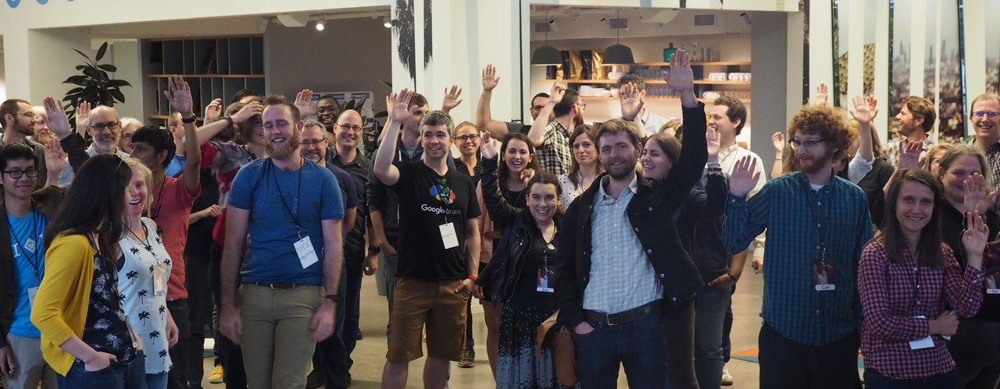

## Software 📦

### New packages

* A new package `available` (`v1.0.0`) is [on CRAN](https://cran.rstudio.com/web/packages/available). `available` checks if the title of a package is available, appropriate and interesting. Check out the [README](https://github.com/ropenscilabs/available#readme) to get started. [Repository on GitHub][available]

### Releases

* A new version (`v0.3.0`) of `rdryad` is on [CRAN](https://cran.rstudio.com/web/packages/rdryad). See the [release notes](https://github.com/ropensci/rdryad/releases/tag/v0.3.0) for details. Check out the [rdryad README](https://github.com/ropensci/rdryad#rdryad) to get started. [Repository on GitHub][rdryad]
* A new version (`v0.2.0`) of `geojson` is on [CRAN](https://cran.rstudio.com/web/packages/geojson). See the [release notes](https://github.com/ropensci/geojson/releases/tag/v0.2.0) for details. Check out the [geojson vignettes](https://cran.rstudio.com/web/packages/geojson/vignettes/) to get started. [Repository on GitHub][geojson]
* A new version (`v0.5.0`) of `geojsonio` is on [CRAN](https://cran.rstudio.com/web/packages/geojsonio). See the [release notes](https://github.com/ropensci/geojsonio/releases/tag/v0.5.0) for details. Check out the [geojsonio vignettes](https://cran.rstudio.com/web/packages/geojsonio/vignettes/) to get started. [Repository on GitHub][geojsonio]
* A new version (`v0.4.2`) of `iheatmapr` is on [CRAN](https://cran.rstudio.com/web/packages/iheatmapr). See the [NEWS](https://cran.rstudio.com/web/packages/iheatmapr/news.html) for details. Check out the [iheatmapr help pages](https://ropensci.github.io/iheatmapr/index.html) to get started. [Repository on GitHub][iheatmapr]
* A new version (`v0.5.2`) of `robotstxt` is on [CRAN](https://cran.rstudio.com/web/packages/robotstxt). See the [NEWS](https://cran.rstudio.com/web/packages/robotstxt/news.html) for details. Check out the [robotstxt vignette](https://cran.rstudio.com/web/packages/robotstxt/vignettes/using_robotstxt.html) to get started. [Repository on GitHub][robotstxt]
* A new version (`v0.9.9`) of `rgbif` is on [CRAN](https://cran.rstudio.com/web/packages/rgbif). See the [release notes](https://github.com/ropensci/rgbif/releases/tag/v0.9.9) for details. Check out the [rgbif vignettes](https://cran.rstudio.com/web/packages/rgbif/vignettes/) to get started. [Repository on GitHub][rgbif]
* A new version (`v0.1.1`) of `googleLanguageR` is on [CRAN](https://cran.rstudio.com/web/packages/googleLanguageR). See the [release notes](https://github.com/ropensci/googleLanguageR/releases/tag/v0.1.1) for details. Check out the [googleLanguageR vignettes](https://cran.rstudio.com/web/packages/googleLanguageR/vignettes/) to get started. [Repository on GitHub][googleLanguageR]
* A new version (`v0.2.0`) of `getCRUCLdata` is on [CRAN](https://cran.rstudio.com/web/packages/getCRUCLdata). See the [release notes](https://github.com/ropensci/getCRUCLdata/releases/tag/0.2.0) for details. Check out the [getCRUCLdata vignettes](https://cran.rstudio.com/web/packages/getCRUCLdata/vignettes/getCRUCLdata.html) to get started. [Repository on GitHub][getCRUCLdata]
* A new version (`v2.0.8`) of `RNeXML` is on [CRAN](https://cran.rstudio.com/web/packages/RNeXML). See the [NEWS](https://cran.rstudio.com/web/packages/RNeXML/NEWS) for details. Check out the [RNeXML vignettes](https://cran.rstudio.com/web/packages/RNeXML/vignettes/) to get started. [Repository on GitHub][RNeXML]
* A new version (`v1.1`) of `unrtf` is on [CRAN](https://cran.rstudio.com/web/packages/unrtf). See the [NEWS](https://cran.rstudio.com/web/packages/unrtf/NEWS) for details. Check out the [unrtf README](https://github.com/ropensci/unrtf#readme) to get started. [Repository on GitHub][unrtf]
* A new version (`v1.3`) of `xslt` is on [CRAN](https://cran.rstudio.com/web/packages/xslt). See the [NEWS](https://cran.rstudio.com/web/packages/xslt/NEWS) for details. Check out the [xslt README](https://github.com/ropensci/xslt#readme) to get started. [Repository on GitHub][xslt]
* A new version (`v0.4.0`) of `wicket` is on [CRAN](https://cran.rstudio.com/web/packages/wicket). See the [NEWS](https://cran.rstudio.com/web/packages/wicket/NEWS) for details. Check out the [wicket vignette](https://cran.rstudio.com/web/packages/wicket/vignettes/Introduction.html) to get started. [Repository on GitHub][wicket]
* A new version (`v2.4.7`) of `FedData` is on [CRAN](https://cran.rstudio.com/web/packages/FedData). See the [NEWS](https://cran.rstudio.com/web/packages/FedData/news.html) for details. Check out the [FedData README](https://github.com/ropensci/FedData#readme) to get started. [Repository on GitHub][FedData]
* A new version (`v0.2.4`) of `ropenaq` is on [CRAN](https://cran.rstudio.com/web/packages/ropenaq). See the [release notes](https://github.com/ropensci/ropenaq/releases/tag/v0.2.4) for details. Check out the [ropenaq vignettes](https://cran.rstudio.com/web/packages/ropenaq/vignettes/) to get started. [Repository on GitHub][ropenaq]

  

## Software Review ✔

We accept community contributed packages via our onboarding system - an open software review system, sorta like scholarly paper review, but way better. We'll highlight newly onboarded packages here. A huge thanks to our reviewers, who do a lot of work reviewing (see the [blog post on our review system](https://ropensci.org/blog/2016/03/28/software-review)),
and the authors of the packages!

If you want to be a reviewer fill out this short [form](https://ropensci.org/onboarding/), and we'll ping you when there's a submission that fits in your area of expertise.

The following packages were recently submitted for review:

* [drake][] > Data Frames in R for Make
    * Author: [Will Landau](https://github.com/wlandau-lilly)
    * Issue: [ropensci/onboarding#156](https://github.com/ropensci/onboarding/issues/156)
    * Reviewers:
        * [Julia Stewart Lowndes](https://github.com/jules32)
        * [Ben Marwick](https://github.com/benmarwick)
* [Rpolyhedra][] > Polyhedra Database
    * Author: [Alejandro Baranek](https://github.com/kenarab)
    * Issue: [ropensci/onboarding#157](https://github.com/ropensci/onboarding/issues/157)
    * Reviewers: not assigned yet

  

## On the blog

### .rprofile series

Our second post is out in our `.rprofile` series: [.rprofile: Mara Averick](https://ropensci.org/blog/2017/11/10/rprofile-mara-averick/) by [Kelly O'Briant](https://kellobri.github.io/). Mara on Twitter -> <https://twitter.com/dataandme>

Keep an eye out for more posts in this series.

### main blog

We've had two blog posts on our main blog in the past two weeks.

One of the posts is from our community manager [Stefanie Butland](https://ropensci.org/about/#team). In the post [Six tips for running a successful unconference](https://ropensci.org/blog/2017/11/17/unconf-sixtips/) Stefanie writes about six tips for running a succesful unconference.

The other post is a follow up on the recent rOpenSci unconference [ozunconf](https://ozunconf17.ropensci.org/) in Melbourne, Australia. In the piece [Jonathan Carroll](https://jcarroll.com.au/) summarized one of the projects at the unconf: [2017 rOpenSci ozunconf :: Reflections and the realtime Package](https://ropensci.org/blog/2017/11/14/realtime/)

### technotes

We've had one post on our technotes blog in the past two weeks:

[Scott Chamberlain](https://ropensci.org/about/#team) discusses `v1` of the [solrium][] package: [solrium 1.0: Working with Solr from R](https://ropensci.org/technotes/2017/11/08/solrium-solr-r/)

  

## Use cases

The following seven works use/cite rOpenSci or rOpenSci software:

* Landis & Schraiber cited and used [rfishbase][] in their paper [Pulsed evolution shaped modern vertebrate body sizes](https://doi.org/10.1073/pnas.1710920114) [^1]
* Weingart & Eichmann-Kalwara cited [gender][] in their paper [What’s Under the Big Tent?: A Study of ADHO Conference Abstracts](https://doi.org/10.16995/dscn.284) [^2]

If you've used rOpenSci software in a blog post or a paper, tell us on the [discussion forum](https://discuss.ropensci.org/t/share-ropensci-package-citations-plz/515/11) and we'll share it with our community here.

  

  

### Submit news to rOpenSci

Reach out to us with your news suggestions by sending us an email <mailto:info@ropensci.org> or by
contacting us on Twitter [@ropensci](https://twitter.com/ropensci)

 

### Keep up with rOpenSci

* Mailing list: Sign up with an email address to get this newsletter sent to your inbox -> [ropensci.org/#subscribe](https://ropensci.org/#subscribe)
* Alternatively, you can subscribe to this newsletter via our XML feed at <https://ropensci.github.io/biweekly/feed.xml> or our JSON feed at <https://ropensci.github.io/biweekly/feed.json>
* rOpenSci on Twitter: [@ropensci](https://twitter.com/ropensci)
* The rOpenSci blog at [ropensci.org/blog](https://ropensci.org/blog) - you can subscribe in any RSS aggregator, or manually via [https://ropensci.org/feed.xml](https://ropensci.org/feed.xml). We also announce new blog posts on our Twitter account.

 

#### Footnotes

[^1]: Landis, M. J., & Schraiber, J. G. (2017). Pulsed evolution shaped modern vertebrate body sizes. Proceedings of the National Academy of Sciences, 201710920. <https://doi.org/10.1073/pnas.1710920114>

[^2]: Weingart, S. B., & Eichmann-Kalwara, N. (2017). What’s Under the Big Tent?: A Study of ADHO Conference Abstracts. Digital Studies/Le Champ Numérique, 7(1). <https://doi.org/10.16995/dscn.284>

[taxize]: https://github.com/ropensci/taxize
[solrium]: https://github.com/ropensci/solrium
[getCRUCLdata]: https://github.com/ropensci/getCRUCLdata
[geojson]: https://github.com/ropensci/geojson
[gender]: https://github.com/ropensci/gender
[rfishbase]: https://github.com/ropensci/rfishbase
[drake]: https://github.com/wlandau-lilly/drake
[Rpolyhedra]: https://github.com/qbotics/Rpolyhedra
[available]: https://github.com/ropenscilabs/available
[rdryad]: https://github.com/ropensci/rdryad
[geojsonio]: https://github.com/ropensci/geojsonio
[iheatmapr]: https://github.com/ropensci/iheatmapr
[robotstxt]: https://github.com/ropensci/robotstxt
[rgbif]: https://github.com/ropensci/rgbif
[googleLanguageR]: https://github.com/ropensci/googleLanguageR
[RNeXML]: https://github.com/ropensci/RNeXML
[unrtf]: https://github.com/ropensci/unrtf
[xslt]: https://github.com/ropensci/xslt
[wicket]: https://github.com/ropensci/wicket
[FedData]: https://github.com/ropensci/FedData
[ropenaq]: https://github.com/ropensci/ropenaq

