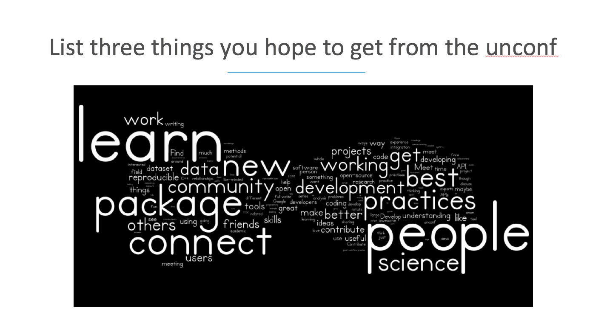
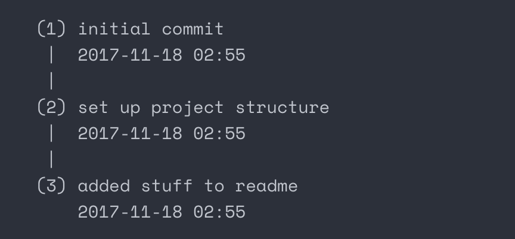
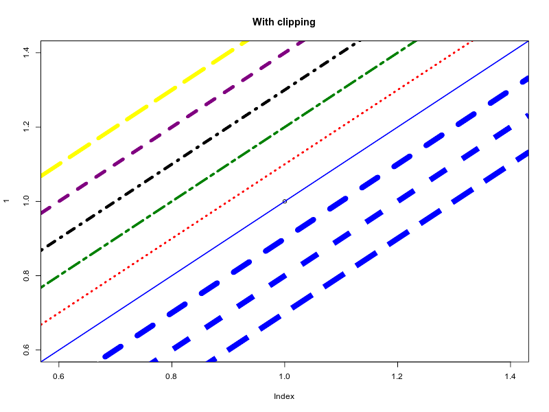

## Software 📦

### Releases

* A new version (`v0.1.0`) of `bikedata` is on [CRAN](https://cran.rstudio.com/web/packages/bikedata). See the [release notes](https://github.com/ropensci/bikedata/releases/tag/v0.1.0) for details. Check out the [bikedata vignette](https://cran.r-project.org/web/packages/bikedata/vignettes/bikedata.html) to get started. [Repository on GitHub][bikedata]
* A new version (`v0.2.1`) of `stplanr` is on [CRAN](https://cran.rstudio.com/web/packages/stplanr). See the [release notes](https://github.com/ropensci/stplanr/releases/tag/0.2.1) for details. Check out the [stplanr vignettes](https://cran.r-project.org/web/packages/stplanr/vignettes/) to get started. [Repository on GitHub][stplanr]
* A new version (`v1.1.1`) of `GSODR` is on [CRAN](https://cran.rstudio.com/web/packages/GSODR). See the [release notes](https://github.com/ropensci/GSODR/releases/tag/v1.1.1) for details. Check out the [GSODR vignettes](https://cran.r-project.org/web/packages/GSODR/vignettes/) to get started. [Repository on GitHub][GSODR]
* A new version (`v1.0.9`) of `lingtypology` is on [CRAN](https://cran.rstudio.com/web/packages/lingtypology). See the [release notes](https://github.com/ropensci/lingtypology/releases/tag/v1.0.9) for details. Check out the [lingtypology vignette](https://cran.r-project.org/web/packages/lingtypology/vignettes/lingtypology.html) to get started. [Repository on GitHub][lingtypology]
* A new version (`v1.6`) of `magick` is on [CRAN](https://cran.rstudio.com/web/packages/magick). See the [release notes](https://github.com/ropensci/magick/releases/tag/v1.6) for details. Check out the [magick vignette](https://cran.r-project.org/web/packages/magick/vignettes/intro.html) to get started. [Repository on GitHub][magick]
* A new version (`v0.8.0`) of `rcrossref` is on [CRAN](https://cran.rstudio.com/web/packages/rcrossref). See the [release notes](https://github.com/ropensci/rcrossref/releases/tag/v0.8.0) for details. Check out the [rcrossref vignette](https://cran.r-project.org/web/packages/rcrossref/vignettes/crossref_vignette.html) to get started. [Repository on GitHub][rcrossref]
* A new version (`v0.1.0`) of `bomrang` is on [CRAN](https://cran.rstudio.com/web/packages/bomrang). See the [NEWS file](https://cran.r-project.org/web/packages/bomrang/news.html) for details. Check out the [bomrang vignettes](https://cran.r-project.org/web/packages/bomrang/vignettes/) to get started. [Repository on GitHub][bomrang]

  

## Software Review ✔

We accept community contributed packages via our onboarding system - an open software review system, sorta like scholarly paper review, but way better. We'll highlight newly onboarded packages here. A huge thanks to our reviewers, who do a lot of work reviewing (see the [blog post on our review system](https://ropensci.org/blog/2016/03/28/software-review)),
and the authors of the packages!

If you want to be a reviewer fill out this short [form](https://ropensci.org/onboarding/), and we'll ping you when there's a submission that fits in your area of expertise.

The following packages were recently submitted for review:

* [Rnightlights][] > Satellite Nightlight Data Extraction
    * Author: [Chris Njuguna](https://github.com/chrisvwn)
    * Issue: [ropensci/onboarding#159](https://github.com/ropensci/onboarding/issues/159)
    * Reviewers: not assigned yet
* [weathercan][] > Download Weather Data from the Environment and Climate Change Canada Website
    * Author: [Steffi LaZerte](https://github.com/steffilazerte)
    * Issue: [ropensci/onboarding#160](https://github.com/ropensci/onboarding/issues/160)
    * Reviewers:
        * [Joe Thorley](https://github.com/joethorley)
        * [Charles Gray](https://github.com/softloud)
* [ijtiff][] > TIFF I/O for ImageJ Users
    * Author: [Rory Nolan](https://github.com/rorynolan)
    * Issue: [ropensci/onboarding#164](https://github.com/ropensci/onboarding/issues/164)
    * Reviewers: not assigned yet

  

## On the blog

### main blog

We've had four blog posts on our main blog in the past two weeks.

One of the posts is from our community manager [Stefanie Butland](https://ropensci.org/about/#team): [The Value of Welcome, part 2: How to prepare 40 new community members for an unconference](https://ropensci.org/blog/2017/12/01/unconf-welcome/). Read the related blog post (part 1, from earlier this year) [on the blog](https://ropensci.org/blog/2017/07/18/value-of-welcome/).

 

Two posts come from the recent rOpenSci unconference [#ozunconf][ozunconf] in Melbourne, Australia. 

In one piece [Holly Kirk](https://twitter.com/HollyKirk), [Di Cook](https://twitter.com/visnut), [Alicia Allan](https://github.com/alicia-a), [Ross Gayler](https://twitter.com/ross_gayler), [Roger Peng](https://twitter.com/rdpeng), and [Elle Saber](https://github.com/ellesaber) summarized one of the projects at the unconf: [ochRe - Australia themed colour palettes](https://ropensci.org/blog/2017/11/21/ochre/). Check out the project at [ropenscilabs/ochRe](https://github.com/ropenscilabs/ochRe).

 

In another [#ozunconf][ozunconf] piece [Anikó Tóth](https://github.com/anikobtoth) and [Nick Golding](https://twitter.com/_NickGolding_) discuss their project [changes: easy Git-based version control from R](https://ropensci.org/blog/2017/11/28/ropensci-changes/). Check out the project at [ropenscilabs/changes](https://github.com/ropenscilabs/changes).

 

Last, we had a post announcing a new software review collaboration: [Announcing a New rOpenSci Software Review Collaboration](https://ropensci.org/blog/2017/11/29/review-collaboration-mee/).

 

### technotes

We've had one post on our technotes blog in the past two weeks:

[Jeroen Ooms](https://ropensci.org/about/#team) discusses `v1.6` of the [magick][] package: [Magick 1.6: clipping, geometries, fonts, fuzz, and a bit of history](https://ropensci.org/technotes/2017/12/05/magick-16/)

  

## Use cases

If you've used rOpenSci software in a blog post or a paper, tell us on the [discussion forum](https://discuss.ropensci.org/t/share-ropensci-package-citations-plz/515/11) and we'll share it with our community here.

  

  

### Submit news to rOpenSci

Reach out to us with your news suggestions by sending us an email <mailto:info@ropensci.org> or by
contacting us on Twitter [@ropensci](https://twitter.com/ropensci)

 

### Keep up with rOpenSci

* Mailing list: Sign up with an email address to get this newsletter sent to your inbox -> [ropensci.org/#subscribe](https://ropensci.org/#subscribe)
* Alternatively, you can subscribe to this newsletter via our XML feed at <https://ropensci.github.io/biweekly/feed.xml> or our JSON feed at <https://ropensci.github.io/biweekly/feed.json>
* rOpenSci on Twitter: [@ropensci](https://twitter.com/ropensci)
* The rOpenSci blog at [ropensci.org/blog](https://ropensci.org/blog) - you can subscribe in any RSS aggregator, or manually via [https://ropensci.org/feed.xml](https://ropensci.org/feed.xml). We also announce new blog posts on our Twitter account.

 

[bikedata]: https://github.com/ropensci/bikedata
[stplanr]: https://github.com/ropensci/stplanr
[GSODR]: https://github.com/ropensci/GSODR
[lingtypology]: https://github.com/ropensci/lingtypology
[magick]: https://github.com/ropensci/magick
[rcrossref]: https://github.com/ropensci/rcrossref
[bomrang]: https://github.com/ropensci/bomrang
[Rnightlights]: https://github.com/chrisvwn/Rnightlights
[weathercan]: https://github.com/steffilazerte/weathercan
[ijtiff]: https://www.github.com/rorynolan/ijtiff
[ozunconf]: https://ozunconf17.ropensci.org/

