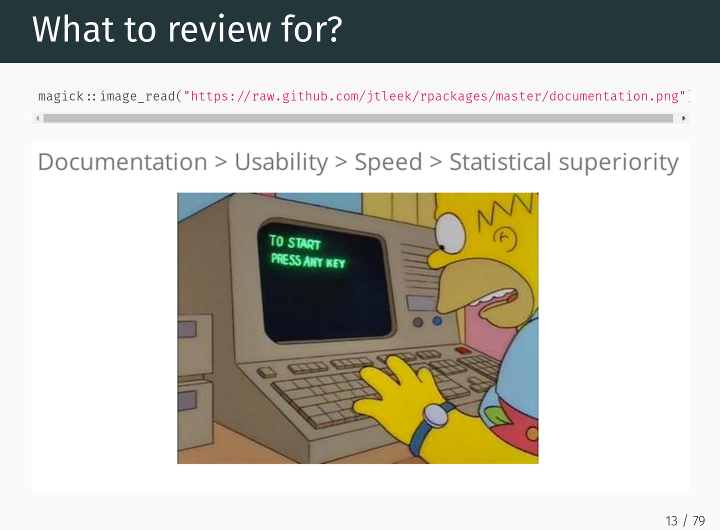
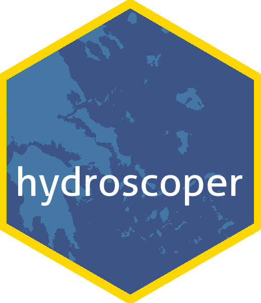

## Software 📦

CRAN:  
GitHub: 

### New packages

* A new package `rdflib` (`v0.1.0`) is on CRAN. `rdflib` is a high level wrapper around the redland package for common rdf applications.  `rdflib` provides utility functions to complete tasks involved in most landscape analysis. This package recently went through [rOpenSci review](https://github.com/ropensci/onboarding/issues/169). Check out the [rdflib docs](https://ropensci.github.io/rdflib/) to get started. {{ "rdflib" | image_cran }} {{ "rdflib" | image_github }}
* A new package `landscapetools` (`v0.3.0`) is on CRAN. `landscapetools` provides utility functions to complete tasks involved in most landscape analysis. This package recently went through [rOpenSci review](https://github.com/ropensci/onboarding/issues/188). Check out the [landscapetools docs](https://ropensci.github.io/landscapetools/) to get started. {{ "landscapetools" | image_cran }} {{ "landscapetools" | image_github }}
* A new package `essurvey` (`v1.0.0`) is on CRAN. `essurvey` lets you download data from the European Social Survey. `essurvey` provides utility functions to complete tasks involved in most landscape analysis. This package recently went through [rOpenSci review](https://github.com/ropensci/onboarding/issues/201). Check out the [essurvey docs](https://ropensci.github.io/essurvey/) to get started. {{ "essurvey" | image_cran }} {{ "essurvey" | image_github }}

### Releases

* A new version (`v0.4.0`) of `webchem` is on CRAN. See the [webchem NEWS](https://cran.rstudio.com/web/packages/webchem/NEWS) for details. Check out the [webchem README](https://github.com/ropensci/webchem#webchem) to get started.  {{ "webchem" | image_cran }} {{ "webchem" | image_github }}
> Lots a 🐞 fixes!!!
* A new version (`v3.0.4`) of `rotl` is on CRAN. See the [release notes](https://github.com/ropensci/rotl/releases/tag/v3.0.4) for details. Check out the [rotl vignettes](https://cran.rstudio.com/web/packages/rotl/vignettes/) to get started. {{ "rotl" | image_cran }} {{ "rotl" | image_github }}
* A new version (`v1.0.2`) of `skimr` is on [CRAN](https://cran.rstudio.com/web/packages/skimr). See the [skimr NEWS](https://cran.rstudio.com/web/packages/skimr/news.html) for details. Check out the [skimr vignettes](https://cran.rstudio.com/web/packages/skimr/vignettes/) to get started.  {{ "skimr" | image_cran }} {{ "skimr" | image_github: 'ropenscilabs' }}
> You can create skimmers with the formula syntax from `rlang!
* A new version (`v0.6.0`) of `geojsonio` is out - see the [release notes](https://github.com/ropensci/geojsonio/releases/tag/v0.6.0) for details. Check out the [geojsonio vignettes](https://cran.rstudio.com/web/packages/geojsonio/vignettes/) to get started. {{ "geojsonio" | image_cran }} {{ "geojsonio" | image_github }}
> You can now control the object name output for `topojson_write`, and there's now an analog of `geojson_sp` for `sf` (`geojson_sf`)`
* A new version (`v1.2.0`) of `GSODR` is out. See the [GSODR NEWS](https://cran.rstudio.com/web/packages/GSODR/news.html) for details. Check out the [GSODR vignettes](https://cran.rstudio.com/web/packages/GSODR/vignettes/) to get started. {{ "GSODR" | image_cran }} {{ "GSODR" | image_github }}
> package slimmed down with move of `sp`/`sf`/`rgdal` from Imports to Suggests
* A new version (`v0.3.1`) of `USAboundaries` is on CRAN. See the [release notes](https://github.com/ropensci/USAboundaries/releases/tag/v0.3.1) for details. Check out the [USAboundaries docs](http://lincolnmullen.com/software/usaboundaries/) to get started. {{ "USAboundaries" | image_cran }} {{ "USAboundaries" | image_github }}
> a [new vignette](https://cran.rstudio.com/web/packages/USAboundaries/vignettes/usaboundaries-sample-analysis.html) - woop woop
* A new version (`v0.5.0`) of `wellknown` is on CRAN. See the [release notes](https://github.com/ropensci/wellknown/releases/tag/v0.5.0) for details. Check out the [wellknown vignette](https://cran.rstudio.com/web/packages/wellknown/vignettes/wellknown_vignette.html) to get started.  {{ "wellknown" | image_cran }} {{ "wellknown" | image_github }}
> added wkt<-->wkb awesome sauce, and overhaul of `wkt2geojson` and `geojson2wkt`
* A new version (`v0.2.1`) of `tokenizers` is on CRAN. See the [release notes](https://github.com/ropensci/tokenizers/releases/tag/v0.2.1) for details. Check out the [tokenizers docs](https://lincolnmullen.com/software/tokenizers/) to get started. {{ "tokenizers" | image_cran }} {{ "tokenizers" | image_github }}
* A new version (`v0.3.0`) of `microdemic` is on CRAN. See the [release notes](https://github.com/ropensci/microdemic/releases/tag/v0.3.0) for details. Check out the [microdemic README](https://github.com/ropensci/microdemic#microdemic) to get started. {{ "microdemic" | image_cran }} {{ "microdemic" | image_github }}
> changed base url, make sure to get a new API 🔑
* A new version (`v1.6`) of `pdftools` is on [CRAN](https://cran.rstudio.com/web/packages/dftools). See the [pdftools NEWS](https://cran.rstudio.com/web/packages/pdftools/NEWS) for details. Check out the [pdftools README](https://github.com/ropensci/pdftools#pdftools) to get started.  {{ "pdftools" | image_cran }} {{ "pdftools" | image_github }}

  

## Software Review ✔

We accept community contributed packages via our onboarding system - an open software review system, sorta like scholarly paper review, but way better. We'll highlight newly onboarded packages here. A huge thanks to our reviewers, who do a lot of work reviewing (see the [blog post on our review system](https://ropensci.org/blog/2016/03/28/software-review)),
and the authors of the packages!

If you want to be a reviewer fill out [this short form](https://ropensci.org/onboarding/), and we'll ping you when there's a submission that fits in your area of expertise.

The following two packages recently went through our onboarding process and has been approved!

* [EndoMineR][] > Functions to mine endoscopic and associated pathology datasets
    * Author: [Sebastian Zeki](https://github.com/sebastiz)
    * Issue: [ropensci/onboarding#153](https://github.com/ropensci/onboarding/issues/153)
    * Reviewers: 
        * [Jon Clayden](https://github.com/jonclayden)
        * [Roel Hogervorst](https://github.com/RMHogervorst)
* [qualtRics][] > Download Qualtrics Survey Data Directly into R
    * Author: [Jasper Ginn](https://github.com/JasperHG90)
    * Issue: [ropensci/onboarding#192](https://github.com/ropensci/onboarding/issues/192)
    * Reviewers: 
        * [Jesse Maegan](https://github.com/kierisi)
        * [Tyler Rinker](https://github.com/trinker)

The following two packages were recently submitted:

* [rppo][] > R functions to access Plant Phenology Ontology annotated datasets
    * Author: [John Deck](https://github.com/jdeck88)
    * Issue: [ropensci/onboarding#207](https://github.com/ropensci/onboarding/issues/207)
    * Note: still going through editor checks
* [babette][] > Control BEAST2 from R
    * Author: [Richel Bilderbeek](https://github.com/richelbilderbeek)
    * Issue: [ropensci/onboarding#209](https://github.com/ropensci/onboarding/issues/209)
    * Reviewers: not assigned yet

  

## On the blog

### main blog

[Miles McBain](https://github.com/milesmcbain) was kind enough to cross-post a reflection on the value of software peer review from his personal blog: [Where is the value in package peer review?](https://ropensci.org/blog/2018/04/06/peer-review-value/). 

----

As part of our series of posts on packages that have gone through [rOpenSci onboarding](https://github.com/ropensci/onboarding/) [Konstantinos Vantas](https://kvantas.github.io/) wrote a post ([ὕδωρ + σκοπῶ = water + observe](https://ropensci.org/blog/2018/04/03/hydroscoper/)) about his package [hydroscoper][] for interacting with the [Greek National Data Bank for Hydrometeorological Information](http://www.hydroscope.gr/). 

----

As part of our series of posts on packages that have gone through [rOpenSci onboarding](https://github.com/ropensci/onboarding/) [Daniel Münch](https://github.com/dahaniel) wrote a post ([DoOR - The Database of Odorant Responses](https://ropensci.org/blog/2018/03/27/door/)) about his packages [DoOR.functions][] and [DoOR.data][] for interacting with the [Database of Odorant Responses](http://neuro.uni-konstanz.de/DoOR/default.html). 

  

## Use cases

The following 18 works use/cite rOpenSci software:

* Tang used the rOpenSci packages [plotly][] and [RSelenium][] in his paper [Autoplotly-Automatic Generation of Interactive Visualizations for Popular Statistical Results](https://arxiv.org/pdf/1803.08424) [^1]
* Dion _et al_. used [rcrossref][] in their paper [Gendered Citation Patterns across Political Science and Social Science Methodology Fields](http://www.saramitchell.org/DSM2018PAfinal.pdf) [^2]
* Gearty _et al_. used [rgbif][] in their paper [Energetic tradeoffs control the size distribution of aquatic mammals](https://doi.org/10.1073/pnas.1712629115) [^3]
* Nolan & Padilla-Parra cited [ijtiff][] in their paper [ijtiff: An R package providing TIFF I/O for ImageJ users](https://10.21105/joss.00633) [^4]
* Gershanov _et al_. used [iheatmapr][] in their paper [MicroRNA&ndash;mRNA expression profiles associated with medulloblastoma subgroup 4](https://doi.org/10.2147/cmar.s156709) [^5]
* Peters _et al_. used [oai][] in their paper [Zenodo in the Spotlight of Traditional and New Metrics](https://doi.org/10.3389/frma.2017.00013) [^6]
* Tierney cited his R package [visdat][] in his JOSS paper on the software itself [visdat: Visualising Whole Data Frames](https://doi.org/10.21105/joss.00355) [^7]
* Mullen _et al_. used [tokenizers][] and [textreuse][] in their paper [Fast, Consistent Tokenization of Natural Language Text](https://doi.org/10.21105/joss.00655) [^8]
* Sales _et al_. used [spocc][] in their paper [Niche conservatism and the invasive potential of the wild boar](https://doi.org/10.1111/1365-2656.12721) [^9]
* Essl _et al_.  used [plotly][] in their paper [Machine learning analysis for a flexibility energy approach towards renewable energy integration with dynamic forecasting of electricity balancing power](https://doi.org/10.1109/eem.2017.7981877) [^10]
* Grosser _et al_. used [rnoaa][] in their paper [Multivariate skeletal analyses support a taxonomic distinction between New Zealand and Australian Eudyptula penguins (Sphenisciformes: Spheniscidae)](https://doi.org/10.1080/01584197.2017.1315310) [^11]
* Bowser _et al_. used [bold][] in their paper [Arthropod and oligochaete assemblages from grasslands of the southern Kenai Peninsula, Alaska](https://doi.org/10.3897/bdj.5.e10792) [^12]
* Divoll _et al_. used [bold][] in their paper [Disparities in second-generation DNA metabarcoding results exposed with accessible and repeatable workflows](https://doi.org/10.1111/1755-0998.12770) [^13]
* Cravens _et al_. used [bold][] in their paper [Illuminating prey selection in an insectivorous bat community exposed to artificial light at night](https://doi.org/10.1111/1365-2664.13036) [^14]
* Fox _et al_. used [fingertipsR][] in their paper [fingertipsR: an R package for accessing population health information in England](https://doi.org/10.1101/189167) [^15]
* ȚÎRU & NECULA used [fingertipsR][] in their paper [rTempo–an R package to access the TEMPO-Online database](http://www.revistadestatistica.ro/wp-content/uploads/2017/11/RRS-4_2017_A04.pdf) [^16]
* Manlove & Belou used our [gender][] package in their paper [Authors and editors assort on gender and geography in high-rank ecological publications](https://doi.org/10.1371/journal.pone.0192481) [^17]
* Bennett _et al_. used [phylotaR][] in their paper [phylotaR: An automated pipeline for retrieving orthologous DNA sequences from GenBank in R](https://doi.org/10.20944/preprints201804.0047.v1) [^18]

  

## In the news

[Jorge Cimentada](https://twitter.com/cimentadaj) wrote a blog post [RSelenium and scraping Catalan educational data](https://cimentadaj.github.io/blog/2018-03-22-rselenium-and-scraping-catalan-educational-data/rselenium-and-scraping-catalan-educational-data/) using, you guessed it, our [RSelenium][] package.
<blockquote class="twitter-tweet" data-lang="en">
I just figured out how to use Docker and <a href="https://twitter.com/hashtag/rstats?src=hash&amp;ref_src=twsrc%5Etfw">#rstats</a> RSelenium on my Windows 10 machine. Blogged about it <a href="https://t.co/sxN5LZktIy">https://t.co/sxN5LZktIy</a> on a case study on scraping educational data.
&mdash; Jorge Cimentada (@cimentadaj) <a href="https://twitter.com/cimentadaj/status/978960950320599041?ref_src=twsrc%5Etfw">March 28, 2018</a></blockquote>

 

[Caryn Johansen](https://twitter.com/jo_caryn) and [Ciera Martinez](https://twitter.com/cierareports) of the [Cabinet of Curiosity blog](https://twitter.com/ofcuriositydata) wrote a blog post on [Exploring Neotoma Part 2: Extinct Mammal Distributions](https://cabinetofcuriosity.github.io/cabinetofcuriosity_site/exploring-neotoma-part2/) using our [neotoma][] package

 

[Juan Mayorga](https://twitter.com/juansmayorga) wrote a nice blog post about mapping fisheries, while using our [rnaturalearth][] package  
<blockquote class="twitter-tweet" data-lang="en">
Check out this blog post to learn how SFG&#39;s <a href="https://twitter.com/juansmayorga?ref_src=twsrc%5Etfw">@juansmayorga</a> made this global map of transnational fisheries. <a href="https://twitter.com/hashtag/dataviz?src=hash&amp;ref_src=twsrc%5Etfw">#dataviz</a>  <a href="https://twitter.com/hashtag/rstats?src=hash&amp;ref_src=twsrc%5Etfw">#rstats</a> <a href="https://t.co/YGBHS0Szrr">https://t.co/YGBHS0Szrr</a> <a href="https://t.co/9xR0PDD63l">pic.twitter.com/9xR0PDD63l</a>
&mdash; SFG UC Santa Barbara (@sfgucsb) <a href="https://twitter.com/sfgucsb/status/976216544148516864?ref_src=twsrc%5Etfw">March 20, 2018</a></blockquote>

 

[Daniela Vázquez](https://twitter.com/d4tagirl) wrote a blog post [Scrapeando las Sesiones Parlamentarias de Uruguay](https://d4tagirl.com/2018/04/scrapeando-las-sesiones-parlamentarias-de-uruguay) (english title: _Scraping the Parliamentary Sessions of Uruguay_) - and used rOpenSci packages [pdftools][] and [robotstxt][]
<blockquote class="twitter-tweet" data-cards="hidden" data-lang="en">
🎉 Nuevo <a href="https://twitter.com/hashtag/rstatsES?src=hash&amp;ref_src=twsrc%5Etfw">#rstatsES</a> blog post 🤓  “Scrapeando las sesiones parlamentarias de Uruguay” 🇺🇾 <a href="https://t.co/4Apx4FHfel">https://t.co/4Apx4FHfel</a>   De qué se trata? 🤖 Scrapear la web usando rvest y robotstxt  📝 Extraer texto de archivos pdf con pdftools 🔎 Datos abiertos y transparencia <a href="https://t.co/yHAYMac4ZI">pic.twitter.com/yHAYMac4ZI</a>
&mdash; Daniela Vázquez (@d4tagirl) <a href="https://twitter.com/d4tagirl/status/981512605515870211?ref_src=twsrc%5Etfw">April 4, 2018</a></blockquote>

  

  

### Keep up with rOpenSci

* Mailing list: Sign up with an email address to get this newsletter sent to your inbox -> [ropensci.org/#subscribe](https://ropensci.org/#subscribe)
* Alternatively, you can subscribe to this newsletter via our XML feed at <https://ropensci.github.io/biweekly/feed.xml> or our JSON feed at <https://ropensci.github.io/biweekly/feed.json>
* rOpenSci on Twitter: [@ropensci](https://twitter.com/ropensci)
* The rOpenSci blog at [ropensci.org/blog](https://ropensci.org/blog) - you can subscribe in any RSS aggregator, or manually via [https://ropensci.org/feed.xml](https://ropensci.org/feed.xml). We also announce new blog posts on our Twitter account.

 

#### Footnotes

[^1]: Tang, Y. (2018). Autoplotly-Automatic Generation of Interactive Visualizations for Popular Statistical Results. arXiv preprint arXiv:1803.08424. <https://arxiv.org/pdf/1803.08424>
[^2]: Dion, Michelle L., Jane L. Sumner, and Sara McLaughlin Mitchell. "Gendered Citation Patterns across Political Science and Social Science Methodology Fields.", Forthcoming, Political Analysis. See also the Appendix for the paper and the replication materials." <http://www.saramitchell.org/DSM2018PAfinal.pdf>
[^3]: Gearty, W., McClain, C. R., & Payne, J. L. (2018). Energetic tradeoffs control the size distribution of aquatic mammals. Proceedings of the National Academy of Sciences, 201712629. <https://doi.org/10.1073/pnas.1712629115>
[^4]: Nolan, R., & Padilla-Parra, S. (2018). ijtiff: An R package providing TIFF I/O for ImageJ users. Journal of Open Source Software, 3(23), 633. <https://doi.org/10.21105/joss.00633>
[^5]: Gershanov, S., Toledano, H., Michowiz, S., Barinfeld, O., Pinhasov, A., Goldenberg-Cohen, N., & Salmon-Divon, M. (2018). MicroRNA&ndash;mRNA expression profiles associated with medulloblastoma subgroup 4. Cancer Management and Research, Volume 10, 339–352. <https://doi.org/10.2147/cmar.s156709>
[^6]: Peters, I., Kraker, P., Lex, E., Gumpenberger, C., & Gorraiz, J. I. (2017). Zenodo in the Spotlight of Traditional and New Metrics. Frontiers in Research Metrics and Analytics, 2. <https://doi.org/10.3389/frma.2017.00013>
[^7]: Tierney, N. (2017). visdat: Visualising Whole Data Frames. The Journal of Open Source Software, 2(16), 355. <https://doi.org/10.21105/joss.00355>
[^8]: Mullen, L., Benoit, K., Keyes, O., Selivanov, D., & Arnold, J. (2018). Fast, Consistent Tokenization of Natural Language Text. Journal of Open Source Software, 3(23), 655. <https://doi.org/10.21105/joss.00655>
[^9]: Sales, L. P., Ribeiro, B. R., Hayward, M. W., Paglia, A., Passamani, M., & Loyola, R. (2017). Niche conservatism and the invasive potential of the wild boar. Journal of Animal Ecology, 86(5), 1214–1223. <https://doi.org/10.1111/1365-2656.12721>
[^10]: Essl, A., Ortner, A., Haas, R., & Hettegger, P. (2017). Machine learning analysis for a flexibility energy approach towards renewable energy integration with dynamic forecasting of electricity balancing power. 2017 14th International Conference on the European Energy Market (EEM). <https://doi.org/10.1109/eem.2017.7981877>
[^11]: Grosser, S., Scofield, R. P., & Waters, J. M. (2017). Multivariate skeletal analyses support a taxonomic distinction between New Zealand and Australian Eudyptula penguins (Sphenisciformes: Spheniscidae). Emu - Austral Ornithology, 117(3), 276–283. <https://doi.org/10.1080/01584197.2017.1315310>
[^12]: Bowser, M., Morton, J., Hanson, J., Magness, D., & Okuly, M. (2017). Arthropod and oligochaete assemblages from grasslands of the southern Kenai Peninsula, Alaska. Biodiversity Data Journal, 5, e10792. <https://doi.org/10.3897/bdj.5.e10792>
[^13]: Divoll, T. J., Brown, V. A., Kinne, J., McCracken, G. F., & O’Keefe, J. M. (2018). Disparities in second-generation DNA metabarcoding results exposed with accessible and repeatable workflows. Molecular Ecology Resources. <https://doi.org/10.1111/1755-0998.12770>
[^14]: Cravens, Z. M., Brown, V. A., Divoll, T. J., & Boyles, J. G. (2017). Illuminating prey selection in an insectivorous bat community exposed to artificial light at night. Journal of Applied Ecology, 55(2), 705–713. <https://doi.org/10.1111/1365-2664.13036>
[^15]: Fox, S., Flowers, J., Thelwall, S., Flint, D., & Hain, D. (2017). fingertipsR: an R package for accessing population health information in England. <https://doi.org/10.1101/189167>
[^16]: ȚÎRU, A. M., & NECULA, M. (2017). rTempo–an R package to access the TEMPO-Online database. Romanian Statistical Review, (4). <http://www.revistadestatistica.ro/wp-content/uploads/2017/11/RRS-4_2017_A04.pdf>
[^17]: Manlove, K. R., & Belou, R. M. (2018). Authors and editors assort on gender and geography in high-rank ecological publications. PLOS ONE, 13(2), e0192481. <https://doi.org/10.1371/journal.pone.0192481>
[^18]: Bennett, D. J., Hettling, H., Silvestro, D., Zizka, A., Bacon, C. D., Faurby, S., … Antonelli, A. (2018). phylotaR: An automated pipeline for retrieving orthologous DNA sequences from GenBank in R. <https://doi.org/10.20944/preprints201804.0047.v1>

[taxize]: https://github.com/ropensci/taxize
[rcrossref]: https://github.com/ropensci/rcrossref
[webchem]: https://github.com/ropensci/webchem
[rotl]: https://github.com/ropensci/rotl
[skimr]: https://github.com/ropenscilabs/skimr
[geojsonio]: https://github.com/ropensci/geojsonio
[GSODR]: https://github.com/ropensci/GSODR
[USAboundaries]: https://github.com/ropensci/USAboundaries
[wellknown]: https://github.com/ropensci/wellknown
[tokenizers]: https://github.com/ropensci/tokenizers
[microdemic]: https://github.com/ropensci/microdemic
[pdftools]: https://github.com/ropensci/pdftools
[essurvey]: https://github.com/ropensci/essurvey
[landscapetools]: https://github.com/ropensci/landscapetools
[rdflib]: https://github.com/ropensci/rdflib
[EndoMineR]: https://github.com/sebastiz/EndoMineR
[qualtRics]: https://github.com/ropensci/qualtRics
[rppo]: https://github.com/biocodellc/rppo/
[babette]: https://github.com/richelbilderbeek/babette
[DoOR.functions]: https://github.com/ropensci/DoOR.functions
[DoOR.data]: https://github.com/ropensci/DoOR.data
[RSelenium]: https://github.com/ropensci/RSelenium
[plotly]: https://github.com/ropensci/plotly
[rgbif]: https://github.com/ropensci/rgbif
[ijtiff]: https://github.com/ropensci/ijtiff
[iheatmapr]: https://github.com/ropensci/iheatmapr
[oai]: https://github.com/ropensci/oai
[visdat]: https://github.com/ropensci/visdat
[spocc]: https://github.com/ropensci/spocc
[rnoaa]: https://github.com/ropensci/rnoaa
[bold]: https://github.com/ropensci/bold
[hydroscoper]: https://github.com/ropensci/hydroscoper
[fingertipsR]: https://github.com/ropensci/fingertipsR
[gender]: https://github.com/ropensci/gender
[phylotaR]: https://github.com/ropensci/phylotaR
[textreuse]: https://github.com/ropensci/textreuse
[neotoma]: https://github.com/ropensci/neotoma
[rnaturalearth]: https://github.com/ropenscilabs/rnaturalearth
[robotstxt]: https://github.com/ropenscilabs/robotstxt
