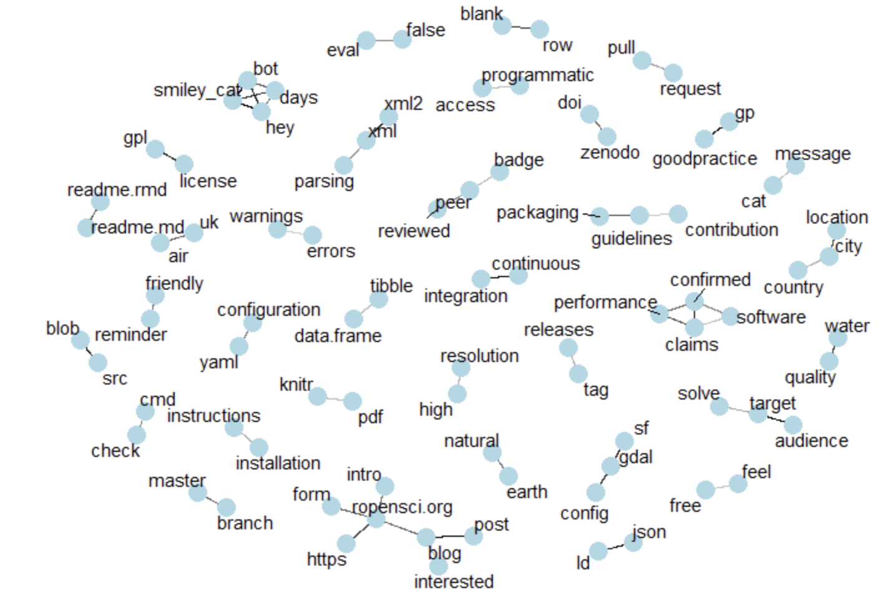
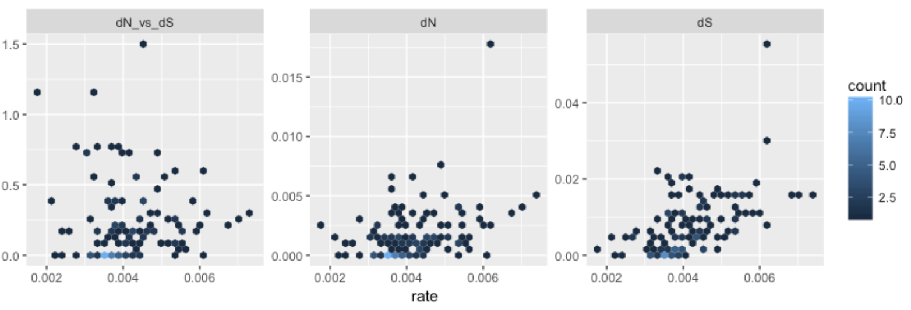
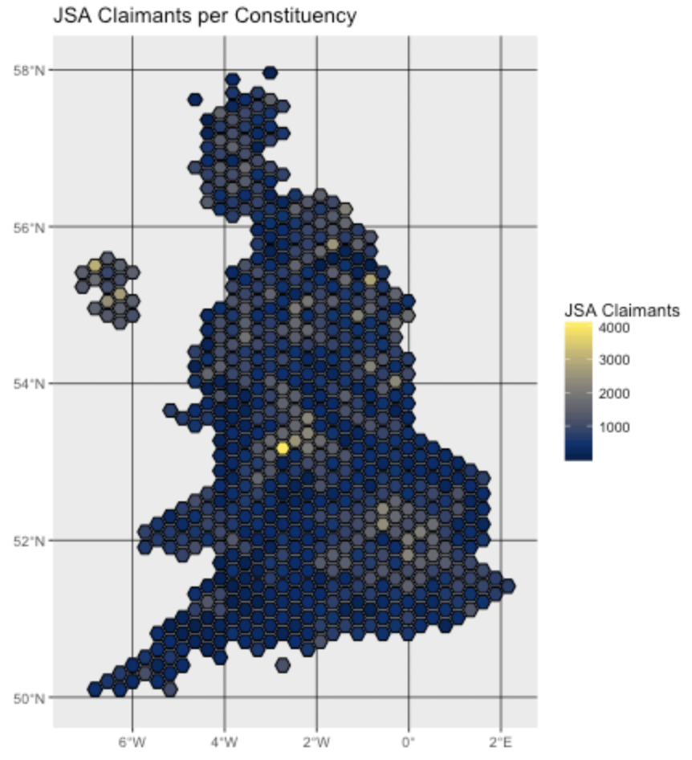
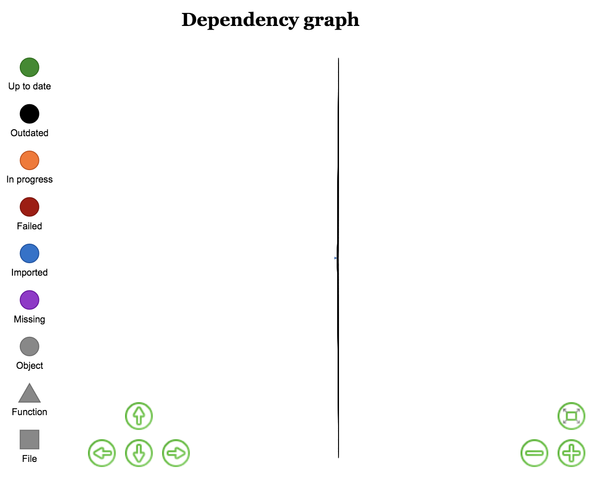

## Software 📦

CRAN:  
GitHub: 

### New packages

* A new package `vcr` (`v0.1.0`) is on CRAN. `vcr` records HTTP calls to disk - main use case is caching HTTP requests in test suites. The logic of matching HTTP requests is done with our [webmockr][] package. [vcr][] is a port from Ruby land where the [gem of the same name][vcrruby] been battle tested and ported to many other languages. Check out the in progress [http testing book](https://ropensci.github.io/http-testing-book/) to get started. {{ "vcr" | image_cran }} {{ "vcr" | image_github }}

### Releases

* A new version (`v0.7.2`) of `ritis` is on CRAN - an R client for ITIS ([Integrated Taxonomic Information Service](https://www.itis.gov/)). See the [ritis release notes](https://github.com/ropensci/ritis/releases/tag/v0.7.2) for details. Check out the [ritis vignette](https://cran.r-project.org/web/packages/ritis/vignettes/ritis_vignette.html) to get started.  {{ "ritis" | image_cran }} {{ "ritis" | image_github }}
> integration w/ [vcr][] and [webmockr][] for http request caching
* A new version (`v0.2.4`) of `stplanr` is on CRAN, tools for transport planning, including origin-destination analysis, route allocation and modelling travel patterns. See the [stplanr release notes](https://github.com/ropensci/stplanr/releases/tag/0.2.4) for details. Check out the [stplanr docs](https://ropensci.github.io/stplanr/) to get started.  {{ "stplanr" | image_cran }} {{ "stplanr" | image_github }}
> New function `geo_length()`!
* A new version (`v0.2.0`) of `bomrang` is on CRAN, an R interface to Australian Government Bureau of Meteorology data. See the [bomrang 
release notes](https://github.com/ropensci/bomrang/releases/tag/0.2.0) for details. Check out the [bomrang docs](https://ropensci.github.io/bomrang/) to get started.  {{ "bomrang" | image_cran }} {{ "bomrang" | image_github }}
> new function `get_historical()`: retrieves historical daily rainfall, min/max temperatures, or solar exposure
* A new version (`v0.3.0`) of `randgeo` is on CRAN - a package that generates random GeoJSON and WKT. See the [randgeo 
release notes](https://github.com/ropensci/randgeo/releases/tag/v0.3.0) for details. Check out the [randgeo docs](https://ropensci.github.io/randgeo/) to get started.  {{ "randgeo" | image_cran }} {{ "randgeo" | image_github }}
> new fxns `geo_linestring` and `wkt_linestring` thx 2 [@samuelbosch](https://github.com/samuelbosch)
* A new version (`v0.2.6`) of `webmockr` is on CRAN, an R client for doing HTTP request mocking. See the [webmockr 
release notes](https://github.com/ropensci/webmockr/releases/tag/v0.2.6) for details. Check out the [webmockr README](https://github.com/ropensci/webmockr#webmockr) to get started.  {{ "webmockr" | image_cran }} {{ "webmockr" | image_github }}
> integration w/ [vcr][] 🎉🎉
* A new version (`v1.7`) of `pdftools` is on CRAN, the best pdf parser for R. See the [pdftools 
NEWS](https://cran.rstudio.com/web/packages/pdftools/NEWS) for details. Check out the [pdftools README](https://github.com/ropensci/pdftools#pdftools) to get started.  {{ "pdftools" | image_cran }} {{ "pdftools" | image_github }}
> something about autobrew
* A new version (`v0.2.3`) of `getCRUCLdata` is on CRAN, an interface for working with CRU CL v. 2.0 climatology data. See the [getCRUCLdata 
release notes](https://github.com/ropensci/getCRUCLdata/releases/tag/0.2.3) for details. Check out the [getCRUCLdata docs](https://ropensci.github.io/getCRUCLdata/) to get started.  {{ "getCRUCLdata" | image_cran }} {{ "getCRUCLdata" | image_github }}
> fix missing import for `rappdirs`
* A new version (`v0.0.7`) of `osmdata` is on CRAN, the OpenStreetMap R client. See the [osmdata 
release notes](https://github.com/ropensci/osmdata/releases/tag/v0.0.7) for details. Check out the [osmdata docs](https://ropensci.github.io/osmdata/) to get started.  {{ "osmdata" | image_cran }} {{ "osmdata" | image_github }}
> minor things
* A new version (`v0.1.6`) of `fingertipsR` is on CRAN, Fingertips Data for Public Health. See the [fingertipsR 
NEWS](https://cran.rstudio.com/web/packages/fingertipsR/news.html) for details. Check out the [fingertipsR vignettes](https://cran.rstudio.com/web/packages/fingertipsR/vignettes/) to get started.  {{ "fingertipsR" | image_cran }} {{ "fingertipsR" | image_github }}
> new fxns `nearest_neighbours()` & `indicator_order()`
* A new version (`v1.9`) of `magick` is on CRAN; bindings to ImageMagick. See the [magick 
release notes](https://github.com/ropensci/magick/releases/tag/v1.9) for details. Check out the [magick vignette](https://cran.rstudio.com/web/packages/magick/vignettes/intro.html) to get started.  {{ "magick" | image_cran }} {{ "magick" | image_github }}
> new function `image_attributes()`
* A new version (`v1.2`) of `cld2` is on CRAN - R wrapper for Google's Compact Language Detector 2. Check out the [cld2 README](https://github.com/ropensci/cld2#cld2) to get started.  {{ "cld2" | image_cran }} {{ "cld2" | image_github }}
* A new version (`v1.0`) of `writexl` is on CRAN, a portable, light-weight data frame to xlsx exporter. See the [writexl 
release notes](https://github.com/ropensci/writexl/releases/tag/v1.0) for details. Check out the [writexl README](https://github.com/ropensci/writexl/tree/v1.0#writexl) to get started.  {{ "writexl" | image_cran }} {{ "writexl" | image_github }}
> save R `Date` types as proper datetime strings; update vendored libxlswriter

### Archived

* [solr][] has been permanently archived on CRAN - it has been replaced by the fresh and new [solrium][]. Check out [solrium][] if you need to work with [Solr][solrdb] from R.
* [dvn][] has been archived. See package [dataverse][] instead.

  

## Software Review ✔

We accept community contributed packages via our onboarding system - an open software review system, sorta like scholarly paper review, but way better. We'll highlight newly onboarded packages here. A huge thanks to our reviewers, who do a lot of work reviewing (see the [blog post on our review system](https://ropensci.org/blog/2016/03/28/software-review)),
and the authors of the packages!

If you want to be a reviewer fill out [this short form](https://ropensci.org/onboarding/), and we'll ping you when there's a submission that fits in your area of expertise.

The following two packages were recently submitted:

* [oec][] > Observatory of Economic Complexity API Wrapper and Utility Program
    * Author: Mauricio Vargas
    * Issue: [ropensci/onboarding#217](https://github.com/ropensci/onboarding/issues/217)
    * Reviewers: not assigned yet
* [infx][] > OpenBIS API access to the InfectX data repository
    * Author: [Nicolas Bennett](https://github.com/nbenn)
    * Issue: [ropensci/onboarding#218](https://github.com/ropensci/onboarding/issues/218)
    * Reviewers: not assigned yet

  

## On the blog

### main blog

[Maëlle Salmon](https://ropensci.org/about/#team), from the rOpenSci team, is writing a 3 post series about a data-driven overview of rOpenSci onboarding. She introduces the series in a post [Our package reviews in review: Introducing a 3-post series about software onboarding data](https://ropensci.org/blog/2018/04/26/a-satrday-ct-series/)

* In the third and final post in the series Maëlle wrote about [The social weather of rOpenSci onboarding system](https://ropensci.org/blog/2018/05/10/onboarding-social-weather/)

[Guangchuang Yu](https://guangchuangyu.github.io/) wrote a post called [treeio: Phylogenetic data integration](https://ropensci.org/blog/2018/05/17/treeio/) regarding his recently onboarded package [treeio][]; check out the review at <a href="https://github.com/ropensci/onboarding/issues/179">ropensci/onboarding#179</a>

----

### technotes

[Evan Odell](https://github.com/evanodell) wrote a post called [Nomisr - Access 'Nomis' UK Labour Market Data](https://ropensci.org/technotes/2018/05/08/nomisr/) about his recently onobarded package [nomisr][]; check out the review at <a href="https://github.com/ropensci/onboarding/issues/190">ropensci/onboarding#190</a> 

[Mitchell O'Hara-Wild](https://github.com/mitchelloharawild) wrote about the package [icon][] developed at [rOpenSci OzUnconf 2017](https://ozunconf17.ropensci.org/): [icon: web icons for rmarkdown](https://ropensci.org/technotes/2018/05/15/icon/)

[Will Landau](https://github.com/wlandau) wrote about the package [drake][] in a post: [drake's improved high-performance computing power](https://ropensci.org/technotes/2018/05/18/drake-hpc/); see the review at <a href="https://github.com/ropensci/onboarding/issues/156">https://github.com/ropensci/onboarding#156</a>

  

## Use cases

The following five works use/cite rOpenSci software:

* Yee wrote a thesis in which she cited [taxize][]: [Spatial Modelling and Wildlife Health Surveillance: A case study of White Nose Syndrome in Ontario](http://scholars.wlu.ca/etd/2040) [^1]
* Ahmed _et al_. cited [cRegulome][] in their paper [miRCancerdb: a database for correlation analysis between microRNA and gene expression in cancer](https://doi.org/10.1186/s13104-018-3160-9) [^2]
* Federer _et al_. cited [rplos][] in their paper [Data sharing in PLOS ONE: An analysis of Data Availability Statements](https://doi.org/10.1371/journal.pone.0194768) [^3]
* Garmendia _et al_. cited [writexl][] in their paper [Effects of nettle slurry (Urtica dioica L.) used as foliar fertilizer on potato (Solanum tuberosum L.) yield and plant growth](https://doi.org/10.7717/peerj.4729) [^4]
*  Neubauer _et al_. cited [rfishbase][] in their paper [Drivers and rates of stock assessments in the United States](https://doi.org/10.1371/journal.pone.0196483) [^5]

  

## In the news

 

Rachel Tatman of Kaggle did a challenge on [Data Cleaning Challenge: Deduplication
](https://www.kaggle.com/rtatman/data-cleaning-challenge-deduplication/) using our [scrubr][] package
<blockquote class="twitter-tweet" data-lang="en">
Do you have ♊️duplicate records♊️ in your data? In today&#39;s data cleaning challenge we&#39;ll learn how to remove both exact and partial duplicates (using <a href="https://twitter.com/sckottie?ref_src=twsrc%5Etfw">@sckottie</a>&#39;s scrubr() package). Join in here: <a href="https://t.co/DQK2m9WY75">https://t.co/DQK2m9WY75</a>
&mdash; Rachael Tatman (@rctatman) <a href="https://twitter.com/rctatman/status/992162842655641600?ref_src=twsrc%5Etfw">May 3, 2018</a></blockquote>

Desi Quintans is working on a new R package [taxizehelper](https://github.com/DesiQuintans/taxizehelper) that wraps around our package [taxize][]
<blockquote class="twitter-tweet" data-cards="hidden" data-lang="en">
My first personal <a href="https://twitter.com/hashtag/Rstats?src=hash&amp;ref_src=twsrc%5Etfw">#Rstats</a> package is on Github! It&#39;s got one function in it, which is a wrapper for parsing the taxize package&#39;s output and returning a tidy dataframe of taxonomic information. It was a lot of learning phew <a href="https://t.co/p421H39Mjx">https://t.co/p421H39Mjx</a> <a href="https://t.co/PBzi3Ci47P">pic.twitter.com/PBzi3Ci47P</a>
&mdash; Desi Quintans (@eco_desi) <a href="https://twitter.com/eco_desi/status/992504483929145344?ref_src=twsrc%5Etfw">May 4, 2018</a></blockquote>

There was an R workshop by many folks recently ([Phylogenetic Comparative Methods in R](https://pedrohbraga.github.io/PhylogeneticComparativeMethods/PhyloCompMethodsMaterial.html)), and included coverage of our package [fulltext][] for text mining the scholarly literature
<blockquote class="twitter-tweet" data-cards="hidden" data-lang="en">
Splendid R workshops on phylogenetics (<a href="https://twitter.com/pedrohp_braga?ref_src=twsrc%5Etfw">@pedrohp_braga</a>), spatial analyses &amp; cartography (<a href="https://twitter.com/mariehbrice?ref_src=twsrc%5Etfw">@mariehbrice</a>), survival analysis (Julie Landes) &amp; metabarcoding (<a href="https://twitter.com/AlexisCarteron?ref_src=twsrc%5Etfw">@AlexisCarteron</a> &amp; Simon Moravan) at <a href="https://twitter.com/csbq_qcbs?ref_src=twsrc%5Etfw">@csbq_qcbs</a> R symposium. All material here: <a href="https://t.co/jQjwkeB9l6">https://t.co/jQjwkeB9l6</a> <a href="https://twitter.com/hashtag/rstats?src=hash&amp;ref_src=twsrc%5Etfw">#rstats</a>. <a href="https://t.co/jLdUqzqik0">pic.twitter.com/jLdUqzqik0</a>
&mdash; Vincent Fugère (@V_Fugere) <a href="https://twitter.com/V_Fugere/status/995015163366473729?ref_src=twsrc%5Etfw">May 11, 2018</a></blockquote>

  

  

### Keep up with rOpenSci

* Mailing list: Sign up with an email address to get this newsletter sent to your inbox -> [ropensci.org/#subscribe](https://ropensci.org/#subscribe)
* Alternatively, you can subscribe to this newsletter via our XML feed at <https://news.ropensci.org/feed.xml> or our JSON feed at <https://news.ropensci.org/feed.json>
* rOpenSci on Twitter: [@ropensci](https://twitter.com/ropensci)
* The rOpenSci blog at [ropensci.org/blog](https://ropensci.org/blog) - you can subscribe in any RSS aggregator, or manually via <https://ropensci.org/feed.xml>. We also announce new blog posts on our Twitter account.

 

#### Footnotes

[^1]: Yee, Lauren. 2018. Spatial Modelling and Wildlife Health Surveillance: A case study of White Nose Syndrome in Ontario. Theses and Dissertations (Comprehensive). 2040. <http://scholars.wlu.ca/etd/2040>
[^2]: Ahmed, M., Nguyen, H., Lai, T., & Kim, D. R. (2018). miRCancerdb: a database for correlation analysis between microRNA and gene expression in cancer. BMC Research Notes, 11(1). <https://doi.org/10.1186/s13104-018-3160-9>
[^3]: Federer, L. M., Belter, C. W., Joubert, D. J., Livinski, A., Lu, Y.-L., Snyders, L. N., & Thompson, H. (2018). Data sharing in PLOS ONE: An analysis of Data Availability Statements. PLOS ONE, 13(5), e0194768. <https://doi.org/10.1371/journal.pone.0194768>
[^4]: Garmendia, A., Raigón, M. D., Marques, O., Ferriol, M., Royo, J., & Merle, H. (2018). Effects of nettle slurry (Urtica dioica L.) used as foliar fertilizer on potato (Solanum tuberosum L.) yield and plant growth. PeerJ, 6, e4729. <https://doi.org/10.7717/peerj.4729>
[^5]: Neubauer, P., Thorson, J. T., Melnychuk, M. C., Methot, R., & Blackhart, K. (2018). Drivers and rates of stock assessments in the United States. PLOS ONE, 13(5), e0196483. <https://doi.org/10.1371/journal.pone.0196483>

[taxize]: https://github.com/ropensci/taxize
[vcr]: https://github.com/ropensci/vcr
[vcrruby]: https://github.com/vcr/vcr
[suppdata]: https://github.com/ropensci/suppdata
[writexl]: https://github.com/ropensci/writexl
[cRegulome]: https://github.com/ropensci/cRegulome
[rplos]: https://github.com/ropensci/rplos
[rfishbase]: https://github.com/ropensci/rfishbase
[solr]: https://github.com/ropensci/solrium
[solrium]: https://github.com/ropensci/solrium
[dvn]: https://github.com/ropensci/dvn
[nomisr]: https://github.com/ropensci/nomisr
[treeio]: https://github.com/GuangchuangYu/treeio
[webmockr]: https://github.com/ropensci/webmockr
[icon]: https://github.com/ropenscilabs/icon
[drake]: https://github.com/ropensci/drake
[scrubr]: https://github.com/ropensci/scrubr
[fulltext]: https://github.com/ropensci/fulltext
[oec]: https://github.com/pachamaltese/oec-r-package
[infx]: https://github.com/nbenn/infx

[solrdb]: https://lucene.apache.org/solr/
[dataverse]: https://cran.rstudio.com/web/packages/dataverse/
