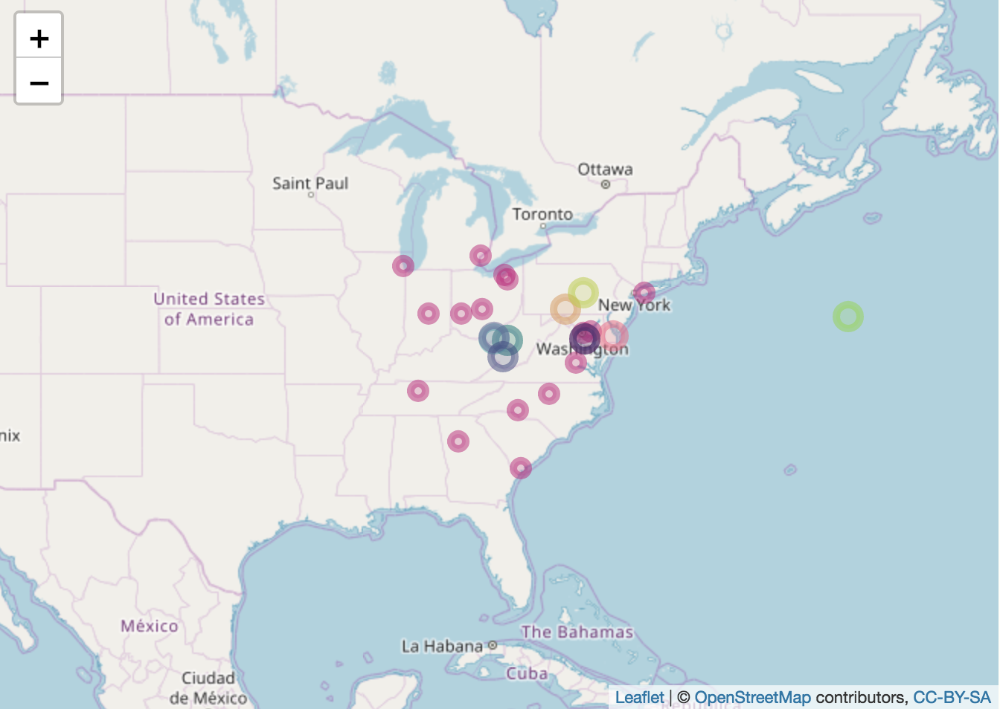

## Software 📦

CRAN:  
GitHub: 

### New packages

* A new version (`v2.1.0`) of `phylogram` is on CRAN - a tool for developing phylogenetic trees as deeply-nested lists known as “dendrogram” objects. Check out [the vignette](https://cran.rstudio.com/web/packages/phylogram/vignettes/phylogram-vignette.html) to get started. This is not the first version on CRAN - but it just completed our software review process and is now in the rOpenSci family - welcome [Shaun](https://github.com/shaunpwilkinson)! {{ "phylogram" | image_cran }} {{ "phylogram" | image_github }}
* A new version (`v1.2.2`) of `skynet` is on CRAN - A flexible tool that allows generating bespoke air transport statistics for urban studies based on publicly available data from the Bureau of Transport Statistics (BTS) in the United States. Check out the [skynet vignette](https://cran.rstudio.com/web/packages/skynet/vignettes/skynet.html) to get started. This is not the first version on CRAN - but it just completed our software review process and is now in the rOpenSci family - welcome [Filipe](https://github.com/FilipeamTeixeira)!  {{ "skynet" | image_cran }} {{ "skynet" | image_github }}

### Releases

* A new version (`v5.2.1`) of `drake` is on CRAN - A Pipeline Toolkit for Reproducible Computation at Scale. Check out the [drake docs](https://ropensci.github.io/drake/) to get started.  {{ "drake" | image_cran }} {{ "drake" | image_github }}
> tests changes
* A new version (`v0.3.0`) of `brranching` is on CRAN - grab plant phylogenies from Phylomatic. See the [release notes](https://github.com/ropensci/brranching/releases/tag/v0.3.0) for changes. Check out the [brranching README](https://github.com/ropensci/brranching#brranching) to get started.  {{ "brranching" | image_cran }} {{ "brranching" | image_github }}
> new fxn bladj 🌲 - crul now for http requests 
* A new version (`v0.2.0`) of `googleLanguageR` is on CRAN - call Google's Natural Language, Cloud Translation, Cloud Speech and Cloud Text-to-Speech API's. See the [release notes](https://github.com/ropensci/googleLanguageR/releases/tag/v0.2.0) for changes. Check out the [googleLanguageR docs](http://code.markedmondson.me/googleLanguageR/) to get started.  {{ "googleLanguageR" | image_cran }} {{ "googleLanguageR" | image_github }}
> new example Shiny app for Speech API, new fxn gl_talk() for Google text to speech
* A new version (`v0.8.4`) of `elastic` is on CRAN - the best R client for [Elasticsearch](https://www.elastic.co/products/elasticsearch). See the [release notes](https://github.com/ropensci/elastic/releases/tag/v0.8.4) for changes. Check out the [elastic vignettes](https://cran.r-project.org/web/packages/elastic/vignettes/) to get started.  {{ "elastic" | image_cran }} {{ "elastic" | image_github }}
> new fxn docs_bulk_update, many docs_bulk fixes/improvements
* A new version (`v0.8.0`) of `biomartr` is on CRAN - genomic data retrieval with R. See the [biomartr NEWS](https://cran.rstudio.com/web/packages/biomartr/news/news.html) for changes. Check out the [biomartr docs](https://ropensci.github.io/biomartr/) to get started.  {{ "biomartr" | image_cran }} {{ "biomartr" | image_github }}
> new fxn getCollection, lots of new functionality in existing functions
* A new version (`v1.1`) of `cld3` is on CRAN - bindings to Google's Compact Language Detector 3. See the [cld3 NEWS](https://cran.rstudio.com/web/packages/cld3/NEWS) for changes. Check out the [cld3 README](https://github.com/ropensci/cld3#cld3) to get started.  {{ "cld3" | image_cran }} {{ "cld3" | image_github }}
* A new version (`v0.4.2`) of `gistr` is on CRAN - work with GitHub gists API from R. See the [release notes](https://github.com/ropensci/gistr/releases/tag/v0.4.2) for changes. Check out the [gistr vignette](https://cran.rstudio.com/web/packages/gistr/vignettes/gistr_vignette.html) to get started.  {{ "gistr" | image_cran }} {{ "gistr" | image_github }}
> better failure behavior; gist() can now fetch a specific revision

  

## Software Review ✔

We accept community contributed packages via our onboarding system - an open software review system, sorta like scholarly paper review, but way better. We'll highlight newly onboarded packages here. A huge thanks to our reviewers, who do a lot of work reviewing (see the [blog post on our review system](https://ropensci.org/blog/2016/03/28/software-review)),
and the authors of the packages!

If you want to be a reviewer fill out [this short form](https://ropensci.org/onboarding/), and we'll ping you when there's a submission that fits in your area of expertise.

The following four packages recently went through our onboarding process and have been approved!

* [skynet][] > Generates Networks from Bureau of Transport Statistics Data
    * Author: [Filipe Teixeira](https://github.com/FilipeamTeixeira)
    * Issue: [ropensci/onboarding#214](https://github.com/ropensci/onboarding/issues/214)
    * Reviewers: 
        * [Topher Cyll](https://github.com/toph)
        * [Aaron Berdanier](https://github.com/berdaniera)
* [jstor][] > Functions and helpers to import metadata and full-texts delivered
    by Data for Research (DfR) by JSTOR
    * Author: [Thomas Klebel](https://github.com/tklebel)
    * Issue: [ropensci/onboarding#189](https://github.com/ropensci/onboarding/issues/189)
    * Reviewers:
        * [Jason Becker](https://github.com/jsonbecker)
        * [Riley Smith-Hunter](https://github.com/EccRiley)
* [phylogram][] > Dendrograms for Evolutionary Analysis
    * Author: [Shaun Wilkinson](https://github.com/shaunpwilkinson)
    * Issue: [ropensci/onboarding#212](https://github.com/ropensci/onboarding/issues/212)
    * Reviewers:
        * [Ben Ward](https://github.com/BenJWard)
        * [Will Cornwell](https://github.com/wcornwell)
* [rppo][] > R functions to access Plant Phenology Ontology annotated datasets
    * Author: [John Deck](https://github.com/jdeck88)
    * Issue: [ropensci/onboarding#207](https://github.com/ropensci/onboarding/issues/207)
    * Reviewers:
        * [Tamora James](https://github.com/tdjames1)
        * [Remi Vergnon](https://github.com/remsamp)

The following three packages were recently submitted:

* [DataPackageR][] > Construct Reproducible Analytic Data Sets as R Packages
    * Author: [Greg Finak](https://github.com/gfinak)
    * Issue: [ropensci/onboarding#230](https://github.com/ropensci/onboarding/issues/230)
    * Reviewers: 
        * [Kara Woo](https://github.com/karawoo)
        * [Will Landau](https://github.com/wlandau)
* [smapr][] > Acquisition and Processing of NASA Soil Moisture Active-Passive (SMAP) Data
    * Author: [Maxwell Joseph](https://github.com/mbjoseph)
    * Issue: [ropensci/onboarding#231](https://github.com/ropensci/onboarding/issues/231)
    * Reviewers: 
        * [Laura DeCicco](https://github.com/ldecicco-USGS)
        * [Marco Sciaini](https://github.com/marcosci)
* [restez][] > Create and Query a Local Copy of GenBank in R
    * Author: [Dom Bennett](https://github.com/DomBennett)
    * Issue: [ropensci/onboarding#232](https://github.com/ropensci/onboarding/issues/232)
    * Reviewers: not assigned yet

  

## On the blog

### rOpenSci Unconference

There will be a series of posts from teams at our recent [rOpenSci Unconference](http://unconf18.ropensci.org/). Here's the first:

The roomba team ([Amanda Dobbyn](https://github.com/aedobbyn), [Jim Hester](https://github.com/jimhester), [Laura DeCicco](https://github.com/ldecicco-USGS), [Christine Stawitz](https://github.com/cstawitz), [Isabella Velasquez](https://github.com/ivelasq)) wrote about their [roomba][] package: [A package for tidying nested lists](https://ropensci.org/blog/2018/06/26/roomba/)

### Software Review / Onboarding

We're excited to announce two new editors for rOpenSci software review: Anna Krystalli and Lincoln Mullen. Read the details: [Announcing new software review editors: Anna Krystalli and Lincoln Mullen](https://ropensci.org/blog/2018/06/22/new_editors/).

### rOpenSci HQ

[Chat with the rOpenSci team at upcoming meetings](https://ropensci.org/blog/2018/06/19/ropensci-at-meetings/) - check out where various rOpenSci team members will be. We'd love to chat with you.

  

## Use cases

The following 14 works use/cite rOpenSci software:

* Venkat wrote a thesis citing [tabulizer][]: [Sub-basin Valuation of Agriculture: A Crop-specific Assessment of Groundwater Footprints and Value in California](https://search.proquest.com/docview/2054012866) [^1]
* Jaspers _et al_. cited [aRxiv][], [rbhl][], [rcrossref][], [rdatacite][], and [rplos][] in their paper [Machine learning techniques for the automation of literature reviews and systematic reviews in EFSA](https://doi.org/10.2903/sp.efsa.2018.EN-1427) [^2]
* Lawrence cited our [plotly][] R package in their paper [Linking Traditional Chinese Medicinal Herbs to Cancer Related Pathways](https://digitalcommons.ohsu.edu/etd/4054) [^3]
* Krogsgaard _et al_. cited our R package [plotly][] in their paper [Characteristics of the bacterial microbiome in association with common intestinal parasites in irritable bowel syndrome](https://doi.org/10.1038/s41424-018-0027-2) [^4]
* Mienna cited [rgbif][] in their paper [Patterns and Drivers of Phylogenetic Diversity and Endemism in the Norwegian Vascular Flora](https://brage.bibsys.no/xmlui/bitstream/handle/11250/2502355/17650_FULLTEXT.pdf?sequence=1) [^5]
* Morais & Bellwood cited our package [rotl][] in their paper [Global drivers of reef fish growth](https://doi.org/10.1111/faf.12297) [^6]
* Schwalie _et al_. cited [biomartr][] in their paper [A stromal cell population that inhibits adipogenesis in mammalian fat depots](https://doi.org/10.1038/s41586-018-0226-8) [^7]
* Ondei _et al_. cited [taxize][] in their paper [Nature’s untold stories: an overview on the availability and type of on-line data on long-term biodiversity monitoring](https://doi.org/10.1007/s10531-018-1582-2) [^8]
* Hendrickson cited [plotly][] in their thesis [Ecological Characterization of the Kuparuk River Aufeis Field, North Slope Alaska](https://search.proquest.com/docview/2056852840) [^9]
* Sanford _et al_. cited [plotly][] in their paper [Effect of Oscillation on Perineal Pressure in Cyclists: Implications for Micro-Trauma](https://doi.org/10.1016/j.esxm.2018.05.002) [^10]
* Mioduchowska _et al_. cited [rentrez][] in their paper [Instances of erroneous DNA barcoding of metazoan invertebrates: Are universal cox1 gene primers too “universal”?](https://doi.org/10.1371/journal.pone.0199609) [^11]
* Casey cited [tokenizers][] in their dissertation [Text Analytics Techniques in the Digital World: a Sentiment Analysis Case Study of the Coverage of Climate Change on US News Networks](https://arrow.dit.ie/icr/vol16/iss1/7) [^12]
* Koc _et al_. cited [plotly][] in their paper [Specalyzer—an interactive online tool to analyze spectral reflectance measurements](https://doi.org/10.7717/peerj.5031) [^13]
* Devlin _et al_. [plotly][] in their paper [WHAM!: a web-based visualization suite for user-defined analysis of metagenomic shotgun sequencing data](https://doi.org/10.1186/s12864-018-4870-z) [^14]

  

## In the news

 

Lorenzo Busetto wrote a blog post about a new version of his package [MODIStsp][]
<blockquote class="twitter-tweet" data-cards="hidden" data-lang="en">
MODIStsp v. 1.3.4 is on CRAN ! Introduces an improved GUI allowing interactive definition of processing extent over a map and other tweaks (thanks <a href="https://twitter.com/LeahAWasser?ref_src=twsrc%5Etfw">@LeahAWasser</a> <a href="https://twitter.com/TimSalabim3?ref_src=twsrc%5Etfw">@TimSalabim3</a> <a href="https://twitter.com/timelyportfolio?ref_src=twsrc%5Etfw">@timelyportfolio</a> ) ! More info at <a href="https://t.co/koyFHpnaex">https://t.co/koyFHpnaex</a> <a href="https://twitter.com/hashtag/rstats?src=hash&amp;ref_src=twsrc%5Etfw">#rstats</a> <a href="https://twitter.com/hashtag/rspatial?src=hash&amp;ref_src=twsrc%5Etfw">#rspatial</a> <a href="https://t.co/kXQV9lENTJ">pic.twitter.com/kXQV9lENTJ</a>
&mdash; Lorenzo Busetto (@lbusetto74) <a href="https://twitter.com/lbusetto74/status/1006204164832153600?ref_src=twsrc%5Etfw">June 11, 2018</a></blockquote>

Adam Sparks highlights a use of his package [GSODR][] in the wild
<blockquote class="twitter-tweet" data-cards="hidden" data-lang="en">
The first time you see the use of your <a href="https://twitter.com/hashtag/rstats?src=hash&amp;ref_src=twsrc%5Etfw">#rstats</a> package (GSODR) by someone else! Bonus points for work related to your own FOR. <a href="https://t.co/eZV0IsA0SL">pic.twitter.com/eZV0IsA0SL</a>
&mdash; Adam Sparks (@adamhsparks) <a href="https://twitter.com/adamhsparks/status/1003433349489180672?ref_src=twsrc%5Etfw">June 4, 2018</a></blockquote>

[Hal Snyder](https://twitter.com/HalDroid) shared a Jupyter Notebook with use of our package [rrricanes][]
<blockquote class="twitter-tweet" data-lang="en">
It&#39;s hurricane season. With CoCalc, we can use R to analyze Natl Hurricane Ctr data, thanks to rrricanes pkg by <a href="https://twitter.com/timtrice?ref_src=twsrc%5Etfw">@timtrice</a>. Here&#39;s a Jupyter notebook showing 120-day forecast cone for Subtropical Storm Alberto frmo 2 PM EDT on Saturday, May 26, 2018. <a href="https://twitter.com/rOpenSci?ref_src=twsrc%5Etfw">@rOpenSci</a> <a href="https://twitter.com/cocalc_com?ref_src=twsrc%5Etfw">@cocalc_com</a> <a href="https://t.co/GR9UodJXzc">pic.twitter.com/GR9UodJXzc</a>
&mdash; Hal Snyder (@HalDroid) <a href="https://twitter.com/HalDroid/status/1007659793279082496?ref_src=twsrc%5Etfw">June 15, 2018</a></blockquote>

Jose Vera used [pdftools][] in a blog post
<blockquote class="twitter-tweet" data-cards="hidden" data-lang="en">
getting data from pdfs using pdftools <a href="https://twitter.com/hashtag/rstats?src=hash&amp;ref_src=twsrc%5Etfw">#rstats</a> package <a href="https://t.co/KMx41yMuzB">https://t.co/KMx41yMuzB</a> <a href="https://t.co/cxVmMXxPkW">pic.twitter.com/cxVmMXxPkW</a>
&mdash; Jose Manuel Vera (@verajosemanuel) <a href="https://twitter.com/verajosemanuel/status/1009416831126392832?ref_src=twsrc%5Etfw">June 20, 2018</a></blockquote>

[Lucy D'Agostino McGowan](https://twitter.com/LucyStats) wrote a post using [opencage][]: [Bringing the family together: Finding the center of geographic points in R](http://livefreeordichotomize.com/2018/06/27/bringing-the-family-together-finding-the-center-of-geographic-points-in-r/)

 

[Steven Mortimer](https://twitter.com/StevenMMortimer) wrote a blog post: [Scraping responsibly with R](https://stevenmortimer.com/scraping-responsibly-with-r/) in which he uses our package [robotstxt][]

  

  

### Keep up with rOpenSci

* Mailing list: Sign up with an email address to get this newsletter sent to your inbox -> [ropensci.org/#subscribe](https://ropensci.org/#subscribe)
* Alternatively, you can subscribe to this newsletter via our XML feed at <https://news.ropensci.org/feed.xml> or our JSON feed at <https://news.ropensci.org/feed.json>
* rOpenSci on Twitter: [@ropensci](https://twitter.com/ropensci)
* The rOpenSci blog at [ropensci.org/blog](https://ropensci.org/blog) - you can subscribe in any RSS aggregator, or manually via <https://ropensci.org/feed.xml>. We also announce new blog posts on our Twitter account.

 

#### Footnotes

[^1]: Venkat, A. (2018). Sub-basin Valuation of Agriculture: A Crop-specific Assessment of Groundwater Footprints and Value in California (Masters thesis, Tufts University). <https://search.proquest.com/docview/2054012866>
[^2]: Jaspers, S., De Troyer, E., & Aerts, M. (2018). Machine learning techniques for the automation of literature reviews and systematic reviews in EFSA. EFSA Supporting Publications, 15(6), 1427E. <https://doi.org/10.2903/sp.efsa.2018.EN-1427>
[^3]: Hsu, Lawrence. 2018. Linking Traditional Chinese Medicinal Herbs to Cancer Related Pathways. Scholar Archive. 4054. <https://digitalcommons.ohsu.edu/etd/4054>
[^4]: Krogsgaard, L. R., Andersen, L. O. ‘Brien, Johannesen, T. B., Engsbro, A. L., Stensvold, C. R., Nielsen, H. V., & Bytzer, P. (2018). Characteristics of the bacterial microbiome in association with common intestinal parasites in irritable bowel syndrome. Clinical and Translational Gastroenterology, 9(6). <https://doi.org/10.1038/s41424-018-0027-2>
[^5]: Mienna, I. M. (2018). Patterns and Drivers of Phylogenetic Diversity and Endemism in the Norwegian Vascular Flora (Master's thesis, NTNU). <https://brage.bibsys.no/xmlui/bitstream/handle/11250/2502355/17650_FULLTEXT.pdf?sequence=1>
[^6]: Morais, R. A., & Bellwood, D. R. (2018). Global drivers of reef fish growth. Fish and Fisheries. <https://doi.org/10.1111/faf.12297>
[^7]: Schwalie, P. C., Dong, H., Zachara, M., Russeil, J., Alpern, D., Akchiche, N., … Deplancke, B. (2018). A stromal cell population that inhibits adipogenesis in mammalian fat depots. Nature. <https://doi.org/10.1038/s41586-018-0226-8>
[^8]: Ondei, S., Brook, B. W., & Buettel, J. C. (2018). Nature’s untold stories: an overview on the availability and type of on-line data on long-term biodiversity monitoring. Biodiversity and Conservation. <https://doi.org/10.1007/s10531-018-1582-2>
[^9]: Hendrickson, P. J. (2018). Ecological Characterization of the Kuparuk River Aufeis Field, North Slope Alaska (Doctoral dissertation, University of Colorado at Boulder). <https://search.proquest.com/docview/2056852840>
[^10]: Sanford, T., Gadzinski, A. J., Gaither, T., Osterberg, E. C., Murphy, G. P., Carroll, P. R., & Breyer, B. N. (2018). Effect of Oscillation on Perineal Pressure in Cyclists: Implications for Micro-Trauma. Sexual Medicine. <https://doi.org/10.1016/j.esxm.2018.05.002>
[^11]: Mioduchowska, M., Czyż, M. J., Gołdyn, B., Kur, J., & Sell, J. (2018). Instances of erroneous DNA barcoding of metazoan invertebrates: Are universal cox1 gene primers too “universal”? PLOS ONE, 13(6), e0199609. <https://doi.org/10.1371/journal.pone.0199609>
[^12]: Casey, Jerome (2018). Text Analytics Techniques in the Digital World: a Sentiment Analysis Case Study of the Coverage of Climate Change on US News Networks. Irish Communication Review: Vol. 16: Iss. 1, Article 7. <https://arrow.dit.ie/icr/vol16/iss1/7>
[^13]: Koc, A., Henriksson, T., & Chawade, A. (2018). Specalyzer—an interactive online tool to analyze spectral reflectance measurements. PeerJ, 6, e5031. <https://doi.org/10.7717/peerj.5031>
[^14]: Devlin, J. C., Battaglia, T., Blaser, M. J., & Ruggles, K. V. (2018). WHAM!: a web-based visualization suite for user-defined analysis of metagenomic shotgun sequencing data. BMC Genomics, 19(1). <https://doi.org/10.1186/s12864-018-4870-z>

[taxize]: https://github.com/ropensci/taxize
[MODIStsp]: https://github.com/ropensci/MODIStsp
[rrricanes]: https://github.com/ropensci/rrricanes
[fulltext]: https://github.com/ropensci/fulltext
[GSODR]: https://github.com/ropensci/GSODR
[rcrossref]: https://github.com/ropensci/rcrossref
[opencage]: https://github.com/ropensci/opencage
[pangaer]: https://github.com/ropensci/pangaer
[magick]: https://github.com/ropensci/magick
[vcr]: https://github.com/ropensci/vcr
[httr]: https://cran.rstudio.com/web/packages/httr/
[curl]: https://github.com/jeroen/curl
[rentrez]: https://github.com/ropensci/rentrez
[rotl]: https://github.com/ropensci/rotl
[rtimicropem]: https://github.com/ropensci/rtimicropem
[rppo]: https://github.com/ropensci/rppo
[plotly]: https://github.com/ropensci/plotly
[phylogram]: https://github.com/ropensci/phylogram
[jstor]: https://github.com/ropensci/jstor
[skynet]: https://github.com/ropensci/skynet

[DataPackageR]: https://github.com/RGLab/DataPackageR
[smapr]: https://github.com/earthlab/smapr
[restez]: https://github.com/AntonelliLab/restez

[roomba]: https://github.com/ropenscilabs/roomba

[tabulizer]: https://github.com/ropensci/tabulizer
[aRxiv]: https://github.com/ropensci/aRxiv
[rbhl]: https://github.com/ropensci/rbhl
[rdatacite]: https://github.com/ropensci/rdatacite
[rplos]: https://github.com/ropensci/rplos
[rgbif]: https://github.com/ropensci/rgbif
[biomartr]: https://github.com/ropensci/biomartr
[tokenizers]: https://github.com/ropensci/tokenizers
[pdftools]: https://github.com/ropensci/pdftools
[robotstxt]: https://github.com/ropensci/robotstxt
