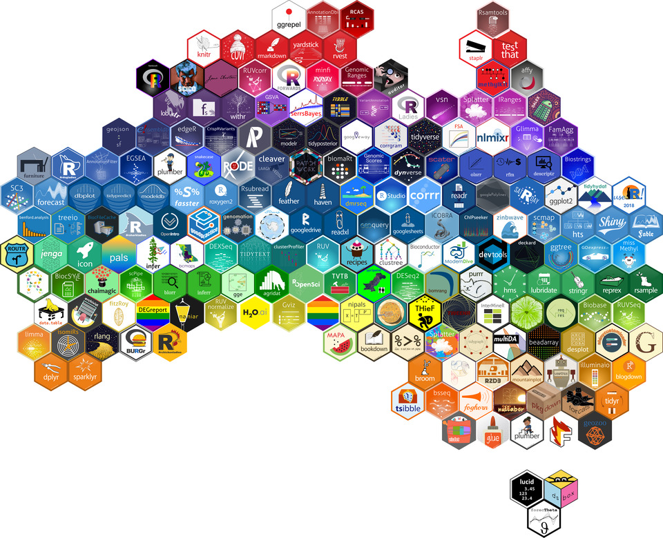
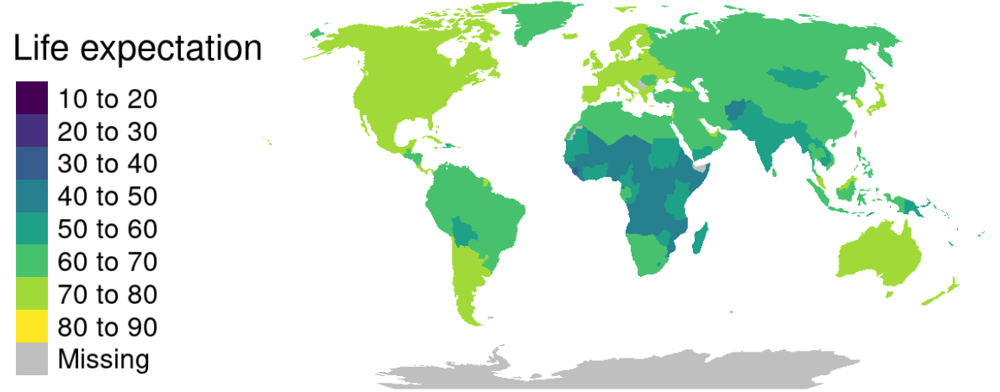

## rOpenSci HQ 

The rOpenSci team will be at a number of upcoming events.

* Jul 25-27, New York, NY, Stefanie Butland, Handbook hackathon - Open Source Alliance for Open Scholarship
* Jul 28 - Aug 2, Vancouver, CA, Scott Chamberlain & Jenny Bryan, Joint Statistical Meetings (JSM)

 

## Software 📦

CRAN:  
GitHub: 

### New packages

* A new version (`v0.2.7`) of `weathercan` is on CRAN - . Check out the [docs](http://ropensci.github.io/weathercan/) to get started. It just completed our software review process and is now in the rOpenSci family - welcome [Steffi](https://github.com/steffilazerte)! {{ "weathercan" | image_cran }} {{ "weathercan" | image_github }} 

### New versions

* A new version (`v1.0.1`) of `available` is on CRAN - check if the title of a package is available, appropriate and interesting. Check out the [available README](https://github.com/ropenscilabs/available#available) to get started.  {{ "available" | image_cran }} {{ "available" | image_github }}
> remove self from results :)
* A new version (`v0.22.1`) of `git2r` is on CRAN - an interface to the libgit2 library, a pure C implementation of the Git core methods. See the [release notes](https://github.com/ropensci/git2r/releases/tag/v0.22.1) for changes. Check out the [git2r README](https://github.com/ropensci/git2r#introduction) to get started.  {{ "git2r" | image_cran }} {{ "git2r" | image_github }}
> changed from S4 to S3 classes; a number of new functions; update libgit2 lib
* A new version (`v0.6.0`) of `crul` is on CRAN - an R6 based HTTP client for R made for developers. See the [release notes](https://github.com/ropensci/crul/releases/tag/v0.6.0) for changes. Check out the [crul docs](https://ropensci.github.io/crul/) to get started. {{ "crul" | image_cran }} {{ "crul" | image_github }}
> simple auth now in async requests; new fxn ok(); progress bar support; new vign; global curl options
* A new version (`v2.2`) of `tesseract` is on CRAN - bindings to Tesseract, an OCR engine <https://opensource.google.com/projects/tesseract>. See the [release notes](https://github.com/ropensci/tesseract/releases/tag/v2.2) for changes. Check out the [tesseract vignette](https://cran.rstudio.com/web/packages/tesseract/vignettes/intro.html) to get started. {{ "tesseract" | image_cran }} {{ "tesseract" | image_github }}
> fixes for breaking changes
* A new version (`v0.5.0`) of `rebird` is on CRAN - a client for the eBird database of bird observations. See the [release notes](https://github.com/ropensci/rebird/releases/tag/v0.5.0) for changes. Check out the [rebird vignette](https://cran.rstudio.com/web/packages/rebird/vignettes/rebird_vignette.html) to get started. {{ "rebird" | image_cran }} {{ "rebird" | image_github }}
> all requests use https instead of http
* A new version (`v1.2`) of `spelling` is on CRAN - tools for spell checking. See the [NEWS](https://cran.rstudio.com/web/packages/spelling/NEWS) for changes. Check out the [spelling README](https://github.com/ropensci/spelling#spelling) to get started. {{ "spelling" | image_cran }} {{ "spelling" | image_github }}
> internally normalize all case of lang strings to lower_UPPER e.g en_US
* A new version (`v0.3.5`) of `rdefra` is on CRAN - get data from DEFRA's UK-AIR website <https://uk-air.defra.gov.uk/>. See the [NEWS](https://cran.rstudio.com/web/packages/rdefra/news/news.html) for changes. Check out the [rdefra vignette](https://cran.rstudio.com/web/packages/rdefra/vignettes/rdefra_vignette.html) to get started. {{ "rdefra" | image_cran }} {{ "rdefra" | image_github }}
> minor changes; changes in pkg for API changes
* A new version (`v1.1.0`) of `hydroscoper` is on CRAN - interface to the Greek National Data Bank for Hydrological and Meteorological Information <http://www.hydroscope.gr/>. See the [release notes](https://github.com/ropensci/hydroscoper/releases/tag/1.1.0) for changes. Check out the [hydroscoper vignettes](https://cran.rstudio.com/web/packages/hydroscoper/vignettes/) to get started. {{ "hydroscoper" | image_cran }} {{ "hydroscoper" | image_github }}
> new fxn find_stations() gets nearest hydroscope's stations
* A new version (`v0.8.0`) of `spocc` is on CRAN - an interface to many species occurrence data sources. See the [release notes](https://github.com/ropensci/spocc/releases/tag/v0.8.0) for changes. Check out the [spocc docs](https://ropensci.github.io/spocc/) to get started. {{ "spocc" | image_cran }} {{ "spocc" | image_github }}
> occ() gains new param date for date range searches across data sources
* A new version (`v2.5.4`) of `FedData` is on CRAN - fxns to automate downloading geospatial data available from several federated data sources (mainly US fed gov't). See the [NEWS](https://cran.rstudio.com/web/packages/FedData/news/news.html) for changes. Check out the [FedData docs](http://ropensci.github.io/FedData/) to get started. {{ "FedData" | image_cran }} {{ "FedData" | image_github }}
> fixed issue in downloading NED tiles
* A new version (`v0.1.8`) of `fingertipsR` is on CRAN - Fingertips data for public health <http://fingertips.phe.org.uk/>. See the [release notes](https://github.com/ropensci/fingertipsR/releases/tag/v0.1.8) for changes. Check out the [fingertipsR vignettes](https://cran.rstudio.com/web/packages/fingertipsR/vignettes/) to get started. {{ "fingertipsR" | image_cran }} {{ "fingertipsR" | image_github }}
> fingertips_data function adapted for "New data” field in API
* A new version (`v0.2.0`/`v0.2.2`) of `charlatan` is on CRAN - a comprehensive approach to making fake data, supporting many languages. See the release notes for [v0.2.0](https://github.com/ropensci/charlatan/releases/tag/v0.2.0) and [v0.2.2](https://github.com/ropensci/charlatan/releases/tag/v0.2.2) for changes. Check out the [charlatan vignette](https://cran.rstudio.com/web/packages/charlatan/vignettes/charlatan_vignette.html) to get started. {{ "charlatan" | image_cran }} {{ "charlatan" | image_github }}
> new package author! new data types: Elements, Internet, User-agent, Files, LoremIpsum
* A new version (`0.5.1`) of `visdat` is on CRAN - create preliminary exploratory data visualisations of an entire dataset to identify problems or unexpected features using ggplot2. See the [release notes](https://github.com/ropensci/visdat/releases/tag/0.5.1) for changes. Check out the [visdat docs](http://visdat.njtierney.com/) to get started. {{ "visdat" | image_cran }} {{ "visdat" | image_github }}
> new fxns: vis_compare, vis_expect, vis_cor, vis_guess, and more!
* A new version (`v1.0.0`/`v1.0.2`) of `rgbif` is on CRAN - interface to the [Global Biodiversity Information Facility](https://www.gbif.org/) API. See the release notes for [v1.0.0](https://github.com/ropensci/rgbif/releases/tag/v1.0.0) and [v1.0.2](https://github.com/ropensci/rgbif/releases/tag/v1.0.2) for changes. Check out the [rgbif vignettes](https://cran.rstudio.com/web/packages/rgbif/vignettes/) to get started. {{ "rgbif" | image_cran }} {{ "rgbif" | image_github }}
> v1! new download queue fxns: occ_download_prep, occ_download_queue; new map fxn: map_fetch; internal paging in name_* functions, and more

  

## Software Review ✔

We accept community contributed packages via our onboarding system - an open software review system, sorta like scholarly paper review, but way better. We'll highlight newly onboarded packages here. A huge thanks to our reviewers, who do a lot of work reviewing (see the [blog post on our review system](https://ropensci.org/blog/2016/03/28/software-review)),
and the authors of the packages!

If you want to be a reviewer fill out [this short form](https://ropensci.org/onboarding/), and we'll ping you when there's a submission that fits in your area of expertise.

The following 3 packages recently went through our onboarding process and have been approved!

* [epubr][] > Read EPUB File Metadata and Text
    * Author: [Matthew Leonawicz](https://github.com/leonawicz)
    * Issue: [ropensci/onboarding#222](https://github.com/ropensci/onboarding/issues/222)
    * Reviewers: 
        * [Cale Basaraba](https://github.com/calebasaraba)
        * [Suzan Baert](https://github.com/suzanbaert)
* [phylotaR][] > Automated phylogenetic sequence cluster identification from GenBank
    * Author: [Dom Bennett](https://github.com/DomBennett)
    * Issue: [ropensci/onboarding#187](https://github.com/ropensci/onboarding/issues/187)
    * Reviewers: 
        * [John Baumgartner](https://github.com/johnbaums)
        * [Lorenzo Busetto](https://github.com/lbusett)
* [antanym][] > Antarctic Geographic Place Names
    * Author: [Ben Raymond](https://github.com/raymondben)
    * Issue: [ropensci/onboarding#198](https://github.com/ropensci/onboarding/issues/198)
    * Reviewers: 
        * [Zebulun Arendsee](https://github.com/arendsee)
        * [Naupaka Zimmerman](https://github.com/naupaka)

  

## On the blog

### rOpenSci Unconference

In another in a series of posts from teams at our recent [rOpenSci Unconference](http://unconf18.ropensci.org/), this time we've got the mchtoolbox team.

The mchtoolbox team ([Monica Gerber](https://github.com/monicagerber), [Jennifer Thompson](https://github.com/jenniferthompson), [Jenny Draper](https://github.com/learithe), [Kyle Hamilton](https://github.com/kylehamilton), [Charles Gray](https://github.com/softloud)) wrote about their [mchtoolbox](https://github.com/ropenscilabs/mchtoolbox) project: [Exploring ways to address gaps in maternal-child health research](https://ropensci.org/blog/2018/07/05/mchtoolbox/)

  

## Use cases

The following 12 works use/cite rOpenSci software:

* Zhu _et al_. cited [rnoaa][] in their paper [En Route Flight Time Prediction Under Convective Weather Events](https://doi.org/10.2514/6.2018-3670) [^1]
* Wiltshire _et al_. cited [rgbif][] in their paper [Predicting environmental suitability for key benthic species in an ecologically and economically important deep-sea environment](https://doi.org/10.1016/j.dsr2.2018.06.011) [^2]
* De Oliveira _et al_. cited our package [rgbif][] in their paper [Distributional Patterns and Ecological Determinants of Bat Occurrence Inside Caves: A Broad Scale Meta-Analysis](https://doi.org/10.3390/d10030049) [^3]
* Allaway _et al_. cited [webchem][] in their conference paper [Abstract 4643: Drug-Target Explorer: An interactive tool for examining chemical-biological interactions](http://cancerres.aacrjournals.org/content/78/13_Supplement/4643) [^4]
* Sánchez-Tapia _et al_. used [rgbif][] in their paper [Environmental and geographical space partitioning between core and peripheral Myrsine species (Primulaceae) of the Brazilian Atlantic Forest](https://doi.org/10.1093/botlinnean/boy034) [^5]
* Gastauer _et al_. used [rotl][] and [brranching][] in their paper [Optimizing community trees using the open tree of life increases the reliability of phylogenetic diversity and dispersion indices](https://doi.org/10.1016/j.ecoinf.2018.06.008) [^6]
* Nuijten used [rplos][] in their dissertation [Research on Research: A Meta-Scientific Study of Problems and Solutions in Psychological Science](https://doi.org/10.31234/osf.io/qtk7e) [^7]
* Chapman _et al_. used [rnaturalearth][] in their paper [Restoration Provides Hope for Faunal Recovery: Changes in Primate Abundance Over 45 Years in Kibale National Park, Uganda](https://doi.org/10.1177/1940082918787376) [^8]
* Kovesdi _et al_. used [tesseract][] in their book chapter [Quantifying the Contribution of Individual Display Features on Fixation Duration to Support Human-System Interface Design in Nuclear Power Plants](https://link.springer.com/chapter/10.1007/978-3-319-94229-2_44) [^9]
* Becker used our package [lingtypology][] in their dissertation thesis [Articles in the world’s languages](http://home.uni-leipzig.de/lbecker/papers/diss.pdf) [^10]
* Garmendia _et al_. used [writexl][] in their paper [Distribution and ecological segregation on regional and microgeographic scales of the diploid Centaurea aspera L., the tetraploid C. seridis L., and their triploid hybrids (Compositae)](https://doi.org/10.7717/peerj.5209) [^11]
* Sethuraman & Vaishnavi used our R package [plotly][] in their paper [An innovative integrated methodology for predicting and mitigating global warming in major Indian cities](https://acadpubl.eu/hub/2018-119-15/1/45.pdf) [^12]

  

## In the news

<!-- Make note about ropensci related stuff that happened at useR: from maelle "there were 2 tutorials and 1 talk, as far as I can tell, maybe more, worth checking the program) and start it with a picture of the hex wall asking if people can see the rOpenSci hexes on that wall (rOpenSci logo, and visdat logo, not more I think. The ozunconf `icon` pkg logo is also on the wall" -->

[useR 2018](https://user2018.r-project.org/) happened last week in Brisbane, Australia. 

The hex wall was very cool. See if you can pick out the rOpenSci related stickers (bigger image [here](https://blog.mitchelloharawild.com/blog/2018-07-11-user-2018-feature-wall_files/final.jpg))

No rOpenSci team members were there, but there were a fair amount of rOpenSci mentions in talks (these are a subset). 

* Our own [Jeroen Ooms](https://ropensci.org/about/#team) was mentioned in his R Consortium project on [infrastructure development for R on Windows and MacOS](https://www.r-consortium.org/announcement/2018/05/29/announcing-the-r-consortium-isc-funded-project-grant-recipients-for-spring-2018) 
* [Mark Padgham](https://github.com/mpadge/) gave a great talk about *tRansport tools for the World (Health Organization)*, mentioning rOpenSci  
* [Thomas Klebel](https://github.com/tklebel) gave a talk on *jstor: an R package for analysing scientific articles*, mentioning rOpenSci and the recent [rOpenSci review](https://github.com/ropensci/onboarding/issues/189) of [the package](https://github.com/ropensci/jstor)  
* [Zachary Foster](https://github.com/tklebel) gave a talk on *taxa and metacoder: R packages for parsing, visualization, and manipulation of taxonomic data*, mentioning rOpenSci and the recent [rOpenSci review](https://github.com/ropensci/onboarding/issues/189) of [the package](https://github.com/ropensci/jstor)  
* A workshop *The ultimate online collection toolbox: Combining RSelenium and Rvest* highlighted the rOpenSci package [RSelenium][]. part 1:   part 2: 

 

[Julia Silge](https://twitter.com/juliasilge) wrote a blog post about [Punctuation In Literature](https://juliasilge.com/blog/punctution-literature/) using our [gutenbergr][] package 

 

[Jakub Nowosad](https://twitter.com/jakub_nowosad) wrote a blog post [Life (expectancy), animated](https://nowosad.github.io/post/life-expectancy-animated/) using our [rnaturalearth][] package

 

[Shirin Glander](https://twitter.com/ShirinGlander) wrote a blog post using our [googleLanguageR][] package: [Addendum: Text-to-Speech with the googleLanguageR package](https://shirinsplayground.netlify.com/2018/06/googlelanguager/) 

[Danielle Navarro](https://twitter.com/djnavarro) wrote a fun blog post on skimboarding data using our packages [skimr][] and [pdftools][]: [Day 63-66: Learning to skim](http://djnavarro.net/post/2018-06-30-skimr/)

 

[Eric Scott](https://twitter.com/LeafyEricScott) wrote a blog post about a new function he contributed to our package [webchem][]: [Retrieve chemical retention indices from NIST with {webchem}!](http://www.ericrscott.com/2018/06/28/webchem/)

 

[Francisco Rodriguez-Sanchez](https://twitter.com/frod_san/) was scratching his own itch to create a new package [biblioformat](https://github.com/Pakillo/biblioformat) that uses our package [rcrossref][]

 

[Hal Snyder](https://twitter.com/HalDroid) wrote a blog post on using [Hurricane tracking data in R](https://share.cocalc.com/share/db982efa-e439-4e2d-933b-7c7011c6b21a/Public/r-hurricane-tracker-beryl.ipynb?viewer=share) using our [rrricanes][] package

  

  

### Keep up with rOpenSci

* Mailing list: Sign up with an email address to get this newsletter sent to your inbox -> [ropensci.org/#subscribe](https://ropensci.org/#subscribe)
* Alternatively, you can subscribe to this newsletter via our XML feed at <https://news.ropensci.org/feed.xml> or our JSON feed at <https://news.ropensci.org/feed.json>
* rOpenSci on Twitter: [@ropensci](https://twitter.com/ropensci)
* The rOpenSci blog at [ropensci.org/blog](https://ropensci.org/blog) - you can subscribe in any RSS aggregator, or manually via <https://ropensci.org/feed.xml>. We also announce new blog posts on our Twitter account.

 

#### Footnotes

[^1]: Zhu, G., Matthews, C., Wei, P., Lorch, M., & Chakravarty, S. (2018). En Route Flight Time Prediction Under Convective Weather Events. 2018 Aviation Technology, Integration, and Operations Conference. <https://doi.org/10.2514/6.2018-3670>
[^2]: Wiltshire, K., Tanner, J. E., Althaus, F., Sorokin, S., & Williams, A. (2018). Predicting environmental suitability for key benthic species in an ecologically and economically important deep-sea environment. Deep Sea Research Part II: Topical Studies in Oceanography. <https://doi.org/10.1016/j.dsr2.2018.06.011>
[^3]: De Oliveira, H., Oprea, M., & Dias, R. (2018). Distributional Patterns and Ecological Determinants of Bat Occurrence Inside Caves: A Broad Scale Meta-Analysis. Diversity, 10(3), 49. <https://doi.org/10.3390/d10030049>
[^4]: Robert J. Allaway, Sara J. Gosline, Marco Nievo, Salvatore La Rosa, Annette Bakker and Justin Guinney 2018. Abstract 4643: Drug-Target Explorer: An interactive tool for examining chemical-biological interactions. Cancer Res July 1 2018 (78) (13 Supplement) 4643, doi:10.1158/1538-7445.AM2018-4643, <http://cancerres.aacrjournals.org/content/78/13_Supplement/4643>
[^5]: Sánchez-Tapia, A., Mário L Garbin, Marinez F Siqueira, Karlo G Guidoni-Martins, Fabio R Scarano, Tatiana T Carrijo. Environmental and geographical space partitioning between core and peripheral Myrsine species (Primulaceae) of the Brazilian Atlantic Forest, Botanical Journal of the Linnean Society <https://doi.org/10.1093/botlinnean/boy034>
[^6]: Gastauer, M., Caldeira, C. F., Trotter, I., Ramos, S. J., & Neto, J. A. A. M. (2018). Optimizing community trees using the open tree of life increases the reliability of phylogenetic diversity and dispersion indices. Ecological Informatics. <https://doi.org/10.1016/j.ecoinf.2018.06.008>
[^7]: Nuijten, M. B. (2018, April 30). Research on Research: A Meta-Scientific Study of Problems and Solutions in Psychological Science. <https://doi.org/10.31234/osf.io/qtk7e>
[^8]: Chapman, C. A., Omeja, P. A., Kalbitzer, U., Fan, P., & Lawes, M. J. (2018). Restoration Provides Hope for Faunal Recovery: Changes in Primate Abundance Over 45 Years in Kibale National Park, Uganda. Tropical Conservation Science, 11, 194008291878737. <https://doi.org/10.1177/1940082918787376>
[^9]: Kovesdi, C., Le Blanc, K., Spielman, Z., Hill, R., & Oxstrand, J. (2018, July). Quantifying the Contribution of Individual Display Features on Fixation Duration to Support Human-System Interface Design in Nuclear Power Plants. In International Conference on Applied Human Factors and Ergonomics (pp. 453-464). Springer, Cham. <https://link.springer.com/chapter/10.1007/978-3-319-94229-2_44>
[^10]: Becker, L. 2018. Articles in the world’s languages. Dissertation thesis. <http://home.uni-leipzig.de/lbecker/papers/diss.pdf>
[^11]: Garmendia, A., Merle, H., Ruiz, P., & Ferriol, M. (2018). Distribution and ecological segregation on regional and microgeographic scales of the diploid Centaurea aspera L., the tetraploid C. seridis L., and their triploid hybrids (Compositae). PeerJ, 6, e5209. <https://doi.org/10.7717/peerj.5209>
[^12]: Sethuraman, J., & Vaishnavi, J. 2018. An innovative integrated methodology for predicting and mitigating global warming in major Indian cities. <https://acadpubl.eu/hub/2018-119-15/1/45.pdf>

[taxize]: https://github.com/ropensci/taxize
[gutenbergr]: https://github.com/ropensci/gutenbergr
[rnaturalearth]: https://github.com/ropensci/rnaturalearth
[googleLanguageR]: https://github.com/ropensci/googleLanguageR
[skimr]: https://github.com/ropensci/skimr
[rcrossref]: https://github.com/ropensci/rcrossref
[webchem]: https://github.com/ropensci/webchem
[pdftools]: https://github.com/ropensci/pdftools
[magick]: https://github.com/ropensci/magick
[rrricanes]: https://github.com/ropensci/rrricanes
[rnoaa]: https://github.com/ropensci/rnoaa
[brranching]: https://github.com/ropensci/brranching
[rgbif]: https://github.com/ropensci/rgbif
[rplos]: https://github.com/ropensci/rplos
[plotly]: https://github.com/ropensci/plotly
[lingtypology]: https://github.com/ropensci/lingtypology
[writexl]: https://github.com/ropensci/writexl
[rotl]: https://github.com/ropensci/rotl
[tesseract]: https://github.com/ropensci/tesseract
[phylotaR]: https://github.com/ropensci/phylotaR
[epubr]: https://github.com/leonawicz/epubr
[antanym]: https://github.com/ropensci/antanym
[RSelenium]: https://github.com/ropensci/RSelenium
