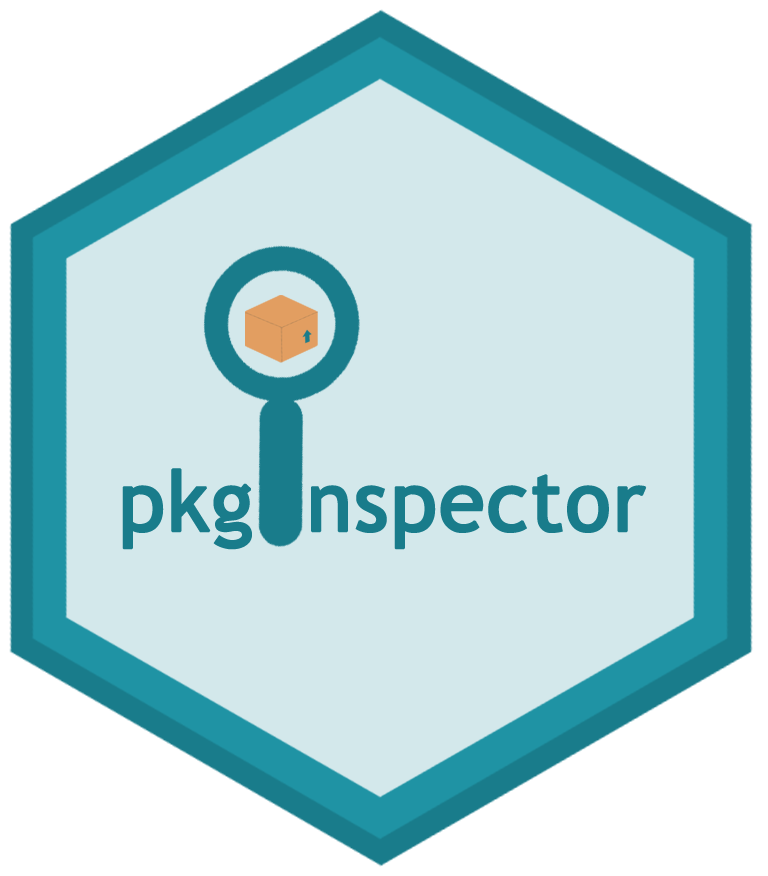
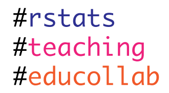

## rOpenSci HQ 

The rOpenSci team will be at a number of upcoming events.

* Aug 6-10, New Orleans, LA, USA, Carl Boettiger and Dan Sholler, Ecological Society of America annual meeting
* Aug 15-16, Cambridge, MA, USA, Stefanie Butland, R/Pharma meeting
* Aug 27-30, Dunedin, New Zealand, Scott Chamberlain, Biodiversity Information Standards Meeting (TDWG)

 

## Software 📦

CRAN:  
GitHub: 

### New packages

* The first version (`v1.0.5`) of `helminthR` is on CRAN - access the London Natural History Museum Host-Helminth record database. It's been on GitHub for a while, but this is the first version on CRAN. Check out the [vignette](https://cran.rstudio.com/web/packages/helminthR/vignettes/helminthR_vignette.html) to get started. {{ "helminthR" | image_cran }} {{ "helminthR" | image_github }} 
* The first version (`v1.0.0`) of `phylotaR` is on CRAN - Automated Phylogenetic Sequence Cluster Identification from GenBank. Check out the [docs](https://ropensci.github.io/phylotaR/) to get started. The package recently completed our [software review process](https://github.com/ropensci/onboarding/issues/187) and is now in the rOpenSci family - welcome [Dom](https://github.com/DomBennett)! {{ "phylotaR" | image_cran }} {{ "phylotaR" | image_github }} 
* The first version (`v0.1.0`) of `nodbi` is now on CRAN - it's like `DBI`, bu for NoSQL databases, supporting create/get/delete/update operations for many NoSQL databases. Check out the [README](https://github.com/ropensci/nodbi#nodbi) to get started. The project was started a few years back at an rOpenSci Unconference, but is just now getting to CRAN. {{ "nodbi" | image_cran }} {{ "nodbi" | image_github }} 

### New versions

* A new version (`v0.4.0`) of `nomisr` is on CRAN - access UK official statistics from the Nomis database. See the [NEWS](https://cran.rstudio.com/web/packages/nomisr/news/news.html) for changes. Checkout the [nomisr docs](https://docs.evanodell.com/nomisr/) to get started. {{ "nomisr" | image_cran }} {{ "nomisr" | image_github }}
> docs fixes, new citation to JOSS paper
* A new version (`v0.4.1`) of `epubr` is on CRAN - read EPUB File Metadata and Text. See the [NEWS](https://cran.rstudio.com/web/packages/epubr/news/news.html) for changes. Checkout the [epubr docs](https://ropensci.github.io/epubr/) to get started. {{ "epubr" | image_cran }} {{ "epubr" | image_github }}
> many fixes, better error handling
* A new version (`v3.2-0`) of `clifro` is on CRAN - easily download and visualise climate data from CliFlo. See the [release notes](https://github.com/ropensci/clifro/releases) for changes. Checkout the [clifro vignettes](https://cran.rstudio.com/web/packages/clifro/vignettes/) to get started. {{ "clifro" | image_cran }} {{ "clifro" | image_github }}
> many bug fixes, XML -> xml2
* A new version (`v0.9.4`) of `taxize` is on CRAN - taxonomic toolbelt for R. See the [release notes](https://github.com/ropensci/taxize/releases/tag/v0.9.4) for changes. Checkout the [taxize book](https://ropensci.github.io/taxize-book/) to get started. {{ "taxize" | image_cran }} {{ "taxize" | image_github }}
> new fxns to help with API keys; 11 bug fixes!
* A new version (`v0.2.2`) of `auk` is on CRAN - eBird data extraction and processing with AWK. See the [NEWS](https://cran.rstudio.com/web/packages/auk/news/news.html) for changes. Checkout the [auk docs](https://cornelllabofornithology.github.io/auk/) to get started. {{ "auk" | image_cran }} 
> updated to work with EDB ver. 1.9, bug fixes
* A new version (`v0.2.4`) of `wdman` is on CRAN - Webdriver/Selenium binary manager. See the [NEWS](https://cran.rstudio.com/web/packages/wdman/news/news.html) for changes. Checkout the [wdman vignette](https://cran.rstudio.com/web/packages/wdman/vignettes/basics.html) to get started. {{ "wdman" | image_cran }} {{ "wdman" | image_github }}
> back on CRAN!
* A new version (`v4.8.0`) of `plotly` is on CRAN. See the [NEWS](https://github.com/ropensci/plotly/blob/master/NEWS.md#480) for changes. Checkout the [plotly book](https://plotly-book.cpsievert.me/) to get started. {{ "plotly" | image_cran }} {{ "plotly" | image_github }}
> too many to list ...
* A new version (`v0.8.2`) of `rplos` is on CRAN - Public Library of Science client. See the [release notes](https://github.com/ropensci/rplos/releases/tag/v0.8.2) for changes. Checkout the [rplos vignettes](https://cran.rstudio.com/web/packages/rplos/vignettes/) to get started. {{ "rplos" | image_cran }} {{ "rplos" | image_github }}
> bug fixes; now test caching with vcr
* A new version (`v0.5.0`) of `rredlist` is on CRAN - IUCN Red List client. See the [release notes](https://github.com/ropensci/rredlist/releases/tag/v0.5.0) for changes. Checkout the [rredlist README](https://github.com/ropensci/rredlist#rredlist) to get started. {{ "rredlist" | image_cran }} {{ "rredlist" | image_github }}
> new function to help setup API key; new fxns for comp groups
* A new version (`v0.2-6`) of `dbhydroR` is on CRAN - DBHYDRO hydrologic and water quality data. See the [release notes](https://github.com/ropensci/dbhydroR/releases/tag/v0.2-6) for changes. Checkout the [dbhydroR docs](https://ropensci.github.io/dbhydroR/) to get started. {{ "dbhydroR" | image_cran }} {{ "dbhydroR" | image_github }}
> get_hydro() bug fix
* A new version (`v0.2.2`) of `bomrang` is on CRAN - Australian Government Bureau of Meteorology (BOM) data. See the [release notes](https://github.com/ropensci/bomrang/releases/tag/0.2.2) for changes. Checkout the [bomrang docs](https://ropensci.github.io/bomrang/) to get started. {{ "bomrang" | image_cran }} {{ "bomrang" | image_github }}
> fix corrupted zip file download in get_historical(); update pkg citation
* A new version (`v5.3.0`) of `drake` is on CRAN - a pipeline toolkit for reproducible computation at scale. See the [release notes](https://github.com/ropensci/drake/releases/tag/v5.3.0) for changes. Checkout the [drake docs](https://ropensci.github.io/drake/) to get started. {{ "drake" | image_cran }} {{ "drake" | image_github }}
> lots of improvements, check out the release notes
* A new version (`v0.6.2`) of `robotstxt` is on CRAN - robots.txt parser and Webbot/Spider/Crawler permissions checker. See the [release notes](https://github.com/ropensci/robotstxt/releases/tag/v0.6.2) for changes. Checkout the [robotstxt vignette](https://cran.rstudio.com/web/packages/robotstxt/vignettes/using_robotstxt.html) to get started. {{ "robotstxt" | image_cran }} {{ "robotstxt" | image_github }}
> pkg dep. future compatability; small fix
* A new version (`v0.1.1`) of `binman` is on CRAN - a binary download manager. See the [NEWS](https://cran.rstudio.com/web/packages/binman/news/news.html) for changes. Checkout the [binman vignette](https://cran.rstudio.com/web/packages/binman/vignettes/binman-Basics.html) to get started. {{ "binman" | image_cran }} {{ "binman" | image_github }}
> back on CRAN!
* The package [qualtRics][] was archived on CRAN recently - hopefully it will be back up soon. {{ "qualtRics" | image_github }}

  

## Software Review ✔

We accept community contributed packages via our onboarding system - an open software review system, sorta like scholarly paper review, but way better. We'll highlight newly onboarded packages here. A huge thanks to our reviewers, who do a lot of work reviewing (see the [blog post on our review system](https://ropensci.org/blog/2016/03/28/software-review)),
and the authors of the packages!

If you want to be a reviewer fill out [this short form](https://ropensci.org/onboarding/), and we'll ping you when there's a submission that fits in your area of expertise.

The following two packages recently went through our onboarding process and have been approved!

* [arkdb][] > Archive and Unarchive Databases Using Flat Files
    * Author: [Carl Boettiger](https://github.com/cboettig)
    * Issue: [ropensci/onboarding#224](https://github.com/ropensci/onboarding/issues/224)
    * Reviewers: 
        * [Rich FitzJohn](https://github.com/richfitz)
        * [Verena Haunschmid](https://github.com/expectopatronum)
* [MODIStsp][] > A Tool for Automating Download and Preprocessing of MODIS Land Products
    Data
    * Author: [Michael Sumner](https://github.com/mdsumner)
    * Issue: [ropensci/onboarding#184](https://github.com/ropensci/onboarding/issues/184)
    * Reviewers: 
        * [Leah Wasser](https://github.com/lwasser)
        * [Jeff Hanson](https://github.com/jeffreyhanson)

The following three packages were recently submitted:

* [spatsoc][] > Group Animal Relocation Data by Spatial and Temporal Relationship
    * Author: [Alec Robitaille](https://github.com/robitalec)
    * Issue: [ropensci/onboarding#237](https://github.com/ropensci/onboarding/issues/237)
    * Reviewers: 
        * [Priscilla Minotti](https://github.com/pmnatural)
        * [Filipe Teixeira](https://github.com/FilipeamTeixeira)
* [rdhs][] > API Client and Dataset Management for the Demographic and Health Survey (DHS) Data
    * Author: [Alec Robitaille](https://github.com/robitalec)
    * Issue: [ropensci/onboarding#238](https://github.com/ropensci/onboarding/issues/238)
    * Reviewers: not assigned yet
* [treestartr][] > Generate Starting Trees For Combined Molecular, Morphological and Stratigraphic Data
    * Author: [April Wright](https://github.com/wrightaprilm)
    * Issue: [ropensci/onboarding#239](https://github.com/ropensci/onboarding/issues/239)
    * Reviewers: 
        * [David Bapst](https://github.com/dwbapst)
        * 2nd reviewer not assigned yet

  

## On the blog

### rOpenSci Unconference

We've got a number of blog posts from our series of posts from teams at our recent [rOpenSci Unconference](http://unconf18.ropensci.org/):

The pkginspector team ([Sam Albers](https://github.com/boshek), [Leonardo Collado-Torres](https://github.com/lcolladotor), [Mauro Lepore](https://github.com/maurolepore), [Joyce Robbins](https://github.com/jtr13), [Omayma Said](https://github.com/OmaymaS), and [Noam Ross](https://github.com/noamross)) wrote about their [pkginspector](https://github.com/ropenscilabs/pkginspector) project: [What's inside? pkginspector provides helpful tools for inspecting package contents](https://ropensci.org/blog/2018/07/17/pkginspector/)

In a series of three blog posts the rOpenSci Educators Collaborative team ([Laura Ación](https://github.com/lauracion), [Mara Averick](https://github.com/batpigandme), [Leonardo Collado Torres](https://lcolladotor.github.io), [Auriel Fournier](https://github.com/aurielfournier), [Alison Hill](https://alison.rbind.io), [Sean Kross](https://github.com/seankross), [Lincoln Mullen](https://lincolnmullen.com)) wrote about:

* [What Are The Challenges When Teaching Science With R?](https://ropensci.org/blog/2018/07/24/educollab-challenges/)
* [What Educational Resources Work Well and Why?](https://ropensci.org/blog/2018/07/25/educollab-resources/)
* [How Can We Develop a Community of Innovative R Educators?](https://ropensci.org/blog/2018/07/26/educollab-community/)

The umapr team ([Sean Hughes](https://github.com/seaaan), [Angela Li](https://github.com/angela-li), [Ju Kim](https://github.com/juyeongkim), [Malisa Smith](https://github.com/malisas), and [Ted Laderas](https://github.com/laderast)) wrote about their [pkginspector](https://github.com/ropenscilabs/pkginspector) project: [A package for dimensionality reduction of large data](https://ropensci.org/blog/2018/08/01/umapr/)

### Technotes

[Jeroen Ooms](https://ropensci.org/about/#team) wrote about a new package: [Gifski on CRAN: the fastest GIF encoder in the universe](https://ropensci.org/technotes/2018/07/23/gifski-release/). This is not only a fun package, but also demonstrates usage of the programming language [Rust](https://www.rust-lang.org) inside an R package!

  

## Use cases

The following seven works use/cite rOpenSci software:

* Rodriguez & cited [pdftools][] in their conference paper [Uncovering the digital “x” phenomena in the IS field: A text analysis approach](https://dds.cct.lsu.edu/ddslab/pdf/rodriguez2018.pdf) [^1]
* Longbottom _et al_. used our package [spocc][] in their paper [Vulnerability to snakebite envenoming: a global mapping of hotspots](https://doi.org/10.1016/S0140-6736(18)31224-8) [^2]
* Araujo & Alves used our package [rAltmetric][] in their preprint [The altmetric performance of publications authored by Brazilian researchers: analysis of CNPq productivity scholarship holders](https://arxiv.org/abs/1807.06366) [^3]
* Ruiz _et al_. used [iheatmapr][] in their paper [Characterization of the accessible genome in the human malaria parasite Plasmodium falciparum](https://doi.org/10.1093/nar/gky643) [^4]
* Paseka & Grunberg used [rotl][] in their paper [Allometric and trait-based patterns in parasite stoichiometry](https://doi.org/10.1111/oik.05339) [^5]
* Finak _et al_. wrote a paper about their package [DataPackageR][]: [DataPackageR: Reproducible data preprocessing, standardization and sharing using R/Bioconductor for collaborative data analysis](https://doi.org/10.12688/gatesopenres.12832.2) [^6]
* Rojas-Garcia _et al_. used [crminer][] in their paper [Semi-automatic extraction of processes affecting beaches from a specialized corpus](http://euralex2018.cjvt.si/wp-content/uploads/sites/6/2018/07/Euralex2018_book_of_abstracts_FINAL.pdf#page=93) [^7]

The following seven papers cited our [plotly][] package:

* Brechtmann, F., Matuseviciute, A., Mertes, C., Yepez, V. A., Avsec, Z., Herzog, M., … Gagneur, J. (2018). OUTRIDER: A statistical method for detecting aberrantly expressed genes in RNA sequencing data. <https://doi.org/10.1101/322149> [^8]
* Václav Brázda, Jiri Lysek, Martin Bartas, and Miroslav Fojta. 2018. Complex analyses of short inverted repeats in all sequenced chloroplast DNAs. BioMed Research International. <https://www.hindawi.com/journals/bmri/aip/1097018/> [^9]
* Fontaine, A., Lequime, S., Moltini-Conclois, I., Jiolle, D., Leparc-Goffart, I., Reiner, R. C., & Lambrechts, L. (2018). Epidemiological significance of dengue virus genetic variation in mosquito infection dynamics. PLOS Pathogens, 14(7), e1007187. <https://doi.org/10.1371/journal.ppat.1007187> [^10]
* Lawrence, T. N., & Bhalla, R. S. (2018). Spatially explicit action research for coastal fisheries management. PLOS ONE, 13(7), e0199841. <https://doi.org/10.1371/journal.pone.0199841> [^11]
* Glanz, H., & Pileggi, S. 2018. Improving statistical communication in statistical computing courses. In M. A. Sorto, A. White, & L. Guyot (Eds.), Looking back, looking forward. Proceedings of the Tenth International Conference on Teaching Statistics (ICOTS10, July, 2018), Kyoto, Japan. Voorburg, The Netherlands: International Statistical Institute. <https://iase-web.org/icots/10/proceedings/pdfs/ICOTS10_3F1.pdf> [^12]
* Zhang, Y., Oates, L. G., Serate, J., Xie, D., Pohlmann, E., Bukhman, Y. V., … Ong, R. G. (2018). Diverse lignocellulosic feedstocks can achieve high field-scale ethanol yields while providing flexibility for the biorefinery and landscape-level environmental benefits. GCB Bioenergy. <https://doi.org/10.1111/gcbb.12533> [^13]
* Wang, C., Moya, L., Clements, J. A., Nelson, C. C., & Batra, J. (2018). Mining human cancer datasets for kallikrein expression in cancer: the “KLK-CANMAP” Shiny web tool. Biological Chemistry, 0(0). <https://doi.org/10.1515/hsz-2017-0322> [^14]

  

## In the news

Alex Koiter used two of our packages, [weathercan][] and [tidyhydat][], to explore historical precipitation and sediment load in a single creek in 1975.
<blockquote class="twitter-tweet" data-lang="en">
Thought there was an error in the data until I combined  <a href="https://twitter.com/steffilazerte?ref_src=twsrc%5Etfw">@steffilazerte</a>&#39;s weathercan and <a href="https://twitter.com/big_bad_sam?ref_src=twsrc%5Etfw">@big_bad_sam</a>&#39;s tidyhydat <a href="https://twitter.com/hashtag/rstats?src=hash&amp;ref_src=twsrc%5Etfw">#rstats</a> packages. Must have been an interesting day in Riding Mtn <a href="https://twitter.com/ParksCanada?ref_src=twsrc%5Etfw">@ParksCanada</a> Wilsons Crk back on Sept 19, 1975! Over 20 cm of rain in one day! <a href="https://t.co/w3qh5DCv6E">pic.twitter.com/w3qh5DCv6E</a>
&mdash; Alex K (@Alex_Koiter) <a href="https://twitter.com/Alex_Koiter/status/1016689857974829057?ref_src=twsrc%5Etfw">July 10, 2018</a></blockquote>

 

Serdar Balci demonstrated in a tweet how to add NCBI references into an R markdown document with our package [RefManageR][]
<blockquote class="twitter-tweet" data-cards="hidden" data-lang="en">
How to add <a href="https://twitter.com/ncbi_pubmed?ref_src=twsrc%5Etfw">@ncbi_pubmed</a> references into R <a href="https://twitter.com/hashtag/Markdown?src=hash&amp;ref_src=twsrc%5Etfw">#Markdown</a> document? Here is my <a href="https://twitter.com/hashtag/rstats?src=hash&amp;ref_src=twsrc%5Etfw">#rstats</a> code: <a href="https://t.co/wCt0rZcZ5T">pic.twitter.com/wCt0rZcZ5T</a>
&mdash; Serdar Balcı (@serdarbalci) <a href="https://twitter.com/serdarbalci/status/1016707273098395648?ref_src=twsrc%5Etfw">July 10, 2018</a></blockquote>

 

Paul Oldham used our package [rorcid][] in a "practical introduction to the rorcid package": [Introduction to ORCID Researcher Identifiers in R with rorcid](https://www.pauloldham.net/introduction-to-orcid-with-rorcid/). This is a great intro to `rorcid` - if you've been wanting to use it this is a great place to get started.

 

Mara Averick pointed out a  blog post on [Image Manipulation for Machine Learning in R](https://heartbeat.fritz.ai/image-manipulation-for-machine-learning-in-r-ff2b92069fef), which used our package [magick][].
<blockquote class="twitter-tweet" data-lang="en">
✨ Lessons in {magick}… 📝 “Image Manipulation for Machine Learning in R” by AMR <a href="https://t.co/T5KQPyx9Ec">https://t.co/T5KQPyx9Ec</a> <a href="https://twitter.com/hashtag/rstats?src=hash&amp;ref_src=twsrc%5Etfw">#rstats</a> <a href="https://twitter.com/hashtag/machinelearning?src=hash&amp;ref_src=twsrc%5Etfw">#machinelearning</a> <a href="https://t.co/pKE9Utop92">pic.twitter.com/pKE9Utop92</a>
&mdash; Mara Averick (@dataandme) <a href="https://twitter.com/dataandme/status/1019041264929591296?ref_src=twsrc%5Etfw">July 17, 2018</a></blockquote>

 

Xavier Rotllan-Puig used our package [rgbif][] in his first R package: [PreSPickR](https://github.com/xavi-rp/PreSPickR)
<blockquote class="twitter-tweet" data-cards="hidden" data-lang="en">
<a href="https://twitter.com/hashtag/MyFirstRPackage?src=hash&amp;ref_src=twsrc%5Etfw">#MyFirstRPackage</a> is on <a href="https://twitter.com/github?ref_src=twsrc%5Etfw">@github</a>. Use <a href="https://twitter.com/hashtag/PreSPickR?src=hash&amp;ref_src=twsrc%5Etfw">#PreSPickR</a> to download species presences (occurrences) from <a href="https://twitter.com/GBIF?ref_src=twsrc%5Etfw">@GBIF</a> and from <a href="https://twitter.com/hashtag/Bioatles?src=hash&amp;ref_src=twsrc%5Etfw">#Bioatles</a>.<a href="https://t.co/16Wku4EOuO">https://t.co/16Wku4EOuO</a> Please, report bugs and suggest improvements! <a href="https://twitter.com/hashtag/Rstats?src=hash&amp;ref_src=twsrc%5Etfw">#Rstats</a>
&mdash; Xavi Rotllan-Puig 🎗 (@xavi_rp) <a href="https://twitter.com/xavi_rp/status/1019150850676154368?ref_src=twsrc%5Etfw">July 17, 2018</a></blockquote>

 

[Amanda Dobbyn](https://dobb.ae/) wrote a blog post recently [Sentiment analysis of Slack reviews using R](https://monkeylearn.com/blog/sentiment-analysis-of-slack-reviews-using-r/) using our packages [monkeylearn][] and [robotstxt][]

  

  

### Keep up with rOpenSci

* Mailing list: Sign up with an email address to get this newsletter sent to your inbox -> [ropensci.org/#subscribe](https://ropensci.org/#subscribe)
* Alternatively, you can subscribe to this newsletter via our XML feed at <https://news.ropensci.org/feed.xml> or our JSON feed at <https://news.ropensci.org/feed.json>
* rOpenSci on Twitter: [@ropensci](https://twitter.com/ropensci)
* The rOpenSci blog at [ropensci.org/blog](https://ropensci.org/blog) - you can subscribe in any RSS aggregator, or manually via <https://ropensci.org/feed.xml>. We also announce new blog posts on our Twitter account.

 

#### Footnotes

[^1]: Rodriguez, J., & Piccoli, G. 2018. Uncovering the digital “x” phenomena in the IS field: A text analysis approach. 31st Bled eConference Digital Transformation. <https://dds.cct.lsu.edu/ddslab/pdf/rodriguez2018.pdf>
[^2]: Longbottom, J., Shearer, F. M., Devine, M., Alcoba, G., Chappuis, F., Weiss, D. J., … Pigott, D. M. (2018). Vulnerability to snakebite envenoming: a global mapping of hotspots. The Lancet. doi:10.1016/s0140-6736(18)31224-8 <https://doi.org/10.1016/S0140-6736(18)31224-8>
[^3]: Araujo, R. F., & Alves, M. (2018). The altmetric performance of publications authored by Brazilian researchers: analysis of CNPq productivity scholarship holders. arXiv preprint arXiv:1807.06366. <https://arxiv.org/abs/1807.06366>
[^4]: Ruiz, J. L., Tena, J. J., Bancells, C., Cortés, A., Gómez-Skarmeta, J. L., & Gómez-Díaz, E. (2018). Characterization of the accessible genome in the human malaria parasite Plasmodium falciparum. Nucleic Acids Research. <https://doi.org/10.1093/nar/gky643>
[^5]: Paseka, R. E., & Grunberg, R. L. (2018). Allometric and trait-based patterns in parasite stoichiometry. Oikos. <https://doi.org/10.1111/oik.05339>
[^6]: Finak, G., Mayer, B., Fulp, W., Obrecht, P., Sato, A., Chung, E., … Gottardo, R. (2018). DataPackageR: Reproducible data preprocessing, standardization and sharing using R/Bioconductor for collaborative data analysis. Gates Open Research, 2, 31. <https://doi.org/10.12688/gatesopenres.12832.2>
[^7]: Rojas-Garcia, J., Batista-Navarro, R., & Faber, P. 2018. Semi-automatic extraction of processes affecting beaches from a specialized corpus. In The XVIII EURALEX International Congress (p. 93). <http://euralex2018.cjvt.si/wp-content/uploads/sites/6/2018/07/Euralex2018_book_of_abstracts_FINAL.pdf#page=93>
[^8]: Brechtmann, F., Matuseviciute, A., Mertes, C., Yepez, V. A., Avsec, Z., Herzog, M., … Gagneur, J. (2018). OUTRIDER: A statistical method for detecting aberrantly expressed genes in RNA sequencing data. <https://doi.org/10.1101/322149>
[^9]: Václav Brázda, Jiri Lysek, Martin Bartas, and Miroslav Fojta. 2018. Complex analyses of short inverted repeats in all sequenced chloroplast DNAs. BioMed Research International. <https://www.hindawi.com/journals/bmri/aip/1097018/>
[^10]: Fontaine, A., Lequime, S., Moltini-Conclois, I., Jiolle, D., Leparc-Goffart, I., Reiner, R. C., & Lambrechts, L. (2018). Epidemiological significance of dengue virus genetic variation in mosquito infection dynamics. PLOS Pathogens, 14(7), e1007187. <https://doi.org/10.1371/journal.ppat.1007187>
[^11]: Lawrence, T. N., & Bhalla, R. S. (2018). Spatially explicit action research for coastal fisheries management. PLOS ONE, 13(7), e0199841. <https://doi.org/10.1371/journal.pone.0199841>
[^12]: Glanz, H., & Pileggi, S. 2018. Improving statistical communication in statistical computing courses. In M. A. Sorto, A. White, & L. Guyot (Eds.), Looking back, looking forward. Proceedings of the Tenth International Conference on Teaching Statistics (ICOTS10, July, 2018), Kyoto, Japan. Voorburg, The Netherlands: International Statistical Institute. <https://iase-web.org/icots/10/proceedings/pdfs/ICOTS10_3F1.pdf>
[^13]: Zhang, Y., Oates, L. G., Serate, J., Xie, D., Pohlmann, E., Bukhman, Y. V., … Ong, R. G. (2018). Diverse lignocellulosic feedstocks can achieve high field-scale ethanol yields while providing flexibility for the biorefinery and landscape-level environmental benefits. GCB Bioenergy. <https://doi.org/10.1111/gcbb.12533>
[^14]: Wang, C., Moya, L., Clements, J. A., Nelson, C. C., & Batra, J. (2018). Mining human cancer datasets for kallikrein expression in cancer: the “KLK-CANMAP” Shiny web tool. Biological Chemistry, 0(0). <https://doi.org/10.1515/hsz-2017-0322>

[taxize]: https://github.com/ropensci/taxize
[DataPackageR]: https://github.com/ropensci/DataPackageR
[iheatmapr]: https://github.com/ropensci/iheatmapr
[rAltmetric]: https://github.com/ropensci/rAltmetric
[spocc]: https://github.com/ropensci/spocc
[rcrossref]: https://github.com/ropensci/rcrossref
[crminer]: https://github.com/ropensci/crminer
[pdftools]: https://github.com/ropensci/pdftools
[magick]: https://github.com/ropensci/magick
[robotstxt]: https://github.com/ropensci/robotstxt
[monkeylearn]: https://github.com/ropensci/monkeylearn
[rorcid]: https://github.com/ropensci/rorcid
[rnoaa]: https://github.com/ropensci/rnoaa
[rgbif]: https://github.com/ropensci/rgbif
[brranching]: https://github.com/ropensci/brranching
[RefManageR]: https://github.com/ropensci/RefManageR
[rplos]: https://github.com/ropensci/rplos
[plotly]: https://github.com/ropensci/plotly
[lingtypology]: https://github.com/ropensci/lingtypology
[tidyhydat]: https://github.com/ropensci/tidyhydat
[rotl]: https://github.com/ropensci/rotl
[weathercan]: https://github.com/ropensci/weathercan
[phylotaR]: https://github.com/ropensci/phylotaR
[epubr]: https://github.com/leonawicz/epubr
[antanym]: https://github.com/ropensci/antanym
[RSelenium]: https://github.com/ropensci/RSelenium

[arkdb]: https://github.com/cboettig/arkdb
[MODIStsp]: https://github.com/lbusett/MODIStsp 
[spatsoc]: https://gitlab.com/robit.a/spatsoc/
[rdhs]: https://github.com/OJWatson/rdhs
[treestartr]: https://github.com/wrightaprilm/treeStartR
[qualtRics]: https://github.com/ropensci/qualtRics
