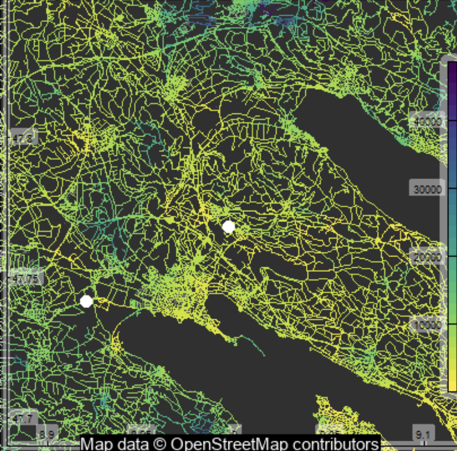

## rOpenSci HQ 

The rOpenSci team will be at a number of [upcoming events](https://ropensci.org/community/#eventlist):

* Aug 27-30, Dunedin, New Zealand, Scott Chamberlain, Biodiversity Information Standards Meeting (TDWG)
* Sep 3-7, Buenos Aires, Argentina, Jenny Bryan and Maëlle Salmon (remote), LatinR meeting
* Sep 11, Radolfzell, Germany, Maëlle Salmon, AniMove meeting
* Sep 12-14, The Hauge, Netherlands, Jeroen Ooms, Use of R in Official Statistics (uRos2018)

 

## Software 📦

CRAN:  
GitHub: 

### New packages

* The first version (`v0.0.1`) of `arkdb` is on CRAN - archive and unarchive databases as flat text files. Check out the [docs](https://ropensci.github.io/arkdb/) to get started. {{ "arkdb" | image_cran }} {{ "arkdb" | image_github }} 
* The first version (`v0.15.1`) of `DataPackageR` is on CRAN - an R package to enable reproducible data processing, packaging and sharing. Check out the [vignettes](https://cran.r-project.org/web/packages/DataPackageR/vignettes/) to get started. {{ "DataPackageR" | image_cran }} {{ "DataPackageR" | image_github }} 

### New versions

* A new version (`v1.2.2`) of `GSODR` is on CRAN - Global Surface Summary of the Day (GSOD) Weather Data from R. See the [release notes](https://github.com/ropensci/GSODR/releases/tag/1.2.2) for changes. Checkout the [GSODR docs](https://ropensci.github.io/GSODR/) to get started. {{ "GSODR" | image_cran }} {{ "GSODR" | image_github }}
> bug 🐛 fixes
* A new version (`v1.0.6`) of `helminthR` is on CRAN - Access London Natural History Museum Host-Helminth Record Database. See the [release notes](https://github.com/ropensci/helminthR/releases/tag/v1.0.6) for changes. Checkout the [helminthR vignette](https://cran.r-project.org/web/packages/helminthR/vignettes/helminthR_vignette.html) to get started. {{ "helminthR" | image_cran }} {{ "helminthR" | image_github }}
> bug fix
* A new version (`v0.3.0`) of `bomrang` is on CRAN - Australian Government Bureau of Meteorology (BOM) Data from R. See the [release notes](https://github.com/ropensci/bomrang/releases/tag/v0.3.0) for changes. Checkout the [bomrang docs](https://ropensci.github.io/bomrang/) to get started. {{ "bomrang" | image_cran }} {{ "bomrang" | image_github }}
> new function `get_coastal_forecast()` 
* A new version (`v0.8.4`) of `rplos` is on CRAN - Interface to the Search API for Public Library of Science journals. See the [release notes](https://github.com/ropensci/rplos/releases/tag/v0.8.4) for changes. Checkout the [rplos vignettes](https://cran.r-project.org/web/packages/rplos/vignettes/) to get started. {{ "rplos" | image_cran }} {{ "rplos" | image_github }}
> docs updates, `searchplos()` bug fix, make sure to update
* A new version (`v2.1.2`) of `RNeXML` is on CRAN - Semantically Rich I/O for the NeXML Format. See the [NEWS](https://cran.r-project.org/web/packages/RNeXML/news/news.html) for changes. Checkout the [RNeXML vignettes](https://cran.r-project.org/web/packages/RNeXML/vignettes/) to get started. {{ "RNeXML" | image_cran }} {{ "RNeXML" | image_github }}
> fix for failing CRAN checks
* A new version (`v2.3`) of `tesseract` is on CRAN - R bindings to the Open Tesseract Open Source OCR Engine. See the [release notes](https://github.com/ropensci/tesseract/releases/tag/v2.3) for changes. Checkout the [tesseract vignette](https://cran.r-project.org/web/packages/tesseract/vignettes/intro.html) to get started. {{ "tesseract" | image_cran }} {{ "tesseract" | image_github }}  
> fixed problem with `setlocale()`
* A new version (`v0.8.2`) of `hddtools` is on CRAN - Hydrological Data Discovery Tools. Checkout the [hddtools vignette](https://cran.r-project.org/web/packages/hddtools/vignettes/hddtools_vignette.html) to get started. {{ "hddtools" | image_cran }} {{ "hddtools" | image_github }}
* A new version (`v2.5.5`) of `FedData` is on CRAN - get geospatial data from several federated government data sources. See the [NEWS](https://cran.r-project.org/web/packages/FedData/news/news.html) for changes. Checkout the [FedData README](https://github.com/ropensci/FedData#install-feddata) to get started. {{ "FedData" | image_cran }} {{ "FedData" | image_github }}
> fixed issue with NLCD data processing
* A new version (`v0.3.1`) of `taxa` is on CRAN - taxonomic classes for groupings of taxonomic names without data, and those with data. See the [NEWS](https://cran.r-project.org/web/packages/taxa/news/news.html) for changes. Checkout the [taxa vignette](https://cran.r-project.org/web/packages/taxa/vignettes/taxa-introduction.html) to get started. {{ "taxa" | image_cran }} {{ "taxa" | image_github }}
> new fxns `taxonomy_table()`, `print_tree()` & many improvements
* A new version (`v0.5.2`) of `roadoi` is on CRAN - find free versions of scholarly publications via Unpaywall. See the [NEWS](https://cran.r-project.org/web/packages/roadoi/NEWS) for changes. Checkout the [roadoi vignette](https://cran.r-project.org/web/packages/roadoi/vignettes/intro.html) to get started. {{ "roadoi" | image_cran }} {{ "roadoi" | image_github }}
> fix example, change to email address handling
* A new version (`v5.4.0`) of `drake` is on CRAN - a pipeline toolkit for reproducible computation at scale. See the [release notes](https://github.com/ropensci/drake/releases/tag/v5.4.0) for changes. Checkout the [drake docs](https://ropensci.github.io/drake/) to get started. {{ "drake" | image_cran }} {{ "drake" | image_github }}
> overhauled trigger interface; docs changes; refactor igraph attributes; enable `vis_drake_graph()` and `sankey_drake_graph()`
* A new version (`v0.8.4`) of `rcrossref` is on CRAN - R client for the Crossref API. See the [release notes](https://github.com/ropensci/rcrossref/releases/tag/v0.8.4) for changes. Checkout the [rcrossref vignette](https://cran.r-project.org/web/packages/rcrossref/vignettes/crossref_vignette.html) to get started. {{ "rcrossref" | image_cran }} {{ "rcrossref" | image_github }}
> RStudio Addin can now search by article metadata; can set custom base URL for `cr_cn()`; many improvements and bug fixes

  

## Software Review ✔

We accept community contributed packages via our onboarding system - an open software review system, sorta like scholarly paper review, but way better. We'll highlight newly onboarded packages here. A huge thanks to our reviewers, who do a lot of work reviewing (see the [blog post on our review system](https://ropensci.org/blog/2016/03/28/software-review)),
and the authors of the packages!

If you want to be a reviewer fill out [this short form](https://ropensci.org/onboarding/), and we'll ping you when there's a submission that fits in your area of expertise.

The following three packages recently went through our onboarding process and have been approved!

* [smapr][] > Acquisition and Processing of NASA Soil Moisture Active-Passive (SMAP) Data
    * Author: [Maxwell Joseph](https://github.com/mbjoseph)
    * Issue: [ropensci/onboarding#231](https://github.com/ropensci/onboarding/issues/231)
    * Reviewers: 
        * [Laura DeCicco](https://github.com/ldecicco-USGS)
        * [Marco Sciaini](https://github.com/marcosci)
* [DataPackageR][] > Construct Reproducible Analytic Data Sets as R Packages
    * Author: [Greg Finak](https://github.com/gfinak)
    * Issue: [ropensci/onboarding#230](https://github.com/ropensci/onboarding/issues/230)
    * Reviewers: 
        * [Kara Woo](https://github.com/karawoo)
        * [Will Landau](https://github.com/wlandau)
* [infx][] > OpenBIS API access to the InfectX data repository
    * Author: [Nicolas Bennett](https://github.com/nbenn)
    * Issue: [ropensci/onboarding#218](https://github.com/ropensci/onboarding/issues/218)
    * Reviewers:
        * [Philipp Ottolinger](https://github.com/ottlngr)
        * [Tamora James](https://github.com/tdjames1)

The following two packages were recently submitted:

* [colocr][] > Conduct Co-localization Analysis of Fluorescence Microscopy Images
    * Author: [Mahmoud Ahmed](https://github.com/MahShaaban)
    * Issue: [ropensci/onboarding#243](https://github.com/ropensci/onboarding/issues/243)
    * Reviewers: 
        * [Hao Zhu](https://github.com/haozhu233)
        * [Sean Hughes](https://github.com/seaaan)
* [rcites][] > R Interface to the Species+ Database
    * Author: [Jonas Geschke](https://github.com/JonasGeschke)
    * Issue: [ropensci/onboarding#244](https://github.com/ropensci/onboarding/issues/244)
    * Reviewers: 
        * [Noam Ross](https://github.com/noamross)
        * other reviewer not assigned yet

  

## On the blog

### Software Review / Onboarding

[Matthew Strimas-Mackey](http://strimas.com/) wrote a post about their recently rOpenSci reviewed package [auk](https://cran.rstudio.com/web/packages/auk/): [Extracting and Processing eBird Data](https://ropensci.org/blog/2018/08/07/auk/). The review: [ropensci/onboarding#136](https://github.com/ropensci/onboarding/issues/136)

### Animal Movement series

We're doing a series of posts corresponding to the material for a talk [Maëlle](https://ropensci.org/about/#team) will give at the [Animal Movement Analysis summer school](http://animove.org/animove-2019-evening-keynotes/) in Radolfzell, Germany on September the 12th, in a Max Planck Institute of Ornithology. Here's the first:

[Where to go observe birds in Radolfzell? An answer with R and open data](https://ropensci.org/blog/2018/08/14/where-to-bird/)

### Technotes

[Dom Bennett](https://github.com/dombennett) wrote about a new package: [phylotaR: Retrieve Orthologous Sequences from GenBank](https://ropensci.org/technotes/2018/08/08/phylotar/).

[Jeroen Ooms](https://ropensci.org/about/#team) wrote about a new version of mongolite: [Mongolite 2.0: GridFS, connection pooling, and more](https://ropensci.org/technotes/2018/08/14/mongolite-20/). 

  

## Use cases

The following 12 works use/cite rOpenSci software:

* Krah _et al_. used [rusda][] in their paper [Evolutionary dynamics of host specialization in wood-decay fungi](https://doi.org/10.1186/s12862-018-1229-7) [^1]
* Babcock _et al_. used [rfishbase][] in their paper [Fish community and single-species indicators provide evidence of unsustainable practices in a multi-gear reef fishery](https://doi.org/10.1016/j.fishres.2018.07.003) [^2]
* Almeida _et al_. used [skimr][] in their paper [Alcohol Expectancy-Adolescent Questionnaire (AEQ-AB): Validation for portuguese college students](https://doi.org/10.21134/haaj.v18i2.389) [^3]
* García _et al_. used [textreuse][] in their paper [Locating similar names through locality sensitive hashing and graph theory](https://link.springer.com/article/10.1007/s11042-018-6375-9) [^4]
* Abolaffio _et al_. used [rerddap][] in their paper [Olfactory-cued navigation in shearwaters: linking movement patterns to mechanisms](http://doi.org/10.1038/s41598-018-29919-0) [^5]
* Pierson used [rnoaa][] in their thesis [Flow From Flexibility: Identifying Opportunities For Streamflow Restoration in a Transboundary Municipal Watershed Through Water Budgeting](https://ir.library.oregonstate.edu/downloads/mw22vb77w) [^6]
* Locard-Paulet _et al_. used [plotly][] in their paper [VisioProt-MS: interactive 2D maps from intact protein mass spectrometry](https://doi.org/10.1093/bioinformatics/bty680) [^7]
* Lortie _et al_. used [rgbif][] in their paper [Better late than never: a synthesis of strategic land retirement and restoration in California](https://doi.org/10.1002/ecs2.2367) [^8]
* Van Gemert & Andersen [rfishbase][] in their paper [Challenges to fisheries advice and management due to stock recovery](https://doi.org/10.1093/icesjms/fsy084) [^9]
* Tsuboi _et al_. used [taxize][] in their paper [Breakdown of brain–body allometry and the encephalization of birds and mammals](https://doi.org/10.1038/s41559-018-0632-1) [^10]
* Horvatić _et al_. used [plotly][] in their paper [Quantitative proteomics using tandem mass tags in relation to the acute phase protein response in chicken challenged with  Escherichia coli lipopolysaccharide endotoxin](https://doi.org/10.1016/j.jprot.2018.08.009) [^11]
* Samy _et al_. used [spocc][] in their paper [Mapping the potential distributions of etiological agent, vectors, and reservoirs of Japanese Encephalitis in Asia and Australia](https://doi.org/10.1016/j.actatropica.2018.08.014) [^12]

  

## In the news

Jorge López shared an example of how to use [ckanr][] to extract data from [Open Data Bacelona](http://opendata-ajuntament.barcelona.cat/en) (code shared in [a gist](https://gist.github.com/jlopezper/30aaf279dfc4b3737939b4e39d1156d2))
<blockquote class="twitter-tweet" data-cards="hidden" data-lang="en">
Very quick example of how to use the CKAN API in R to extract data from Open Data Bcn (open data service from <a href="https://twitter.com/bcn_ajuntament?ref_src=twsrc%5Etfw">@bcn_ajuntament</a>). It shows a plot with the number of visitors at the main libraries in Barcelona (2016). <a href="https://twitter.com/hashtag/rstats?src=hash&amp;ref_src=twsrc%5Etfw">#rstats</a>  Code: <a href="https://t.co/oWb9AGV3Of">https://t.co/oWb9AGV3Of</a> <a href="https://t.co/cY3ZHTxgu7">pic.twitter.com/cY3ZHTxgu7</a>
&mdash; Jorge López (@jlopezper) <a href="https://twitter.com/jlopezper/status/1022254992948908033?ref_src=twsrc%5Etfw">July 25, 2018</a></blockquote>

 

Two packages by [Dmytro Perepolkin](https://github.com/dmi3kno) use rOpenSci packages:

- [polite][] uses our [robotstxt][] package to help promote responsible web etiquette when web scraping
- [hocr][] uses our [tesseract][] package to do post-processing of [hOCR files](https://en.wikipedia.org/wiki/HOCR) into tidy formats

 

In a blog post [John Waller]() wrote about [GBIF download trends](http://www.johnwalleranalytics.org/2018/07/06/gbif-download-trends/) and used [rgbif][] to collect the data from GBIF. It includes a Shiny app you can use to explore the data interactively. 

 

Dan Olner shared a plot showing use of our [bib2df][] package for parsing BibTeX files to a tibbles
<blockquote class="twitter-tweet" data-lang="en">
Fun with <a href="https://twitter.com/0ttlngr?ref_src=twsrc%5Etfw">@0ttlngr</a> &#39;s bib2df package. Think I might be a geographer... <a href="https://twitter.com/hashtag/R?src=hash&amp;ref_src=twsrc%5Etfw">#R</a> <a href="https://t.co/dpFlcdrS9k">https://t.co/dpFlcdrS9k</a> <a href="https://t.co/LFDLAYoyX4">pic.twitter.com/LFDLAYoyX4</a>
&mdash; Dan  Olner (@DanOlner) <a href="https://twitter.com/DanOlner/status/1027838869394337793?ref_src=twsrc%5Etfw">August 10, 2018</a></blockquote>

 

At the recent [Author Carpentry meeting](https://authorcarpentry.github.io/) [a workshop](https://authorcarpentry.github.io/DT2018/) was run using [rorcid][] 
<blockquote class="twitter-tweet" data-lang="en">
Props to <a href="https://twitter.com/rOpenSci?ref_src=twsrc%5Etfw">@rOpenSci</a> for the rorcid pkg which we used at <a href="https://twitter.com/hashtag/fsci2018?src=hash&amp;ref_src=twsrc%5Etfw">#fsci2018</a> and <a href="https://twitter.com/hashtag/DataTrieste18?src=hash&amp;ref_src=twsrc%5Etfw">#DataTrieste18</a> to autopopulate our biosketches included in our reproducible reports created w/ Rmarkdown + knitr. <a href="https://twitter.com/AuthorCarpentry?ref_src=twsrc%5Etfw">@AuthorCarpentry</a> lesson online &amp;ready for forking at <a href="https://t.co/PKASSuIBd0">https://t.co/PKASSuIBd0</a> <a href="https://twitter.com/hashtag/rstats?src=hash&amp;ref_src=twsrc%5Etfw">#rstats</a> <a href="https://twitter.com/ORCID_Org?ref_src=twsrc%5Etfw">@ORCID_Org</a>
&mdash; Gail (((Clement))) (@Repositorian) <a href="https://twitter.com/Repositorian/status/1027966947722506241?ref_src=twsrc%5Etfw">August 10, 2018</a></blockquote>

  

  

### Keep up with rOpenSci

* Mailing list: Sign up with an email address to get this newsletter sent to your inbox -> [ropensci.org/#subscribe](https://ropensci.org/#subscribe)
* Alternatively, you can subscribe to this newsletter via our XML feed at <https://news.ropensci.org/feed.xml> or our JSON feed at <https://news.ropensci.org/feed.json>
* rOpenSci on Twitter: [@ropensci](https://twitter.com/ropensci)
* The rOpenSci blog at [ropensci.org/blog](https://ropensci.org/blog) - you can subscribe in any RSS aggregator, or manually via <https://ropensci.org/feed.xml>. We also announce new blog posts on our Twitter account.

 

#### Footnotes

[^1]: Krah, F.-S., Bässler, C., Heibl, C., Soghigian, J., Schaefer, H., & Hibbett, D. S. (2018). Evolutionary dynamics of host specialization in wood-decay fungi. BMC Evolutionary Biology, 18(1). <https://doi.org/10.1186/s12862-018-1229-7>
[^2]:Babcock, E. A., Tewfik, A., & Burns-Perez, V. (2018). Fish community and single-species indicators provide evidence of unsustainable practices in a multi-gear reef fishery. Fisheries Research, 208, 70–85. <https://doi.org/10.1016/j.fishres.2018.07.003>
[^3]: Almeida, L. S., Pérez Fuentes, M. del C., Casanova, J. R., Gázquez Linares, J. J., & Molero Jurado, M. del M. (2018). Alcohol Expectancy-Adolescent Questionnaire (AEQ-AB): Validation for portuguese college students. Health and Addictions/Salud y Drogas, 18(2), 155. <https://doi.org/10.21134/haaj.v18i2.389>
[^4]: García, F. T., Villalba, L. J. G., Orozco, A. L. S., Ruiz, F. D. A., Juárez, A. A., & Kim, T. H. (2018). Locating similar names through locality sensitive hashing and graph theory. Multimedia Tools and Applications, 1-14. <https://link.springer.com/article/10.1007/s11042-018-6375-9>
[^5]: Abolaffio, M., Reynolds, A. M., Cecere, J. G., Paiva, V. H., & Focardi, S. (2018). Olfactory-cued navigation in shearwaters: linking movement patterns to mechanisms. Scientific Reports, 8(1). <http://doi.org/10.1038/s41598-018-29919-0>
[^6]: Pierson, J. S. (2018). Flow From Flexibility: Identifying Opportunities For Streamflow Restoration in a Transboundary Municipal Watershed Through Water Budgeting. Masters Thesis. <https://ir.library.oregonstate.edu/downloads/mw22vb77w>
[^7]: Locard-Paulet, M., Parra, J., Albigot, R., Mouton-Barbosa, E., Bardi, L., Burlet-Schiltz, O., & Marcoux, J. (2018). VisioProt-MS: interactive 2D maps from intact protein mass spectrometry. Bioinformatics. <https://doi.org/10.1093/bioinformatics/bty680>
[^8]: Lortie, C. J., Filazzola, A., Kelsey, R., Hart, A. K., & Butterfield, H. S. (2018). Better late than never: a synthesis of strategic land retirement and restoration in California. Ecosphere, 9(8), e02367. <https://doi.org/10.1002/ecs2.2367>
[^9]: Van Gemert, R., & Andersen, K. H. (2018). Challenges to fisheries advice and management due to stock recovery. ICES Journal of Marine Science. <https://doi.org/10.1093/icesjms/fsy084>
[^10]: Tsuboi, M., van der Bijl, W., Kopperud, B. T., Erritzøe, J., Voje, K. L., Kotrschal, A., … Kolm, N. (2018). Breakdown of brain–body allometry and the encephalization of birds and mammals. Nature Ecology & Evolution. <https://doi.org/10.1038/s41559-018-0632-1>
[^11]: Horvatić, A., Guillemin, N., Kaab, H., McKeegan, D., O’Reilly, E., Bain, M., … Eckersall, P. D. (2018). Quantitative proteomics using tandem mass tags in relation to the acute phase protein response in chicken challenged with  Escherichia coli  lipopolysaccharide endotoxin. Journal of Proteomics. <https://doi.org/10.1016/j.jprot.2018.08.009>
[^12]: Samy, A. M., Alkishe, A. A., Thomas, S., Wang, L., & Zhang, W. (2018). Mapping the potential distributions of etiological agent, vectors, and reservoirs of Japanese Encephalitis in Asia and Australia. Acta Tropica. <https://doi.org/10.1016/j.actatropica.2018.08.014>

[taxize]: https://github.com/ropensci/taxize
[DataPackageR]: https://github.com/ropensci/DataPackageR
[infx]: https://github.com/ropensci/infx
[smapr]: https://github.com/ropensci/smapr
[spocc]: https://github.com/ropensci/spocc
[rcrossref]: https://github.com/ropensci/rcrossref
[colocr]: https://github.com/MahShaaban/colocr
[rcites]: https://github.com/ibartomeus/rcites
[rusda]: https://github.com/ropensci/rusda
[skimr]: https://github.com/ropenscilabs/skimr
[textreuse]: https://github.com/ropensci/textreuse
[rerddap]: https://github.com/ropensci/rerddap
[rfishbase]: https://github.com/ropensci/rfishbase
[rgbif]: https://github.com/ropensci/rgbif
[rnoaa]: https://github.com/ropensci/rnoaa
[arkdb]: https://github.com/cboettig/arkdb
[plotly]: https://github.com/ropensci/plotly
[ckanr]: https://github.com/ropensci/ckanr
[polite]: https://github.com/dmi3kno/polite
[robotstxt]: https://github.com/ropensci/robotstxt
[hocr]: https://github.com/dmi3kno/hocr
[tesseract]: https://github.com/ropensci/tesseract
[rorcid]: https://github.com/ropensci/rorcid
[phylotaR]: https://github.com/ropensci/phylotaR
[bib2df]: https://github.com/ropensci/bib2df
