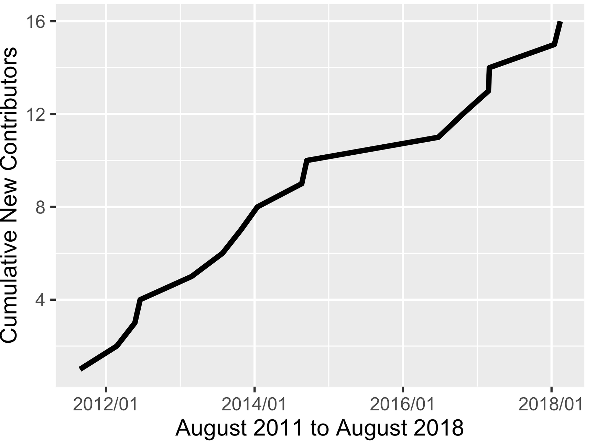

## rOpenSci HQ 

* OzUnconf <https://ozunconf18.ropensci.org/> is running for the third year. The unconference is 22-23 November in Melbourne, Australia. OzUnconf is based on our main unconference in the US (<http://unconf18.ropensci.org/>) but more accessible to folks in Australia/Asia.
* The rOpenSci team at [upcoming events](https://ropensci.org/community/#eventlist):
    * Sep 24-25, New York, NY, Karthik Ram, NumFOCUS Project Forum 2018
* A call to anyone making R packages - especially rOpenSci contributors. Help us build capacity of open source software users and developers with [Hacktoberfest](https://hacktoberfest.digitalocean.com/). Create an issue label in your repository named `hacktoberfest`, like these <https://github.com/search?q=user%3Aropensci+label%3Ahacktoberfest>. The label will help potential contributors find your issues!
* One of our community members [David Winter](https://github.com/dwinter) is a finalist in the science category of the New Zealand Open Source Awards <https://nzosa.org.nz/finalists2018/>, in part due to his software contributions ([rentrez][], [rotl][]) and involvement in rOpenSci software reviews.

 

## Software 📦

CRAN:  
GitHub: 

### New versions

* A new version (`v0.2.1`) of `bikedata`  is on CRAN - extract data from public hire bicycle systems. See the [NEWS](https://github.com/ropensci/bikedata/blob/master/NEWS.md) for changes. Checkout the [bikedata docs](https://ropensci.github.io/bikedata/) to get started. {{ "bikedata" | image_cran }} {{ "bikedata" | image_github }}
> new fxn `bike_cities()`
* A new version (`v0.2.0`) of `cRegulome`  is on CRAN - access, manage and visualize regulome (microRNA/transcription factors)-gene correlations in cancer. See the [NEWS](https://cran.r-project.org/web/packages/cRegulome/news/news.html) for changes. Checkout the [cRegulome vignettes](https://cran.r-project.org/web/packages/cRegulome/vignettes/) to get started. {{ "cRegulome" | image_cran }} {{ "cRegulome" | image_github }}
* A new version (`v0.2.5`) of `getCRUCLdata`  is on CRAN - use and explore CRU CL v. 2.0 climatology elements. See the [release notes](https://github.com/ropensci/getCRUCLdata/releases/tag/0.2.5) for changes. Checkout the [getCRUCLdata docs](https://ropensci.github.io/getCRUCLdata/) to get started. {{ "getCRUCLdata" | image_cran }} {{ "getCRUCLdata" | image_github }}
> remove startup message, reorg internal fxns
* A new version (`v0.4.0`) of `bomrang`  is on CRAN - Australian government Bureau of Meteorology (BOM) data. See the [NEWS](https://cran.rstudio.com/web/packages/bomrang/news/news.html) for changes. Checkout the [bomrang docs](https://ropensci.github.io/bomrang/) to get started. {{ "bomrang" | image_cran }} {{ "bomrang" | image_github }}
> bug fixes; many small changes
* A new version (`v0.0.3`) of `arkdb`  is on CRAN - archive and unarchive databases as flat text files. See the [NEWS](https://cran.rstudio.com/web/packages/arkdb/news/news.html) for changes. Checkout the [arkdb docs](https://ropensci.github.io/arkdb/) to get started. {{ "arkdb" | image_cran }} {{ "arkdb" | image_github }}
> remove dependency on `utils::askYesNo`
* A new version (`v1.4.0`) of `ijtiff`  is on CRAN - TIFF file I/O which plays nice with ImageJ. See the [release notes](https://github.com/ropensci/ijtiff/releases/tag/v1.4.0) for changes. Checkout the [ijtiff docs](https://ropensci.github.io/ijtiff/) to get started. {{ "ijtiff" | image_cran }} {{ "ijtiff" | image_github }}
> better docs; better error messages
* A new version (`v0.1.9`) of `fingertipsR`  is on CRAN - Public Health England’s Fingertips data tool. See the [NEWS](https://cran.rstudio.com/web/packages/fingertipsR/news/news.html) for changes. Checkout the [fingertipsR vignettes](https://cran.rstudio.com/web/packages/fingertipsR/vignettes/) to get started. {{ "fingertipsR" | image_cran }} {{ "fingertipsR" | image_github }}
> new fields in `fingertips_data()`
* A new version (`v1.1.1`) of `hydroscoper`  is on CRAN - Greek National Data Bank for Hydrometeorological Information. See the [release notes](https://github.com/ropensci/hydroscoper/releases/tag/1.1.1) for changes. Checkout the [hydroscoper docs](https://ropensci.github.io/hydroscoper/) to get started. {{ "hydroscoper" | image_cran }} {{ "hydroscoper" | image_github }}
* A new version (`v1.0.2`) of `essurvey`  is on CRAN - data from the European Social Survey. See the [release notes](https://github.com/ropensci/essurvey/releases/tag/v1.0.2) for changes. Checkout the [essurvey docs](https://ropensci.github.io/essurvey/) to get started. {{ "essurvey" | image_cran }} {{ "essurvey" | image_github }}
* A new version (`v0.15.3`) of `DataPackageR`  is on CRAN - construct reproducible analytic data sets as R packages. See the [NEWS](https://cran.rstudio.com/web/packages/DataPackageR/news/news.html) for changes. Checkout the [DataPackageR vignettes](https://cran.rstudio.com/web/packages/DataPackageR/vignettes/) to get started. {{ "DataPackageR" | image_cran }} {{ "DataPackageR" | image_github }}
* A new version (`v0.3.5`) of `tidyhydat`  is on CRAN - Water Survey of Canada hydrometric data. See the [release notes](https://github.com/ropensci/tidyhydat/releases/tag/0.3.5) for changes. Checkout the [tidyhydat vignettes](https://cran.r-project.org/web/packages/tidyhydat/vignettes/) to get started. {{ "tidyhydat" | image_cran }} {{ "tidyhydat" | image_github }}
> two new fxns; some output column names changed case; bug fixes

  

## Software Review ✔

We accept community contributed packages via our onboarding system - an open software review system, sorta like scholarly paper review, but way better. We'll highlight newly onboarded packages here. A huge thanks to our reviewers, who do a lot of work reviewing (see the [blog post on our review system](https://ropensci.org/blog/2016/03/28/software-review)),
and the authors of the packages!

If you want to be a reviewer fill out [this short form](https://ropensci.org/onboarding/), and we'll ping you when there's a submission that fits in your area of expertise.

The following package recently went through our onboarding process and has been approved!

* [outcomerate][] > AAPOR Survey Outcome Rates
    * Author: [Rafael Pilliard Hellwig](https://github.com/rtaph)
    * Issue: [ropensci/onboarding#213](https://github.com/ropensci/onboarding/issues/213)
    * Reviewers: 
        * [Carl Ganz](https://github.com/carlganz)
        * [Neil Richardson](https://github.com/nealrichardson)

The following package was recently submitted:

* [MODISTools][] > Interface to the MODIS Land Products Subsets Web Services
    * Author: [Koen Hufkens](https://github.com/khufkens)
    * Issue: [ropensci/onboarding#246](https://github.com/ropensci/onboarding/issues/246)
    * Reviewers: not assigned yet

  

## On the blog

### Animal Movement series

We're doing a series of posts corresponding to the material for a talk [Maëlle](https://ropensci.org/about/#team) gave at the [Animal Movement Analysis summer school](http://animove.org/animove-2019-evening-keynotes/) in Radolfzell, Germany on September 12th, at the Max Planck Institute of Ornithology. All five posts are out now:

* [Where to go observe birds in Radolfzell? An answer with R and open data](https://ropensci.org/blog/2018/08/14/where-to-bird/)
* [What birds are observed near Radolfzell? Bird occurrence data in R](https://ropensci.org/blog/2018/08/21/birds-radolfzell/)
* [What's this bird? Classify old natural history drawings with R](https://ropensci.org/blog/2018/08/28/birds-ocr/)
* [What are these birds? Complement occurrence data with taxonomy and traits information](https://ropensci.org/blog/2018/09/04/birds-taxo-traits/)
* [What have these birds been studied for? Querying science outputs with R](https://ropensci.org/blog/2018/09/11/birds-science/)

 

### Technotes

[Scott Chamberlain](https://ropensci.org/about/#team) wrote about one of our oldest packages: [rgbif: seven years of GBIF in R](https://ropensci.org/technotes/2018/08/22/rgbif-seven-years/)

 

[Maëlle Salmon](https://ropensci.org/about/#team) had two technotes in the past month:
 
* [In praise of Commonmark: wrangle (R)Markdown files without regex](https://ropensci.org/technotes/2018/09/05/commonmark/)
* [All the Badges One Can Earn: Parsing Badges of CRAN Packages READMEs](https://ropensci.org/technotes/2018/09/10/github-badges/)

  

## Use cases

The following 19 works use/cite rOpenSci software:

* Sánchez-Hernández and Amundsen used [rfishbase][] in their paper [Ecosystem type shapes trophic position and omnivory in fishes](https://doi.org/10.1111/faf.12308) [^1]
* Bharanidharan _et al_. cited [plotly][] in their paper [Ruminal methane emissions, metabolic, and microbial profile of Holstein steers fed forage and concentrate, separately or as a total mixed ration](https://doi.org/10.1371/journal.pone.0202446) [^2]
* Martín-Martín _et al_. used [cld2][] in their preprint [Google Scholar, Web of Science, and Scopus: a systematic comparison of citations in 252 subject categories](https://arxiv.org/abs/1808.05053) [^3]
* Grenié _et al_. used [taxize][] in their paper [Functional rarity of coral reef fishes at the global scale: Hotspots and challenges for conservation](https://doi.org/10.1016/j.biocon.2018.08.011) [^4]
* Magoga _et al_. used [rentrez][] in their paper [Barcoding of Chrysomelidae of Euro-Mediterranean area: efficiency and problematic species](https://doi.org/10.1038/s41598-018-31545-9) [^5]
* Catalano used [textreuse][] in their paper [Digitally Analyzing the Uneven Ground: Language Borrowing Among Indian Treaties](https://doi.org/10.31835/crdh.2018.02) [^6]
* Rakitko used [rsnps][] in their paper [COITR​—​ novel algorithm for predicting child’s externally visible traits](https://www.researchgate.net/profile/Alexander_Rakitko/publication/327136498_Title_COITR_-_novel_algorithm_for_predicting_child%27s_externally_visible_traits/links/5b7bcd70a6fdcc5f8b585910/Title-COITR-novel-algorithm-for-predicting-childs-externally-visible-traits.pdf) [^7]
* Cano _et al_. used [opencage][] in their paper [Modelling the spatial distribution of aquatic insects (Order Hemiptera) potentially involved in the transmission of Mycobacterium ulcerans in Africa](http://doi.org/10.1186/s13071-018-3066-3) [^8]
* Otten _et al_. used [rentrez][] in their paper [Systematic pharmacological screens uncover novel pathways involved in cerebral cavernous malformations](https://doi.org/10.15252/emmm.201809155) [^9]
* Liu _et al_. used [hunspell][] in their paper [Asymmetric or Incomplete Information about Asset Values?](http://fmaconferences.org/SanDiego/Papers/LNS_Some_Remarks_Info_Asymmetry_FMA.pdf) [^10]
* Boria & Blois used [rgbif][] in their paper [The effect of large sample sizes on ecological niche models: Analysis using a North American rodent, Peromyscus maniculatus](https://doi.org/10.1016/j.ecolmodel.2018.08.013) [^11]
* Albert _et al_. used [brranching][] in their paper [Why are woody plants fleshy-fruited at low elevations? Evidence from a high-elevation oceanic island](https://doi.org/10.1111/jvs.12676) [^12]
* Lusseau & Mancini used [rredlist][] in their preprint [A global assessment of tourism and recreation conservation threats to prioritise interventions](https://arxiv.org/abs/1808.08399) [^13]
* Lusseau & Mancini used [rgbif][] in their preprint [A global assessment of tourism and recreation conservation threats to prioritise interventions](https://arxiv.org/abs/1808.08399) [^14]
* Abdala-Roberts _et al_. used [scrubr][] in their paper [Interspecific variation in leaf functional and defensive traits in oak species and its underlying climatic drivers](https://doi.org/10.1371/journal.pone.0202548) [^15]
* Barneche _et al_. used [rotl][] in their paper [Global environmental drivers of marine fish egg size](https://doi.org/10.1111/geb.12748) [^16]
* Tierney & Cook cited [visdat][] in their preprint [Expanding tidy data principles to facilitate missing data exploration, visualization and assessment of imputations](https://arxiv.org/abs/1809.02264) [^17]
* Dezordi _et al_. used [rnoaa][] in their paper [An R package to access climate change data for South America regionalized by the Eta Model of CPTEC/INPE](https://www.researchgate.net/profile/Carlos_Holbig/publication/327078798_An_R_package_to_access_climate_change_data_for_South_America_regionalized_by_the_Eta_Model_of_CPTECINPE/links/5b770844299bf1d5a70e95ba/An-R-package-to-access-climate-change-data-for-South-America-regionalized-by-the-Eta-Model-of-CPTEC-INPE.pdf) [^18]
* Yángüez _et al_. used [rentrez][] in their paper [Phosphoproteomic-based kinase profiling early in influenza virus infection identifies GRK2 as antiviral drug target](https://doi.org/10.1038/s41467-018-06119-y) [^19]

  

## In the news

In a blog post [Leaving the house - where preprints go](https://www.crossref.org/blog/leaving-the-house---where-preprints-go/) [Karthik Ram](https://ropensci.org/about/#team) and [Jennifer Lin](https://www.crossref.org/authors/jennifer-lin/) sort out where preprints are published, using our [rcrossref][] package.

 

At the recent [R in Pharma conference](http://rinpharma.com/program/the-largest-shiny-application-in-the-world-roche-diagnostics-biowarp.html) Sebastian Wolfe of Roche talked about bioWARP, a large Shiny application for their employees - which uses [RSelenium][]. He goes into detail in a recent blog post: <https://zappingseb.github.io/biowarptruck/>.

 

In a blog post Francesco Bailo showed how to enrich a map with details, leveraging our package [osmdata][]: [How to (quickly) enrich a map with natural and anthropic details](http://www.francescobailo.net/2018/08/how-to-quickly-enrich-a-map-with-natural-and-anthropic-details/)

 

Megan Winton made a nice plot using our [rerddap][] package:
<blockquote class="twitter-tweet" data-cards="hidden" data-lang="en">
Ever wanted to use satellite-derived environmental data in your research but didn&#39;t know where to start? Check out the &#39;rerddap&#39; package . Took less than 10 lines of R code and mere seconds to extract SST data and produce this map!  <a href="https://t.co/WpmUrl1LVz">https://t.co/WpmUrl1LVz</a> <a href="https://t.co/ZDXfUml07A">pic.twitter.com/ZDXfUml07A</a>
&mdash; Megan Winton (@MegalodonWinton) <a href="https://twitter.com/MegalodonWinton/status/1029755708395462656?ref_src=twsrc%5Etfw">August 15, 2018</a></blockquote>

 

Michele Tobias used [rgbif][]:
<blockquote class="twitter-tweet" data-cards="hidden" data-lang="en">
Saturday night fun: <a href="https://twitter.com/hashtag/rstats?src=hash&amp;ref_src=twsrc%5Etfw">#rstats</a> <a href="https://twitter.com/GBIF?ref_src=twsrc%5Etfw">@GBIF</a> rgbif package &amp; plotting observations of my favorite beach plants. (Yes I know it can map, but I want control.) <a href="https://t.co/CrqpnONu2b">pic.twitter.com/CrqpnONu2b</a>
&mdash; Dr. Michele M Tobias (@MicheleTobias) <a href="https://twitter.com/MicheleTobias/status/1031031452446539776?ref_src=twsrc%5Etfw">August 19, 2018</a></blockquote>

 

Bob Rudis visualized hurricanes with our [rrricanes][] package
<blockquote class="twitter-tweet" data-cards="hidden" data-lang="en">
Had to make these at the request of <a href="https://twitter.com/mrshrbrmstr?ref_src=twsrc%5Etfw">@mrshrbrmstr</a> (global and zoomed-in views of current hurricane season) so figured I&#39;d share.<a href="https://twitter.com/rOpenSci?ref_src=twsrc%5Etfw">@ropensci</a>&#39;s rrricanes 📦 (<a href="https://t.co/0ViFLVt4ow">https://t.co/0ViFLVt4ow</a>) makes it way too easy [Code: <a href="https://t.co/QxY1egKDDK">https://t.co/QxY1egKDDK</a>] <a href="https://twitter.com/hashtag/rstats?src=hash&amp;ref_src=twsrc%5Etfw">#rstats</a> <a href="https://t.co/UKV54av9A9">pic.twitter.com/UKV54av9A9</a>
&mdash; boB Rudis (@hrbrmstr) <a href="https://twitter.com/hrbrmstr/status/1031875140454375426?ref_src=twsrc%5Etfw">August 21, 2018</a></blockquote>

  

  

### Keep up with rOpenSci

* Mailing list: Sign up with an email address to get this newsletter sent to your inbox -> [ropensci.org/#subscribe](https://ropensci.org/#subscribe)
* Alternatively, you can subscribe to this newsletter via our XML feed at <https://news.ropensci.org/feed.xml> or our JSON feed at <https://news.ropensci.org/feed.json>
* rOpenSci on Twitter: [@ropensci](https://twitter.com/ropensci)
* The rOpenSci blog at [ropensci.org/blog](https://ropensci.org/blog) - you can subscribe in any RSS aggregator, or manually via <https://ropensci.org/feed.xml>. We also announce new blog posts on our Twitter account.

 

#### Footnotes

[^1]: Sánchez-Hernández, J., & Amundsen, P.-A. (2018). Ecosystem type shapes trophic position and omnivory in fishes. Fish and Fisheries. <https://doi.org/10.1111/faf.12308>
[^2]: Bharanidharan, R., Arokiyaraj, S., Kim, E. B., Lee, C. H., Woo, Y. W., Na, Y., … Kim, K. H. (2018). Ruminal methane emissions, metabolic, and microbial profile of Holstein steers fed forage and concentrate, separately or as a total mixed ration. PLOS ONE, 13(8), e0202446. <https://doi.org/10.1371/journal.pone.0202446>
[^3]: Martín-Martín, A., Orduna-Malea, E., Thelwall, M., & López-Cózar, E. D. (2018). Google Scholar, Web of Science, and Scopus: a systematic comparison of citations in 252 subject categories. arXiv preprint arXiv:1808.05053 <https://arxiv.org/abs/1808.05053>
[^4]: Grenié, M., Mouillot, D., Villéger, S., Denelle, P., Tucker, C. M., Munoz, F., & Violle, C. (2018). Functional rarity of coral reef fishes at the global scale: Hotspots and challenges for conservation. Biological Conservation, 226, 288–299. <https://doi.org/10.1016/j.biocon.2018.08.011>
[^5]: Magoga, G., Sahin, D. C., Fontaneto, D., & Montagna, M. (2018). Barcoding of Chrysomelidae of Euro-Mediterranean area: efficiency and problematic species. Scientific Reports, 8(1). <https://doi.org/10.1038/s41598-018-31545-9>
[^6]: Catalano, J. (2018). Digitally Analyzing the Uneven Ground: Language Borrowing Among Indian Treaties. Current Research in Digital History, 1. <https://doi.org/10.31835/crdh.2018.02>
[^7]: Rakitko, A. COITR​—​ novel algorithm for predicting child’s externally visible traits. <https://www.researchgate.net/profile/Alexander_Rakitko/publication/327136498_Title_COITR_-_novel_algorithm_for_predicting_child%27s_externally_visible_traits/links/5b7bcd70a6fdcc5f8b585910/Title-COITR-novel-algorithm-for-predicting-childs-externally-visible-traits.pdf>
[^8]: Cano, J., Rodríguez, A., Simpson, H., Tabah, E. N., Gómez, J. F., & Pullan, R. L. (2018). Modelling the spatial distribution of aquatic insects (Order Hemiptera) potentially involved in the transmission of Mycobacterium ulcerans in Africa. Parasites & Vectors, 11(1). <http://doi.org/10.1186/s13071-018-3066-3>
[^9]: Otten, C., Knox, J., Boulday, G., Eymery, M., Haniszewski, M., Neuenschwander, M., … Abdelilah‐Seyfried, S. (2018). Systematic pharmacological screens uncover novel pathways involved in cerebral cavernous malformations. EMBO Molecular Medicine, e9155. <https://doi.org/10.15252/emmm.201809155>
[^10]: Liu, C. H., Nowak, A. D., & Smith, P. S. (2018). Asymmetric or Incomplete Information about Asset Values?. <http://fmaconferences.org/SanDiego/Papers/LNS_Some_Remarks_Info_Asymmetry_FMA.pdf>
[^11]: Boria, R. A., & Blois, J. L. (2018). The effect of large sample sizes on ecological niche models: Analysis using a North American rodent, Peromyscus maniculatus. Ecological Modelling, 386, 83–88. <https://doi.org/10.1016/j.ecolmodel.2018.08.013>
[^12]: Albert, S., Flores, O., Rouget, M., Wilding, N., & Strasberg, D. (2018). Why are woody plants fleshy-fruited at low elevations? Evidence from a high-elevation oceanic island. Journal of Vegetation Science. <https://doi.org/10.1111/jvs.12676>
[^13]: Lusseau, D., & Mancini, F. (2018). A global assessment of tourism and recreation conservation threats to prioritise interventions. arXiv preprint <https://arxiv.org/abs/1808.08399>
[^14]: Lusseau, D., & Mancini, F. (2018). A global assessment of tourism and recreation conservation threats to prioritise interventions. arXiv preprint <https://arxiv.org/abs/1808.08399>
[^15]: Abdala-Roberts, L., Galmán, A., Petry, W. K., Covelo, F., de la Fuente, M., Glauser, G., & Moreira, X. (2018). Interspecific variation in leaf functional and defensive traits in oak species and its underlying climatic drivers. PLOS ONE, 13(8), e0202548. <https://doi.org/10.1371/journal.pone.0202548>
[^16]: Barneche, D. R., Burgess, S. C., & Marshall, D. J. (2018). Global environmental drivers of marine fish egg size. Global Ecology and Biogeography, 27(8), 890–898. <https://doi.org/10.1111/geb.12748>
[^17]: Tierney, N. J., & Cook, D. H. (2018). Expanding tidy data principles to facilitate missing data exploration, visualization and assessment of imputations. arXiv preprint arXiv:1809.02264. <https://arxiv.org/abs/1809.02264>
[^18]: Dezordi, M. L., Hölbig, C. A., Pavan, W., & Fernandes, J. M. C. An R package to access climate change data for South America regionalized by the Eta Model of CPTEC/INPE. <https://www.researchgate.net/profile/Carlos_Holbig/publication/327078798_An_R_package_to_access_climate_change_data_for_South_America_regionalized_by_the_Eta_Model_of_CPTECINPE/links/5b770844299bf1d5a70e95ba/An-R-package-to-access-climate-change-data-for-South-America-regionalized-by-the-Eta-Model-of-CPTEC-INPE.pdf>
[^19]: Yángüez, E., Hunziker, A., Dobay, M. P., Yildiz, S., Schading, S., Elshina, E., … Stertz, S. (2018). Phosphoproteomic-based kinase profiling early in influenza virus infection identifies GRK2 as antiviral drug target. Nature Communications, 9(1). <https://doi.org/10.1038/s41467-018-06119-y>

[taxize]: https://github.com/ropensci/taxize
[rentrez]: https://github.com/ropensci/rentrez
[rotl]: https://github.com/ropensci/rotl
[MODISTools]: https://github.com/khufkens/MODISTools
[outcomerate]: https://github.com/ropensci/outcomerate
[rfishbase]: https://github.com/ropensci/rfishbase
[plotly]: https://github.com/ropensci/plotly
[cld2]: https://github.com/ropensci/cld2
[taxize]: https://github.com/ropensci/taxize
[rentrez]: https://github.com/ropensci/rentrez
[textreuse]: https://github.com/ropensci/textreuse
[rsnps]: https://github.com/ropensci/rsnps
[opencage]: https://github.com/ropensci/opencage
[hunspell]: https://github.com/ropensci/hunspell
[rgbif]: https://github.com/ropensci/rgbif
[brranching]: https://github.com/ropensci/brranching
[rredlist]: https://github.com/ropensci/rredlist
[rgbif]: https://github.com/ropensci/rgbif
[scrubr]: https://github.com/ropensci/scrubr
[visdat]: https://github.com/ropensci/visdat
[rnoaa]: https://github.com/ropensci/rnoaa
[rentrez]: https://github.com/ropensci/rentrez
[osmdata]: https://github.com/ropensci/osmdata
[rerddap]: https://github.com/ropensci/rerddap
[rrricanes]: https://github.com/ropensci/rrricanes
[rcrossref]: https://github.com/ropensci/rcrossref
[RSelenium]: https://github.com/ropensci/RSelenium
