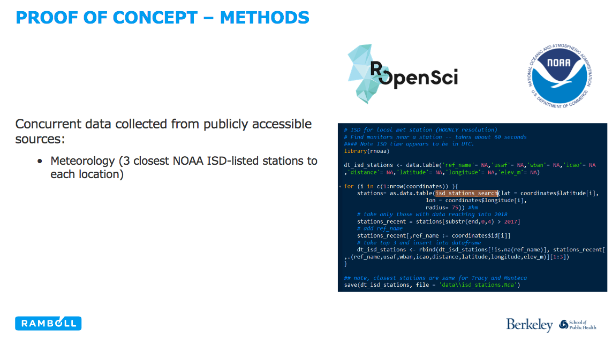

## rOpenSci HQ 

* OzUnconf <https://ozunconf18.ropensci.org/> is running for the third year. The unconference is 22-23 November in Melbourne, Australia. OzUnconf is based on our main unconference in the US (<http://unconf18.ropensci.org/>) but more accessible to folks in Australia/Asia.
* We just had a community call. See a recent blog post for all the details: [Community Call - Code Review in the Lab, or ... How do you review code that accompanies a research project?](https://ropensci.org/blog/2018/10/05/commcall-oct2018/). And here's links to other resources from the call, including recording: <http://communitycalls.ropensci.org/#past-calls>
* We're having another community call coming up soon. See a recent blog post for all the details. [Community Call - Working with images in R](https://ropensci.org/blog/2018/10/24/commcall-nov2018/).

 

## Software 📦

CRAN:  
GitHub: 

### New packages

* A new version (`v1.0.1`) of `nasapower` is on CRAN - NASA POWER API client. Checkout the [docs](https://ropensci.github.io/nasapower/) to get started. {{ "nasapower" | image_cran }} {{ "nasapower" | image_github }}

### New versions

* A new version (`v0.8.0`) of `bold` is on CRAN - interface to Bold Systems (<http://www.boldsystems.org/>) API. See the [release notes](https://github.com/ropensci/bold/releases/tag/v0.8.0) for changes. Checkout the [vignette](https://cran.rstudio.com/web/packages/bold/vignettes/bold_vignette.html) to get started. {{ "bold" | image_cran }} {{ "bold" | image_github }} 
> `bold_identify_parents()` improvements, and `bold_specimens()` bug fix
* A new version (`v6.1.0`) of `drake` is on CRAN - pipeline toolkit for reproducible computation at scale. See the [release notes](https://github.com/ropensci/drake/releases/tag/v6.1.0) for changes. Checkout the [docs](https://ropensci.github.io/drake) to get started. {{ "drake" | image_cran }} {{ "drake" | image_github }} 
> new fxns `map_plan()`/`plan_to_code()`/`drake_debug()`; many improvements and bug fixes 
* A new version (`v0.7.0`) of `rbison` is on CRAN - interface to the USGS BISON API. See the [release notes](https://github.com/ropensci/rbison/releases/tag/v0.7.0) for changes. Checkout the [vignette](https://cran.r-project.org/web/packages/rbison/vignettes/rbison_vignette.html) to get started. {{ "rbison" | image_cran }} {{ "rbison" | image_github }} 
> `bison()` now paginates internally and loses `what` parameter; `bisonmap()` fix
* A new version (`v0.4.0`) of `microdemic` is on CRAN - Microsoft Academic API client. See the [release notes](https://github.com/ropensci/microdemic/releases/tag/v0.4.0) for changes. Checkout the [README](https://github.com/ropensci/microdemic#microdemic) to get started. {{ "microdemic" | image_cran }} {{ "microdemic" | image_github }} 
> tests now use `vcr`; `ma_abstract()` now a data.frame
* A new version (`v0.15.4`) of `DataPackageR` is on CRAN - construct reproducible analytic data sets as R packages. Checkout the [vignette](https://cran.rstudio.com/web/packages/DataPackageR/vignettes/usingDataPackageR.html) to get started. {{ "DataPackageR" | image_cran }} {{ "DataPackageR" | image_github }} 
* A new version (`v2.0-3`) of `CoordinateCleaner` is on CRAN - automated cleaning of occurrence records from biological collections. See the [NEWS](https://cran.rstudio.com/web/packages/CoordinateCleaner/news/news.html) for changes. Checkout the [docs](https://ropensci.github.io/CoordinateCleaner/) to get started. {{ "CoordinateCleaner" | image_cran }} {{ "CoordinateCleaner" | image_github }} 
* A new version (`v0.3.0`) of `isdparser` is on CRAN - parse NOAA Integrated Surface data files. See the [release notes](https://github.com/ropensci/isdparser/releases/tag/v0.3.0) for changes. Checkout the [vignette](https://cran.rstudio.com/web/packages/isdparser/vignettes/isdparser_vignette.html) to get started. {{ "isdparser" | image_cran }} {{ "isdparser" | image_github }} 
> small bug fix; working on incorporating metadata
* A new version (`v1.1.0`) of `jqr` is on CRAN - a client for JQ, the JSON processor. See the [release notes](https://github.com/ropensci/jqr/releases/tag/v1.1.0) for changes. Checkout the [vignette](https://cran.rstudio.com/web/packages/jqr/vignettes/jqr_vignette.html) to get started. {{ "jqr" | image_cran }} {{ "jqr" | image_github }} 
> `jq()` now supports connections (file paths, urls) and json objects; new `build_` fxns
* A new version (`v0.0.8`) of `osmdata` is on CRAN - import OpenStreetMap data as simple features or spatial objects. See the [release notes](https://github.com/ropensci/osmdata/releases/tag/v0.0.8) for changes. Checkout the [docs](https://ropensci.github.io/osmdata/) to get started. {{ "osmdata" | image_cran }} {{ "osmdata" | image_github }} 
> bug fixes in `trim_osmdata` and `opq`
* A new version (`v0.2.2`) of `bikedata` is on CRAN - download and aggregate data from public hire bicycle systems. See the [release notes](https://github.com/ropensci/bikedata/releases/tag/v0.2.2) for changes. Checkout the [docs](https://ropensci.github.io/bikedata/) to get started. {{ "bikedata" | image_cran }} {{ "bikedata" | image_github }} 
> minor bug fixes
* A new version (`v0.5.0`) of `epubr` is on CRAN - read EPUB file metadata and text. See the [release notes](https://github.com/ropensci/epubr/releases/tag/v0.5.0) for changes. Checkout the [vignette](https://cran.rstudio.com/web/packages/epubr/vignettes/epubr.html) to get started. {{ "epubr" | image_cran }} {{ "epubr" | image_github }} 
> new fxn `epub_cat()`; `epub()` gains `encoding` param
* A new version (`v0.2.6`) of `stplanr` is on CRAN - sustainable transport planning. See the [release notes](https://github.com/ropensci/stplanr/releases/tag/0.2.6) for changes. Checkout the [docs](https://ropensci.github.io/stplanr/) to get started. {{ "stplanr" | image_cran }} {{ "stplanr" | image_github }} 
> new fxn `route_local()`; `line2route()` gains `time_sleep` param
* A new version (`v1.1.0`) of `fulltext` is on CRAN - full text of scholarly articles across many data sources. See the [release notes](https://github.com/ropensci/fulltext/releases/tag/v1.1.0) for changes. Checkout the [fulltext book](https://ropensci.github.io/fulltext-book/) to get started. {{ "fulltext" | image_cran }} {{ "fulltext" | image_github }} 
> new fxns `cache_file_info()` & `as.ft_data()`; better error info in `ft_get()`; many, many, many bug fixes and improvements
* A new version (`v1.1.0`) of `rgbif` is on CRAN - interface to the Global Biodiversity Information Facility API. See the [release notes](https://github.com/ropensci/rgbif/releases/tag/v1.1.0) for changes. Checkout the [occurrence manual](https://ropensci.github.io/occurrence-manual/) to get started. {{ "rgbif" | image_cran }} {{ "rgbif" | image_github }} 
> now using `vcr` for tests; name issues metadata added; `map_fetch()` changes
* A new version (`v0.2.8`) of `webmockr` is on CRAN - stubbing and setting expectations on HTTP requests. See the [release notes](https://github.com/ropensci/webmockr/releases/tag/v0.2.8) for changes. Checkout the [HTTP testing book](https://ropensci.github.io/http-testing-book/) to get started. {{ "webmockr" | image_cran }} {{ "webmockr" | image_github }} 
> gains support for `httr`!
* A new version (`v0.2.0`) of `vcr` is on CRAN - record HTTP calls to disk for test caching. See the [release notes](https://github.com/ropensci/vcr/releases/tag/v0.2.0) for changes. Checkout the [HTTP testing book](https://ropensci.github.io/http-testing-book/) to get started. {{ "vcr" | image_cran }} {{ "vcr" | image_github }} 
> gains support for `httr`!
* A new version (`v0.3.0`) of `wikitaxa` is on CRAN - taxonomic information from Wikipedia. See the [release notes](https://github.com/ropensci/wikitaxa/releases/tag/v0.3.0) for changes. Checkout the [docs](https://ropensci.github.io/wikitaxa/index.html) to get started. {{ "wikitaxa" | image_cran }} {{ "wikitaxa" | image_github }} 
> now using `vcr` for tests; `wt_wikipedia()` bug fix
* A new version (`v0.3.0`) of `charlatan` is on CRAN - make fake data. See the [release notes](https://github.com/ropensci/charlatan/releases/tag/v0.3.0) for changes. Checkout the [vignette](https://cran.rstudio.com/web/packages/charlatan/vignettes/charlatan_vignette.html) to get started. {{ "charlatan" | image_cran }} {{ "charlatan" | image_github }} 
> `ch_job()`/`JobsProvider` gain `da_DK` locale support; many fixes for `JobsProvider`/`PersonProvider`
* A new version (`v0.3.4`) of `jstor` is on CRAN - read data from JSTOR/DfR. See the [release notes](https://github.com/ropensci/jstor/releases/tag/v0.3.4) for changes. Checkout the [docs](https://ropensci.github.io/jstor) to get started. {{ "jstor" | image_cran }} {{ "jstor" | image_github }} 
> parse references if available

  

## Software Review ✔

We accept community contributed packages via our onboarding system - an open software review system, sorta like scholarly paper review, but way better. We'll highlight newly onboarded packages here. A huge thanks to our reviewers, who do a lot of work reviewing (see the [blog post on our review system](https://ropensci.org/blog/2016/03/28/software-review)),
and the authors of the packages!

If you want to be a reviewer fill out [this short form](https://ropensci.org/onboarding/), and we'll ping you when there's a submission that fits in your area of expertise.

The following packages were recently submitted:

* [DataSpaceR][] > An R Interface to the CAVD DataSpace
    * Author: [Ju Yeong Kim](https://github.com/juyeongkim)
    * Issue: [ropensci/onboarding#261](https://github.com/ropensci/onboarding/issues/261)
   * Reviewers: not assigned yet
* [nlrx][] > Setup, run and analyze NetLogo model simulations from R via XML
    * Author: [Jan Salecker](https://github.com/nldoc)
    * Issue: [ropensci/onboarding#262](https://github.com/ropensci/onboarding/issues/262)
   * Reviewers: not assigned yet

  

## On the blog

### Technotes

[Scott Chamberlain](https://ropensci.org/about/#team) wrote about a new package `pubchunks`: [pubchunks: extract parts of scholarly XML articles](https://ropensci.org/technotes/2018/10/16/pubchunks/). Check out the package at [ropensci/pubchunks](https://github.com/ropensci/pubchunks).

 

### rOpenSci HQ

[Stefanie Butland](https://ropensci.org/about/#team) writes about our next upcoming community call. [Community Call - Working with images in R](https://ropensci.org/blog/2018/10/24/commcall-nov2018/). Please join us for our next community call!

  

## Use cases

The following 12 works use/cite rOpenSci software:

* Baquero & Machado used [tabulizer][] in their paper [Spatiotemporal dynamics and risk factors for human Leptospirosis in Brazil](https://doi.org/10.1038/s41598-018-33381-3) [^1]
* Rahman _et al_. used [plotly][] in their paper [KinaMetrix: a web resource to investigate kinase conformations and inhibitor space](https://doi.org/10.1093/nar/gky916) [^2]
* Vieilledent _et al_. used [taxize][] in their paper [New formula and conversion factor to compute basic wood density of tree species using a global wood technology database](https://doi.org/10.1002/ajb2.1175) [^3]
* McAfee _et al_. used [FedData][] in their paper [Changing station coverage impacts temperature trends in the Upper Colorado River Basin](https://doi.org/10.1002/joc.5898) [^4]
* Shema _et al_. used [rAltmetric][] in their conference paper [Retractions from altmetric and bibliometric perspectives](http://altmetrics.org/wp-content/uploads/2018/09/altmetrics18_paper_3_Shema_new.pdf) [^5]
* Borer used [pdftools][] in their dissertation [Creating a Water Quality Geodatabase for the West Hawai ‘i Island Region](https://spatial.usc.edu/wp-content/uploads/2018/10/72893.pdf) [^6]
* Testo _et al_. used [rgbif][] in their paper [The rise of the Andes promoted rapid diversification in Neotropical Phlegmariurus (Lycopodiaceae)](https://doi.org/10.1111/nph.15544) [^7]
* Horvatić _et al_. used [plotly][] in their paper [Integrated dataset on acute phase protein response in chicken challenged with Escherichia coli lipopolysaccharide endotoxin](https://doi.org/10.1016/j.dib.2018.09.103) [^8]
* Milla _et al_. used [taxize][] in their paper [Phylogenetic patterns and phenotypic profiles of the species of plants and mammals farmed for food](https://doi.org/10.1038/s41559-018-0690-4) [^9]
* Hagerman _et al_. used [riem][] in their paper [Temporal and geographic distribution of weather conditions favorable to airborne spread of foot-and-mouth disease in the coterminous United States](https://doi.org/10.1016/j.prevetmed.2018.10.016) [^10]
* Yu, G. _et al_. used [treeio][] in their paper [Two methods for mapping and visualizing associated data on phylogeny using ggtree](https://doi.org/10.1093/molbev/msy194) [^11]
* Degen & Faulwetter used [rfishbase][] in their paper [The Arctic Traits Database &amp;ndash; A repository of arctic benthic invertebrate trait](https://doi.org/10.5194/essd-2018-97) [^12]

  

## In the news

Two people played with one of our newest packages ([av][]) and shared their experience:

<blockquote class="twitter-tweet" data-cards="hidden" data-lang="en">
Average daily temperature in Bratislava (2016 - ~ Now).  Thx <a href="https://twitter.com/rOpenSci?ref_src=twsrc%5Etfw">@rOpenSci</a> for av package, <a href="https://twitter.com/thomasp85?ref_src=twsrc%5Etfw">@thomasp85</a> for gganimate, and <a href="https://twitter.com/JustTheSpring?ref_src=twsrc%5Etfw">@JustTheSpring</a> for sample code! There is lot of to improve... <a href="https://twitter.com/hashtag/ggplot2?src=hash&amp;ref_src=twsrc%5Etfw">#ggplot2</a> <a href="https://twitter.com/hashtag/rstats?src=hash&amp;ref_src=twsrc%5Etfw">#rstats</a> <a href="https://twitter.com/hashtag/DataScience?src=hash&amp;ref_src=twsrc%5Etfw">#DataScience</a> <a href="https://twitter.com/hashtag/Weather?src=hash&amp;ref_src=twsrc%5Etfw">#Weather</a> <a href="https://twitter.com/hashtag/gganimate?src=hash&amp;ref_src=twsrc%5Etfw">#gganimate</a> <a href="https://twitter.com/hashtag/dataviz?src=hash&amp;ref_src=twsrc%5Etfw">#dataviz</a> <a href="https://twitter.com/hashtag/datavideo?src=hash&amp;ref_src=twsrc%5Etfw">#datavideo</a> <a href="https://t.co/sMwg0z0M7d">pic.twitter.com/sMwg0z0M7d</a>
&mdash; Peter Laurinec (@petolauri) <a href="https://twitter.com/petolauri/status/1052189852257595393?ref_src=twsrc%5Etfw">October 16, 2018</a></blockquote>

 

In a blog post [Animated Prison](https://muaydata.netlify.com/post/animated-prison/) someone used `av` to help visualize the rate of incarceration over time in the US. 

 

In a recent presentation [rnoaa][] was cited: [Improving pollution source resolution for real time low cost sensors using widely available data resources](https://asic.aqrc.ucdavis.edu/sites/g/files/dgvnsk3466/files/inline-files/L.%20Drew%20Hill%20-%20ASIC_presentation_2018_v3.pdf)

  

  

### Keep up with rOpenSci

* Mailing list: Sign up with an email address to get this newsletter sent to your inbox -> [ropensci.org/#subscribe](https://ropensci.org/#subscribe)
* Alternatively, you can subscribe to this newsletter via our XML feed at <https://news.ropensci.org/feed.xml> or our JSON feed at <https://news.ropensci.org/feed.json>
* rOpenSci on Twitter: [@ropensci](https://twitter.com/ropensci)
* The rOpenSci blog at [ropensci.org/blog](https://ropensci.org/blog) - you can subscribe in any RSS aggregator, or manually via <https://ropensci.org/feed.xml>. We also announce new blog posts on our Twitter account.

 

#### Footnotes

[^1]: Baquero, O. S., & Machado, G. (2018). Spatiotemporal dynamics and risk factors for human Leptospirosis in Brazil. Scientific Reports, 8(1). <https://doi.org/10.1038/s41598-018-33381-3>
[^2]: Rahman, R., Ung, P. M.-U., & Schlessinger, A. (2018). KinaMetrix: a web resource to investigate kinase conformations and inhibitor space. Nucleic Acids Research. <https://doi.org/10.1093/nar/gky916>
[^3]: Vieilledent, G., Fischer, F. J., Chave, J., Guibal, D., Langbour, P., & Gérard, J. (2018). New formula and conversion factor to compute basic wood density of tree species using a global wood technology database. American Journal of Botany. <https://doi.org/10.1002/ajb2.1175>
[^4]: McAfee, S. A., McCabe, G. J., Gray, S. T., & Pederson, G. T. (2018). Changing station coverage impacts temperature trends in the Upper Colorado River Basin. International Journal of Climatology. <https://doi.org/10.1002/joc.5898>
[^5]: Shema, H., Mazarakis, A., Hahn, O., & Peters, I. Retractions from altmetric and bibliometric perspectives. <http://altmetrics.org/wp-content/uploads/2018/09/altmetrics18_paper_3_Shema_new.pdf>
[^6]: Borer, D. (2018). Creating a Water Quality Geodatabase for the West Hawai ‘i Island Region (Doctoral dissertation, University of Southern California). <https://spatial.usc.edu/wp-content/uploads/2018/10/72893.pdf>
[^7]: Testo, W. L., Sessa, E., & Barrington, D. S. (2018). The rise of the Andes promoted rapid diversification in Neotropical Phlegmariurus (Lycopodiaceae). New Phytologist. <https://doi.org/10.1111/nph.15544>
[^8]: Horvatić, A., Guillemin, N., Kaab, H., McKeegan, D., O’Reilly, E., Bain, M., … Eckersall, P. D. (2018). Integrated dataset on acute phase protein response in chicken challenged with Escherichia coli lipopolysaccharide endotoxin. Data in Brief. <https://doi.org/10.1016/j.dib.2018.09.103>
[^9]: Milla, R., Bastida, J. M., Turcotte, M. M., Jones, G., Violle, C., Osborne, C. P., … Byun, C. (2018). Phylogenetic patterns and phenotypic profiles of the species of plants and mammals farmed for food. Nature Ecology & Evolution, 2(11), 1808–1817. <https://doi.org/10.1038/s41559-018-0690-4>
[^10]: Hagerman, A. D., South, D. D., Sondgerath, T. C., Patyk, K. A., Sanson, R. L., Schumacher, R. S., … Magzamen, S. (2018). Temporal and geographic distribution of weather conditions favorable to airborne spread of foot-and-mouth disease in the coterminous United States. Preventive Veterinary Medicine, 161, 41–49. <https://doi.org/10.1016/j.prevetmed.2018.10.016>
[^11]: Yu, G., Tsan-Yuk Lam, T., Zhu, H., & Guan, Y. (2018). Two methods for mapping and visualizing associated data on phylogeny using ggtree. Molecular Biology and Evolution. <https://doi.org/10.1093/molbev/msy194>
[^12]: Degen, R., & Faulwetter, S. (2018). The Arctic Traits Database &amp;ndash; A repository of arctic benthic invertebrate traits. Earth System Science Data Discussions, 1–25. <https://doi.org/10.5194/essd-2018-97>

[taxize]: https://github.com/ropensci/taxize
[tabulizer]: https://github.com/ropensci/tabulizer
[plotly]: https://github.com/ropensci/plotly
[FedData]: https://github.com/ropensci/FedData
[rAltmetric]: https://github.com/ropensci/rAltmetric
[pdftools]: https://github.com/ropensci/pdftools
[rgbif]: https://github.com/ropensci/rgbif
[riem]: https://github.com/ropensci/riem
[av]: https://github.com/ropensci/av
[rnoaa]: https://github.com/ropensci/rnoaa
[treeio]: https://github.com/GuangchuangYu/treeio
[rfishbase]: https://github.com/ropensci/rfishbase
[DataSpaceR]: https://github.com/CAVDDataSpace/DataSpaceR
[nlrx]: https://github.com/nldoc/nlrx
