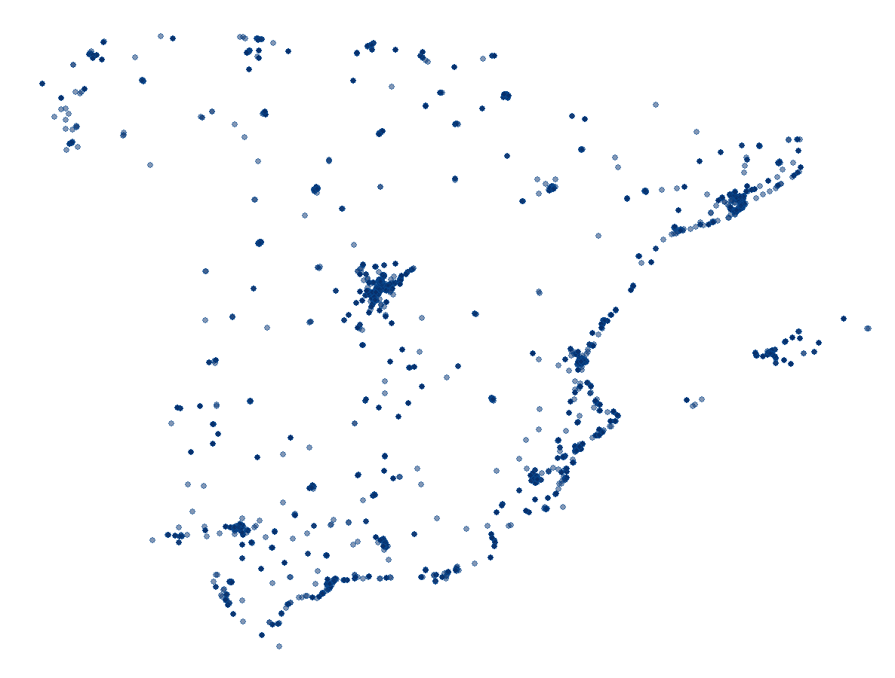

## rOpenSci HQ 

* OzUnconf <https://ozunconf18.ropensci.org/> is running for the third year. The unconference is 22-23 November in Melbourne, Australia. OzUnconf is based on our main unconference in the US (<http://unconf18.ropensci.org/>) but more accessible to folks in Australia/Asia.
* We have an upcoming community call this week on [Working with images in R](https://ropensci.org/blog/2018/10/24/commcall-nov2018/). Don't miss it!

 

## Software 📦

CRAN:  
GitHub: 

### New packages

* The first version (`v0.1.0`) of `zbank` is on CRAN - an interface to the ZooBank API (<http://zoobank.org/Api>); ZooBank (<http://zoobank.org/>) is the official registry of zoological nomenclature. Checkout the [README](https://github.com/ropenscilabs/zbank#zbank) to get started. {{ "zbank" | image_cran }} {{ "zbank" | image_github: "ropenscilabs" }}

### New versions

* A new version (`v0.2.0`) of `fingertipsR` is on CRAN - Fingertips data for public health <http://fingertips.phe.org.uk/>. See the [release notes](https://github.com/ropensci/fingertipsR/blob/master/NEWS.md) for changes. Checkout the [vignettes](https://cran.rstudio.com/web/packages/fingertipsR/vignettes/) to get started. {{ "fingertipsR" | image_cran }} {{ "fingertipsR" | image_github }}
> fixes to `select_indicators`, `deprivation_decile`, `fingertips_data` and `indicators` fxns
* A new version (`v3.0.0`) of `rfishbase` is on CRAN - interface to Fishbase data. See the [release notes](https://github.com/ropensci/rfishbase/blob/master/NEWS.md) for changes. Checkout the [docs](http://ropensci.github.io/rfishbase/) to get started. {{ "rfishbase" | image_cran }} {{ "rfishbase" | image_github }}
> Major change: now uses static data; requests return all data in one go now
* A new version (`v1.3`) of `antiword` is on CRAN - Extract text from Microsoft Word documents. See the [release notes](https://github.com/ropensci/antiword/releases/tag/v1.3) for changes. Checkout the [README](https://github.com/ropensci/antiword#antiword) to get started. {{ "antiword" | image_cran }} {{ "antiword" | image_github }}
> fix for sys 2.0
* A new version (`v1.3`) of `unrtf` is on CRAN - Extract text from Rich Text Format (RTF) documents. See the [release notes](https://github.com/ropensci/unrtf/releases/tag/v1.3) for changes. Checkout the [README](https://github.com/ropensci/unrtf#readme) to get started. {{ "unrtf" | image_cran }} {{ "unrtf" | image_github }}
> fix for sys 2.0; fix for Solaris
* A new version (`v1.0.2`) of `available` is on CRAN - check if the title of a package is available. See the [release notes](https://github.com/ropenscilabs/available/releases/tag/v1.0.2) for changes. Checkout the [README](https://github.com/ropenscilabs/available#available) to get started. {{ "available" | image_cran }} {{ "available" | image_github: "ropenscilabs" }}
> add dialog when run interactively; now use BiocManager
* A new version (`v0.3.0`) of `worrms` is on CRAN - client for [World Register of Marine Species](http://www.marinespecies.org/). See the [release notes](https://github.com/ropensci/worrms/releases/tag/v0.3.0) for changes. Checkout the [vignette](https://cran.rstudio.com/web/packages/worrms/vignettes/worrms_vignette.html) to get started. {{ "worrms" | image_cran }} {{ "worrms" | image_github }}
> plural versions of fxns now only warn where they used to stop on error
* A new version (`v0.2.9`) of `webmockr` is on CRAN - stubbing and setting expectations on HTTP requests. See the [release notes](https://github.com/ropensci/webmockr/releases/tag/v0.2.9) for changes. Checkout the [HTTP testing book](https://ropensci.github.io/http-testing-book/) to get started. {{ "webmockr" | image_cran }} {{ "webmockr" | image_github }}
> fix for use case of using only `webmockr` without `vcr`; update docs
* A new version (`v4.0`) of `tesseract` is on CRAN - bindings to Tesseract, an OCR engine <https://opensource.google.com/projects/tesseract>. See the [release notes](https://github.com/ropensci/tesseract/releases/tag/v4.0) for changes. Checkout the [vignette](https://cran.rstudio.com/web/packages/tesseract/vignettes/intro.html) to get started. {{ "tesseract" | image_cran }} {{ "tesseract" | image_github }}
> upgrade to Tesseract 4.0 for windows/macos users; drop hard dep on `tibble`
* A new version (`v2.2.0`) of `RNeXML` is on CRAN - Semantically Rich I/O for the NeXML Format. See the [release notes](https://github.com/ropensci/RNeXML/releases/tag/v2.2.0) for changes. Checkout the [vignettes](https://cran.r-project.org/web/packages/RNeXML/vignettes/) to get started. {{ "RNeXML" | image_cran }} {{ "RNeXML" | image_github }}
> various fixes; drops `phylobase` dep.
* A new version (`v1.5.0`) of `ijtiff` is on CRAN - Comprehensive TIFF I/O with full support for ImageJ TIFF files. See the [release notes](https://github.com/ropensci/ijtiff/releases/tag/v1.5.0) for changes. Checkout the [docs](https://ropensci.github.io/ijtiff) to get started. {{ "ijtiff" | image_cran }} {{ "ijtiff" | image_github }}
> allow ZIP compression; fix to `write_txt_img`
* A new version (`v0.0.5`) of `arkdb` is on CRAN - archive and unarchive databases as flat text files. See the [release notes](https://github.com/ropensci/arkdb/releases/tag/v0.0.5) for changes. Checkout the [docs](https://ropensci.github.io/arkdb/) to get started. {{ "arkdb" | image_cran }} {{ "arkdb" | image_github }}
> fix to `ark()` fxn when accessing Postgres connections

  

## Software Review ✔

We accept community contributed packages via our onboarding system - an open software review system, sorta like scholarly paper review, but way better. We'll highlight newly onboarded packages here. A huge thanks to our reviewers, who do a lot of work reviewing (see the [blog post on our review system](https://ropensci.org/blog/2016/03/28/software-review)),
and the authors of the packages!

If you want to be a reviewer fill out [this short form](https://ropensci.org/onboarding/), and we'll ping you when there's a submission that fits in your area of expertise.

  

## On the blog

### Technotes

[Jeroen Ooms](https://ropensci.org/about/#team) wrote about a new version of his package `tesseract`: [Tesseract 4 is here! State of the art OCR in R!](https://ropensci.org/technotes/2018/11/06/tesseract-40/). Check out the package at [ropensci/tesseract](https://github.com/ropensci/tesseract).

 

### rOpenSci HQ

[Stefanie Butland](https://ropensci.org/about/#team) wrote up detailed notes on how to do a good unconference ice breaker: [Sharing the Recipe for rOpenSci's Unconf Ice Breaker](https://ropensci.org/blog/2018/11/01/icebreaker/).

  

## Use cases

The following 13 works use/cite rOpenSci software:

* Milà et al. used in [rtimicropem][] in their paper [When, Where, and What? Characterizing Personal PM2.5 Exposure in Periurban India by Integrating GPS, Wearable Camera, and Ambient and Personal Monitoring Data](https://doi.org/10.1021/acs.est.8b03075) [^1]
* Barra et al. used [plotly][] in their paper [Stroke incidence in the young: evidence from a Norwegian register study](https://doi.org/10.1007/s00415-018-9102-6) [^2]
* Ornstein used [FedData][] in their dissertation [The Political Economy of Urban Growth](https://deepblue.lib.umich.edu/bitstream/handle/2027.42/145832/ornstein_1.pdf?sequence=1&isAllowed=y) [^3]
* Clegg et al. used [worrms][] in their paper [The impact of intraspecific variation on food web structure](https://doi.org./10.1002/ecy.2523) [^4]
* Guerra-Grenier used [plotly][] in their dissertation [Resisting the Pied Piper: Colorful Defense Mechanisms in Insect Eggs, with a Focus on Stink Bugs (Heteroptera: Pentatomidae)](https://curve.carleton.ca/system/files/etd/6c45742b-6f0e-4fb7-a131-4e7bddc3fb69/etd_pdf/cb0a257b1921794188a309b53d0d614a/guerra-grenier-resistingthepiedpipercolorfuldefensemechanisms.pdf) [^5]
* Orwoll et al. used [plotly][] in their paper [The relationships between physical performance, activity levels and falls in older men](https://doi.org/10.1093/gerona/gly248) [^6]
* Kandlikar et al. used [taxize][] in their paper [ranacapa: An R package and Shiny web app to explore environmental DNA data with exploratory statistics and interactive visualizations](https://doi.org/10.12688/f1000research.16680.1) [^7]
* Smith et al. used [rgbif][] in their paper [A global test of ecoregions](https://doi.org/10.1038/s41559-018-0709-x) [^8]
* Collins et al. used [rgbif][] and [rentrez][] in their paper [Persistence of environmental DNA in marine systems](https://doi.org/10.1038/s42003-018-0192-6) [^9]
* Mendez et al. used [magick][] in their paper [Imaging natural history museum collections from the bottom up: 3D print technology facilitates imaging of fluid-stored arthropods with flatbed scanners](https://doi.org/10.3897/zookeys.795.28416) [^10]
* Bentz et al. used [rgbif][] in their paper [The evolution of language families is shaped by the environment beyond neutral drift](https://doi.org/10.1038/s41562-018-0457-6) [^11]
* Chatzos used [plotly][] in their thesis [Project for the development of a higher education management dashboard in R](https://upcommons.upc.edu/bitstream/handle/2117/123443/memoria.pdf) [^12]
* Menegotto & Rangel used [rgbif][] in their paper [Mapping knowledge gaps in marine diversity reveals a latitudinal gradient of missing species richness](https://doi.org/10.1038/s41467-018-07217-7) [^13]

  

## In the news

Dominic Royé wrote a blog post on how to access OpenStreetMap data with R, that used our [osmdata][] package from [Mark Padgham](https://github.com/mpadge) and company:

<blockquote class="twitter-tweet" data-cards="hidden" data-lang="en">
New tutorial on how you can access the database of <a href="https://twitter.com/openstreetmap?ref_src=twsrc%5Etfw">@openstreetmap</a> from the  R environment. <a href="https://twitter.com/hashtag/rstat?src=hash&amp;ref_src=twsrc%5Etfw">#rstat</a> <a href="https://twitter.com/hashtag/overpassAPI?src=hash&amp;ref_src=twsrc%5Etfw">#overpassAPI</a> <a href="https://twitter.com/hashtag/ggplot2?src=hash&amp;ref_src=twsrc%5Etfw">#ggplot2</a> <a href="https://twitter.com/hashtag/mapping?src=hash&amp;ref_src=twsrc%5Etfw">#mapping</a> <a href="https://twitter.com/hashtag/gis?src=hash&amp;ref_src=twsrc%5Etfw">#gis</a><a href="https://t.co/9fqq8z6lCJ">https://t.co/9fqq8z6lCJ</a> <a href="https://t.co/zvjeEPMDeM">pic.twitter.com/zvjeEPMDeM</a>
&mdash; Dominic Royé (@dr_xeo) <a href="https://twitter.com/dr_xeo/status/1059397593434853378?ref_src=twsrc%5Etfw">November 5, 2018</a></blockquote>

  

  

### Keep up with rOpenSci

* Mailing list: Sign up with an email address to get this newsletter sent to your inbox -> [ropensci.org/#subscribe](https://ropensci.org/#subscribe)
* Alternatively, you can subscribe to this newsletter via our XML feed at <https://news.ropensci.org/feed.xml> or our JSON feed at <https://news.ropensci.org/feed.json>
* rOpenSci on Twitter: [@ropensci](https://twitter.com/ropensci)
* The rOpenSci blog at [ropensci.org/blog](https://ropensci.org/blog) - you can subscribe in any RSS aggregator, or manually via <https://ropensci.org/feed.xml>. We also announce new blog posts on our Twitter account.

 

#### Footnotes

[^1]: Milà, C., Salmon, M., Sanchez, M., Ambrós, A., Bhogadi, S., Sreekanth, V., … Tonne, C. (2018). When, Where, and What? Characterizing Personal PM2.5 Exposure in Periurban India by Integrating GPS, Wearable Camera, and Ambient and Personal Monitoring Data. Environmental Science & Technology. <https://doi.org/10.1021/acs.est.8b03075>
[^2]: Barra, M., Labberton, A. S., Faiz, K. W., Lindstrøm, J. C., Rønning, O. M., Viana, J., … Rand, K. (2018). Stroke incidence in the young: evidence from a Norwegian register study. Journal of Neurology. <https://doi.org/10.1007/s00415-018-9102-6>
[^3]: Ornstein, J. (2018). The Political Economy of Urban Growth. Dissertation. <https://deepblue.lib.umich.edu/bitstream/handle/2027.42/145832/ornstein_1.pdf?sequence=1&isAllowed=y>
[^4]: Clegg, T., Ali, M., & Beckerman, A. P. (2018). The impact of intraspecific variation on food web structure. Ecology. <https://doi.org./10.1002/ecy.2523>
[^5]: Guerra-Grenier Jr, E. (2018). Resisting the Pied Piper: Colorful Defense Mechanisms in Insect Eggs, with a Focus on Stink Bugs (Heteroptera: Pentatomidae) (Doctoral dissertation, Carleton University). <https://curve.carleton.ca/system/files/etd/6c45742b-6f0e-4fb7-a131-4e7bddc3fb69/etd_pdf/cb0a257b1921794188a309b53d0d614a/guerra-grenier-resistingthepiedpipercolorfuldefensemechanisms.pdf>
[^6]: Orwoll, E. S., Fino, N. F., Gill, T. M., Cauley, J. A., Strotmeyer, E. S., … Ensrud, K. E. (2018). The relationships between physical performance, activity levels and falls in older men. The Journals of Gerontology: Series A. <https://doi.org/10.1093/gerona/gly248>
[^7]: Kandlikar, G. S., Gold, Z. J., Cowen, M. C., Meyer, R. S., Freise, A. C., Kraft, N. J. B., … Curd, E. E. (2018). ranacapa: An R package and Shiny web app to explore environmental DNA data with exploratory statistics and interactive visualizations. F1000Research, 7, 1734. <https://doi.org/10.12688/f1000research.16680.1>
[^8]: Smith, J. R., Letten, A. D., Ke, P.-J., Anderson, C. B., Hendershot, J. N., Dhami, M. K., … Daily, G. C. (2018). A global test of ecoregions. Nature Ecology & Evolution. <https://doi.org/10.1038/s41559-018-0709-x>
[^9]: Collins, R. A., Wangensteen, O. S., O’Gorman, E. J., Mariani, S., Sims, D. W., & Genner, M. J. (2018). Persistence of environmental DNA in marine systems. Communications Biology, 1(1). <https://doi.org/10.1038/s42003-018-0192-6>
[^10]: Mendez, P. K., Lee, S., & Venter, C. E. (2018). Imaging natural history museum collections from the bottom up: 3D print technology facilitates imaging of fluid-stored arthropods with flatbed scanners. ZooKeys, 795, 49–65. <https://doi.org/10.3897/zookeys.795.28416>
[^11]: Bentz, C., Dediu, D., Verkerk, A., & Jäger, G. (2018). The evolution of language families is shaped by the environment beyond neutral drift. Nature Human Behaviour, 2(11), 816–821. <https://doi.org/10.1038/s41562-018-0457-6>
[^12]: Chatzos, D. (2018). Project for the development of a higher education management dashboard in R (Master's thesis, Universitat Politècnica de Catalunya). <https://upcommons.upc.edu/bitstream/handle/2117/123443/memoria.pdf>
[^13]: Menegotto, A., & Rangel, T. F. (2018). Mapping knowledge gaps in marine diversity reveals a latitudinal gradient of missing species richness. Nature Communications, 9(1). <https://doi.org/10.1038/s41467-018-07217-7>

[taxize]: https://github.com/ropensci/taxize
[osmdata]: https://github.com/ropensci/osmdata
[rgbif]: https://github.com/ropensci/rgbif
[magick]: https://github.com/ropensci/magick
[plotly]: https://github.com/ropensci/plotly
[worrms]: https://github.com/ropensci/worrms
[rtimicropem]: https://github.com/ropensci/rtimicropem
[FedData]: https://github.com/ropensci/FedData
[rentrez]: https://github.com/ropensci/rentrez
[osmdata]: https://github.com/ropensci/osmdata
[osmdata]: https://github.com/ropensci/osmdata
[osmdata]: https://github.com/ropensci/osmdata
