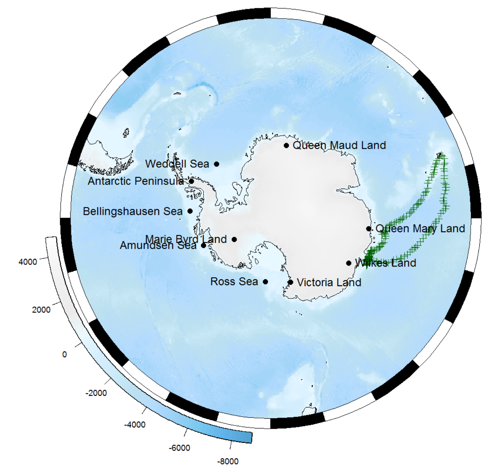
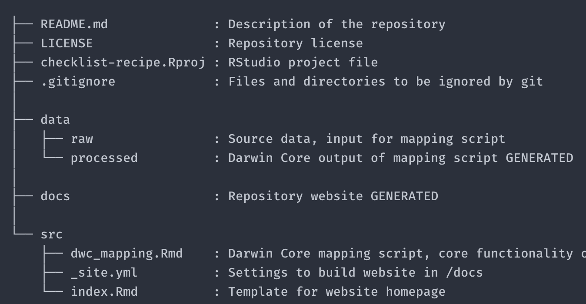
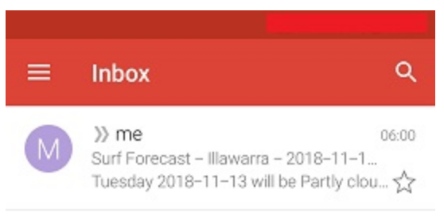
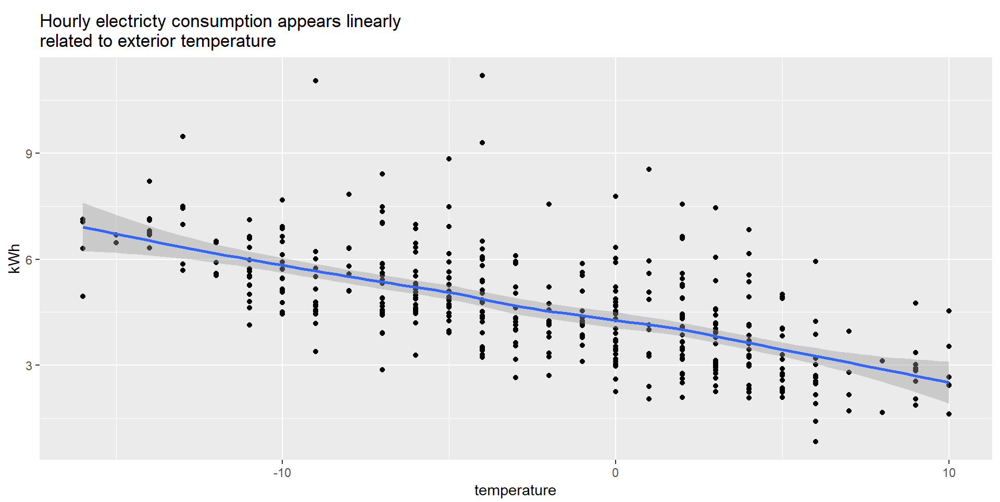

## rOpenSci HQ 

* We just had a community call on [Working with images in R](https://ropensci.org/blog/2018/10/24/commcall-nov2018/). Check out the notes and video at <https://github.com/ropensci/commcalls#past-calls>
* We need a new maintainer for the [chromer][] package! It is a package for interacting with the chromosome counts database (CCDB) <http://ccdb.tau.ac.il>. It is in working order, though there are a number of issues outstanding to address, and other possible issues once you dive in. The package has had two citations (that we know of) so far: [Sessa & Der 2017](https://doi.org/10.1016/bs.abr.2016.02.001) and [Zenil-Ferguson et al. 2017](
https://doi.org/10.1111/evo.13226). 

 

## Software 📦

CRAN:  
GitHub: 

### New packages

* The first version (`v1.0.0`) of `restez` is on CRAN - create and query a local copy of GenBank. Checkout the [docs](https://ropensci.github.io/restez/) to get started. You can find the software review at [ropensci/onboarding#232](https://github.com/ropensci/onboarding/issues/232) {{ "restez" | image_cran }} {{ "restez" | image_github }}
* The first version (`v1.0.0`) of `rcites` is on CRAN - access the CITES Speciesplus database. See the [release notes](https://github.com/ropensci/rcites/blob/master/NEWS.md) for changes. Checkout the [docs](https://ropensci.github.io/rcites/) to get started. You can find the software review at [ropensci/onboarding#244](https://github.com/ropensci/onboarding/issues/244) {{ "rcites" | image_cran }} {{ "rcites" | image_github }}

### New versions

* Two new versions (`v0.2.0`/`v0.2.1`) of `rdflib` are on CRAN - High level wrapper around the redland rdf package. See the [release notes](https://github.com/ropensci/rdflib/blob/master/NEWS.md) for changes. Checkout the [docs](https://ropensci.github.io/rdflib/) to get started. {{ "rdflib" | image_cran }} {{ "rdflib" | image_github }}
> `rdf()` now supports all major storage backends; new fxn `length()`
* A new version (`v0.3.5`) of `jstor` is on CRAN - read data from JSTOR/DfR. See the [release notes](https://github.com/ropensci/jstor/blob/master/NEWS.md) for changes. Checkout the [docs](https://ropensci.github.io/jstor) to get started. {{ "jstor" | image_cran }} {{ "jstor" | image_github }}
> `readr` compatibility fix; column names in `jst_get_refernces` have been renamed to avoid ambiguity when matching with output from `jst_get_article`
* A new version (`v1.3.0`) of `GSODR` is on CRAN - Global Surface Summary of the Day (GSOD) Weather Data from R. See the [release notes](https://github.com/ropensci/GSODR/blob/master/NEWS.md) for changes. Checkout the [docs](https://ropensci.github.io/GSODR/) to get started. {{ "GSODR" | image_cran }} {{ "GSODR" | image_github }}
> use `future_apply` in processing files after downloading
* A new version (`v0.2.1`) of `tiler` is on CRAN - Generate geographic and non-geographic map tiles from R. See the [release notes](https://github.com/ropensci/tiler/releases/tag/v0.2.1) for changes. Checkout the [docs](https://ropensci.github.io/tiler/) to get started. {{ "tiler" | image_cran }} {{ "tiler" | image_github }}
> improved help for Windows users; added `leaflet` examples; bug fix for Windows users
* A new version (`v0.4`) of `NLMR` is on CRAN - Simulating neutral landscape models. See the [release notes](https://github.com/ropensci/NLMR/blob/master/NEWS.md) for changes. Checkout the [docs](https://ropensci.github.io/NLMR/) to get started. {{ "NLMR" | image_cran }} {{ "NLMR" | image_github }}
> `nlm_neigh`, `nlm_mpd`, `nlm_randomrectangularcluster` now implemented in Rcpp
* A new version (`v0.9.0`) of `spocc` is on CRAN - an interface to many species occurrence data sources. See the [release notes](https://github.com/ropensci/spocc/releases/tag/v0.9.0) for changes. Checkout the [docs](https://ropensci.github.io/spocc/) to get started. {{ "spocc" | image_cran }} {{ "spocc" | image_github }}
> AntWeb data source removed; fixes to eBird internals; `occ()` now collects HTTP request error info & gains `throw_warnings` param to control warnings
* A new version (`v1.19.1`) of `rtika` is on CRAN - R Interface to Apache Tika. See the [release notes](https://github.com/ropensci/rtika/blob/master/NEWS.md) for changes. Checkout the [docs](https://ropensci.github.io/rtika/) to get started. {{ "rtika" | image_cran }} {{ "rtika" | image_github }}
> updated Tika version
* A new version (`v0.2.0`) of `fingertipsR` is on CRAN - Fingertips data for public health <http://fingertips.phe.org.uk/>. See the [release notes](https://github.com/ropensci/fingertipsR/releases/tag/v0.2.0) for changes. Checkout the [vignettes](https://cran.rstudio.com/web/packages/fingertipsR/vignettes/) to get started. {{ "fingertipsR" | image_cran }} {{ "fingertipsR" | image_github }}
> fix for `select_indicators()`; speed ups for `indicators()` fxn

  

## Software Review ✔

We accept community contributed packages via our onboarding system - an open software review system, sorta like scholarly paper review, but way better. We'll highlight newly onboarded packages here. A huge thanks to our reviewers, who do a lot of work reviewing (see the [blog post on our review system](https://ropensci.org/blog/2016/03/28/software-review)),
and the authors of the packages!

If you want to be a reviewer fill out [this short form](https://ropensci.org/onboarding/), and we'll ping you when there's a submission that fits in your area of expertise.

The following packages recently went through our onboarding process and have been approved!

* [tiler][] > Create Geographic and Non-Geographic Map Tiles
    * Author: [Matthew Leonawicz](https://github.com/leonawicz)
    * Issue: [ropensci/onboarding#226](https://github.com/ropensci/onboarding/issues/226)
     * Reviewers: 
        * [Jasmine Daly](https://github.com/jasdumas)
        * [Paula Moraga](https://github.com/Paula-Moraga)
* [spatsoc][] > Group Animal Relocation Data by Spatial and Temporal Relationship
    * Author: [Alec Robitaille](https://github.com/robitalec)
    * Issue: [ropensci/onboarding#237](https://github.com/ropensci/onboarding/issues/237)
    * Reviewers: 
        * [Priscilla Minotti](https://github.com/pmnatural)
        * [Filipe Teixeira](https://github.com/FilipeamTeixeira)
* [restez][] > Create and Query a Local Copy of GenBank in R
    * Author: [Dom Bennett](https://github.com/DomBennett)
    * Issue: [ropensci/onboarding#232](https://github.com/ropensci/onboarding/issues/232)
    * Reviewers: 
        * [Naupaka Zimmerman](https://github.com/naupaka)
        * [Evan Eskew](https://github.com/eveskew)
* [treeStartR][] > Generate Starting Trees For Combined Molecular, Morphological and Stratigraphic Data
    * Author: [April Wright](https://github.com/wrightaprilm)
    * Issue: [ropensci/onboarding#239](https://github.com/ropensci/onboarding/issues/239)
    * Reviewers: 
        * [Rachel Warnock](https://github.com/rachelwarnock)
        * [David Bapst](https://github.com/dwbapst)
* [rcites][] > R Interface to the Species+ Database
    * Author: [Jonas Geschke](https://github.com/JonasGeschke)
    * Issue: [ropensci/onboarding#244](https://github.com/ropensci/onboarding/issues/244)
    * Reviewers: 
        * [Margaret Siple](https://github.com/mcsiple)
        * [Noam Ross](https://github.com/noamross)

The following package was recently submitted:

* [git2rdata][] > Store and Retrieve Data.frames in a Git Repository
    * Author: [Thierry Onkelinx](https://github.com/ThierryO)
    * Issue: [ropensci/onboarding#263](https://github.com/ropensci/onboarding/issues/263)
   * Reviewers: not assigned yet

  

## On the blog

[Ben Raymond](https://github.com/raymondben) and [Michael Sumner](https://github.com/mdsumner) wrote about [The Antarctic/Southern Ocean rOpenSci community](https://ropensci.org/blog/2018/11/13/antarctic/). Do check it out to see what's going on in this flourishing community within rOpenSci of folks interested in Antarctic/Southern Ocean data and software.

 

[Peter Desmet](https://orcid.org/0000-0002-8442-8025), [Damiano Oldoni](https://orcid.org/0000-0003-3445-7562), and [Lien Reyserhove](https://orcid.org/0000-0001-7484-9267) wrote about [Checklist Recipe - How we created a template to standardize species data](https://ropensci.org/blog/2018/11/20/checklist-recipe/). Their work won the recent GBIF Ebbe Nielsen Challenge. It's a great example of leveraging R to create reproducible workflows!

  

## Use cases

The following 16 works use/cite rOpenSci software:

* Tickler et al. use [seaaroundus][] in their paper [Modern slavery and the race to fish](https://doi.org/10.1038/s41467-018-07118-9) [^1] 
* Lynd et al. use [plotly][] in their paper [Insecticide resistance in Anopheles gambiae from the northern Democratic Republic of Congo, with extreme knockdown resistance (kdr) mutation frequencies revealed by a new diagnostic assay](https://doi.org/10.1186/s12936-018-2561-5) [^2]
* Robitaille et al. use [spatsoc][] in their paper [Conducting social network analysis with animal telemetry data: applications and methods using spatsoc](https://doi.org/10.1101/447284) [^3]
* Moura et al. use [MODIStsp][] in their paper [Relation of El Niño and La Niña phenomena to precipitation, evapotranspiration and temperature in the Amazon basin](https://doi.org/10.1016/j.scitotenv.2018.09.242) [^4]
* Bartomeus et al. use [taxize][] and [rgbif][] in their paper [Historical collections as a tool for assessing the global pollination crisis](https://doi.org/10.1098/rstb.2017.0389) [^5]
* Jarić et al. use [rfishbase][] in their paper [Susceptibility of European freshwater fish to climate change: species profiling based on life-history and environmental characteristics](https://doi.org/10.1111/gcb.14518) [^6]
* Weishäupl et al. use [magick][] in their paper [Physiological and pathophysiological characteristics of ataxin-3 isoforms](https://doi.org/10.1074/jbc.ra118.005801) [^7]
* Perez et al. use [spocc][] in their paper [Botanic gardens are an untapped resource for studying the functional ecology of tropical plants](https://doi.org/10.1098/rstb.2017.0390) [^8]
* Albrecht et al. use [cld2][] in their paper [Description of Cardiological Apps From the German App Store: Semiautomated Retrospective App Store Analysis](https://doi.org/10.2196/11753) [^9]
* Patel used [tokenizers][] in their paper [Sentiment Analysis of Harry Potter Book Series using R](http://www.j-asc.com/gallery/66-november-1233.pdf) [^10]
* Varela used [MODIStsp][] in their dissertation [Applications of remote sensing in agriculture via unmanned aerial systems and satellites](http://krex.k-state.edu/dspace/bitstream/handle/2097/39333/SebastianVarela2018.pdf) [^11]
* Garmendia et al. used [writexl][] in their paper [Insect repellent and chemical agronomic treatments to reduce seed number in “Afourer” mandarin. Effect on yield and fruit diameter](https://doi.org/10.1016/j.scienta.2018.11.025) [^12]
* Watts & Miksis-Olds used [rentrez][] in their white paper [The Ocean as a Living Sensor: Environmental DNA and Acoustics for Detecting Marine Life](https://phe.rockefeller.edu/eDNAmarine2018/papers/Watts-Miksis-Olds_paper_Ocean_as_a_Living_Sensor.pdf) [^13]
* Hurtado et al. used [MODIStsp][] in their paper [Population Dynamics of Anopheles albimanus (Diptera: Culicidae) at Ipetí-Guna, a Village in a Region Targeted for Malaria Elimination in Panamá](https://doi.org/10.3390/insects9040164) [^14]
* Pietrosemoli & Dobay used [rentrez][] in their book chapter [Optimized Protein–Protein Interaction Network Usage with Context Filtering](https://link.springer.com/protocol/10.1007/978-1-4939-8618-7_2) [^15]
* Boettiger wrote about his new package [piggyback][] in a JOSS paper [Managing Larger Data on a GitHub Repository](https://doi.org/10.21105/joss.00971) [^16]

  

## In the news

Dean Marchiori used our package [bomrang][] (from maintainer [Adam Sparks](https://github.com/adamhsparks/)) to create an automated surf conditions email [Surf Check - Automating Weather Forecast Emails in R](https://deanmarchiori.github.io/posts/2018/11/automated-surf-forecasts/)
<blockquote class="twitter-tweet" data-cards="hidden" data-lang="en">
My latest post uses the bomrang <a href="https://twitter.com/hashtag/rstats?src=hash&amp;ref_src=twsrc%5Etfw">#rstats</a> 📦 to create an automated email each morning w my local surf conditions 🤙🌊 <a href="https://twitter.com/rOpenSci?ref_src=twsrc%5Etfw">@rOpenSci</a> <a href="https://twitter.com/adamhsparks?ref_src=twsrc%5Etfw">@adamhsparks</a> <a href="https://t.co/fqMYLgyYsi">https://t.co/fqMYLgyYsi</a>
&mdash; Dean Marchiori (@deanmarchiori) <a href="https://twitter.com/deanmarchiori/status/1062173092082966528?ref_src=twsrc%5Etfw">November 13, 2018</a></blockquote>

 

Simon Coulombe used our package [weathercan][] (from maintainer [Steffi LaZerte](https://github.com/steffilazerte)) in his blog post about [Buying a heat pump the data scientist way](http://www.simoncoulombe.com/2018/11/22/heatpump/)
<blockquote class="twitter-tweet" data-cards="hidden" data-lang="en">
Does buying a heat pump for my 🏠 in cold  🇨🇦 makes  sense, the data scientist way. I use local weather data provided by the weathercan package, my hourly electricity consumption and some tech sheets. (thanks <a href="https://twitter.com/steffilazerte?ref_src=twsrc%5Etfw">@steffilazerte</a> !) <a href="https://twitter.com/rOpenSci?ref_src=twsrc%5Etfw">@rOpenSci</a> <a href="https://twitter.com/Rbloggers?ref_src=twsrc%5Etfw">@Rbloggers</a> <a href="https://twitter.com/hashtag/rstats?src=hash&amp;ref_src=twsrc%5Etfw">#rstats</a> <a href="https://t.co/kP5K5XZotm">https://t.co/kP5K5XZotm</a> <a href="https://t.co/qOEEwAQzja">pic.twitter.com/qOEEwAQzja</a>
&mdash; Simon Coulombe (@CoulSim) <a href="https://twitter.com/CoulSim/status/1065512754289754117?ref_src=twsrc%5Etfw">November 22, 2018</a></blockquote>

  

  

### Keep up with rOpenSci

* Mailing list: Sign up with an email address to get this newsletter sent to your inbox -> [ropensci.org/#subscribe](https://ropensci.org/#subscribe)
* Alternatively, you can subscribe to this newsletter via our XML feed at <https://news.ropensci.org/feed.xml> or our JSON feed at <https://news.ropensci.org/feed.json>
* rOpenSci on Twitter: [@ropensci](https://twitter.com/ropensci)
* The rOpenSci blog at [ropensci.org/blog](https://ropensci.org/blog) - you can subscribe in any RSS aggregator, or manually via <https://ropensci.org/feed.xml>. We also announce new blog posts on our Twitter account.

 

#### Footnotes

[^1]: Tickler, D., Meeuwig, J. J., Bryant, K., David, F., Forrest, J. A. H., Gordon, E., … Zeller, D. (2018). Modern slavery and the race to fish. Nature Communications, 9(1). <https://doi.org/10.1038/s41467-018-07118-9>
[^2]: Lynd, A., Oruni, A., van’t Hof, A. E., Morgan, J. C., Naego, L. B., Pipini, D., … Weetman, D. (2018). Insecticide resistance in Anopheles gambiae from the northern Democratic Republic of Congo, with extreme knockdown resistance (kdr) mutation frequencies revealed by a new diagnostic assay. Malaria Journal, 17(1). <https://doi.org/10.1186/s12936-018-2561-5>
[^3]: Robitaille, A. L., Webber, Q. M. R., & Vander Wal, E. (2018). Conducting social network analysis with animal telemetry data: applications and methods using spatsoc. <https://doi.org/10.1101/447284>
[^4]: Moura, M. M., dos Santos, A. R., Pezzopane, J. E. M., Alexandre, R. S., da Silva, S. F., Pimentel, S. M., … de Carvalho, J. R. (2019). Relation of El Niño and La Niña phenomena to precipitation, evapotranspiration and temperature in the Amazon basin. Science of The Total Environment, 651, 1639–1651. <https://doi.org/10.1016/j.scitotenv.2018.09.242>
[^5]: Bartomeus, I., Stavert, J. R., Ward, D., & Aguado, O. (2018). Historical collections as a tool for assessing the global pollination crisis. Philosophical Transactions of the Royal Society B: Biological Sciences, 374(1763), 20170389. <https://doi.org/10.1098/rstb.2017.0389>
[^6]: Jarić, I., Lennox, R. J., Kalinkat, G., Cvijanović, G., & Radinger, J. (2018). Susceptibility of European freshwater fish to climate change: species profiling based on life-history and environmental characteristics. Global Change Biology. <https://doi.org/10.1111/gcb.14518>
[^7]: Weishäupl, D., Schneider, J., Peixoto Pinheiro, B., Ruess, C., Dold, S. M., von Zweydorf, F., … Schmidt, T. (2018). Physiological and pathophysiological characteristics of ataxin-3 isoforms. Journal of Biological Chemistry, jbc.RA118.005801. <https://doi.org/10.1074/jbc.ra118.005801>
[^8]: Perez, T. M., Valverde-Barrantes, O., Bravo, C., Taylor, T. C., Fadrique, B., Hogan, J. A., … Feeley, K. J. (2018). Botanic gardens are an untapped resource for studying the functional ecology of tropical plants. Philosophical Transactions of the Royal Society B: Biological Sciences, 374(1763), 20170390. <https://doi.org/10.1098/rstb.2017.0390>
[^9]: Albrecht, U.-V., Hasenfuß, G., & von Jan, U. (2018). Description of Cardiological Apps From the German App Store: Semiautomated Retrospective App Store Analysis. JMIR mHealth and uHealth, 6(11), e11753. <https://doi.org/10.2196/11753>
[^10]: Patel, D. 2018.  Sentiment Analysis of Harry Potter Book Series using R. <http://www.j-asc.com/gallery/66-november-1233.pdf>
[^11]: Varela, S. (2018). Applications of remote sensing in agriculture via unmanned aerial systems and satellites (Doctoral dissertation). <http://krex.k-state.edu/dspace/bitstream/handle/2097/39333/SebastianVarela2018.pdf>
[^12]: Garmendia, A., Beltrán, R., Zornoza, C., Breijo, F., Reig, J., Bayona, I., & Merle, H. (2019). Insect repellent and chemical agronomic treatments to reduce seed number in “Afourer” mandarin. Effect on yield and fruit diameter. Scientia Horticulturae, 246, 437–447. <https://doi.org/10.1016/j.scienta.2018.11.025>
[^13]: Watts, A. W., & Miksis-Olds, J. 2018. The Ocean as a Living Sensor: Environmental DNA and Acoustics for Detecting Marine Life. <https://phe.rockefeller.edu/eDNAmarine2018/papers/Watts-Miksis-Olds_paper_Ocean_as_a_Living_Sensor.pdf>
[^14]: Hurtado, L., Rigg, C., Calzada, J., Dutary, S., Bernal, D., Koo, S., & Chaves, L. (2018). Population Dynamics of Anopheles albimanus (Diptera: Culicidae) at Ipetí-Guna, a Village in a Region Targeted for Malaria Elimination in Panamá. Insects, 9(4), 164. <https://doi.org/10.3390/insects9040164>
[^15]: Pietrosemoli, N., & Dobay, M. P. (2018). Optimized Protein–Protein Interaction Network Usage with Context Filtering. In Computational Cell Biology (pp. 33-50). Humana Press, New York, NY. <https://link.springer.com/protocol/10.1007/978-1-4939-8618-7_2>
[^16]: Boettiger, C. (2018). Managing Larger Data on a GitHub Repository. Journal of Open Source Software, 3(29), 971. <https://doi.org/10.21105/joss.00971>

[taxize]: https://github.com/ropensci/taxize
[rgbif]: https://github.com/ropensci/rgbif
[magick]: https://github.com/ropensci/magick
[rentrez]: https://github.com/ropensci/rentrez
[chromer]: https://github.com/ropensci/chromer
[tiler]: https://github.com/ropensci/tiler
[restez]: https://github.com/ropensci/restez
[spatsoc]: https://github.com/ropensci/spatsoc
[git2rdata]: https://github.com/inbo/git2rdata
[treeStartR]: https://github.com/ropensci/treeStartR
[rcites]: https://github.com/ropensci/rcites
[bomrang]: https://github.com/ropensci/bomrang
[weathercan]: https://github.com/ropensci/weathercan
[seaaroundus]: https://github.com/ropensci/seaaroundus
[plotly]: https://github.com/ropensci/plotly
[MODIStsp]: https://github.com/ropensci/MODIStsp
[rfishbase]: https://github.com/ropensci/rfishbase
[spocc]: https://github.com/ropensci/spocc
[cld2]: https://github.com/ropensci/cld2
[tokenizers]: https://github.com/ropensci/tokenizers
[writexl]: https://github.com/ropensci/writexl
[piggyback]: https://github.com/ropensci/piggyback

