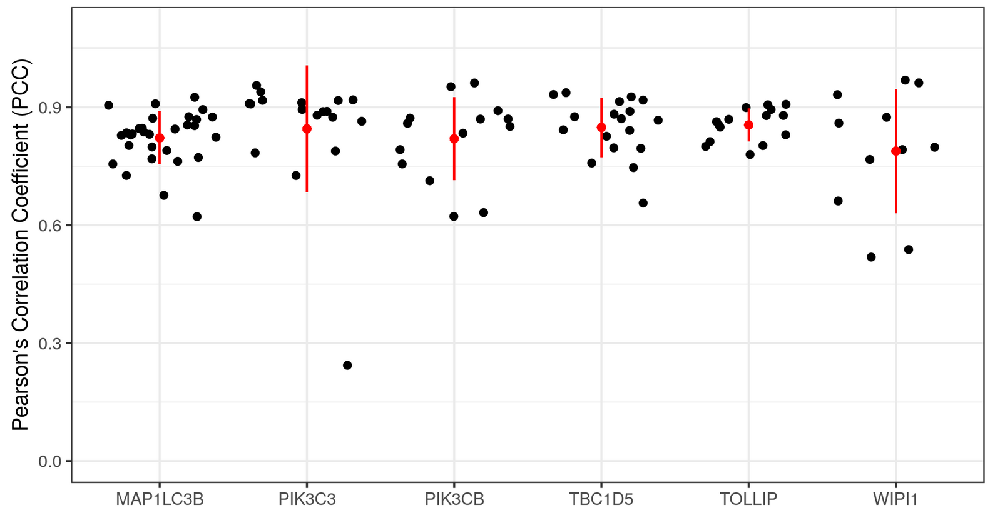

rOpenSci News is four years old! 🎉 Our first newsletter came out on December 15th, 2014. Check it out at <https://news.ropensci.org/update-2014-12-15/>. As you can see the newsletter has changed a lot since then. Thanks for reading!

 

## rOpenSci HQ 

* We have another community call coming up next week; read the recent blog post by [Dan Sholler](https://ropensci.org/about/#team) and [Stefanie Butland](https://ropensci.org/about/#team) for all the details: [Community Call - Governance strategies for open source research software projects](https://ropensci.org/blog/2018/12/05/commcall-dec2018/)

 

## Software 📦

CRAN:  
GitHub: 

### New versions

* A new version (`v0.5.2`) of `visdat` is on CRAN - create preliminary exploratory data visualisations of an entire dataset to identify problems or unexpected features using ggplot2. See the [release notes](https://github.com/ropensci/visdat/blob/master/NEWS.md) for changes. Checkout the [docs](http://visdat.njtierney.com/) to get started. {{ "visdat" | image_cran }} {{ "visdat" | image_github }}
> fix for `readr`
* A new version (`v0.3.1`) of `auk` is on CRAN - eBird data extraction and processing. See the [release notes](https://github.com/CornellLabofOrnithology/auk/blob/master/NEWS.md) for changes. Checkout the [docs](http://cornelllabofornithology.github.io/auk/) to get started. {{ "auk" | image_cran }} 
> `rlang` fixes and change to `auk_unique()`
* A new version (`v0.4.0`) of `brranching` is on CRAN - Fetch Phylogenies from Many Sources. See the [release notes](https://github.com/ropensci/brranching/releases/tag/v0.4.0) for changes. Checkout the [vignette](https://cran.rstudio.com/web/packages/brranching/vignettes/brranching_vignette.html) to get started. {{ "brranching" | image_cran }} {{ "brranching" | image_github }}
> now using [phylocomr][] for `phylomatic_local` and `rbladj` fxns
* A new version (`v1.3.7`) of `MODIStsp` is on CRAN - Automate Download and Preprocessing of MODIS Land Products Data. See the [release notes](https://github.com/ropensci/MODIStsp/releases/tag/v1.3.7) for changes. Checkout the [docs](http://ropensci.github.io/MODIStsp/) to get started. {{ "MODIStsp" | image_cran }} {{ "MODIStsp" | image_github }}
> bug fix for computation of custom spectral indices containing additive parameters
* A new version (`v0.8.0`) of `rnoaa` is on CRAN - NOAA Weather Data from R. See the [release notes](https://github.com/ropensci/rnoaa/releases/tag/v0.8.0) for changes. Checkout the [vignettes](https://cran.rstudio.com/web/packages/rnoaa/vignettes/) to get started. {{ "rnoaa" | image_cran }} {{ "rnoaa" | image_github }}
> 3 new data sources (& fxns); new fxn `ghcnd_read()`; optionally get units for `ncdc()` output
* A new version (`v0.5.2`) of `hoardr` is on CRAN - Manage cached files. See the [release notes](https://github.com/ropensci/hoardr/releases/tag/v0.5.2) for changes. Checkout the [vignette](https://cran.rstudio.com/web/packages/hoardr/vignettes/hoardr_vignette.html) to get started. {{ "hoardr" | image_cran }} {{ "hoardr" | image_github }}
> important bug fix: now multiple `hoardr()` objects in same R session don't collide
* A new version (`v1.1`) of `writexl` is on CRAN - a portable, light-weight data frame to xlsx exporter. See the [release notes](https://github.com/ropensci/writexl/releases/tag/v1.1) for changes. Checkout the [README](https://github.com/ropensci/writexl/#writexl) to get started. {{ "writexl" | image_cran }} {{ "writexl" | image_github }}
> update bundled libxlswriter; don't write blank xlsx strings for NA and `""`
* A new version (`v1.5`) of `graphql` is on CRAN - Bindings to libgraphqlparser for R. See the [release notes](https://github.com/ropensci/graphql/releases/tag/v1.5) for changes. Checkout the [README](https://github.com/ropensci/graphql/#graphql) to get started. {{ "graphql" | image_cran }} {{ "graphql" | image_github }}
> update bundled libgraphqlpaser
* A new version (`v0.1.2`) of `phylocomr` is on CRAN - Interface to Phylocom for analysis of phylogenetic community structure and character evolution. See the [release notes](https://github.com/ropensci/phylocomr/releases/tag/v0.1.2) for changes. Checkout the [vignette](https://cran.rstudio.com/web/packages/phylocomr/vignettes/phylocomr_vignette.html) to get started. {{ "phylocomr" | image_cran }} {{ "phylocomr" | image_github }}
> bug fix - `ph_phylomatic()` wasn't working with some phylogenies

  

## Software Review ✔

We accept community contributed packages via our onboarding system - an open software review system, sorta like scholarly paper review, but way better. We'll highlight newly onboarded packages here. A huge thanks to our reviewers, who do a lot of work reviewing (see the [blog post on our review system](https://ropensci.org/blog/2016/03/28/software-review)),
and the authors of the packages!

If you want to be a reviewer fill out [this short form](https://ropensci.org/onboarding/), and we'll ping you when there's a submission that fits in your area of expertise.

The following packages recently went through our onboarding process and have been approved!

* [wateRinfo][] > Download Time Series Data from Waterinfo.be
    * Author: [Stijn Van Hoey](https://github.com/stijnvanhoey)
    * Issue: [ropensci/onboarding#255](https://github.com/ropensci/onboarding/issues/255)
   * Reviewers:
        * [Laura DeCicco](https://github.com/ldecicco-USGS)
* [rdhs][] > API Client and Dataset Management for the Demographic and Health Survey (DHS) Data
    * Author: [OJ Watson](https://github.com/OJWatson)
    * Issue: [ropensci/onboarding#238](https://github.com/ropensci/onboarding/issues/238)
    * Reviewers:
        * [dosgillespie](https://github.com/dosgillespie)
        * [Lucy McGowan](https://github.com/LucyMcGowan)

The following packages were recently submitted:

* [stats19][] > Work with open road traffic casualty data from Great Britain
    * Author: [Robin Lovelace](https://github.com/Robinlovelace)
    * Issue: [ropensci/onboarding#266](https://github.com/ropensci/onboarding/issues/266)
     * Reviewers: 
        * [Adam Sparks](https://github.com/adamhsparks)
        * [David Ranzolin](https://github.com/daranzolin)
* [lightr][] > Read Spectrometric Data in R
    * Author: [Hugo Gruson](https://github.com/Bisaloo)
    * Issue: [ropensci/onboarding#267](https://github.com/ropensci/onboarding/issues/267)
     * Reviewers: not assigned yet
* [ramlegacy][] > Download and Read RAM Legacy Stock Assessment DataBase
    * Author: [Kshitiz Gupta](https://github.com/kshtzgupta1)
    * Issue: [ropensci/onboarding#264](https://github.com/ropensci/onboarding/issues/264)
     * Reviewers: not assigned yet
* [emld][] > Ecological Metadata as Linked Data
    * Author: [Carl Boettiger](https://github.com/cboettig)
    * Issue: [ropensci/onboarding#269](https://github.com/ropensci/onboarding/issues/269)
     * Reviewers: 
        * [Kelly Hondula](https://github.com/khondula)
        * [Peter Slaughter](https://github.com/gothub)
* [virtuoso][] > R interface to Virtuoso using ODBC
    * Author: [Carl Boettiger](https://github.com/cboettig)
    * Issue: [ropensci/onboarding#271](https://github.com/ropensci/onboarding/issues/271)
     * Reviewers: not assigned yet

  

## On the blog

### Community

[Hoa Ye](https://haoye.us/), [Melanie Frazier](http://ohi-science.org/news/people-of-ohi-melanie-frazier), [Julia Stewart-Lowndes](http://jules32.github.io/), [Carl Beottiger](https://ropensci.org/about/#team) and [Noam Ross](https://www.ecohealthalliance.org/personnel/dr-noam-ross) wrote up a summary of our recent community call on code review in the lab, with links to notes and a recording of the call.  [Community Call Summary - Code Review in the Lab](https://ropensci.org/blog/2018/11/29/codereview/)

 

[Dan Sholler](https://ropensci.org/about/#team) and [Stefanie Butland](https://ropensci.org/about/#team) wrote about an upcoming community call: [Community Call - Governance strategies for open source research software projects](https://ropensci.org/blog/2018/12/05/commcall-dec2018/)

### Software Review

[Mahmoud Ahmed](https://github.com/MahShaaban) wrote about his recently rOpenSci reviewed package [colocr](https://github.com/ropensci/colocr), for conducting co-localization analysis of fluorescence microscopy images. [Co-localization analysis of fluorescence microscopy images](https://ropensci.org/blog/2018/11/27/colocr/)

[Alec Robitaille](https://gitlab.com/robit.a/), [Quinn Webber](http://qwebber.weebly.com/), and [Eric Vander Wal](https://weel.gitlab.io/) wrote about their recently rOpenSci reviewed package [spatsoc][] for detecting spatial and temporal groups in GPS relocations.  [Detecting spatiotemporal groups in relocation data with spatsoc](https://ropensci.org/blog/2018/12/04/spatsoc/)

### tech notes

[Dom Bennett](https://github.com/dombennett) wrote about his package just gone through rOpenSci review for working with a local copy of GenBank data in R. [restez: Query GenBank locally](https://ropensci.org/technotes/2018/12/03/restez/)

 

[Scott Chamberlain](https://ropensci.org/about/#team) wrote about a new release of our `rnoaa` package for working with many NOAA datasets, including a number of new data sets and the addition of units to `rnoaa::ncdc()` data. [rnoaa: new data sources and NCDC units](https://ropensci.org/technotes/2018/12/04/rnoaa-update/)

  

## Use cases

The following 17 works use/cite rOpenSci software:

* Anderson et al. used [skimr][] in their report [NZ GREEN Grid Household Electricity Demand Study](http://reshare.ukdataservice.ac.uk/853334/14/NZ_GREEN_GridHouseholdElectricityDemandStudy_HouseholdAttributeData_v1.0.pdf) [^1] 
* Sabatini et al. used [rredlist][] in their paper [Trade‐offs between carbon stocks and biodiversity in European temperate forests](https://onlinelibrary.wiley.com/doi/full/10.1111/gcb.14503) [^2]
* Walsh & Cherbuin used [fulltext][] and [roadoi][] in their pre-print [Mapping the Literature on Nutritional Interventions in Cognitive Health: A Data-Driven Approach](https://www.preprints.org/manuscript/201811.0527/download/final_file) [^3]
* António et al. used [skimr][] in their paper [Hotel booking demand datasets](https://doi.org/10.1016/j.dib.2018.11.126) [^4]
* Aprosio & Moretti used [textreuse][] in their book chapter [Tint 2.0: An all-inclusive Suite for NLP in Italian](http://ceur-ws.org/Vol-2253/paper58.pdf) [^5]
* Borstein et al. used [rfishbase][] in their paper [Reef fish functional traits evolve fastest at trophic extremes](https://doi.org/10.1038/s41559-018-0725-x) [^6]
* Ott et al. used [iheatmapr][] in their paper [Enhancer Architecture and Essential Core Regulatory Circuitry of Chronic Lymphocytic Leukemia](https://doi.org/10.1016/j.ccell.2018.11.001) [^7]
* White & Santy cited [ckanr][], [rdryad][], [rfigshare][], and [rdatacite][] in their paper [DataDepsGenerators.jl: making reusing data easy by automatically generating DataDeps.jl registration code](https://doi.org/10.21105/joss.00921) [^8]
* Soul et al. used [plotly][] in their paper [SkeletalVis: An exploration and meta-analysis data portal of cross-species skeletal transcriptomics data](https://academic.oup.com/bioinformatics/advance-article-pdf/doi/10.1093/bioinformatics/bty947/26770069/bty947.pdf) [^9]
* Hanson et al. used [rgbif][] in their paper [Conventional methods for enhancing connectivity in conservation planning do not always maintain gene flow](https://doi.org/10.1111/1365-2664.13315) [^10]
* Evans & Nishioka used [magick][] in their paper [Accumulation processes of trace metals into Arctic sea ice: distribution of Fe, Mn and Cd associated with ice structure](https://doi.org/10.1016/j.marchem.2018.11.011) [^11]
* Sinval et al. used [skimr][] in their paper [University student engagement inventory (USEI): Psychometric properties](https://doi.org/10.1007/s12144-018-0082-6) [^12]
* Pelletier et al. used [taxize][] in their paper [Predicting plant conservation priorities on a global scale](https://doi.org/10.1073/pnas.1804098115) [^13]
* Da Silva et al. used [taxize][] in their paper [Assessing the Conservation Potential of Fish and Corals in Aquariums Globally](https://doi.org/10.1016/j.jnc.2018.12.001) [^14]
* Vidal et al. used [rgbif][] in their paper [Impacts of landscape composition, marginality of distribution, soil fertility, and climatic stability on the patterns of woody plant endemism in the Cerrado](https://doi.org/10.1101/362475) [^15]
* Kline et al. used [plotly][] in their paper [Multifocal Versus Conventional Unifocal Diverticulitis: A Comparison of Clinical and Transcriptomic Characteristics](https://doi.org/10.1007/s10620-018-5403-y) [^16]
* Zill used [plotly][] in their thesis [Enriching the feature space of transfer learning in user analysis in online social networks](https://kola.opus.hbz-nrw.de/opus45-kola/frontdoor/index/index/docId/1763) [^17]

  

## In the news

William Chase wrote a blog post using our package [rgbif][]: [Animated Species Invasions with rgbif and gganimate](https://www.williamrchase.com/post/animated-species-invasions-with-rgbif-and-gganimate/). A static map is below - check out the post for the animated maps.

 

Hiroaki Yutani used our package [magick][] in a nice post about [How To Convert A Human To Waves By Magick Package](https://yutani.rbind.io/post/how-to-convert-a-human-to-waves-by-magick-package/). A static image is below - check out the post for the animated image.

  

  

### Keep up with rOpenSci

* Mailing list: Sign up with an email address to get this newsletter sent to your inbox -> [ropensci.org/#subscribe](https://ropensci.org/#subscribe)
* Alternatively, you can subscribe to this newsletter via our XML feed at <https://news.ropensci.org/feed.xml> or our JSON feed at <https://news.ropensci.org/feed.json>
* rOpenSci on Twitter: [@ropensci](https://twitter.com/ropensci)
* The rOpenSci blog at [ropensci.org/blog](https://ropensci.org/blog) - you can subscribe in any RSS aggregator, or manually via <https://ropensci.org/feed.xml>. We also announce new blog posts on our Twitter account.

 

#### Footnotes

[^1]: Anderson, B., Eyers, D., Ford, R., Giraldo Ocampo, D., Peniamina, R., Stephenson, J., ... & Jack, M. NZ GREEN Grid Household Electricity Demand Study. <http://reshare.ukdataservice.ac.uk/853334/14/NZ_GREEN_GridHouseholdElectricityDemandStudy_HouseholdAttributeData_v1.0.pdf>
[^2]: Sabatini, F. M., de Andrade, R. B., Paillet, Y., Ódor, P., Bouget, C., Campagnaro, T., ... & Sitzia, T. Trade‐offs between carbon stocks and biodiversity in European temperate forests. Global Change Biology. <https://onlinelibrary.wiley.com/doi/full/10.1111/gcb.14503>
[^3]: Walsh, E. I., & Cherbuin, N. (preprint). Mapping the Literature on Nutritional Interventions in Cognitive Health: A Data-Driven Approach. <https://www.preprints.org/manuscript/201811.0527/download/final_file>
[^4]: António, N., de Almeida, A., & Nunes, L. (2018). Hotel booking demand datasets. Data in Brief. <https://doi.org/10.1016/j.dib.2018.11.126>
[^5]: Aprosio, A. P., & Moretti, G. (2018). Tint 2.0: An all-inclusive Suite for NLP in Italian. Proceedings of CLIC-it. <http://ceur-ws.org/Vol-2253/paper58.pdf>
[^6]: Borstein, S. R., Fordyce, J. A., O’Meara, B. C., Wainwright, P. C., & McGee, M. D. (2018). Reef fish functional traits evolve fastest at trophic extremes. Nature Ecology & Evolution. <https://doi.org/10.1038/s41559-018-0725-x>
[^7]: Ott, C. J., Federation, A. J., Schwartz, L. S., Kasar, S., Klitgaard, J. L., Lenci, R., … Bradner, J. E. (2018). Enhancer Architecture and Essential Core Regulatory Circuitry of Chronic Lymphocytic Leukemia. Cancer Cell. <https://doi.org/10.1016/j.ccell.2018.11.001>
[^8]: White, L., & Santy, S. (2018). DataDepsGenerators.jl: making reusing data easy by automatically generating DataDeps.jl registration code. Journal of Open Source Software, 3(31), 921. <https://doi.org/10.21105/joss.00921>
[^9]: Soul, J., Hardingham, T., Boot-Handford, R., & Schwartz, J. M. (2018). SkeletalVis: An exploration and meta-analysis data portal of cross-species skeletal transcriptomics data. Bioinformatics. <https://academic.oup.com/bioinformatics/advance-article-pdf/doi/10.1093/bioinformatics/bty947/26770069/bty947.pdf>
[^10]: Hanson, J. O., Fuller, R. A., & Rhodes, J. R. (2018). Conventional methods for enhancing connectivity in conservation planning do not always maintain gene flow. Journal of Applied Ecology. <https://doi.org/10.1111/1365-2664.13315>
[^11]: Evans, L. K., & Nishioka, J. (2018). Accumulation processes of trace metals into Arctic sea ice: distribution of Fe, Mn and Cd associated with ice structure. Marine Chemistry. <https://doi.org/10.1016/j.marchem.2018.11.011>
[^12]: Sinval, J., Casanova, J. R., Marôco, J., & Almeida, L. S. (2018). University student engagement inventory (USEI): Psychometric properties. Current Psychology. <https://doi.org/10.1007/s12144-018-0082-6>
[^13]: Pelletier, T. A., Carstens, B. C., Tank, D. C., Sullivan, J., & Espíndola, A. (2018). Predicting plant conservation priorities on a global scale. Proceedings of the National Academy of Sciences, 201804098. <https://doi.org/10.1073/pnas.1804098115>
[^14]: Da Silva, R., Pearce Kelly, P., Zimmerman, B., Knott, M., Foden, W., & Conde, D. A. (2018). Assessing the Conservation Potential of Fish and Corals in Aquariums Globally. Journal for Nature Conservation. <https://doi.org/10.1016/j.jnc.2018.12.001>
[^15]: Vidal, J. de D., de Souza, A. P., & Koch, I. (2018). Impacts of landscape composition, marginality of distribution, soil fertility, and climatic stability on the patterns of woody plant endemism in the Cerrado. <https://doi.org/10.1101/362475>
[^16]: Kline, B. P., Schieffer, K. M., Choi, C. S., Connelly, T., Chen, J., Harris, L., … Koltun, W. A. (2018). Multifocal Versus Conventional Unifocal Diverticulitis: A Comparison of Clinical and Transcriptomic Characteristics. Digestive Diseases and Sciences. <https://doi.org/10.1007/s10620-018-5403-y>
[^17]: Zill, B. (2018). Enriching the feature space of transfer learning in user analysis in online social networks. Thesis. Universität Koblenz-Landau. <https://kola.opus.hbz-nrw.de/opus45-kola/frontdoor/index/index/docId/1763>

[taxize]: https://github.com/ropensci/taxize
[rgbif]: https://github.com/ropensci/rgbif
[magick]: https://github.com/ropensci/magick
[skimr]: https://github.com/ropensci/skimr
[rredlist]: https://github.com/ropensci/rredlist
[fulltext]: https://github.com/ropensci/fulltext
[roadoi]: https://github.com/ropensci/roadoi
[textreuse]: https://github.com/ropensci/textreuse
[rfishbase]: https://github.com/ropensci/rfishbase
[iheatmapr]: https://github.com/ropensci/iheatmapr
[ckanr]: https://github.com/ropensci/ckanr
[rdryad]: https://github.com/ropensci/rdryad
[rfigshare]: https://github.com/ropensci/rfigshare
[rdatacite]: https://github.com/ropensci/rdatacite
[plotly]: https://github.com/ropensci/plotly
[wateRinfo]: https://github.com/ropensci/wateRinfo
[rdhs]: https://github.com/ropensci/rdhs
[stats19]: https://github.com/ITSLeeds/stats19
[lightr]: https://github.com/Bisaloo/lightr
[ramlegacy]: http://www.github.com/kshtzgupta1/ramlegacy
[emld]: https://github.com/cboettig/emld
[virtuoso]: https://github.com/cboettig/virtuoso
[spatsoc]: https://github.com/ropensci/spatsoc
[phylocomr]: https://github.com/ropensci/phylocomr
