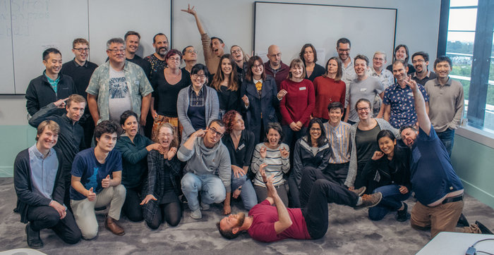

We're rolling out two new newsletter sections: 

* **Call for Contributors**: Software occassionally needs new maintainers. Checkout this section if you're looking to get involved in maintaining software.
* **Related News**: If you're interested to hear what's going in related communities, this section is for you.

Keep reading to see the first installment of these new sections.

 

## Software 📦

CRAN:  
GitHub: 

### New Packages

* The firsts version (`v0.1.1`) of `stats19` is on CRAN - Work with Open Road Traffic Casualty Data from Great Britain. See the [release notes](https://github.com/ropensci/stats19/blob/master/NEWS.md) for changes. Checkout the [docs](https://itsleeds.github.io/stats19/) to get started. {{ "stats19" | image_cran }} {{ "stats19" | image_github }}

### New Versions

* A new version (`v0.2.0`) of `pubchunks` is on CRAN - Fetch Sections of XML Scholarly Articles. See the [release notes](https://github.com/ropensci/pubchunks/releases/tag/v0.2.0) for changes. Checkout the [README](https://github.com/ropensci/pubchunks#pubchunks) to get started. {{ "pubchunks" | image_cran }} {{ "pubchunks" | image_github }}
> default extraction attempts for most section types; better pub_chunks print fxn
* A new version (`v3.0.6`) of `rotl` is on CRAN - an interface to the Open Tree of Life API. See the [release notes](https://github.com/ropensci/rotl/blob/master/NEWS.md) for changes. Checkout the [vignettes](https://cran.rstudio.com/web/packages/rotl/vignettes/) to get started. {{ "rotl" | image_cran }} {{ "rotl" | image_github }}
> minor update for CRAN warnings
* A new version (`v0.3.0`) of `geojson` is on CRAN - Classes for GeoJSON. See the [release notes](https://github.com/ropensci/geojson/releases/tag/v0.3.0) for changes. See also our forum post with details on [the major updates](https://discuss.ropensci.org/t/geojson-release-newline-delimited-geojson-and-other-bits/1555). Checkout the [vignettes](https://cran.rstudio.com/web/packages/geojson/vignettes/) to get started. {{ "geojson" | image_cran }} {{ "geojson" | image_github }}
> new fxns `ndgeo_read`/`ndgeo_write` for newline-delimited GeoJSON; sf method for as.geojson 
* A new version (`v1.3.2`) of `GSODR` is on CRAN - Global Surface Summary of the Day (GSOD) Weather Data from R. See the [release notes](https://github.com/ropensci/GSODR/blob/master/NEWS.md) for changes. Checkout the [docs](https://ropensci.github.io/GSODR/) to get started. {{ "GSODR" | image_cran }} {{ "GSODR" | image_github }}
> `get_gsod` bug fix
* A new version (`v2.1`) of `pdftools` is on CRAN - Text extraction, rendering and converting of PDF documents. See the [release notes](https://github.com/ropensci/pdftools/releases/tag/v2.1) for changes. Checkout the [README](https://github.com/ropensci/pdftools#pdftools) to get started. {{ "pdftools" | image_cran }} {{ "pdftools" | image_github }}
> update poppler to v0.73 for Windows/macOS
* A new version (`v0.2.2`) of `rdflib` is on CRAN - high level wrapper around the redland rdf package. See the [release notes](https://github.com/ropensci/rdflib/blob/master/NEWS.md) for changes. Checkout the [docs](https://ropensci.github.io/rdflib/) to get started. {{ "rdflib" | image_cran }} {{ "rdflib" | image_github }}
> fix license file; hex in docs
* A new version (`v0.9.0`) of `rcrossref` is on CRAN - R client for the Crossref API. See the [release notes](https://github.com/ropensci/rcrossref/releases/tag/v0.9.0) for changes. Checkout the [rcrossref vignette](https://cran.r-project.org/web/packages/rcrossref/vignettes/crossref_vignette.html) to get started. {{ "rcrossref" | image_cran }} {{ "rcrossref" | image_github }}
> big update to the Crossref RStudio Addin; async HTTP requests for some fxns
* A new version (`v0.8.4`) of `rnoaa` is on CRAN - NOAA Weather Data from R. See the [release notes](https://github.com/ropensci/rnoaa/releases/tag/v0.8.4) for changes. Checkout the [vignettes](https://cran.rstudio.com/web/packages/rnoaa/vignettes/) to get started. {{ "rnoaa" | image_cran }} {{ "rnoaa" | image_github }}
> fail better during US federal government shutdown
* A new version (`v1.0.4`) of `skimr` is on CRAN - compact and flexible summaries of data. See the [release notes](https://github.com/ropensci/skimr/blob/master/NEWS.md) for changes. Checkout the [vignettes](https://cran.rstudio.com/web/packages/skimr/vignettes/) to get started. {{ "skimr" | image_cran }} {{ "skimr" | image_github }}
> fix to handling dplyr verbs
* A new version (`v0.2.2`) of `vcr` is on CRAN - record HTTP calls to disk for test caching. See the [release notes](https://github.com/ropensci/vcr/releases/tag/v0.2.2) for changes. Checkout the [HTTP testing book](https://ropensci.github.io/http-testing-book/) to get started. {{ "vcr" | image_cran }} {{ "vcr" | image_github }}
> change suggested usage of `vcr::use_cassette()`
* A new version (`v0.6.0`) of `epubr` is on CRAN - read EPUB File Metadata and Text. See the [release notes](https://github.com/ropensci/epubr/releases/tag/v0.6.0) for changes. Checkout the [docs](https://ropensci.github.io/epubr/) to get started. {{ "epubr" | image_cran }} {{ "epubr" | image_github }}
> improved word count accuracy; new fxns `count_words()`, `epub_recombine()`, `epub_sift()`, `epub_reorder()` 
* A new version (`v2.5.6`) of `FedData` is on CRAN - get geospatial data from several federated government data sources. See the [release notes](https://github.com/ropensci/FedData/blob/master/NEWS.md) for changes. Checkout the [README](https://github.com/ropensci/FedData) to get started. {{ "FedData" | image_cran }} {{ "FedData" | image_github }}
> remove dependency on soilDB pkg
* A new version (`v0.1.6`) of `spatsoc` is on CRAN - detecting spatial and temporal groups in GPS relocations. See the [release notes](https://github.com/ropensci/spatsoc/releases/tag/v0.1.6) for changes. Checkout the [docs](https://spatsoc.gitlab.io/) to get started. {{ "spatsoc" | image_cran }} {{ "spatsoc" | image_github }}
> bug fix 
* A new version (`v0.4.1`) of `nomisr` is on CRAN - access UK official statistics from the Nomis database. See the [release notes](https://github.com/ropensci/nomisr/releases/tag/v0.4.1) for changes. Checkout the [docs](https://docs.evanodell.com/nomisr/) to get started. {{ "nomisr" | image_cran }} {{ "nomisr" | image_github }}
> add `query_id` parameter to `nomis_get_data()`; bug fix
* A new version (`v0.3.0`) of `webmockr` is on CRAN - stubbing and setting expectations on HTTP requests. See the [release notes](https://github.com/ropensci/webmockr/releases/tag/v0.3.0) for changes. Checkout the [HTTP testing book](https://ropensci.github.io/http-testing-book/) to get started. {{ "webmockr" | image_cran }} {{ "webmockr" | image_github }}
> mocked response header fixes; update to match new `response_headers_all` output for `crul` package responses
* A new version (`v3.2-1`) of `clifro` is on CRAN - easily download and visualise climate data from CliFlo. See the [release notes](https://github.com/ropensci/clifro/releases/tag/v3.2-1) for changes. Checkout the [vignettes](https://cran.rstudio.com/web/packages/clifro/vignettes/) to get started. {{ "clifro" | image_cran }} {{ "clifro" | image_github }}
* A new version (`v1.0.4`) of `nasapower` is on CRAN - NASA POWER API Client. See the [release notes](https://github.com/ropensci/nasapower/blob/master/NEWS.md) for changes. Checkout the [docs](https://ropensci.github.io/nasapower/) to get started. {{ "nasapower" | image_cran }} {{ "nasapower" | image_github }}
> better docs; vignette fix for CRAN
* A new version (`v0.0.9`) of `piggyback` is on CRAN - Managing larger data on a GitHub repository. See the [release notes](https://github.com/ropensci/piggyback/blob/master/NEWS.md) for changes. Checkout the [docs](https://ropensci.github.io/piggyback/) to get started. {{ "piggyback" | image_cran }} {{ "piggyback" | image_github }}
> Enable re-upload and deletion of partially uploaded files
* A new version (`v0.24.0`) of `git2r` is on CRAN - an interface to the libgit2 library, a pure C implementation of the Git core methods. See the [release notes](https://github.com/ropensci/git2r/releases/tag/v0.24.0) for changes. Checkout the [README](https://github.com/ropensci/git2r#introduction) to get started. {{ "git2r" | image_cran }} {{ "git2r" | image_github }}
> bug fixes

  

## Software Review ✔

We accept community contributed packages via our onboarding system - an open software review system, sorta like scholarly paper review, but way better. We'll highlight newly onboarded packages here. A huge thanks to our reviewers, who do a lot of work reviewing (see the [blog post on our review system](https://ropensci.org/blog/2016/03/28/software-review)),
and the authors of the packages!

If you want to be a reviewer fill out [this short form](https://ropensci.org/onboarding/), and we'll ping you when there's a submission that fits in your area of expertise.

The following packages recently went through our onboarding process and have been approved!

* [babette][] > Control BEAST2 from R
    * Author: [Richel Bilderbeek](https://github.com/richelbilderbeek)
    * Issue: [ropensci/onboarding#209](https://github.com/ropensci/onboarding/issues/209)
    * Reviewers:
        * [David Winter](https://github.com/dwinter)
        * [bjoelle](https://github.com/bjoelle) 
* [stats19][] > Work with open road traffic casualty data from Great Britain
    * Author: [Robin Lovelace](https://github.com/Robinlovelace)
    * Issue: [ropensci/onboarding#266](https://github.com/ropensci/onboarding/issues/266)
     * Reviewers: 
        * [Adam Sparks](https://github.com/adamhsparks)
        * [David Ranzolin](https://github.com/daranzolin)
* [nlrx][] > Setup, run and analyze NetLogo model simulations from R via XML
    * Author: [Jan Salecker](https://github.com/nldoc)
    * Issue: [ropensci/onboarding#262](https://github.com/ropensci/onboarding/issues/262)
   * Reviewers:
       * [Marina Papadopoulou](https://github.com/marinapapa)
       * [Thomas Lin Pedersen](https://github.com/thomasp85)

The following packages were recently submitted:

* [tacmagic][] > PET (positron emission tomography) Analysis in R
    * Author: [Eric Brown](https://github.com/eebrown)
    * Issue: [ropensci/onboarding#277](https://github.com/ropensci/onboarding/issues/277)
    * Reviewers: not yet assigned
* [osfr][] > R Interface to OSF
    * Author: [Aaron Wolen](https://github.com/aaronwolen)
    * Issue: [ropensci/onboarding#279](https://github.com/ropensci/onboarding/issues/279)
     * Reviewers: not yet assigned

  

## On the blog

### rOpenSci HQ

rOpenSci has a [new code of conduct](https://ropensci.org/code-of-conduct)! Make sure to read the blog post [rOpenSci's new Code of Conduct](https://ropensci.org/blog/2019/01/14/conduct/), the new text of the code of conduct, which also contains [reporting guidelines](https://ropensci.org/code-of-conduct/#reporting-guidelines).

 

### Software Review

[Stin Van Hoey](https://twitter.com/SVanHoey) and [Peter Desmet](https://twitter.com/peterdesmet) wrote about their recently rOpenSci reviewed package [wateRinfo][], for downloading time series data from [Waterinfo.be](https://www.waterinfo.be/). [wateRinfo - Downloading tidal data to understand the behaviour of a migrating eel](https://ropensci.org/blog/2019/01/22/waterinfo-tidal-eel/)

### Australia Unconference

[Nicholas Tierney](https://twitter.com/nj_tierney) wrote about the recent ozunconf held in Brisbane, Australia: [Continuing to Grow Community Together at ozunconf, 2018](https://ropensci.org/blog/2019/01/08/ozunconf18/). Nick does a nice job describing the unconference, some highlights of the projects, and some great pictures of the event. Also, check out [Episode 6 of Credibly Curious](https://soundcloud.com/crediblycurious/episode-6-oz-unconf), a podcast by Nick and Saskia Freytag, for a discussion of the unconference.

 

[Mitchell O'Hara-Wild](https://twitter.com/mitchoharawild) wrote about one ozunconf project called [vitae][] - [vitae: Dynamic CVs with R Markdown](https://ropensci.org/blog/2019/01/10/vitae/). He writes about the motivation for the package, the design of the package, and goes through an example. `vitae` source is [on GitHub](https://github.com/ropenscilabs/vitae), and is [on CRAN](https://cran.rstudio.com/web/packages/vitae/).

### Tech Notes

[Maëlle Salmon](https://ropensci.org/authors/ma%C3%ABlle-salmon/) wroute about changes to the rOpenSci website: [An even better rOpenSci website with Hugo](https://ropensci.org/technotes/2019/01/09/hugo/). A few highlights: new authors pages with posts by each author; cool new [error page](https://ropensci.org/404); the new place to go to find out about rOpenSci community calls is <https://ropensci.org/commcalls/>.

  

## Use Cases

The following 18 works use/cite rOpenSci software:

* Duan _et al_. used [plotly][] in their paper [Dosage Compensation of the X Chromosomes in Bovine Germline, Early Embryos and Somatic Tissues](https://academic.oup.com/gbe/advance-article/doi/10.1093/gbe/evy270/5253178) [^1]
* Martinková & Drabinová used [plotly][] in their paper [ShinyItemAnalysis for Teaching Psychometrics and to Enforce Routine Analysis of Educational Tests](https://journal.r-project.org/archive/2018/RJ-2018-074/RJ-2018-074.pdf) [^2]
* Alexander & Alexander used [hunspell][] and [pdftools][] in their paper on [The Effect of Elections and Prime Ministers on Discussion in the Australian Federal Parliament (1901–2018)](https://rohanalexander.com/pdf/2018-12-16-events.pdf) (NOTE: the pdf has since been removed. get in touch with us if you want a copy) [^3]
* Da Silva, & Conde used [taxize][] in their paper [Data on the conservation potential of fish and coral populations in aquariums](https://doi.org/10.1016/j.dib.2018.12.083) [^4]
* Sclavi & Herrick used [taxize][] in their paper [Genome size variation and species diversity in salamanders](https://doi.org/10.1111/jeb.13412) [^5]
* López-Jurado _et al_. used [rgbif][] in their paper [Niche divergence and limits to expansion in the high polyploid Dianthus broteri complex](https://doi.org/10.1111/nph.15663) [^6]
* Green used [rotl][] in their paper [Rarity of Size-Assortative Mating in Animals: Assessing the Evidence with Anuran Amphibians](https://www.journals.uchicago.edu/doi/abs/10.1086/701124) [^7]
* Mathot _et al_. used [rotl][] in their paper [The covariance between metabolic rate and behaviour varies across behaviours and thermal types: meta-analytic insights](https://doi.org/10.1111/brv.12491) [^8]
* Bennett _et al_. used [rentrez][] in their paper on another rOpenSci package [restez: Create and Query a Local Copy of GenBank in R](https://doi.org/10.21105/joss.01102) [^9]
* Vantas wrote a paper describing the rOpenSci package [hydroscoper][]: [hydroscoper: R interface to the Greek National Data Bank for Hydrological and Meteorological Information](https://doi.org/10.21105/joss.00625) [^10]
* Rivero _et al_. used [chromer][] in their paper [EyeChrom and CCDBcurator: Visualizing chromosome count data from plants](https://doi.org/10.1002/aps3.1207) [^11]
* Chelick used [spocc][] in their dissertation [Predicting taxonomic, functional and phylogenetic diversity of plant assemblages in the Okanagan ecoregion](https://open.library.ubc.ca/collections/ubctheses/24/items/1.0375860) [^12]
* Langhammer _et al_. used [landscapetools][] and [NLMR][] in their paper [ Agricultural landscape generators for simulation models: A review of existing solutions and an outline of future directions](https://doi.org/10.1016/j.ecolmodel.2018.12.010) [^13]
* Yeomans _et al_. used [hunspell][] in their paper [The politeness Package: Detecting Politeness in Natural Language](https://journal.r-project.org/archive/2018/RJ-2018-067/RJ-2018-067.pdf) [^14]
* Spalink _et al_. used [rgbif][] in their paper [Phylogeography, population genetics, and distribution modeling reveal vulnerability of Scirpus longii (Cyperaceae) and the Atlantic Coastal Plain Flora to climate change](https://doi.org/10.1111/mec.15006) [^15]
* Brooks _et al_. used [rentrez][] in their paper [A Curated, Comprehensive Database of Plasmid Sequences](https://doi.org/10.1128/mra.01325-18) [^16]
* Ficcadenti _et al_. used [tokenizers][] in their paper [A joint text mining-rank size investigation of the rhetoric structures of the US Presidents’ speeches](https://doi.org/10.1016/j.eswa.2018.12.049) [^17]
* Muñoz _et al_. used [taxize][] in their paper [A synthesis of animal-mediated seed dispersal of palms reveals distinct biogeographical differences in species interactions](https://doi.org/10.1111/jbi.13493) [^18]

  

## In The News

Maarten Hermans wrote a nice post, [Exploring historical maps and spatial data with R and OpenStreetMap](https://mhermans.net/post/mapping-leuvense-gangen/), using many packages, including our package [osmdata][] maintained by [Mark Padgham](https://github.com/mpadge) _et al_.

  

## Call For Contributors

Part of the mission of rOpenSci is making sustainable software that users can rely on. Some software maintainers need to give up maintanence due to a variety of circumstances. When that happens we try to find new maintainers. We've had two recent examples of maintainer transitions within rOpenSci: 

- [RSelenium][]: now maintained by [Ju Kim](https://github.com/juyeongkim)
- [chromer][]: now maintained by [Paula Andrea](https://github.com/orchid00)

We've got one package in need of a new maintainer:

- [webchem][]: The current maintainer of webchem, [Eduard Szöcs](https://github.com/EDiLD), is looking for a new maintainer. See [issue #155](https://github.com/ropensci/webchem/issues/155). Do ping Eduard in that issue and/or email us at [info@ropensci.org](mailto:info@ropensci.org)

  

## Related News

- The Python programming language is going through a change of leadership. It used to have a BDFL model, a single leader. But the leader has left and now the Python community is deciding what leadership model they want. [Brett Cannon](https://twitter.com/brettsky) has a nice post on the topic: [An update on Python's governance](https://snarky.ca/an-update-on-pythons-governance/).
- The US federal government shutdown is still going. [Bob Rudis](https://twitter.com/hrbrmstr) wrote a nice post on [Roll Your Own Federal Government Shutdown-caused SSL Certificate Expiration Monitor in R](https://rud.is/b/2019/01/10/roll-your-own-federal-government-shutdown-caused-ssl-certificate-expiration-monitor-in-r/) in which he shows some very on topic data munging of federal government websites.
- A shout out to a probably lesser know place to share and gain R knowledge: If you haven't heard of [dev.to](https://dev.to/), it's a sort of developer forum for sharing articles and discussing. They have an R tag <https://dev.to/t/r> and an rstats tag <https://dev.to/t/rstats> - the former has more traffic.
- Some rOpenSci community members are running independent local unconferences (inspired by but not affiliated with rOpenSci). The [Uncoast Unconference](http://uuconf.rbind.io/) aims to bring R users and developers together in flyover country and runs April 14-16 in Des Moines, Iowa. Application deadline is 5 February. The [Chicago R Unconference](https://chirunconf.github.io/) runs March 9-10. Application deadline is 16 February. 

  

  

### Keep up with rOpenSci

* Mailing list: Sign up with an email address to get this newsletter sent to your inbox -> [ropensci.org/#subscribe](https://ropensci.org/#subscribe)
* Alternatively, you can subscribe to this newsletter via our XML feed at <https://news.ropensci.org/feed.xml> or our JSON feed at <https://news.ropensci.org/feed.json>
* rOpenSci on Twitter: [@ropensci](https://twitter.com/ropensci)
* The rOpenSci blog at [ropensci.org/blog](https://ropensci.org/blog) - you can subscribe in any RSS aggregator, or manually via <https://ropensci.org/feed.xml>. We also announce new blog posts on our Twitter account.

 

#### Footnotes

[^1]: Duan, J., Wei Shi, Nathaniel K Jue, Zongliang Jiang, Lynn Kuo, Rachel O’Neill, Eckhard Wolf, Hong Dong, Xinbao Zheng, Jingbo Chen, Xiuchun (Cindy) Tian. 2018. Dosage Compensation of the X Chromosomes in Bovine Germline, Early Embryos and Somatic Tissues. Genome Biology and Evolution. <https://academic.oup.com/gbe/advance-article/doi/10.1093/gbe/evy270/5253178>
[^2]: Martinková, P., & Drabinová, A. ShinyItemAnalysis for Teaching Psychometrics and to Enforce Routine Analysis of Educational Tests. The R Journal. <https://journal.r-project.org/archive/2018/RJ-2018-074/RJ-2018-074.pdf>
[^3]: Alexander, M., and Alexander, R. 2018. The Effect of Elections and Prime Ministers on Discussion in the Australian Federal Parliament (1901–2018). <https://rohanalexander.com/pdf/2018-12-16-events.pdf>
[^4]: Da Silva, R., & Conde, D. A. (2018). Data on the conservation potential of fish and coral populations in aquariums. Data in Brief. <https://doi.org/10.1016/j.dib.2018.12.083>
[^5]: Sclavi, B., & Herrick, J. (2018). Genome size variation and species diversity in salamanders. Journal of Evolutionary Biology. <https://doi.org/10.1111/jeb.13412>
[^6]: López-Jurado, J., Mateos-Naranjo, E., & Balao, F. (2018). Niche divergence and limits to expansion in the high polyploid Dianthus broteri complex. New Phytologist. <https://doi.org/10.1111/nph.15663>
[^7]: Green, D. M. (2019). Rarity of Size-Assortative Mating in Animals: Assessing the Evidence with Anuran Amphibians. The American Naturalist, 193(2) <https://www.journals.uchicago.edu/doi/abs/10.1086/701124>
[^8]: Mathot, K. J., Dingemanse, N. J., & Nakagawa, S. (2018). The covariance between metabolic rate and behaviour varies across behaviours and thermal types: meta-analytic insights. Biological Reviews. <https://doi.org/10.1111/brv.12491>
[^9]: Bennett, D., Hettling, H., Silvestro, D., Vos, R., & Antonelli, A. (2018). restez: Create and Query a Local Copy of GenBank in R. Journal of Open Source Software, 3(31), 1102. <https://doi.org/10.21105/joss.01102>
[^10]: Vantas, K. (2018). hydroscoper: R interface to the Greek National Data Bank for Hydrological and Meteorological Information. Journal of Open Source Software, 3(23), 625. <https://doi.org/10.21105/joss.00625>
[^11]: Rivero, R., Sessa, E. B., & Zenil-Ferguson, R. (2019). EyeChrom and CCDBcurator: Visualizing chromosome count data from plants. Applications in Plant Sciences, e01207. <https://doi.org/10.1002/aps3.1207>
[^12]: Chelick, C. C. (2019). Predicting taxonomic, functional and phylogenetic diversity of plant assemblages in the Okanagan ecoregion (Doctoral dissertation, University of British Columbia). <https://open.library.ubc.ca/collections/ubctheses/24/items/1.0375860>
[^13]: Langhammer, M., Thober, J., Lange, M., Frank, K., & Grimm, V. (2019). Agricultural landscape generators for simulation models: A review of existing solutions and an outline of future directions. Ecological Modelling, 393, 135–151. <https://doi.org/10.1016/j.ecolmodel.2018.12.010>
[^14]: Yeomans, M., Kantor, A., & Tingley, D. (2018). The politeness Package: Detecting Politeness in Natural Language. The R Journal. <https://journal.r-project.org/archive/2018/RJ-2018-067/RJ-2018-067.pdf>
[^15]: Spalink, D., MacKay, R., & Sytsma, K. J. (2019). Phylogeography, population genetics, and distribution modeling reveal vulnerability of Scirpus longii (Cyperaceae) and the Atlantic Coastal Plain Flora to climate change. Molecular Ecology. <https://doi.org/10.1111/mec.15006>
[^16]: Brooks, L., Kaze, M., & Sistrom, M. (2019). A Curated, Comprehensive Database of Plasmid Sequences. Microbiology Resource Announcements, 8(1). <https://doi.org/10.1128/mra.01325-18>
[^17]: Ficcadenti, V., Cerqueti, R., & Ausloos, M. (2019). A joint text mining-rank size investigation of the rhetoric structures of the US Presidents’ speeches. Expert Systems with Applications. <https://doi.org/10.1016/j.eswa.2018.12.049>
[^18]: Muñoz, G., Trøjelsgaard, K., & Kissling, W. D. (2019). A synthesis of animal-mediated seed dispersal of palms reveals distinct biogeographical differences in species interactions. Journal of Biogeography. <https://doi.org/10.1111/jbi.13493>

[taxize]: https://github.com/ropensci/taxize
[rgbif]: https://github.com/ropensci/rgbif
[webchem]: https://github.com/ropensci/webchem
[RSelenium]: https://github.com/ropensci/RSelenium
[osmdata]: https://github.com/ropensci/osmdata
[wateRinfo]: https://github.com/ropensci/wateRinfo
[chromer]: https://github.com/ropensci/chromer
[vitae]: https://github.com/ropenscilabs/vitae
[plotly]: https://github.com/ropensci/plotly
[hunspell]: https://github.com/ropensci/hunspell
[rotl]: https://github.com/ropensci/rotl
[rentrez]: https://github.com/ropensci/rentrez
[hydroscoper]: https://github.com/ropensci/hydroscoper
[spocc]: https://github.com/ropensci/spocc
[tokenizers]: https://github.com/ropensci/tokenizers
[landscapetools]: https://github.com/ropensci/landscapetools
[NLMR]: https://github.com/ropensci/NLMR
[babette]: https://github.com/ropensci/babette
[nlrx]: https://github.com/ropensci/nlrx
[stats19]: https://github.com/ropensci/stats19
[tacmagic]: https://github.com/eebrown/PET/tree/devel
[osfr]: https://github.com/CenterForOpenScience/osfr
[pdftools]: https://github.com/ropensci/pdftools
