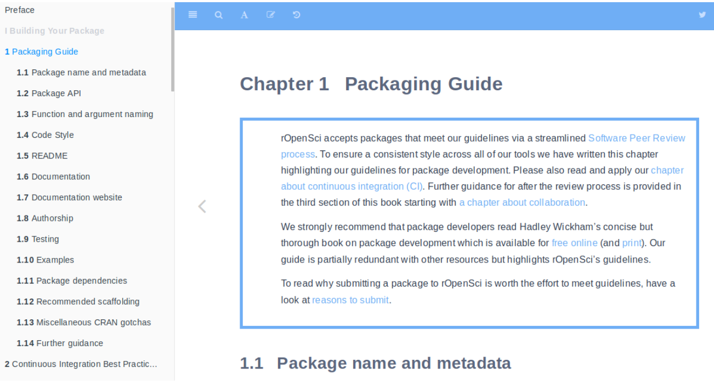

 

## Software 📦

CRAN: 
GitHub: 

### New Versions

* A new version (`v0.3.2`) of `auk` is on CRAN - eBird data extraction and processing. See the [release notes](https://github.com/CornellLabofOrnithology/auk/blob/master/NEWS.md) for changes. Checkout the [docs](http://cornelllabofornithology.github.io/auk/) to get started. {{ "auk" | image_cran }} 
* A new version (`v1.0.7`) of `helminthR` is on CRAN - Access London Natural History Museum Host-Helminth Record Database. See the [release notes](https://github.com/ropensci/helminthR/blob/master/NEWS.md) for changes. Checkout the [vignette](https://cran.r-project.org/web/packages/helminthR/vignettes/helminthR_vignette.html) to get started. {{ "helminthR" | image_cran }} {{ "helminthR" | image_github }}
> changes to `listLocations()` due to `ggmap` API key requirement; `cleanData()` changes
* A new version (`v1.0.5`) of `nasapower` is on CRAN - NASA POWER API Client. See the [release notes](https://github.com/ropensci/nasapower/blob/master/NEWS.md) for changes. Checkout the [docs](https://ropensci.github.io/nasapower/) to get started. {{ "nasapower" | image_cran }} {{ "nasapower" | image_github }}
> fixes problem with WS2M not being available through `nasapower`
* A new version (`v0.5.0`) of `lawn` is on CRAN - Client for Turf.js for geospatial analysis. See the [release notes](https://github.com/ropensci/lawn/releases/tag/v0.5.0) for changes. Checkout the [vignette](https://cran.rstudio.com/web/packages/lawn/vignettes/lawn_vignette.html) to get started. {{ "lawn" | image_cran }} {{ "lawn" | image_github }}
> fix unit tests for upcoming `V8` pkg changes
* A new version (`v0.5.0`) of `rerddap` is on CRAN - General Purpose Client for ERDDAP Servers. See the [release notes](https://github.com/ropensci/rerddap/releases/tag/v0.5.0) for changes. Checkout the [vignettes](https://cran.r-project.org/web/packages/rerddap/vignettes/) to get started. {{ "rerddap" | image_cran }} {{ "rerddap" | image_github }}
> replace httr with [crul][]; many `griddap()` fixes; set default server URL
* A new version (`v0.3.2`) of `geojson` is on CRAN - Classes for GeoJSON. See the [release notes](https://github.com/ropensci/geojson/releases/tag/v0.3.2) for changes. Checkout the [vignettes](https://cran.rstudio.com/web/packages/geojson/vignettes/) to get started. {{ "geojson" | image_cran }} {{ "geojson" | image_github }}
> `ndgeo_read()` bug fix
* A new version (`v0.2.7`) of `ropenaq` is on CRAN - Air quality data from the open data platform OpenAQ. See the [release notes](https://github.com/ropensci/ropenaq/blob/master/NEWS.md) for changes. Checkout the [vignettes](https://cran.rstudio.com/web/packages/ropenaq/vignettes/) to get started. {{ "ropenaq" | image_cran }} {{ "ropenaq" | image_github }}
> better error messages; remove not used `ggmap` dep
* A new version (`v0.9.5`) of `taxize` is on CRAN - taxonomic toolbelt for R. See the [release notes](https://github.com/ropensci/taxize/releases/tag/v0.9.5) for changes. Checkout the [taxize book](https://taxize.dev/) to get started. {{ "taxize" | image_cran }} {{ "taxize" | image_github }}
> `iucn_summary_id` defunct; downstream gains WORMS data source; `col_downstream()` gains `extant_only` param; new fxn `id2name()`; lots and lots of small changes and bug fixes
* A new version (`v0.4.1`) of `NLMR` is on CRAN - Simulating neutral landscape models. See the [release notes](https://github.com/ropensci/NLMR/blob/master/NEWS.md) for changes. Checkout the [docs](https://ropensci.github.io/NLMR/) to get started. {{ "NLMR" | image_cran }} {{ "NLMR" | image_github }}
> `nlm_neigh`, `nlm_mpd`, `nlm_randomrectangularcluster` now implemented in Rcpp; doc improvements; bug fixes
* A new version (`v0.2.2`) of `patentsview` is on CRAN - An R client to the PatentsView API. See the [release notes](https://github.com/ropensci/patentsview/releases/tag/v0.2.2) for changes. Checkout the [docs](https://ropensci.github.io/patentsview/index.html) to get started. {{ "patentsview" | image_cran }} {{ "patentsview" | image_github }}
> vignettes removed from package
* A new version (`v0.6.1`) of `rdhs` is on CRAN - Client for Demographic and Health Survey (DHS) Data. See the [release notes](https://github.com/ropensci/rdhs/blob/master/NEWS.md) for changes. Checkout the [docs](https://ropensci.github.io/rdhs/) to get started. {{ "rdhs" | image_cran }} {{ "rdhs" | image_github }}
> `extraction(add_geo=TRUE)` correction for Kenya 2014 surveys; Geospatial covariate data sets now supported correctly
* A new version (`v2.3.0`) of `RNeXML` is on CRAN - Semantically Rich I/O for the NeXML Format. See the [release notes](https://github.com/ropensci/RNeXML/releases/tag/v2.3.0) for changes. Checkout the [vignettes](https://cran.r-project.org/web/packages/RNeXML/vignettes/) to get started. {{ "RNeXML" | image_cran }} {{ "RNeXML" | image_github }}
> `add_meta()` now works w/ trees and characters; pkg handles nested meta elements properly now
* A new version (`v0.3.0`) of `natserv` is on CRAN - NatureServe R Interface. See the [release notes](https://github.com/ropensci/natserv/releases/tag/v0.3.0) for changes. Checkout the [vignette](https://cran.r-project.org/web/packages/natserv/vignettes/natserv_vignette.html) to get started. {{ "natserv" | image_cran }} {{ "natserv" | image_github }}
> new vignette; improve failure behavior; bug fixes
* A new version (`v2.6`) of `assertr` is on CRAN - Assertive Programming for R Analysis Pipelines. See the [release notes](https://github.com/ropensci/assertr/blob/master/NEWS) for changes. Checkout the [vignette](https://cran.r-project.org/web/packages/assertr/vignettes/assertr.html) to get started. {{ "assertr" | image_cran }} {{ "assertr" | image_github }}
> bug fix for `rlang` pkg changes
* A new version (`v2.0-7`) of `CoordinateCleaner` is on CRAN - automated cleaning of occurrence records from biological collections. See the [release notes](https://github.com/ropensci/CoordinateCleaner/blob/master/NEWS.md) for changes. Checkout the [docs](https://ropensci.github.io/CoordinateCleaner/) to get started. {{ "CoordinateCleaner" | image_cran }} {{ "CoordinateCleaner" | image_github }}
> add pkg citation; improved docs for `cc_outl()`
* A new version (`v1.2.0`) of `fulltext` is on CRAN - full text of scholarly articles across many data sources. See the [release notes](https://github.com/ropensci/fulltext/releases/tag/v1.2.0) for changes. Checkout the [fulltext book](https://ropensci.github.io/fulltext-book/) to get started. {{ "fulltext" | image_cran }} {{ "fulltext" | image_github }}
> `ft_get()` gains progress param; can now set cache path with `full_path` param in `cache_options_set()`; `ft_chunks`/`ft_tabularize` defunct (see [pubchunks][]); `ft_get_si` defunct (see [suppdata][]); replace httr with [crul][]

  

## Software Review ✔

We accept community contributed packages via our onboarding system - an open software review system, sorta like scholarly paper review, but way better. We'll highlight newly onboarded packages here. A huge thanks to our reviewers, who do a lot of work reviewing (see the [blog post on our review system](https://ropensci.org/blog/2016/03/28/software-review)),
and the authors of the packages!

If you want to be a reviewer fill out [this short form](https://ropensci.org/onboarding/), and we'll ping you when there's a submission that fits in your area of expertise.

 

No new submissions or approved submissions.

  

## On the blog

### Software Review

[OJ Watson](https://ropensci.org/authors/oj-watson/) wrote about his recently reviewed package [rdhs][] [Interacting with The Demographic and Health Surveys (DHS) Program data](https://ropensci.org/blog/2019/01/29/rdhs/), including the motivation for the package, what the package does, and some lessons from the process.

The rOpenSci editors wrote changes in our software review: first,  "rOpenSci onboarding" has been changed to "rOpenSci Software Review"; new editors; changes in standards; issue templates to better direct the different types of submissions; and the new bookdown book "rOpenSci Packages: Development, Maintenance, and Peer Review". Read the the post: [rOpenSci Software Peer Review: Still Improving](https://ropensci.org/blog/2019/02/01/software-review-news/).

 

rOpenSci is excited to welcome two new editors: [Announcing new software peer review editors: Melina Vidoni and Brooke Anderson](https://ropensci.org/blog/2019/01/31/more_editors/).

  

## Use Cases

The following 20 works use/cite rOpenSci software:

* Farache _et al_. used [rnaturalearth][] in their paper [The unknown followers: Discovery of a new species of Sycobia Walker (Hymenoptera: Epichrysomallinae) associated with Ficus benjamina L. (Moraceae) in the Neotropical region](https://doi.org/10.3897/jhr.67.29733) [^1]
* Shen & Spruit used [plotly][] in their paper [A Systematic Review of Open Source Clinical Software on GitHub for Improving Software Reuse in Smart Healthcare](https://www.mdpi.com/2076-3417/9/1/150/pdf) [^2]
* Łącki _et al_. used [plotly][] in their paper [masstodon: A tool for assigning peaks and modeling electron transfer reactions in top-down mass spectrometry](https://doi.org/10.1021/acs.analchem.8b01479) [^3]
* Shang & Ghriga used [plotly][] in their paper [Exploring social media analytics on community development practices](http://jitm.ubalt.edu/XXIX-4/article3.pdf) [^4]
* Duft used [crul][] and [rjsonapi][] in their dissertation [Development of a generic concept to process questionnaire result data in different statistical applications](http://dbis.eprints.uni-ulm.de/1722/1/BA_Duft_2018.pdf) [^5]
* Pettersen _et al_. used [rotl][] in their paper [Linking life-history theory and metabolic theory explains the offspring size-temperature relationship](https://doi.org/10.1111/ele.13213) [^6]
* Waltz et al used [plotly][] in their paper [Small is big in Arabidopsis mitochondrial ribosome](https://doi.org/10.1038/s41477-018-0339-y) [^7]
* Dağ used [plotly][] in their dissertation [Binary Classification via GMDH-Type Neural Network Algorithm](http://www.openaccess.hacettepe.edu.tr:8080/xmlui/handle/11655/5673) [^8]
* Hofmann _et al_. used [plotly][] in their paper [A convenient tool for bivariate data analysis and bar graph plotting with R](https://doi.org/10.1002/bmb.21205) [^9]
* Lovelace _et al_. cited [stplanr][] in their paper [stats19: A package for working with open road crash data](https://doi.org/10.21105/joss.01181) [^10]
* Zuquim _et al_. used [spocc][] in their paper [The importance of soils in predicting the future of plant habitat suitability in a tropical forest](https://doi.org/10.1007/s11104-018-03915-9) [^11]
* Kim _et al_. used [iheatmapr][] in their paper [Distinct gut virome profile of pregnant women with type 1 diabetes in the ENDIA study](https://doi.org/10.1093/ofid/ofz025) [^12]
* Lee _et al_. used [rgbif][] in their paper [REDLISTR: Tools for the IUCN Red Lists of Ecosystems and Threatened Species in R](https://doi.org/10.1111/ecog.04143) [^13]
* Krah _et al_. used [RSelenium][] in their paper [rMyCoPortal - an R package to interface with the Mycology Collections Portal](https://doi.org/10.3897/bdj.7.e31511) [^14]
* Mankevich _et al_. used [RSelenium][] in their conference paper [Why Zlatan Ibrahimović is Bigger Than Manchester United: Investigating Digital Traces in Co-branding Processes on Social Media Platforms](https://scholarspace.manoa.hawaii.edu/bitstream/10125/59710/0270.pdf) [^15]
* Muñoz _et al_. used [taxize][] in their paper [Biodiversity Observations Miner: A web application to unlock primary biodiversity data from published literature](https://doi.org/10.3897/bdj.7.e28737) [^16]
* Smith _et al_. used [taxize][] in their paper [Metabolic rates of prokaryotic microbes may inevitably rise with global warming](https://doi.org/10.1101/524264) [^17]
* Ladwig _et al_. used [rgbif][] in their paper [Extreme winter warm event causes exceptionally early bud break for many woody species](https://doi.org/10.1002/ecs2.2542) [^18]
* Pimiento _et al_. used [rfishbase][] in their paper [Evolutionary pathways toward gigantism in sharks and rays](https://doi.org/10.1111/evo.13680) [^19]
* Halsey & White used [rotl][] in their paper [Terrestrial locomotion energy costs vary considerably between species: no evidence that this is explained by rate of leg force production or ecology](https://doi.org/10.1038/s41598-018-36565-z) [^20]

  

## In The News

We're elated Halley Froehlich found [rnoaa][] to be useful.
<blockquote class="twitter-tweet" data-lang="en">
Um &#39;rnoaa&#39; package is an absolute game changer. Thanks <a href="https://twitter.com/juliesquid?ref_src=twsrc%5Etfw">@juliesquid</a> <a href="https://twitter.com/openscapes?ref_src=twsrc%5Etfw">@openscapes</a> for the intro! 🤯<a href="https://t.co/OdcwDKatd7">https://t.co/OdcwDKatd7</a>
&mdash; Halley E. Froehlich üêü (@DocFroehlich) <a href="https://twitter.com/DocFroehlich/status/1085990833571020800?ref_src=twsrc%5Etfw">January 17, 2019</a></blockquote>

 

[rcrossref][] is coming in handy for librarians 👌
<blockquote class="twitter-tweet" data-lang="en">
Life as a Research Support Manager. (Report from EPrints, get DOIs, edit them up in gVim, then feed them through rcrossref with code kindly provided by <a href="https://twitter.com/preater?ref_src=twsrc%5Etfw">@preater</a> to get desired publication metadata). <a href="https://t.co/qTmXGcwBbV">pic.twitter.com/qTmXGcwBbV</a>
&mdash; Kevin Sanders (@moananddrone) <a href="https://twitter.com/moananddrone/status/1088356700317511680?ref_src=twsrc%5Etfw">January 24, 2019</a></blockquote>

<blockquote class="twitter-tweet" data-lang="en">
<a href="https://twitter.com/hashtag/librarydirectorlife?src=hash&amp;ref_src=twsrc%5Etfw">#librarydirectorlife</a> I&#39;ve learned some new and useful things about error handling in GNU R and used rcrossref to work with the <a href="https://twitter.com/CrossrefOrg?ref_src=twsrc%5Etfw">@CrossrefOrg</a> API a bit more. One for schol comms / research support folk to check out. <a href="https://t.co/762ogGkDkC">https://t.co/762ogGkDkC</a>
&mdash; Andrew Preater (@preater) <a href="https://twitter.com/preater/status/1088428624909340678?ref_src=twsrc%5Etfw">January 24, 2019</a></blockquote>

  

## Call For Contributors

Part of the mission of rOpenSci is making sustainable software that users can rely on. Some software maintainers need to give up maintenance due to a variety of circumstances. When that happens we try to find new maintainers. We've had three recent examples of maintainer transitions within rOpenSci:

- [RSelenium][]: now maintained by [Ju Kim](https://github.com/juyeongkim)
- [chromer][]: now maintained by [Paula Andrea](https://github.com/orchid00)
- [qualtRics][]: now maintained by [Julia Silge](https://github.com/juliasilge) (since our previous newsletter!)

We've got two packages in need of a new maintainer:

- [webchem][]: The current maintainer of webchem, [Eduard Szöcs](https://github.com/EDiLD), is looking for a new maintainer. See [issue #155](https://github.com/ropensci/webchem/issues/155). Do ping Eduard in that issue and/or email us at [info@ropensci.org](mailto:info@ropensci.org)
- [rsnps][]: The current maintainer would like to hand it over to someone with more expertise in the domain. Please get in touch with [Scott](mailto:myrmecocystus@gmail.com) if you're interested.

  

## Related News

- A recent blog post [Recursion vs. Looping in Python](https://hackernoon.com/recursion-vs-looping-in-python-9261442f70a5) has a thorough overview of recursion vs. looping; it's not in R, but the principles still apply.
- In a recent podcast episode on Podcast.\_\_init\_\_, [Counteracting Code Complexity With Wily](https://www.podcastinit.com/wily-code-complexity-episode-195/) there's a nice disussion of counteracting code complexity. Again, not in R, but still useful.
- In another recent podcast episode on Podcast.\_\_init\_\_, [What You Need To Know About Open Source Licenses And Intellectual Property](https://www.pythonpodcast.com/software-licenses-for-developers-episode-196/), there's a relatively easy to understand discussion about licenses, copyright, patents, CLA's, and trademarks - relevant to any programming language community.
- [NumFOCUS](https://numfocus.org/) has partnered with [Code for Science & Society](https://codeforscience.org/) to do some qualitative research on the systemic challenges to sustainability for data driven tooling in science and scholarship. They would appreciate your participation in a short questionnaire: <https://goo.gl/forms/Qk7TJslrMHP388tq1>. Additional details about the project can be found on the [Code for Science & Society blog](https://blog.codeforscience.org/identifying-systemic-challenges-to-the-sustainability-of-data-driven-tooling/)

  

  

### Keep up with rOpenSci

* Mailing list: Sign up with an email address to get this newsletter sent to your inbox -> [ropensci.org/#subscribe](https://ropensci.org/#subscribe)
* Alternatively, you can subscribe to this newsletter via our XML feed at <https://news.ropensci.org/feed.xml> or our JSON feed at <https://news.ropensci.org/feed.json>
* rOpenSci on Twitter: [@ropensci](https://twitter.com/ropensci)
* The rOpenSci blog at [ropensci.org/blog](https://ropensci.org/blog) - you can subscribe in any RSS aggregator, or manually via <https://ropensci.org/feed.xml>. We also announce new blog posts on our Twitter account.

 

#### Footnotes

[^1]: Farache, F. H. A., Pereira, C. B., Koschnitzke, C., Barros, L. O., Souza, E. M. de C., Felício, D. T., … Pereira, R. A. S. (2018). The unknown followers: Discovery of a new species of Sycobia Walker (Hymenoptera: Epichrysomallinae) associated with Ficus benjamina L. (Moraceae) in the Neotropical region. Journal of Hymenoptera Research, 67, 85–102. <https://doi.org/10.3897/jhr.67.29733>
[^2]: Shen, Z., & Spruit, M. (2019). A Systematic Review of Open Source Clinical Software on GitHub for Improving Software Reuse in Smart Healthcare. Applied Sciences, 9(1), 150. <https://www.mdpi.com/2076-3417/9/1/150/pdf>
[^3]: Łącki, M. K., Lermyte, F., Miasojedow, B., Startek, M. P., Sobott, F., Valkenborg, D., & Gambin, A. (2019). masstodon: A tool for assigning peaks and modeling electron transfer reactions in top-down mass spectrometry. Analytical Chemistry. <https://doi.org/10.1021/acs.analchem.8b01479>
[^4]: Shang, d., & Ghriga, m. (2018). Exploring social media analytics on community development practices. Journal of Information Technology Management, 29(4), 39. <http://jitm.ubalt.edu/XXIX-4/article3.pdf>
[^5]: Duft, S. (2018). Development of a generic concept to process questionnaire result data in different statistical applications (Doctoral dissertation, Ulm University). <http://dbis.eprints.uni-ulm.de/1722/1/BA_Duft_2018.pdf>
[^6]: Pettersen, A. K., White, C. R., Bryson-Richardson, R. J., & Marshall, D. J. (2019). Linking life-history theory and metabolic theory explains the offspring size-temperature relationship. Ecology Letters. <https://doi.org/10.1111/ele.13213>
[^7]: Waltz, F., Nguyen, T.-T., Arrivé, M., Bochler, A., Chicher, J., Hammann, P., … Giegé, P. (2019). Small is big in Arabidopsis mitochondrial ribosome. Nature Plants, 5(1), 106–117. <https://doi.org/10.1038/s41477-018-0339-y>
[^8]: Dağ, O. (2018). Binary Classification via GMDH-Type Neural Network Algorithm. PhD Thesis. <http://www.openaccess.hacettepe.edu.tr:8080/xmlui/handle/11655/5673>
[^9]: Hofmann, A., Cross, M., Karow, M. A., Straub, J. H., Clemen, C. S., & Eichinger, L. (2019). A convenient tool for bivariate data analysis and bar graph plotting with R. Biochemistry and Molecular Biology Education. <https://doi.org/10.1002/bmb.21205>
[^10]: Lovelace, R., Morgan, M., Hama, L., & Padgham, M. (2019). stats19: A package for working with open road crash data. Journal of Open Source Software, 4(33), 1181. <https://doi.org/10.21105/joss.01181>
[^11]: Zuquim, G., Costa, F. R. C., Tuomisto, H., Moulatlet, G. M., & Figueiredo, F. O. G. (2019). The importance of soils in predicting the future of plant habitat suitability in a tropical forest. Plant and Soil. <https://doi.org/10.1007/s11104-018-03915-9>
[^12]: Kim, K. W., Allen, D. W., Briese, T., Couper, J. J., Barry, S. C., … Colman, P. G. (2019). Distinct gut virome profile of pregnant women with type 1 diabetes in the ENDIA study. Open Forum Infectious Diseases. <https://doi.org/10.1093/ofid/ofz025>
[^13]: Lee, C. K. F., Keith, D. A., Nicholson, E., & Murray, N. J. (2019). REDLISTR: Tools for the IUCN Red Lists of Ecosystems and Threatened Species in R. Ecography. <https://doi.org/10.1111/ecog.04143>
[^14]: Krah, F.-S., Bates, S., & Miller, A. (2019). rMyCoPortal - an R package to interface with the Mycology Collections Portal. Biodiversity Data Journal, 7. <https://doi.org/10.3897/bdj.7.e31511>
[^15]: Mankevich, V., Holmström, J., & McCarthy, I. P. (2019, January). Why Zlatan Ibrahimović is Bigger Than Manchester United: Investigating Digital Traces in Co-branding Processes on Social Media Platforms. In Proceedings of the 52nd Hawaii International Conference on System Sciences. <https://scholarspace.manoa.hawaii.edu/bitstream/10125/59710/0270.pdf>
[^16]: Muñoz, G., Kissling, W. D., & van Loon, E. E. (2019). Biodiversity Observations Miner: A web application to unlock primary biodiversity data from published literature. Biodiversity Data Journal, 7. <https://doi.org/10.3897/bdj.7.e28737>
[^17]: Smith, T. P., Thomas, T. J., Garcia-Carreras, B., Sal, S., Yvon-Durocher, G., Bell, T., & Pawar, S. (2019). Metabolic rates of prokaryotic microbes may inevitably rise with global warming. bioRxiv, 524264. <https://doi.org/10.1101/524264>
[^18]: Ladwig, L. M., Chandler, J. L., Guiden, P. W., & Henn, J. J. (2019). Extreme winter warm event causes exceptionally early bud break for many woody species. Ecosphere, 10(1), e02542. <https://doi.org/10.1002/ecs2.2542>
[^19]: Pimiento, C., Cantalapiedra, J. L., Shimada, K., Field, D. J., & Smaers, J. B. (2019). Evolutionary pathways toward gigantism in sharks and rays. Evolution. <https://doi.org/10.1111/evo.13680>
[^20]: Halsey, L. G., & White, C. R. (2019). Terrestrial locomotion energy costs vary considerably between species: no evidence that this is explained by rate of leg force production or ecology. Scientific Reports, 9(1). <https://doi.org/10.1038/s41598-018-36565-z>

[taxize]: https://github.com/ropensci/taxize
[rgbif]: https://github.com/ropensci/rgbif
[rdhs]: https://github.com/ropensci/rdhs
[RSelenium]: https://github.com/ropensci/RSelenium
[chromer]: https://github.com/ropensci/chromer
[qualtRics]: https://github.com/ropensci/qualtRics
[webchem]: https://github.com/ropensci/webchem
[rsnps]: https://github.com/ropensci/rsnps
[rnoaa]: https://github.com/ropensci/rnoaa
[rcrossref]: https://github.com/ropensci/rcrossref
[rnaturalearth]: https://github.com/ropensci/rnaturalearth
[plotly]: https://github.com/ropensci/plotly
[rjsonapi]: https://github.com/ropensci/rjsonapi
[stplanr]: https://github.com/ropensci/stplanr
[spocc]: https://github.com/ropensci/spocc
[iheatmapr]: https://github.com/ropensci/iheatmapr
[rfishbase]: https://github.com/ropensci/rfishbase
[rotl]: https://github.com/ropensci/rotl
[crul]: https://github.com/ropensci/crul
[suppdata]: https://github.com/ropensci/suppdata
[pubchunks]: https://github.com/ropensci/pubchunks

