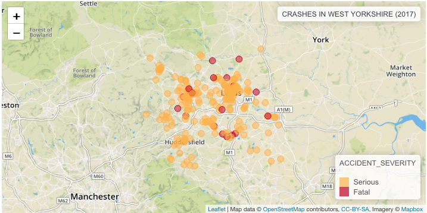
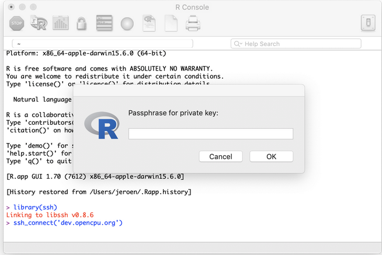
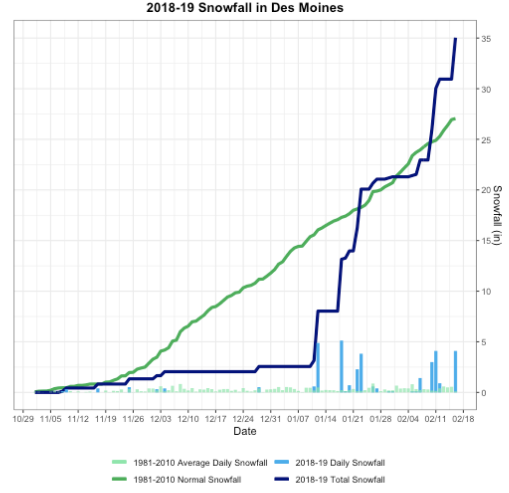

## rOpenSci Community Calls

- We’re planning a Community Call on Research Applications of rOpenSci Taxonomy and Biodiversity Tools and we want your input! What types of questions do you try to address with these tools? How do you use the tools to address your questions? Please tell us about your examples using the template in our discussion forum [UseCases category](https://discuss.ropensci.org/c/usecases).

 

## Software 📦

CRAN: 
GitHub: 

### New packages

* The first version (`v1.0`) of `qpdf` is on CRAN - Split, combine and compress PDF files. Checkout the [README](https://github.com/ropensci/qpdf/#qpdf) to get started. {{ "qpdf" | image_cran }} {{ "qpdf" | image_github }}
* The first version (`v0.1.0`) of `handlr` is on CRAN - convert among citation formats. Checkout the [README](https://github.com/ropensci/handlr/#handlr) and [rOpenSci blog post](https://ropensci.org/technotes/2019/02/27/handlr-release/) to get started. {{ "handlr" | image_cran }} {{ "handlr" | image_github }}
* The first version (`v0.4.1`) of `Rpolyhedra` is on CRAN - polyhedra database from various sources as R6 objects and visualizing capabilities. (previous versions have been on CRAN, but this is the first version as an rOpenSci package).  Checkout the [vignette](https://cran.rstudio.com/web/packages/Rpolyhedra/vignettes/Rpolyhedra.html) to get started. {{ "Rpolyhedra" | image_cran }} {{ "Rpolyhedra" | image_github }}

### New Versions

* A new version (`v3.0.1`) of `rfishbase` is on CRAN - interface to Fishbase data. See the [release notes](https://github.com/ropensci/rfishbase/blob/master/NEWS.md) for changes. Checkout the [docs](http://ropensci.github.io/rfishbase/) to get started. {{ "rfishbase" | image_cran }} {{ "rfishbase" | image_github }}
* A new version (`v2.2.1`) of `beautier` is on CRAN - create BEAST2 input files programmatically. See the [release notes](https://github.com/ropensci/beautier/releases/tag/v2.2.1) for changes. Checkout the [vignettes](https://cran.rstudio.com/web/packages/beautier/vignettes/) to get started. {{ "beautier" | image_cran }} {{ "beautier" | image_github }}
* A new version (`v0.9.6`) of `rzmq` is on CRAN - R Bindings for ZeroMQ, a lightweight messaging kernel. See the [release notes](https://github.com/ropensci/rzmq/releases/tag/v0.9.6) for changes. Checkout the [README](https://github.com/ropensci/rzmq) to get started. {{ "rzmq" | image_cran }} {{ "rzmq" | image_github }}
> allow sending of long vectors; fix some [rchk](https://www.youtube.com/watch?v=TOI7DOrW1u4) warnings
* A new version (`v2.0.1`) of `tracerer` is on CRAN - parse and analyze BEAST2 input files programmatically. See the [release notes](https://github.com/ropensci/tracerer/releases/tag/v2.0.1) for changes. Checkout the [vignettes](https://cran.rstudio.com/web/packages/tracerer/vignettes/) to get started. {{ "tracerer" | image_cran }} {{ "tracerer" | image_github }}
* A new version (`v0.6.2`) of `rdhs` is on CRAN - Client for Demographic and Health Survey (DHS) Data. See the [release notes](https://github.com/ropensci/rdhs/releases/tag/v0.6.2) for changes. Checkout the [docs](https://ropensci.github.io/rdhs/) to get started. {{ "rdhs" | image_cran }} {{ "rdhs" | image_github }}
> duplicate labels fixed; `extraction()` fix; geospatial covariate data sets now supported correctly
* A new version (`v0.4.2`) of `NLMR` is on CRAN - Simulating neutral landscape models. See the [release notes](https://github.com/ropensci/NLMR/blob/master/NEWS.md) for changes. Checkout the [docs](https://ropensci.github.io/NLMR/) to get started. {{ "NLMR" | image_cran }} {{ "NLMR" | image_github }}
* A new version (`v1.20`) of `rtika` is on CRAN - R Interface to Apache Tika. See the [release notes](https://github.com/ropensci/rtika/blob/master/NEWS.md) for changes. Checkout the [docs](https://ropensci.github.io/rtika/) to get started. {{ "rtika" | image_cran }} {{ "rtika" | image_github }}
> updated Tika to 1.2; includes config files for OCR; workaround for `normalizePath` on Windows
* A new version (`v0.6.0`) of `paleobioDB` is on CRAN - download and process data from the Paleobiology database. See the [release notes](https://github.com/ropensci/paleobioDB/blob/master/NEWS.md) for changes. Checkout the [README](https://github.com/ropensci/paleobioDB#paleobiodb) to get started. {{ "paleobioDB" | image_cran }} {{ "paleobioDB" | image_github }}
> improve error reportign in `pbdb_temp_range()`; fix error in `pbdb_occurrences()`
* A new version (`v1.2.0`) of `rgbif` is on CRAN - interface to the [Global Biodiversity Information Facility](https://www.gbif.org/) API. See the [release notes](https://github.com/ropensci/rgbif/releases/tag/v1.2.0) for changes. Checkout the [occurrence manual](https://ropensci.github.io/occurrence-manual/) to get started. {{ "rgbif" | image_cran }} {{ "rgbif" | image_github }}
> `elevation()` fxn now uses Geonames; `occ_data`/`occ_search` column ordering changes; more WKT documentation; bug fixes
* A new version (`v0.5.0`) of `landscapetools` is on CRAN - Landscape Utility Toolbox. See the [release notes](https://github.com/ropensci/landscapetools/blob/master/NEWS.md) for changes. Checkout the [docs](https://ropensci.github.io/landscapetools/) to get started. {{ "landscapetools" | image_cran }} {{ "landscapetools" | image_github }}
> new interface for `util_classify`; removed `util_import_roboto`/`util_plot_grey`; new function `util_writeESRI`
* A new version (`v1.0.5`) of `skimr` is on CRAN - compact and flexible summaries of data. See the [release notes](https://github.com/ropensci/skimr/blob/master/NEWS.md) for changes. Checkout the [vignettes](https://cran.rstudio.com/web/packages/skimr/vignettes/) to get started. {{ "skimr" | image_cran }} {{ "skimr" | image_github }}
> fix mulitbyte characters issue; fix problem where purrr cannot find mean.default
* A new version (`v0.9.6`) of `taxize` is on CRAN - taxonomic toolbelt for R. See the [release notes](https://github.com/ropensci/taxize/releases/tag/v0.9.6) for changes. Checkout the [taxize book](https://taxize.dev/) to get started. {{ "taxize" | image_cran }} {{ "taxize" | image_github }}
> new data source Kew POW; user agent string with all requests; `get_colid` now paginates autom.; most `get_*` now try direct match; new vignette; ...
* A new version (`v0.999`) of `geonames` is on CRAN - interface to the Geonames spatial query web service. See the [release notes](https://github.com/ropensci/geonames/releases/tag/v0.999) for changes. Checkout the [tests](https://github.com/ropensci/geonames/blob/master/inst/tests/testing.R) to get started. {{ "geonames" | image_cran }} {{ "geonames" | image_github }}
> base URL changed; set hostname on load instead of attach
* A new version (`v0.4`) of `ssh` is on CRAN - Secure shell (SSH) client for R. See the [release notes](https://github.com/ropensci/ssh/releases/tag/v0.4) for changes. Checkout the [vignette](https://cran.rstudio.com/web/packages/ssh/vignettes/intro.html) to get started. {{ "ssh" | image_cran }} {{ "ssh" | image_github }}
> fix for security problem; Windows/Mac: update libssh 0.8.6; use askpass pkg

  

## Software Review ✔

We accept community contributed packages via our onboarding system - an open software review system, sorta like scholarly paper review, but way better. We'll highlight newly onboarded packages here. A huge thanks to our reviewers, who do a lot of work reviewing (see the [blog post on our review system](https://ropensci.org/blog/2016/03/28/software-review)),
and the authors of the packages!

If you want to be a reviewer fill out [this short form](https://ropensci.org/onboarding/), and we'll ping you when there's a submission that fits in your area of expertise.

The following two packages recently went through our onboarding process and have been approved:

* [tacmagic][] > PET (positron emission tomography) Analysis in R
    * Author: [Eric Brown](https://github.com/eebrown)
    * Issue: [ropensci/onboarding#280](https://github.com/ropensci/onboarding/issues/280)
    * Reviewers:
        * [Jon Clayden](https://github.com/jonclayden)
        * [Brandon Hurr](https://github.com/bhive01)
* [virtuoso][] > R interface to Virtuoso using ODBC
    * Author: [Carl Boettiger](https://github.com/cboettig)
    * Issue: [ropensci/onboarding#271](https://github.com/ropensci/onboarding/issues/271)
     * Reviewers:
        * [Edgar Ruiz](https://github.com/edgararuiz)
        * [Ildikó Czeller](https://github.com/czeildi)

The following two packagess were recently submitted:

* [cde][] > Download Water Framework Directive (WFD) data from the Environment Agency Catchment Data Explorer (CDE) website
    * Author: [Rob Briers](https://github.com/robbriers)
    * Issue: [ropensci/onboarding#284](https://github.com/ropensci/onboarding/issues/284)
    * Reviewers: not yet assigned
* [rromeo][] > An R Client for SHERPA/RoMEO API
    * Author: [Matthias Grenié](https://github.com/Rekyt)
    * Issue: [ropensci/onboarding#285](https://github.com/ropensci/onboarding/issues/285)
    * Reviewers: not yet assigned

  

## On the blog

### Software Review

[Layik Hama](https://ropensci.org/authors/layik-hama/) and [Robin Lovelace](https://ropensci.org/authors/robin-lovelace/) wrote a summary of their recently onboarded package [stats19][]: [stats19: a package for road safety research](https://ropensci.org/blog/2019/02/26/stats19/). In it, they describe the motivation for the package and go through a detailed run through of using the package.

### Tech notes

[Jeroen Ooms][jeroen] wrote about a [Bugfix release for the ssh package](https://ropensci.org/technotes/2019/02/22/ssh-04/) in his recent rOpenSci tech note. The [ssh][] package is a secure shell (SSH) client for R.

 

[Scott Chamberlain](https://ropensci.org/authors/scott-chamberlain/) wrote about a [handlr: convert among citation formats](https://ropensci.org/technotes/2019/02/27/handlr-release/) in his recent rOpenSci tech note. The [handlr][] package is a new package providing conversions among many different citation formats.

  

## Use Cases

The following 14 works use/cite rOpenSci software:

* Joish et al. used [plotly][] in their paper [Serotonin levels and 1-year mortality in patients with neuroendocrine tumors: a systematic review and meta-analysis](https://doi.org/10.2217/fon-2018-0960) [^1]
* Wheeler et al. used [plotly][] in their paper [Evidence of a trans-kingdom plant disease complex between a fungus and plant-parasitic nematodes](https://doi.org/10.1371/journal.pone.0211508) [^2]
* Liu et al. used [hunspell][] in their paper [Does the Asset Pricing Premium Reflect Asymmetric or IncompleteInformation?](https://researchrepository.wvu.edu/econ_working-papers/5) [^3]
* Maljkovic used [packagemetrics][] in their work [Modelling Influential Factors of Consumption in Buildings Connected to District Heating Systems](https://doi.org/10.3390/en12040586) [^4]
* Särkiö used [tokenizers][] in their thesis [Topic modelling of Finnish Internet discussion forums as a tool for trend](http://sal.aalto.fi/publications/pdf-files/tsar19_public.pdf) [^5]
* Mittermeier et al. used [rgbif][] and [rebird][] in their paper [A season for all things: Phenological imprints in Wikipedia usage and their relevance toconservation](https://research.birmingham.ac.uk/portal/files/58082037/pbio.3000146_1.pdf) [^6]
* Webber & Vander Wal used [spatsoc][] in their paper [Trends and perspectives on the use of animal social network analysis in behavioural ecology: a bibliometric approach](https://doi.org/10.1016/j.anbehav.2019.01.010) [^7]
* Daru et al. used [rgbif][] in their paper [Spatial overlaps between the global protected areas network and terrestrial hotspots of evolutionary diversity](https://doi.org/10.1111/geb.12888) [^8]
* Aiello et al. used [plotly][] in their paper [Deep brain stimulation of the subthalamic nucleus and the temporal discounting of primary and secondary rewards](https://doi.org/10.1007/s00415-019-09240-0) [^9]
* Ohmer et al. used [rotl][] in their paper [Phylogenetic investigation of skin sloughing rates in frogs: relationships with skin characteristics and disease-driven declines](https://doi.org/10.1098/rspb.2018.2378) [^10]
* Srivastava et al. used [taxize][] in their paper [Patterns of microsatellite distribution across eukaryotic genomes](https://doi.org/10.1186/s12864-019-5516-5) [^11]
* Dillen et al. used [rgbif][] in their paper [A benchmark dataset of herbarium specimen images with label data](https://10.3897/bdj.7.e31817) [^12]
* Thomsen & Sigsgaard used [taxize][] in their paper [Environmental DNA metabarcoding of wild flowers reveals diverse communities of terrestrial arthropods](https://doi.org/10.1002/ece3.4809) [^13]
* Fitzpatrick & Dunn used [rnoaa][] in their paper [Contemporary climatic analogs for 540 North American urban areas in the late 21st century](https://doi.org/10.1038/s41467-019-08540-3) [^14]

  

## In The News

[Maëlle Salmon](https://ropensci.org/authors/ma%C3%ABlle-salmon/) wrote a blog post on [How did Axios rectangle Trump's PDF schedule? A try with R](https://masalmon.eu/2019/02/11/trump-schedule/) - using our packages [pdftools][] and [magick][] (maintained by [Jeroen Ooms][jeroen]) to extract text out of PDFs.

 

[Daniel Nüst](https://twitter.com/nordholmen) wrote about [How to increase reproducibility and transparency in your research](https://o2r.info/2019/02/04/write-reproducible-manuscripts-for-copernicus-publications-journals/) using our package [suppdata][] maintained by [Will Pearse](https://github.com/willpearse).

 

[lopierra](https://twitter.com/lopierra) made a Shiny app using our package [tabulizer][]
<blockquote class="twitter-tweet" data-cards="hidden" data-lang="en">
Made a simple Shiny app (<a href="https://t.co/qmjCYXe8fI">https://t.co/qmjCYXe8fI</a>) to decide what veg to plant based on soil temp. Learned to use supercool {tabulizer} package (<a href="https://t.co/KA2Xjjsul7">https://t.co/KA2Xjjsul7</a>) to extract tables from PDFs, and how to deploy on <a href="https://t.co/yjSMYtJyaf">https://t.co/yjSMYtJyaf</a>! <a href="https://twitter.com/hashtag/rstats?src=hash&amp;ref_src=twsrc%5Etfw">#rstats</a> 🍅🥕🥬
&mdash; lopierra (@lopierra) <a href="https://twitter.com/lopierra/status/1097591929473122304?ref_src=twsrc%5Etfw">February 18, 2019</a></blockquote>

 

[Sam Tyner](https://sctyner.github.io/) wrote a blog post on [Reconstructing a plot from the National Weather Service](https://sctyner.github.io/redoing-graphs.html) - in which she used our package [rnoaa][] to get NOAA climate data.

  

## Call For Contributors

Part of the mission of rOpenSci is making sustainable software that users can rely on. Some software maintainers need to give up maintenance due to a variety of circumstances. When that happens we try to find new maintainers. We've had three recent examples of maintainer transitions within rOpenSci:

- [RSelenium][]: now maintained by [Ju Kim](https://github.com/juyeongkim)
- [chromer][]: now maintained by [Paula Andrea](https://github.com/orchid00)
- [qualtRics][]: now maintained by [Julia Silge](https://github.com/juliasilge)

We've got three packages in need of new maintainers:

- [webchem][]: The current maintainer of webchem, [Eduard Szöcs](https://github.com/EDiLD), is looking for a new maintainer. See [issue #155](https://github.com/ropensci/webchem/issues/155). Do ping Eduard in that issue and/or email us at [info@ropensci.org](mailto:info@ropensci.org)
- [rsnps][]: The current maintainer would like to hand it over to someone with more expertise in the domain. Please get in touch with [Scott](mailto:myrmecocystus@gmail.com) if you're interested.
- [rdpla][]: The current maintainer would like to hand it over to someone with more expertise in the domain. Please get in touch with [Scott](mailto:myrmecocystus@gmail.com) if you're interested.

  

  

### Keep up with rOpenSci

* Mailing list: Sign up with an email address to get this newsletter sent to your inbox -> [ropensci.org/#subscribe](https://ropensci.org/#subscribe)
* Alternatively, you can subscribe to this newsletter via our XML feed at <https://news.ropensci.org/feed.xml> or our JSON feed at <https://news.ropensci.org/feed.json>
* rOpenSci on Twitter: [@ropensci](https://twitter.com/ropensci)
* The rOpenSci blog at [ropensci.org/blog](https://ropensci.org/blog) - you can subscribe in any RSS aggregator, or manually via <https://ropensci.org/feed.xml>. We also announce new blog posts on our Twitter account.

 

#### Footnotes

[^1]: Joish, V. N., Shah, S., Tierce, J. C., Patel, D., McKee, C., Lapuerta, P., & Zacks, J. (2019). Serotonin levels and 1-year mortality in patients with neuroendocrine tumors: a systematic review and meta-analysis. Future Oncology <https://doi.org/10.2217/fon-2018-0960>
[^2]: Wheeler, D. L., Scott, J., Dung, J. K. S., & Johnson, D. A. (2019). Evidence of a trans-kingdom plant disease complex between a fungus and plant-parasitic nematodes. PLOS ONE, 14(2), e0211508. <https://doi.org/10.1371/journal.pone.0211508>
[^3]: Liu, Crocker H., Nowak, Adam, and Smith, Patrick S. 2018. Does the Asset Pricing Premium Reflect Asymmetric or IncompleteInformation?. Economics Faculty Working Papers Series. 5. <https://researchrepository.wvu.edu/econ_working-papers/5>
[^4]: Maljkovic, D. (2019). Modelling Influential Factors of Consumption in Buildings Connected to District Heating Systems. Energies, 12(4), 586. <https://doi.org/10.3390/en12040586>
[^5]: Särkiö, I. (2019). Topic modelling of Finnish Internet discussion forums as a tool for trend. M.Sc. Thesis. <http://sal.aalto.fi/publications/pdf-files/tsar19_public.pdf>
[^6]: Mittermeier, T. et al. 2019. A season for all things: Phenological imprints in Wikipedia usage and their relevance toconservation. PLoS Biology <https://research.birmingham.ac.uk/portal/files/58082037/pbio.3000146_1.pdf>
[^7]: Webber, Q. M. R., & Vander Wal, E. (2019). Trends and perspectives on the use of animal social network analysis in behavioural ecology: a bibliometric approach. Animal Behaviour, 149, 77–87. <https://doi.org/10.1016/j.anbehav.2019.01.010>
[^8]: Daru, B. H., le Roux, P. C., Gopalraj, J., Park, D. S., Holt, B. G., & Greve, M. (2019). Spatial overlaps between the global protected areas network and terrestrial hotspots of evolutionary diversity. Global Ecology and Biogeography. <https://doi.org/10.1111/geb.12888>
[^9]: Aiello, M., Terenzi, D., Furlanis, G., Catalan, M., Manganotti, P., Eleopra, R., … Rumiati, R. I. (2019). Deep brain stimulation of the subthalamic nucleus and the temporal discounting of primary and secondary rewards. Journal of Neurology. <https://doi.org/10.1007/s00415-019-09240-0>
[^10]: Ohmer, M. E. B., Cramp, R. L., White, C. R., Harlow, P. S., McFadden, M. S., Merino-Viteri, A., … Franklin, C. E. (2019). Phylogenetic investigation of skin sloughing rates in frogs: relationships with skin characteristics and disease-driven declines. Proceedings of the Royal Society B: Biological Sciences, 286(1896), 20182378. <https://doi.org/10.1098/rspb.2018.2378>
[^11]: Srivastava, S., Avvaru, A. K., Sowpati, D. T., & Mishra, R. K. (2019). Patterns of microsatellite distribution across eukaryotic genomes. BMC Genomics, 20(1). <https://doi.org/10.1186/s12864-019-5516-5>
[^12]: Dillen, M., Groom, Q., Chagnoux, S., Güntsch, A., Hardisty, A., Haston, E., … Phillips, S. (2019). A benchmark dataset of herbarium specimen images with label data. Biodiversity Data Journal, 7. <https://10.3897/bdj.7.e31817>
[^13]: Thomsen, P. F., & Sigsgaard, E. E. (2019). Environmental DNA metabarcoding of wild flowers reveals diverse communities of terrestrial arthropods. Ecology and Evolution. <https://doi.org/10.1002/ece3.4809>
[^14]: Fitzpatrick, M. C., & Dunn, R. R. (2019). Contemporary climatic analogs for 540 North American urban areas in the late 21st century. Nature Communications, 10(1). <https://doi.org/10.1038/s41467-019-08540-3> 

[taxize]: https://github.com/ropensci/taxize
[ssh]: https://github.com/ropensci/ssh
[stats19]: https://github.com/ropensci/stats19
[handlr]: https://github.com/ropensci/handlr
[RSelenium]: https://github.com/ropensci/RSelenium
[chromer]: https://github.com/ropensci/chromer
[qualtRics]: https://github.com/ropensci/qualtRics
[webchem]: https://github.com/ropensci/webchem
[rsnps]: https://github.com/ropensci/rsnps
[rdpla]: https://github.com/ropensci/rdpla
[tacmagic]: https://github.com/ropensci/tacmagic
[virtuoso]: https://github.com/ropensci/virtuoso
[cde]: https://github.com/robbriers/cde
[rromeo]: https://github.com/Rekyt/rromeo
[jeroen]: https://ropensci.org/authors/jeroen-ooms/
[suppdata]: https://github.com/ropensci/suppdata
[magick]: https://github.com/ropensci/magick
[pdftools]: https://github.com/ropensci/pdftools
[tabulizer]: https://github.com/ropensci/tabulizer
[rnoaa]: https://github.com/ropensci/rnoaa
[plotly]: https://github.com/ropensci/plotly
[hunspell]: https://github.com/ropensci/hunspell
[packagemetrics]: https://github.com/ropensci/packagemetrics
[tokenizers]: https://github.com/ropensci/tokenizers
[rgbif]: https://github.com/ropensci/rgbif
[rotl]: https://github.com/ropensci/rotl
[spatsoc]: https://github.com/ropensci/spatsoc
[rebird]: https://github.com/ropensci/rebird
