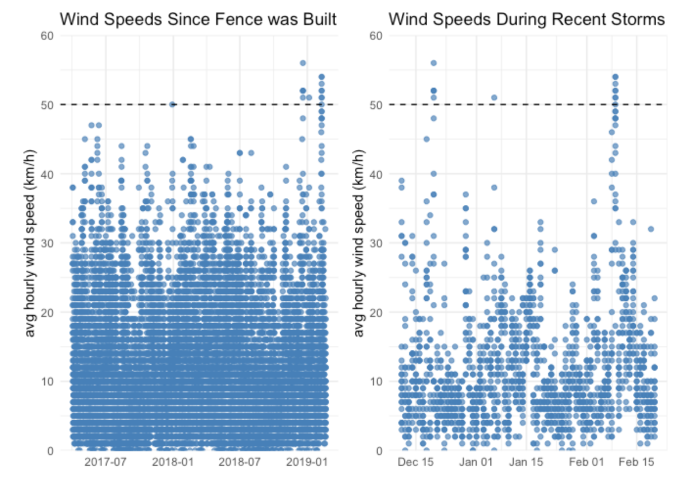

## rOpenSci HQ

- Our next Community Call on Research Applications of rOpenSci Taxonomy and Biodiversity Tools is coming up next week! See our [recent blog post](https://ropensci.org/blog/2019/03/11/commcall-mar2019/) for all the details.
- We’re planning a Community Call on Security for R with Ildi Czeller & Bob Rudis. Create Your Own Security Adventure by [telling us what you want to know about the topic](https://discuss.ropensci.org/t/community-call-security-for-r-create-your-own-security-adventure/1612).
- Our citations Twitter bot [@rocitations](https://twitter.com/rocitations) ([src code](https://github.com/ropenscilabs/rocites)) tweets new citations of rOpenSci software. You can now contribute citations. Citations live on GitHub at [ropenscilabs/ropensci_citations](https://github.com/ropenscilabs/ropensci_citations). Here's an example pull request demonstrating how it's done: <https://github.com/ropenscilabs/ropensci_citations/pull/1>. If you just want to look at the citations, peruse [the tsv file](https://github.com/ropenscilabs/ropensci_citations/blob/master/citations.tsv).

 

## Software 📦

CRAN: 
GitHub: 

### New packages

* The first version (`v0.2.0`) of `emld` is on CRAN - ecological metadata as linked data. The package recently went through rOpenSci software review, check out [the review](https://github.com/ropensci/software-review/issues/269). Checkout the [vignette](https://cran.r-project.org/web/packages/emld/vignettes/tutorial.html) to get started. {{ "emld" | image_cran }} {{ "emld" | image_github }}
* The first version (`v0.2.1`) of `tacmagic` is on CRAN - positron emission tomography time-activity curve analysis. The package recently went through rOpenSci software review, check out [the review](https://github.com/ropensci/software-review/issues/280). Checkout the [vignette](https://cran.rstudio.com/web/packages/tacmagic/vignettes/walkthrough.html) to get started. {{ "tacmagic" | image_cran }} {{ "tacmagic" | image_github }}

### New Versions

* A new version (`v0.25.1`) of `git2r` is on CRAN - an interface to the libgit2 library, a pure C implementation of the Git core methods. See the [release notes](https://github.com/ropensci/git2r/blob/master/NEWS) for changes. Checkout the [README](https://github.com/ropensci/git2r#introduction) to get started. {{ "git2r" | image_cran }} {{ "git2r" | image_github }}
> fixed significant warning from 'R CMD check'
* A new version (`v0.4.8`) of `iheatmapr` is on CRAN - Interactive and complex heatmaps. See the [release notes](https://github.com/ropensci/iheatmapr/blob/master/NEWS.md) for changes. Checkout the [docs](https://ropensci.github.io/iheatmapr/) to get started. {{ "iheatmapr" | image_cran }} {{ "iheatmapr" | image_github }}
> fix for sample; fixes for `add_col_groups`, `iheatmapr_event`, `show_colorbar`, `save_iheatmap`
* A new version (`v0.15.6`) of `DataPackageR` is on CRAN - construct reproducible analytic data sets as R packages. See the [release notes](https://github.com/ropensci/DataPackageR/releases/tag/v0.15.6) for changes. Checkout the [vignettes](https://cran.rstudio.com/web/packages/DataPackageR/vignettes/) to get started. {{ "DataPackageR" | image_cran }} {{ "DataPackageR" | image_github }}
> fixes for writing to users dir; fixes to `update_news()`
* A new version (`v0.1.7`) of `codemetar` is on CRAN - Generate codemeta metadata for R packages. See the [release notes](https://github.com/ropensci/codemetar/blob/master/NEWS.md) for changes. Checkout the [docs](https://ropensci.github.io/codemetar/) to get started. {{ "codemetar" | image_cran }} {{ "codemetar" | image_github }}
> `jsonld` to Suggests; `write_codemeta()` gains new arg. `use_githook`; `create_codemeta()` & `write_codemeta()` gain new arg. `use_filesize`
* A new version (`v3.0.3`) of `rfishbase` is on CRAN - interface to Fishbase data. See the [release notes](https://github.com/ropensci/rfishbase/blob/master/NEWS.md) for changes. Checkout the [docs](http://ropensci.github.io/rfishbase/) to get started. {{ "rfishbase" | image_cran }} {{ "rfishbase" | image_github }}
> fix bug in sealifebase name resolution
* A new version (`v2.1`) of `spelling` is on CRAN - tools for spell checking. See the [release notes](https://github.com/ropensci/spelling/releases/tag/v2.1) for changes. Checkout the [README](https://github.com/ropensci/spelling#spelling) to get started. {{ "spelling" | image_cran }} {{ "spelling" | image_github }}
> pre-filter script/style/img tags when checking html files; treat input files in `spell_check_files()` as UTF-8 on all platforms; fix sorting bug in `spell_check_files()`
* A new version (`v7.0.0`) of `drake` is on CRAN - a pipeline toolkit for reproducible computation at scale. See the [release notes](https://github.com/ropensci/drake/releases/tag/v7.0.0) for changes. Checkout the [docs](https://ropensci.github.io/drake/) to get started. {{ "drake" | image_cran }} {{ "drake" | image_github }}
> many breaking changes; some bug fixes; new features including DSL for generating large plans; many enhancements including a large speed boost
* A new version (`v2.2`) of `pdftools` is on CRAN - Text extraction, rendering and converting of PDF documents. See the [release notes](https://github.com/ropensci/pdftools/releases/tag/v2.2) for changes. Checkout the [README](https://github.com/ropensci/pdftools#pdftools) to get started. {{ "pdftools" | image_cran }} {{ "pdftools" | image_github }}
> import new qpdf pkg; document new PPA for Ubuntu 16.04 and 18.04 with poppler 0.74
* A new version (`v1.3.8`) of `MODIStsp` is on CRAN - Automate Download and Preprocessing of MODIS Land Products Data. See the [release notes](https://github.com/ropensci/MODIStsp/releases/tag/v1.3.8) for changes. Checkout the [docs](http://ropensci.github.io/MODIStsp/) to get started. {{ "MODIStsp" | image_cran }} {{ "MODIStsp" | image_github }}
> fix for incorrect application of scale/offset values on GDAL verions > 2.3; added support for more MODIS products
* A new version (`v0.2.1`) of `fingertipsR` is on CRAN - Fingertips data for public health <http://fingertips.phe.org.uk/>. See the [release notes](https://github.com/ropensci/fingertipsR/releases/tag/v0.2.1) for changes. Checkout the [vignettes](https://cran.rstudio.com/web/packages/fingertipsR/vignettes/) to get started. {{ "fingertipsR" | image_cran }} {{ "fingertipsR" | image_github }}
> change in `deprivation_decile()`; bug fix for `fingertips_data()`
* A new version (`v1.1`) of `qpdf` is on CRAN - Split, combine and compress PDF files. See the [release notes](https://github.com/ropensci/qpdf/blob/master/NEWS) for changes. Checkout the [README](https://github.com/ropensci/qpdf/#qpdf) to get started. {{ "qpdf" | image_cran }} {{ "qpdf" | image_github }}
> add configure script to allow building with system libqpdf; fix solaris build

### Archived

* The `rdefra` has been archived on CRAN - we're hoping to get it back on CRAN soon. {{ "rdefra" | image_cran }} {{ "rdefra" | image_github }}

  

## Software Review ✔

We accept community contributed packages via our onboarding system - an open software review system, sorta like scholarly paper review, but way better. We'll highlight newly onboarded packages here. A huge thanks to our reviewers, who do a lot of work reviewing (see the [blog post on our review system](https://ropensci.org/blog/2016/03/28/software-review)),
and the authors of the packages!

If you want to be a reviewer fill out [this short form](https://ropensci.org/onboarding/), and we'll ping you when there's a submission that fits in your area of expertise.

The following two packagess were recently submitted:

* [MtreeRing][] > A Shiny Application for Automatic Measurements of Tree-Ring Widths on Digital Images
    * Author: [Jingning Shi](https://github.com/JingningShi)
    * Issue: [ropensci/onboarding#287](https://github.com/ropensci/onboarding/issues/287)
    * Reviewers: not yet assigned
* [grainchanger][] > Moving-Window and Direct Data Aggregation
    * Author: [Laura Jane Graham](https://github.com/laurajanegraham)
    * Issue: [ropensci/onboarding#289](https://github.com/ropensci/onboarding/issues/289)
    * Reviewers: not yet assigned

  

## On the blog

### Community calls

[Stefanie Butland](https://ropensci.org/authors/layik-hama/) wrote about our upcoming community call: [Community Call - Research Applications of rOpenSci Taxonomy and Biodiversity Tools](https://ropensci.org/blog/2019/03/11/commcall-mar2019/).

### Tech notes

[Will Landau](https://ropensci.org/authors/will-landau/) wrote about a new version (`v7`) of [drake][] in a tech note [drake transformed](https://ropensci.org/technotes/2019/03/18/drake-700/). [drake][] is an R-focused pipeline toolkit for reproducibility and high-performance computing.

  

## Use Cases

The following eight works use/cite rOpenSci software:

* Karger et al. used [CoordinateCleaner][] in their article [Why tree lines are lower on islands-Climatic and biogeographic effects hold the answer](https://doi.org/10.1111/geb.12897) [^1]
* Olsson-Collentine et al. used [rcrossref][] in their paper [The Prevalence of Marginally Significant Results in Psychology Over Time](https://doi.org/10.1177/0956797619830326) [^2]
* Poulin et al. used [rentrez][] in their paper on [Taxonomic and geographic bias in the genetic study of helminth parasites](https://doi.org/10.1016/j.ijpara.2018.12.005) [^3]
* Piñar et al. used [rgbif][] in their article [A time travel story: metagenomic analyses decipher the unknown geographical shift and the storage history of possibly smuggled antique marble statues](https://doi.org/10.1007/s13213-019-1446-3) [^4]
* Dreyer et al. used [rgbif][] in their article [Ligustrum lucidum W. T. Aiton (broad-leaf privet) demonstrates climatic niche shifts during global-scale invasion](https://doi.org/10.1038/s41598-019-40531-8) [^5]
* Ludt et al. used [rgbif][] in their paper [Genomic, ecological, and morphological approaches to investigating species limits: A case study in modern taxonomy from Tropical Eastern Pacific surgeonfishes](https://doi.org/10.1002/ece3.5029) [^6]
* Peruffo used [skimr][] in their thesis on [Improving predictive maintenance classifiers of industrial sensors’ data using entropy. A case study](http://trap.ncirl.ie/3429/1/eleonoraperuffo.pdf) [^7]
* Free et al. used [rfishbase][] in their paper [Impacts of historical warming on marine fisheries production](https://doi.org/10.1126/science.aau1758) [^8]

  

## In The News

We've introduced a template in our **UseCases** category in our discussion forum to make it easy to share how folks are using rOpenSci tools. Check out a recent one by Sharla Gelfand [#visdat, #skimr, and #assertr use case: Exploring and understanding a new data set](https://discuss.ropensci.org/t/visdat-skimr-and-assertr-use-case-exploring-and-understanding-a-new-data-set/1620) to find top 5 causes for delays on the TTC subway and SRT in 2018.

 

[Stephanie Hazlitt](https://github.com/stephhazlitt) wrote [a blog post](https://github.com/stephhazlitt/some-assembly-required/blob/master/R/fence/fence.md) using the rOpenSci package [weathercan][] triggered by her fence being blown over!

 

[Guangchuang Yu](https://github.com/GuangchuangYu/) is writing a bookdown book wrote _Data Integration, Manipulation and Visualization of Phylogenetic Trees_, in which he includes a section of a chapter on the rOpenSci package [treeio](https://yulab-smu.github.io/treedata-book/chapter1.html#getting-tree-data-with-treeio)

  

## Call For Contributors

Part of the mission of rOpenSci is making sustainable software that users can rely on. Some software maintainers need to give up maintenance due to a variety of circumstances. When that happens we try to find new maintainers. We've had three recent examples of maintainer transitions within rOpenSci:

- [RSelenium][]: now maintained by [Ju Kim](https://github.com/juyeongkim)
- [chromer][]: now maintained by [Paula Andrea](https://github.com/orchid00)
- [qualtRics][]: now maintained by [Julia Silge](https://github.com/juliasilge)

We've got three packages in need of new maintainers:

- [webchem][]: The current maintainer of webchem, [Eduard Szöcs](https://github.com/EDiLD), is looking for a new maintainer. See [issue #155](https://github.com/ropensci/webchem/issues/155). Do ping Eduard in that issue and/or email us at [info@ropensci.org](mailto:info@ropensci.org)
- [rsnps][]: The current maintainer would like to hand it over to someone with more expertise in the domain. Please get in touch with [Scott](mailto:myrmecocystus@gmail.com) if you're interested.
- [rdpla][]: The current maintainer would like to hand it over to someone with more expertise in the domain. Please get in touch with [Scott](mailto:myrmecocystus@gmail.com) if you're interested.

  

  

### Keep up with rOpenSci

* Mailing list: Sign up with an email address to get this newsletter sent to your inbox -> [ropensci.org/#subscribe](https://ropensci.org/#subscribe)
* Alternatively, you can subscribe to this newsletter via our XML feed at <https://news.ropensci.org/feed.xml> or our JSON feed at <https://news.ropensci.org/feed.json>
* rOpenSci on Twitter: [@ropensci](https://twitter.com/ropensci)
* The rOpenSci blog at [ropensci.org/blog](https://ropensci.org/blog) - you can subscribe in any RSS aggregator, or manually via <https://ropensci.org/feed.xml>. We also announce new blog posts on our Twitter account.

 

#### Footnotes

[^1]: Karger, D. N., Kessler, M., Conrad, O., Weigelt, P., Kreft, H., König, C., & Zimmermann, N. E. (2019). Why tree lines are lower on islands-Climatic and biogeographic effects hold the answer. Global Ecology and Biogeography. <https://doi.org/10.1111/geb.12897>
[^2]: Olsson-Collentine, A., van Assen, M. A. L. M., & Hartgerink, C. H. J. (2019). The Prevalence of Marginally Significant Results in Psychology Over Time. Psychological Science, 095679761983032. <https://doi.org/10.1177/0956797619830326>
[^3]: Poulin, R., Hay, E., & Jorge, F. (2019). Taxonomic and geographic bias in the genetic study of helminth parasites. International Journal for Parasitology. <https://doi.org/10.1016/j.ijpara.2018.12.005>
[^4]: Piñar, G., Poyntner, C., Tafer, H., & Sterflinger, K. (2019). A time travel story: metagenomic analyses decipher the unknown geographical shift and the storage history of possibly smuggled antique marble statues. Annals of Microbiology. <https://doi.org/10.1007/s13213-019-1446-3>
[^5]: Dreyer, J. B. B., Higuchi, P., & Silva, A. C. (2019). Ligustrum lucidum W. T. Aiton (broad-leaf privet) demonstrates climatic niche shifts during global-scale invasion. Scientific Reports, 9(1). <https://doi.org/10.1038/s41598-019-40531-8>
[^6]: Ludt, W. B., Bernal, M. A., Kenworthy, E., Salas, E., & Chakrabarty, P. (2019). Genomic, ecological, and morphological approaches to investigating species limits: A case study in modern taxonomy from Tropical Eastern Pacific surgeonfishes. Ecology and Evolution. <https://doi.org/10.1002/ece3.5029>
[^7]: Peruffo, E. Improving predictive maintenance classifiers of industrial sensors’ data using entropy. A case study. <http://trap.ncirl.ie/3429/1/eleonoraperuffo.pdf>
[^8]: Free, C. M., Thorson, J. T., Pinsky, M. L., Oken, K. L., Wiedenmann, J., & Jensen, O. P. (2019). Impacts of historical warming on marine fisheries production. Science, 363(6430), 979–983. <https://doi.org/10.1126/science.aau1758>

[taxize]: https://github.com/ropensci/taxize
[ssh]: https://github.com/ropensci/ssh
[stats19]: https://github.com/ropensci/stats19
[handlr]: https://github.com/ropensci/handlr
[RSelenium]: https://github.com/ropensci/RSelenium
[chromer]: https://github.com/ropensci/chromer
[qualtRics]: https://github.com/ropensci/qualtRics
[webchem]: https://github.com/ropensci/webchem
[rsnps]: https://github.com/ropensci/rsnps
[rdpla]: https://github.com/ropensci/rdpla
[tacmagic]: https://github.com/ropensci/tacmagic
[virtuoso]: https://github.com/ropensci/virtuoso
[cde]: https://github.com/robbriers/cde
[rromeo]: https://github.com/Rekyt/rromeo
[magick]: https://github.com/ropensci/magick
[pdftools]: https://github.com/ropensci/pdftools
[rgbif]: https://github.com/ropensci/rgbif
[MtreeRing]: https://github.com/JingningShi/MtreeRing
[grainchanger]: https://github.com/laurajanegraham/grainchanger
[treeio]: https://github.com/GuangchuangYu/treeio
[rentrez]: https://github.com/ropensci/rentrez
[skimr]: https://github.com/ropensci/skimr
[CoordinateCleaner]: https://github.com/ropensci/CoordinateCleaner
[rcrossref]: https://github.com/ropensci/rcrossref
[rfishbase]: https://github.com/ropensci/rfishbase
[drake]: https://github.com/ropensci/drake
[weathercan]: https://github.com/ropensci/weathercan
