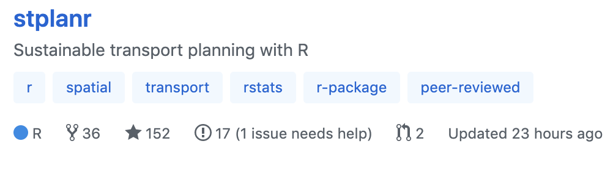

## rOpenSci HQ

* Join us for our next community call on [Reproducible Workflows at Scale with drake](https://ropensci.org/blog/2019/08/08/commcall-sep2019/) on Sep 24th, 2019. The speaker is [drake][] developer [Will Landau](https://ropensci.org/authors/will-landau/).
* Help wanted! We encourage rOpenSci package authors to help us help you get more contributors to your package. If you label an issue "help wanted" (no hyphen or emojis), those issues can be found in a [search of the rOpenSci organization](
https://github.com/search?q=org%3Aropensci+label%3A"help+wanted"+state%3Aopen&type=Issues); and on the rOpenSci GitHub landing page <https://github.com/ropensci> the number of open help wanted issues is highlighted for each package that has them.

 

## Software 📦

CRAN: 
GitHub: 

### New packages

* The first version (`v0.4.1`) of `cde` is on CRAN - download data from the Catchment Data Explorer. Checkout the [docs](https://docs.ropensci.org/cde/) to get started. {{ "cde" | image_cran }} {{ "cde" | image_github }}
* The first version (`v0.1.0`) of `citecorp` is on CRAN - client for the Open Citations Corpus. Checkout the [docs](https://docs.ropensci.org/citecorp/) to get started. {{ "citecorp" | image_cran }} {{ "citecorp" | image_github: 'ropenscilabs' }}
* The first version (`v0.1.1`) of `PostcodesioR` is on CRAN - API wrapper for Postcodes.io. Checkout the [docs](https://docs.ropensci.org/PostcodesioR/) to get started. {{ "PostcodesioR" | image_cran }} {{ "PostcodesioR" | image_github }}

### New Versions

* A new version (`v0.6`) of `roadoi` is on CRAN - find free versions of scholarly publications via Unpaywall. See the [release notes](https://github.com/ropensci/roadoi/releases/tag/v0.6) for changes. Checkout the [vignette](https://cran.r-project.org/web/packages/roadoi/vignettes/intro.html) to get started. {{ "roadoi" | image_cran }} {{ "roadoi" | image_github }}
> new data fields in Unpaywall data; minor fixes
* A new version (`v7.6.1` & `v7.6.2`) of `drake` is on CRAN - a pipeline toolkit for reproducible computation at scale. See the [release notes](https://github.com/ropensci/drake/blob/master/NEWS.md) for changes. Checkout the [docs](https://ropensci.github.io/drake/) to get started. {{ "drake" | image_cran }} {{ "drake" | image_github }}
> docs now at <https://docs.ropensci.org/drake/>; many bug fixes
* A new version (`v0.8.0` & `v0.8.2`) of `pangaear` is on CRAN - Client for the Pangaea database. See the [release notes](https://github.com/ropensci/pangaear/blob/master/NEWS.md) for changes. Checkout the [vignette](https://cran.rstudio.com/web/packages/pangaear/vignettes/pangaear_vignette.html) to get started. {{ "pangaear" | image_cran }} {{ "pangaear" | image_github }}
> new object `pg_cache` to manage file caching; `pg_data()` now includes parsed metadata; bug fixes for `pg_data()`
* A new version (`v0.1.5`) of `gutenbergr` is on CRAN - Download and process public domain works from Project Gutenberg. See the [release notes](https://github.com/ropensci/gutenbergr/blob/master/NEWS.md) for changes. Checkout the [vignette](https://cran.rstudio.com/web/packages/gutenbergr/vignettes/intro.html) to get started. {{ "gutenbergr" | image_cran }} {{ "gutenbergr" | image_github }}
> replace `data_frame()` w/ `tibble()`
* A new version (`v0.2.8`) of `fingertipsR` is on CRAN - Fingertips data for public health <http://fingertips.phe.org.uk/>. See the [release notes](https://github.com/ropensci/fingertipsR/blob/master/NEWS.md) for changes. Checkout the [vignettes](https://cran.rstudio.com/web/packages/fingertipsR/vignettes/) to get started. {{ "fingertipsR" | image_cran }} {{ "fingertipsR" | image_github }}
> better failure behavior: throw informative message when no API response
* A new version (`v1.1.2`) of `nasapower` is on CRAN - NASA POWER API Client. See the [release notes](https://github.com/ropensci/nasapower/blob/master/NEWS.md) for changes. Checkout the [docs](https://docs.ropensci.org/nasapower/) to get started. {{ "nasapower" | image_cran }} {{ "nasapower" | image_github }}
> correct citation; suppress `APSIM::createMetFile()` console output
* A new version (`v0.3.0`) of `oai` is on CRAN - general purpose OAI-PMH services client. See the [release notes](https://github.com/ropensci/oai/releases/tag/v0.3.0) for changes. Checkout the [docs](https://docs.ropensci.org/oai/) to get started. {{ "oai" | image_cran }} {{ "oai" | image_github }}
> `id()` gains `as` param; `update_providers()` fix; small changes
* A new version (`v1.2.6`) of `UCSCXenaTools` is on CRAN - download and explore datasets from UCSC Xena data hubs. See the [release notes](https://github.com/ropensci/UCSCXenaTools/releases/tag/v1.2.6) for changes. Checkout the [docs](https://shixiangwang.github.io/home/en/tools/ucscxenatools-intro/) to get started. {{ "UCSCXenaTools" | image_cran }} {{ "UCSCXenaTools" | image_github }}
> update pkg citation
* A new version (`v0.3.7`) of `jstor` is on CRAN - read data from JSTOR/DfR. See the [release notes](https://github.com/ropensci/jstor/releases/tag/v0.3.7) for changes. Checkout the [docs](https://ropensci.github.io/jstor) to get started. {{ "jstor" | image_cran }} {{ "jstor" | image_github }}
> `tidyr` compatability; remove defunct fxns
* A new version (`v2.0.0`) of `GSODR` is on CRAN - Global Surface Summary of the Day (GSOD) Weather Data from R. See the [release notes](https://github.com/ropensci/GSODR/releases/tag/v2.0.0) for changes. Checkout the [docs](https://docs.ropensci.org/GSODR/) to get started. {{ "GSODR" | image_cran }} {{ "GSODR" | image_github }}
> `get_GSOD()` now using https rather than FTP; objects now returned as data.table objects; minor changes
* A new version (`v0.2.0`) of `jaod` is on CRAN - Directory of Open Access Journals client. See the [release notes](https://github.com/ropensci/jaod/releases/tag/v0.2.0) for changes. Checkout the [docs](https://ropensci.github.io/jaod/) to get started. {{ "jaod" | image_cran }} {{ "jaod" | image_github }}
> new vignette; docs changes
* A new version (`v0.3.1`) of `getCRUCLdata` is on CRAN - use and explore CRU CL v. 2.0 climatology elements. See the [release notes](https://github.com/ropensci/getCRUCLdata/blob/master/NEWS.md) for changes. Checkout the [docs](https://docs.ropensci.org/getCRUCLdata/) to get started. {{ "getCRUCLdata" | image_cran }} {{ "getCRUCLdata" | image_github }}
> fix documentation bug in an example
* A new version (`v0.2.3`) of `tradestatistics` is on CRAN - open trade statistics api wrapper and utility program. See the [release notes](https://github.com/ropensci/tradestatistics/releases/tag/v0.2.3) for changes. Checkout the [docs](https://ropensci.github.io/tradestatistics/) to get started. {{ "tradestatistics" | image_cran }} {{ "tradestatistics" | image_github }}
> fixes for testthat
* A new version (`v1.0.14`) of `lingtypology` is on CRAN - linguistic typology and mapping. See the [release notes](https://github.com/ropensci/lingtypology/blob/master/NEWS) for changes. Checkout the [docs](https://ropensci.github.io/lingtypology/) to get started. {{ "lingtypology" | image_cran }} {{ "lingtypology" | image_github }}
> some dependencies moved to Suggests; new fxns `uralex.feature()` and `ggmap.feature()`
* A new version (`v2.2`) of `magick` is on CRAN - Advanced graphics and Image-Processing in R. See the [release notes](https://github.com/ropensci/magick/releases/tag/v2.2) for changes. Checkout the [vignette](https://cran.rstudio.com/web/packages/magick/vignettes/intro.html) to get started. {{ "magick" | image_cran }} {{ "magick" | image_github }}
> new fxns `image_read_video()`, `image_separate()`, `image_combine()`; improve RStudio auto preview
* A new version (`v2.0.3`) of `ijtiff` is on CRAN - Comprehensive TIFF I/O with full support for ImageJ TIFF files. See the [release notes](https://github.com/ropensci/ijtiff/releases/tag/v2.0.3) for changes. Checkout the [docs](https://ropensci.github.io/ijtiff) to get started. {{ "ijtiff" | image_cran }} {{ "ijtiff" | image_github }}
> add `libjpeg` needs to SystemRequirements
* A new version (`v0.3`) of `av` is on CRAN - working with audio and video. See the [release notes](https://github.com/ropensci/av/blob/master/NEWS) for changes. Checkout the [docs](https://docs.ropensci.org/av/) to get started. {{ "av" | image_cran }} {{ "av" | image_github }}
> major refactor; new fxns `av_video_convert()`, `av_audio_convert()`, `av_video_images()` 
* A new version (`v0.7.2`) of `DataSpaceR` is on CRAN - interface to the CAVD DataSpace. See the [release notes](https://github.com/ropensci/DataSpaceR/releases/tag/v0.7.2) for changes. Checkout the [docs](https://ropensci.github.io/DataSpaceR/) to get started. {{ "DataSpaceR" | image_cran }} {{ "DataSpaceR" | image_github }}
> fix broken and invalid URLs
* A new version (`v0.3.0`) of `vcr` is on CRAN - record HTTP calls to disk for test caching. See the [release notes](https://github.com/ropensci/vcr/releases/tag/v0.3.0) for changes. Checkout the [HTTP testing book](https://ropenscilabs.github.io/http-testing-book/) to get started. {{ "vcr" | image_cran }} {{ "vcr" | image_github }}
> re-recording cassettes now works, see docs about setting a re-record interval; fixes to request body matching
* A new version (`v0.2.0`) of `handlr` is on CRAN - Convert among citation formats. See the [release notes](https://github.com/ropensci/handlr/releases/tag/v0.2.0) for changes. Checkout the [README](https://github.com/ropensci/handlr/#handlr) to get started. {{ "handlr" | image_cran }} {{ "handlr" | image_github }}
> new fxn `handl_to_df()` (and associated method `$as_df()` on `HandlClient`) to convert a `handl` object to a data.frame
* A new version (`v0.5.0`) of `rnassqs` is on CRAN - access the NASS Quick Stats API. See the [release notes](https://github.com/ropensci/rnassqs/releases/tag/v0.5.0) for changes. Checkout the [docs](https://ropensci.github.io/rnassqs/) to get started. {{ "rnassqs" | image_cran }} {{ "rnassqs" | image_github }}
> change how queries are specified; simplified token management; docs improved

  

## Software Review ✔

We accept community contributed packages via our software review system - an open software review system, sorta like scholarly paper review, but way better. We'll highlight newly onboarded packages here. A huge thanks to our reviewers, who do a lot of work reviewing (see the [blog post on our review system](https://ropensci.org/blog/2016/03/28/software-review)),
and the authors of the packages!

If you want to be a reviewer fill out [this short form](https://ropensci.org/onboarding/), and we'll ping you when there's a submission that fits in your area of expertise.

The following three packages were recently submitted:

* [baRcodeR][] > Label Creation for Tracking and Collecting Data from Biological Samples
    * Author: [Yihan Wu](https://github.com/yihanwu)
    * Issue: [ropensci/onboarding#338](https://github.com/ropensci/onboarding/issues/338)
    * Reviewers:
        * [Rayna Harris](https://github.com/raynamharris)
        * [Lluís Revilla](https://github.com/llrs)
* [ruODK][] > An R Client for the ODK Central API
    * Author: [Florian Mayer](https://github.com/florianm)
    * Issue: [ropensci/onboarding#335](https://github.com/ropensci/onboarding/issues/335)
    * Reviewers: not yet assigned
* [parzer][] > Parse Coordinates
    * Author: [Scott Chamberlain](https://github.com/sckott)
    * Issue: [ropensci/onboarding#341](https://github.com/ropensci/onboarding/issues/341)
    * Reviewers: not yet assigned

The following two packages recently went through our software-review process and have been approved:

* [rmangal][] > An interface to the Mangal database <https://mangal.io/#/>
    * Author: [Steve Vissault](https://github.com/SteveViss)
    * Issue: [ropensci/onboarding#332](https://github.com/ropensci/onboarding/issues/332)
    * Reviewers:
        * [Thomas Pedersen](https://github.com/thomasp85)
        * [Anna Willoughby](https://github.com/arw36)
* [c14bazAAR][] > Download and Prepare C14 Dates from Different Source Databases
    * Author: [Clemens Schmid](https://github.com/nevrome)
    * Issue: [ropensci/onboarding#333](https://github.com/ropensci/onboarding/issues/333)
    * Reviewers:
        * [Ben Marwick](https://github.com/benmarwick)
        * [Enrico Crema](https://github.com/ercrema)

  

## On the blog

[Stefanie Butland](https://ropensci.org/authors/stefanie-butland/) wrote the second of a semi-monthly summary of the rOpenSci Newsletter including software reviews, packages on CRAN, use cases, posts from staff and community, and events - [2 Months in 2 Minutes - rOpenSci News, August 2019](https://ropensci.org/blog/2019/08/15/news-aug2019/)

 

[Sam Tyner](https://ropensci.org/authors/sam-tyner/) wrote a post describing her free online book on forensic science in R. This work was funded by a 2018 rOpenSci Research Fellowship. Read the post here: [Introducing Open Forensic Science in R](https://ropensci.org/blog/2019/08/20/forensic-science/)

 

[Tiffany Timbers](https://ropensci.org/authors/tiffany-timbers/) in a recent post [Using rOpenSci Software Peer Review Guidelines for Teaching](https://ropensci.org/blog/2019/08/27/software-peer-review-guidelines-for-teaching/) wrote about the Collaborative Software Development course she teaches at University of British Columbia. In this course, they recommend students use our book [rOpenSci Packages: Development, Maintenance, and Peer Review](https://devguide.ropensci.org/); and the students and teachers use our [Review Template](https://devguide.ropensci.org/reviewtemplate.html) when submitting and reviewing assignments.

 

### Software Review

[Aldo Compagnoni](https://ropensci.org/authors/aldo-compagnoni/) wrote a post on his package that recently went through review, [popler](https://github.com/ropensci/popler): [Synthesizing population time-series data from the USA Long Term Ecological Research Network](https://ropensci.org/blog/2019/08/13/popler/). Aldo talks about the motivation for making the package and the database behind the package.

  

## Use Cases

The following 24 works use/cite rOpenSci software:

* Saxena _et al_. used [tesseract][] in their paper [Feature Boosting in Natural Image Classification](https://doi.org/10.1109/compsac.2019.10184) [^1]
* Pilogallo _et al_. used [MODIStsp][] in their paper [Investigating Urban Growth Dynamic – Land Surface Temperature Relationship](https://doi.org/10.1007/978-3-030-24302-9_51) [^2]
* Sang used [neotoma][] in their paper [No-analog ecological communities since the last glacial maximum inferred from fossil pollen records for North America](https://sites.ualberta.ca/~ahamann/people/pdfs/Sang_2019_MSc.pdf) [^3]
* Xia _et al_. used [plotly][] in their paper [GEDS: A Gene Expression Display Server for mRNAs, miRNAs and Proteins](https://doi.org/10.3390/cells8070675) [^4]
* Burkett used [plotly][] in their paper [Who Is Ready To Retire: Your Average Life Expectancy And The Savings Needed To Support You](https://libres.uncg.edu/ir/asu/f/Burkett_Kaitlyn_2019_Thesis.pdf) [^5]
* Valdez & Mandrekar used [rfishbase][] in their paper [Assessing the Species in the CARES Preservation Program and the Role of Aquarium Hobbyists in Freshwater Fish Conservation](https://doi.org/10.20944/preprints201907.0030.v1) [^6]
* Correia _et al_. used [rgbif][] in their paper [Using ignorance scores to explore biodiversity recording effort for multiple taxa in the Caatinga](https://doi.org/10.1016/j.ecolind.2019.105539) [^7]
* Lin _et al_. used [hunspell][] in their paper [Projection Word Embedding Model With Hybrid Sampling Training for Classifying ICD-10-CM Codes: Longitudinal Observational Study](https://doi.org/10.2196/14499) [^8]
* Stöver _et al_. used [RNeXML][] in their paper [JPhyloIO: a Java library for event-based reading and writing of different phylogenetic file formats through a common interface](https://doi.org/10.1186/s12859-019-2982-3) [^9]
* Myers _et al_. used [spocc][] in their paper [Environmental Heterogeneity and Not Vicariant Biogeographic Barriers Generate Community Wide Population Structure in Desert Adapted Snakes](https://doi.org/10.1111/mec.15182) [^10]
* Van Schaik _et al_. used [fingertipsR][] in their paper [Explainable statistical learning in public health for policy development: the case of real-world suicide data](https://bmcmedresmethodol.biomedcentral.com/articles/10.1186/s12874-019-0796-7) [^11]
* Hagen _et al_. used [taxize][] in their paper [Mountain building, climate cooling and the richness of cold‐adapted plants in the Northern Hemisphere](https://doi.org/10.1111/jbi.13653) [^12]
* Carlström _et al_. used [plotly][] in their paper [Therapeutic efficacy of dimethyl fumarate in relapsing-remitting multiple sclerosis associates with ROS pathway in monocytes](https://doi.org/10.1038/s41467-019-11139-3) [^13]
* Dag _et al_. used [plotly][] in their paper [GMDH2: Binary Classification via GMDH-Type Neural Network Algorithms—R Package and Web-Based Tool](https://doi.org/10.2991/ijcis.d.190618.001) [^14]
* Wüest _et al_. used [CoordinateCleaner][] in their paper [Macroecology in the age of Big Data – Where to go from here?](https://doi.org/10.1111/jbi.13633) [^15]
* Saunders _et al_. used [rnoaa][] in their paper [A Regionalisation Approach for Rainfall based on Extremal Dependence](https://arxiv.org/pdf/1907.05750.pdf>) [^16]
* Collins _et al_. used [rentrez][] in their paper [Non‐specific amplification compromises environmental DNA metabarcoding with COI](https://doi.org/10.1111/2041-210x.13276) [^17]
* Elsner & Schroder used [USABoundaries][] in their paper [Tornado damage ratings estimated with cumulative logistic regression](https://doi.org/10.31223/osf.io/k9wv6) [^18]
* Abhilash & Sheeba used [plotly][] in their paper [RhythmicAlly: Your R and Shiny–Based Open-Source Ally for the Analysis of Biological Rhythms](https://doi.org/10.1177/0748730419862474) [^19]
* Peters _et al_. used [rotl][] in their paper [Immunosenescence in wild animals: meta‐analysis and outlook](https://doi.org/10.1111/ele.13343) [^20]
* Die _et al_. used [rentrez][] in their paper [geneHummus: an R package to define gene families and their expression in legumes and beyond](https://doi.org/10.1186/s12864-019-5952-2) [^21]
* Saadi _et al_. used [FedData][] in their paper [Random Forest Ability in Regionalizing Hourly Hydrological Model Parameters](https://doi.org/10.3390/w11081540) [^22]
* Jaganathan & Dalrymple used [rgbif][] in their paper [Internal Seed Structure of Alpine Plants and Extreme Cold Exposure](https://doi.org/10.3390/data4030107) [^23]
* Alhajeri _et al_. used [taxize][] in their paper [Habitat productivity is a poor predictor of body size in rodents](https://academic.oup.com/cz/advance-article/doi/10.1093/cz/zoz037/5539488) [^24]

  

## From the Forum

We have a [discussion forum](https://discuss.ropensci.org) (using [Discourse](https://www.discourse.org/)) for the rOpenSci community. It's a really nice way to have conversations on the internet. From time to time we'll highlight recent discussions of interest.

* [Noam Ross](https://ropensci.org/about/#team) wrote about [Using rorcid to generate a website CV](https://discuss.ropensci.org/t/using-rorcid-to-generate-a-website-cv/1806). The [rorcid][] package, made by rOpenSci, is a client for [ORCID](https://orcid.org/) data.
* [Tim Williams](https://github.com/NovasTaylor) wrote about using our [rdflib][] package (a high level wrapper around the redland package for common rdf applications): [Converting MedDRA Terminology to Linked Data using rdflib](https://discuss.ropensci.org/t/converting-meddra-terminology-to-linked-data-using-rdflib/1824).

  

## Call For Contributors

Part of the mission of rOpenSci is making sustainable software that users can rely on. Some software maintainers need to give up maintenance due to a variety of circumstances. When that happens we try to find new maintainers. Checkout our [Contributing Guide](https://devguide.ropensci.org/contributingguide.html) for why and how to contribute to rOpenSci.

We've had six recent examples of maintainer transitions within rOpenSci:

- [RSelenium][]: now maintained by [Ju Kim](https://github.com/juyeongkim)
- [chromer][]: now maintained by [Paula Andrea](https://github.com/orchid00)
- [qualtRics][]: now maintained by [Julia Silge](https://github.com/juliasilge)
- [rsnps][]: now maintained by [Julia Gustavsen](https://github.com/jooolia) and [Sina Rüeger](https://github.com/sinarueeger)
- [rdpla][]: now maintained by [Alyssa Columbus](https://github.com/acolum)
- [webchem][]: now maintained by [Erik Sapper](https://github.com/eriksapper)

We don't have any packages looking for new maintainers - if you are a maintainer and want to hand over that role to someone else get in touch with us.

  

  

### Keep up with rOpenSci

* Mailing list: Sign up with an email address to get this newsletter sent to your inbox -> [ropensci.org/#subscribe](https://ropensci.org/#subscribe)
* Alternatively, you can subscribe to this newsletter via our XML feed at <https://news.ropensci.org/feed.xml> or our JSON feed at <https://news.ropensci.org/feed.json>
* rOpenSci on Twitter: [@ropensci](https://twitter.com/ropensci)
* The rOpenSci blog at [ropensci.org/blog](https://ropensci.org/blog) - you can subscribe in any RSS aggregator, or manually via <https://ropensci.org/feed.xml>. We also announce new blog posts on our Twitter account.

 

#### Footnotes

[^1]: Saxena, P., Saxena, D., Nie, X., Helmers, A., Ramachandran, N., Sakib, N., & Ahamed, S. (2019). Feature Boosting in Natural Image Classification. 2019 IEEE 43rd Annual Computer Software and Applications Conference (COMPSAC). <https://doi.org/10.1109/compsac.2019.10184>
[^2]: Pilogallo, A., Saganeiti, L., Scorza, F., & Murgante, B. (2019). Investigating Urban Growth Dynamic – Land Surface Temperature Relationship. Lecture Notes in Computer Science, 701–710. <https://doi.org/10.1007/978-3-030-24302-9_51>
[^3]: Sang, Zihaohan. No-analog ecological communities since the last glacial maximum inferred from fossil pollen records for North America. Diss. University of Alberta, 2019. <https://sites.ualberta.ca/~ahamann/people/pdfs/Sang_2019_MSc.pdf>
[^4]: Xia, Liu, Zhang, & Guo. (2019). GEDS: A Gene Expression Display Server for mRNAs, miRNAs and Proteins. Cells, 8(7), 675. <https://doi.org/10.3390/cells8070675>
[^5]: Burkett, Kaitlyn E. Who Is Ready To Retire: Your Average Life Expectancy And The Savings Needed To Support You. Diss. Appalachian State University, 2019. <https://libres.uncg.edu/ir/asu/f/Burkett_Kaitlyn_2019_Thesis.pdf>
[^6]: Valdez, J. W., & Mandrekar, K. (2019). Assessing the Species in the CARES Preservation Program and the Role of Aquarium Hobbyists in Freshwater Fish Conservation. <https://doi.org/10.20944/preprints201907.0030.v1>
[^7]: Correia, R. A., Ruete, A., Stropp, J., Malhado, A. C. M., dos Santos, J. W., Lessa, T., … Ladle, R. J. (2019). Using ignorance scores to explore biodiversity recording effort for multiple taxa in the Caatinga. Ecological Indicators, 106, 105539. <https://doi.org/10.1016/j.ecolind.2019.105539>
[^8]: Lin, C., Lou, Y.-S., Tsai, D.-J., Lee, C.-C., Hsu, C.-J., Wu, D.-C., … Fang, W.-H. (2019). Projection Word Embedding Model With Hybrid Sampling Training for Classifying ICD-10-CM Codes: Longitudinal Observational Study. JMIR Medical Informatics, 7(3), e14499. <https://doi.org/10.2196/14499>
[^9]: Stöver, B. C., Wiechers, S., & Müller, K. F. (2019). JPhyloIO: a Java library for event-based reading and writing of different phylogenetic file formats through a common interface. BMC Bioinformatics, 20(1). <https://doi.org/10.1186/s12859-019-2982-3>
[^10]: Myers, E. A., Xue, A. T., Gehara, M., Cox, C., Davis Rabosky, A. R., Lemos‐Espinal, J., … Burbrink, F. T. (2019). Environmental Heterogeneity and Not Vicariant Biogeographic Barriers Generate Community Wide Population Structure in Desert Adapted Snakes. Molecular Ecology. <https://doi.org/10.1111/mec.15182>
[^11]: Van Schaik, P., Peng, Y., Ojelabi, A., & Ling, J. (2019). Explainable statistical learning in public health for policy development: the case of real-world suicide data. BMC medical research methodology, 19(1), 152. <https://bmcmedresmethodol.biomedcentral.com/articles/10.1186/s12874-019-0796-7>
[^12]: Hagen, O., Vaterlaus, L., Albouy, C., Brown, A., Leugger, F., Onstein, R. E., … Pellissier, L. (2019). Mountain building, climate cooling and the richness of cold‐adapted plants in the Northern Hemisphere. Journal of Biogeography. <https://doi.org/10.1111/jbi.13653>
[^13]: Carlström, K. E., Ewing, E., Granqvist, M., Gyllenberg, A., Aeinehband, S., Enoksson, S. L., … Piehl, F. (2019). Therapeutic efficacy of dimethyl fumarate in relapsing-remitting multiple sclerosis associates with ROS pathway in monocytes. Nature Communications, 10(1). <https://doi.org/10.1038/s41467-019-11139-3>
[^14]: Dag, O., Karabulut, E., & Alpar, R. (2019). GMDH2: Binary Classification via GMDH-Type Neural Network Algorithms—R Package and Web-Based Tool. International Journal of Computational Intelligence Systems, 12(2), 649. <https://doi.org/10.2991/ijcis.d.190618.001>
[^15]: Wüest, R. O., Zimmermann, N. E., Zurell, D., Alexander, J. M., Fritz, S. A., Hof, C., … Karger, D. N. (2019). Macroecology in the age of Big Data – Where to go from here? Journal of Biogeography. <https://doi.org/10.1111/jbi.13633>
[^16]: Saunders, K. R., Stephenson, A. G., & Karoly, D. J. (2019). A Regionalisation Approach for Rainfall based on Extremal Dependence. arXiv preprint <https://arxiv.org/pdf/1907.05750.pdf>
[^17]: Collins, R. A., Bakker, J., Wangensteen, O. S., Soto, A. Z., Corrigan, L., Sims, D. W., … Mariani, S. (2019). Non‐specific amplification compromises environmental DNA metabarcoding with COI. Methods in Ecology and Evolution. <https://doi.org/10.1111/2041-210x.13276>
[^18]: Elsner, J. B., & Schroder, Z. (2019, July 18). Tornado damage ratings estimated with cumulative logistic regression. <https://doi.org/10.31223/osf.io/k9wv6>
[^19]: Abhilash, L., & Sheeba, V. (2019). RhythmicAlly: Your R and Shiny–Based Open-Source Ally for the Analysis of Biological Rhythms. Journal of Biological Rhythms, 074873041986247. <https://doi.org/10.1177/0748730419862474>
[^20]: Peters, A., Delhey, K., Nakagawa, S., Aulsebrook, A., & Verhulst, S. (2019). Immunosenescence in wild animals: meta‐analysis and outlook. Ecology Letters. <https://doi.org/10.1111/ele.13343>
[^21]: Die, J. V., Elmassry, M. M., LeBlanc, K. H., Awe, O. I., Dillman, A., & Busby, B. (2019). geneHummus: an R package to define gene families and their expression in legumes and beyond. BMC Genomics, 20(1). <https://doi.org/10.1186/s12864-019-5952-2>
[^22]: Saadi, M., Oudin, L., & Ribstein, P. (2019). Random Forest Ability in Regionalizing Hourly Hydrological Model Parameters. Water, 11(8), 1540. <https://doi.org/10.3390/w11081540>
[^23]: Jaganathan, G. K., & Dalrymple, S. E. (2019). Internal Seed Structure of Alpine Plants and Extreme Cold Exposure. Data, 4(3), 107. <https://doi.org/10.3390/data4030107>
[^24]: Alhajeri, B. H., Porto, L., & Maestri, R. (2019). Habitat productivity is a poor predictor of body size in rodents. Current Zoology. <https://academic.oup.com/cz/advance-article/doi/10.1093/cz/zoz037/5539488>

[RSelenium]: https://github.com/ropensci/RSelenium
[chromer]: https://github.com/ropensci/chromer
[qualtRics]: https://github.com/ropensci/qualtRics
[rsnps]: https://github.com/ropensci/rsnps
[rdpla]: https://github.com/ropensci/rdpla
[webchem]: https://github.com/ropensci/webchem
[stplanr]: https://github.com/ropensci/stplanr
[tesseract]: https://github.com/ropensci/tesseract
[MODIStsp]: https://github.com/ropensci/MODIStsp
[neotoma]: https://github.com/ropensci/neotoma
[plotly]: https://github.com/ropensci/plotly
[rfishbase]: https://github.com/ropensci/rfishbase
[rgbif]: https://github.com/ropensci/rgbif
[hunspell]: https://github.com/ropensci/hunspell
[RNeXML]: https://github.com/ropensci/RNeXML
[spocc]: https://github.com/ropensci/spocc
[fingertipsR]: https://github.com/ropensci/fingertipsR
[taxize]: https://github.com/ropensci/taxize
[CoordinateCleaner]: https://github.com/ropensci/CoordinateCleaner
[rnoaa]: https://github.com/ropensci/rnoaa
[rentrez]: https://github.com/ropensci/rentrez
[rotl]: https://github.com/ropensci/rotl
[FedData]: https://github.com/ropensci/FedData
[drake]: https://github.com/ropensci/drake
[rmangal]: https://github.com/ropensci/rmangal
[c14bazAAR]: https://github.com/ISAAKiel/c14bazAAR
[baRcodeR]: https://github.com/yihanwu/baRcodeR
[ruODK]: https://github.com/dbca-wa/ruODK
[parzer]: https://github.com/ropenscilabs/parzer
[USABoundaries]: https://github.com/ropensci/USABoundaries
[rorcid]: https://github.com/ropensci/rorcid
[rdflib]: https://github.com/ropensci/rdflib
