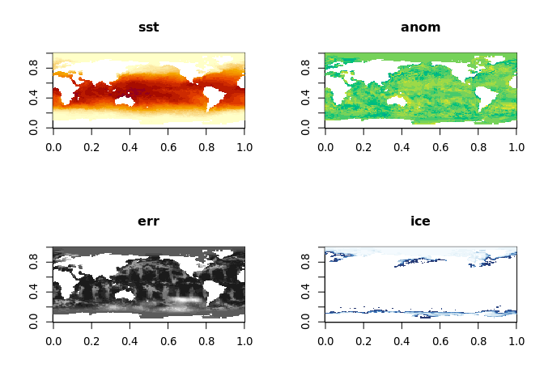

## rOpenSci HQ

rOpenSci Announces a New $896k Award From The Gordon and Betty Moore Foundation to Improve the Scientific Package Ecosystem for R. Read the <a href="https://ropensci.org/blog/2019/11/06/scientific-package-ecosystem/">blog post</a> by <a href="https://ropensci.org/authors/karthik-ram/">Karthik Ram</a>

 

## Software 📦

CRAN: 
GitHub: 

### New Versions

* A new version (`v2.3`) of `pdftools` is on CRAN - Text extraction, rendering and converting of PDF documents. See the [release notes](https://github.com/ropensci/pdftools/blob/master/NEWS) for changes. Checkout the [README](https://github.com/ropensci/pdftools#pdftools) to get started. {{ "pdftools" | image_cran }} {{ "pdftools" | image_github }}
> pdf_text() improvements; new fxns pdf_ocr_text/pdf_ocr_data wrap tesseract
* A new version (`v0.5.3`) of `gender` is on CRAN - Predict gender from names using historical data. See the [release notes](https://github.com/ropensci/gender/blob/master/NEWS) for changes. Checkout the [vignette](https://cran.r-project.org/web/packages/gender/vignettes/predicting-gender.html) to get started. {{ "gender" | image_cran }} {{ "gender" | image_github }}
> docs improvements, testing fixes
* A new version (`v2.4.0`) of `RNeXML` is on CRAN - Semantically Rich I/O for the NeXML Format. See the [release notes](https://github.com/ropensci/RNeXML/releases/tag/v2.4.0) for changes. Checkout the [vignettes](https://cran.r-project.org/web/packages/RNeXML/vignettes/) to get started. {{ "RNeXML" | image_cran }} {{ "RNeXML" | image_github }}
> use Additional_repositories for taxadb
* A new version (`v0.2.0`) of `citecorp` is on CRAN - client for the Open Citations Corpus. See the [release notes](https://github.com/ropenscilabs/citecorp/releases/tag/v0.2.0) for changes. Checkout the [docs](https://docs.ropensci.org/citecorp/) to get started. {{ "citecorp" | image_cran }} {{ "citecorp" | image_github: 'ropenscilabs' }}
> oc_doi2ids/oc_pmid2ids/oc_pmcid2ids functions now vectorized; bug fixes
* A new version (`v0.9.4`) of `rnoaa` is on CRAN - NOAA Weather Data from R. See the [release notes](https://github.com/ropensci/rnoaa/releases/tag/v0.9.4) for changes. Checkout the [vignettes](https://cran.rstudio.com/web/packages/rnoaa/vignettes/) to get started. {{ "rnoaa" | image_cran }} {{ "rnoaa" | image_github }}
> new gefs fxns gefs_dimensions/gefs_ensembles; gefs fxn fixes; argo family fxns no longer work as API is gone - but FTP fxns still work (`argo_guoy_files()`/`argo()`)
* A new version (`v0.2.3`) of `tidync` is on CRAN - a tidy approach to NetCDF data exploration and extraction. See the [release notes](https://github.com/ropensci/tidync/releases/tag/v0.2.3) for changes. Checkout the [docs](https://ropensci.github.io/tidync/) to get started. {{ "tidync" | image_cran }} {{ "tidync" | image_github }}
> test fixes
* A new version (`v0.9.0`) of `crul` is on CRAN - an R6 based HTTP client for R made for developers. See the [release notes](https://github.com/ropensci/crul/releases/tag/v0.9.0) for changes. Checkout the [docs](https://ropensci.github.io/crul/) to get started. {{ "crul" | image_cran }} {{ "crul" | image_github }}
> HttpResponse object gains methods for checking response content type; head verb now uses auth correctly
* A new version (`v1.0.4`) of `essurvey` is on CRAN - data from the European Social Survey. See the [release notes](https://github.com/ropensci/essurvey/releases/tag/v1.0.4) for changes. Checkout the [docs](https://ropensci.github.io/essurvey/) to get started. {{ "essurvey" | image_cran }} {{ "essurvey" | image_github }}
* A new version (`v1.1.4`) of `solrium` is on CRAN - general purpose R interface to Solr. See the [release notes](https://github.com/ropensci/solrium/releases/tag/v1.1.4) for changes. Checkout the [vignettes](https://cran.rstudio.com/web/packages/solrium/vignettes/) to get started. {{ "solrium" | image_cran }} {{ "solrium" | image_github }}
> fix `delete_by_query()`/`$delete_by_query()` method
* A new version (`v1.0.2`) of `spocc` is on CRAN - an interface to many species occurrence data sources. See the [release notes](https://github.com/ropensci/spocc/releases/tag/v1.0.2) for changes. Checkout the [docs](https://ropensci.github.io/spocc/) to get started. {{ "spocc" | image_cran }} {{ "spocc" | image_github }}
> fix failing tests on cran
* A new version (`v1.4.0`) of `rgbif` is on CRAN - interface to the [Global Biodiversity Information Facility](https://www.gbif.org/) API. See the [release notes](https://github.com/ropensci/rgbif/releases/tag/v1.4.0) for changes. Checkout the [occurrence manual](https://ropenscilabs.github.io/occurrence-manual/) to get started. {{ "rgbif" | image_cran }} {{ "rgbif" | image_github }}
> new fxn `mvt_fetch()` for GBIF's Map Vector Tiles; overhaul of `occ_issues`/`name_issues` fxns; many fixes
* A new version (`v0.8.0`) of `geojsonio` is on CRAN - Convert Data from and to GeoJSON or TopoJSON. See the [release notes](https://github.com/ropensci/geojsonio/releases/tag/v0.8.0) for changes. Checkout the [vignettes](https://cran.rstudio.com/web/packages/geojsonio/vignettes/) to get started. {{ "geojsonio" | image_cran }} {{ "geojsonio" | image_github }}
> `geojson_read()` gains method for PostGIS; `geojson_read()` now uses sf instead of sp; `geojson_list()` gains precision param; bug fixes
* A new version (`v0.8.0`) of `ritis` is on CRAN - an R client for ITIS ([Integrated Taxonomic Information Service](https://www.itis.gov/)). See the [release notes](https://github.com/ropensci/ritis/releases/tag/v0.8.0) for changes. Checkout the [docs](https://docs.ropensci.org/ritis/) to get started. {{ "ritis" | image_cran }} {{ "ritis" | image_github }}
> improve `itis_search()` examples; bug fix for `itis_group()`

  

## Software Review ✔

We accept community contributed packages via our software review system - an open software review system, sorta like scholarly paper review, but way better. We'll highlight newly onboarded packages here. A huge thanks to our reviewers, who do a lot of work reviewing (see the [blog post on our review system](https://ropensci.org/blog/2016/03/28/software-review)),
and the authors of the packages!

If you want to be a reviewer fill out [this short form](https://ropensci.org/onboarding/), and we'll ping you when there's a submission that fits in your area of expertise.

The following package was recently submitted:

* [dbparser][] > DrugBank Database XML Parser
    * Author: [Mohammed Ali](https://github.com/MohammedFCIS)
    * Issue: [ropensci/onboarding#347](https://github.com/ropensci/onboarding/issues/347)
    * Reviewers: not yet assigned

The following packages recently went through our software review process and have been approved:

* [workloopR][] > Analysis of Work Loops and Other Data from Muscle Physiology Experiments
    * Author: [Vikram Baliga](https://github.com/vbaliga)
    * Issue: [ropensci/onboarding#326](https://github.com/ropensci/onboarding/issues/326)
    * Reviewers:
        * [Julia Romanowska](https://github.com/jromanowska)
        * [Eric Brown](https://github.com/eebrown)
* [eia][] > API Wrapper for 'US Energy Information Administration' Open Data
    * Author: [Matthew Leonawicz](https://github.com/leonawicz)
    * Issue: [ropensci/onboarding#342](https://github.com/ropensci/onboarding/issues/342)
    * Reviewers:
        * [David Ranzolin](https://github.com/daranzolin)
        * [Philipp Ottolinger](https://github.com/ottlngr)
* [photosearcher][] > Searches Flickr for photographs and metadata
    * Author: [Nathan Fox](https://github.com/nfox29)
    * Issue: [ropensci/onboarding#325](https://github.com/ropensci/onboarding/issues/325)
    * Reviewers:
        * [Monica Gerber](https://github.com/monicagerber)
        * [Zhian Kamvar](https://github.com/zkamvar)

  

## On the blog

[Michael Quinn](https://ropensci.org/authors/michael-quinn/) and [Elin Waring](https://ropensci.org/authors/elin-waring/) wrote about a new version (v2) of their package [skimr][] - [(Re)introducing skimr v2 - A year in the life of an open source R project](https://ropensci.org/blog/2019/10/29/skimrv2/)

 

[Michael Sumner](https://ropensci.org/authors/michael-sumner/) wrote about his package [tidync][] that was recently approved in rOpenSci software review - [tidync: scientific array data from NetCDF in R](https://ropensci.org/blog/2019/11/05/tidync/)

  

## Use Cases

The following 15 works use/cite rOpenSci software:

* Palstrøm _et al_. used [writexl][] in their paper [Data Imputation in Merged Isobaric Labeling-Based Relative Quantification Datasets](https://doi.org/10.1007/978-1-4939-9744-2_13) [^1]
* Cinelli _et al_. used [hunspell][] in their paper [The interconnectedness of the economic content in the speeches of the US Presidents](https://doi.org/10.1007/s10479-019-03372-2) [^2]
* Umlauf _et al_. used [rnaturalearth][] in their paper [bamlss: A Lego Toolbox for Flexible Bayesian Regression](https://arxiv.org/abs/1909.11784) [^3]
* Bager Olsen _et al_. used [rredlist][] in their paper [Thirty-six years of legal and illegal wildlife trade entering the USA](https://doi.org/10.1017/s0030605319000541) [^4]
* Vidal _et al_. used [brranching][] in their paper [Geography is more important than host plant use for the population genetic structure of a generalist insect herbivore](https://doi.org/10.1111/mec.15218) [^5]
* De Luca _et al_. used [rgbif][] in their paper [Global distribution and diversity of Chaetoceros (Bacillariophyta, Mediophyceae): integration of classical and novel strategies](https://doi.org/10.7717/peerj.7410) [^6]
* Ondra used [camsRad][] in their paper [Reliability based design approach to stochastic supply planning](https://iaee2019ljubljana.oyco.eu/download/contribution/fullpaper/345/345_fullpaper_20190608_130510.pdf) [^7]
* Wang _et al_. used [neotoma][] in their paper [Bayesian ages for pollen records since the last glaciation in North America](https://doi.org/10.1038/s41597-019-0182-7) [^8]
* Nalborczyk _et al_. used [skimr][] in their paper [Can we decode phonetic features in inner speech using surface electromyography?](https://doi.org/10.31234/osf.io/8v5yd) [^9]
* Stanstrup _et al_. used [webchem][] in their paper [The metaRbolomics Toolbox in Bioconductor and beyond](https://doi.org/10.3390/metabo9100200) [^10]
* Feng _et al_. used [CoordinateCleaner][] in their paper [A checklist for maximizing reproducibility of ecological niche models](https://doi.org/10.1038/s41559-019-0972-5) [^11]
* Duffany used [hunspell][] in their paper [Developing CyberSecurity Skills with Intermediate Programming Courses](NULL) [^12]
* Maherali used [rotl][] in their paper [Mutualism as a plant functional trait: linking variation in the mycorrhizal symbiosis to climatic tolerance, geographic range and population dynamics](https://doi.org/10.1086/706187) [^13]
* Havinga _et al_. used [rgbif][] in their paper [Spatial quantification to examine the effectiveness of payments for ecosystem services: A case study of Costa Rica’s Pago de Servicios Ambientales](https://doi.org/10.1016/j.ecolind.2019.105766) [^14]
* Jin _et al_. used [tokenizers][] in their paper [Mining consumer complaints to identify unsuccessful interactions with advanced driver assistance systems](https://doi.org/10.1145/3349263.3351313) [^15]

  

## Call For Maintainers

Part of the mission of rOpenSci is making sustainable software that users can rely on. Some software maintainers need to give up maintenance due to a variety of circumstances. When that happens we try to find new maintainers. Checkout our [Contributing Guide](https://devguide.ropensci.org/contributingguide.html) for why and how to contribute to rOpenSci.

We've had six recent examples of maintainer transitions within rOpenSci:

- [RSelenium][]: now maintained by [Ju Kim](https://github.com/juyeongkim)
- [chromer][]: now maintained by [Paula Andrea](https://github.com/orchid00)
- [qualtRics][]: now maintained by [Julia Silge](https://github.com/juliasilge)
- [rsnps][]: now maintained by [Julia Gustavsen](https://github.com/jooolia) and [Sina Rüeger](https://github.com/sinarueeger)
- [rdpla][]: now maintained by [Alyssa Columbus](https://github.com/acolum)
- [webchem][]: now maintained by [Erik Sapper](https://github.com/eriksapper)

We've got one package in need of a new maintainer:

- [mregions][]: The current maintainer [Scott Chamberlain](https://github.com/sckott) is looking for a new maintainer. [Email Scott](mailto:myrmecocystus@gmail.com) if you're interested.

  

  

### Keep up with rOpenSci

* Mailing list: Sign up with an email address to get this newsletter sent to your inbox -> [ropensci.org/#subscribe](https://ropensci.org/#subscribe)
* Alternatively, you can subscribe to this newsletter via our XML feed at <https://news.ropensci.org/feed.xml> or our JSON feed at <https://news.ropensci.org/feed.json>
* rOpenSci on Twitter: [@ropensci](https://twitter.com/ropensci)
* The rOpenSci blog at [ropensci.org/blog](https://ropensci.org/blog) - you can subscribe in any RSS aggregator, or manually via <https://ropensci.org/feed.xml>. We also announce new blog posts on our Twitter account.

 

#### Footnotes

[^1]: Palstrøm N.B., Matthiesen R., Beck H.C. (2020) Data Imputation in Merged Isobaric Labeling-Based Relative Quantification Datasets. In: Matthiesen R. (eds) Mass Spectrometry Data Analysis in Proteomics. Methods in Molecular Biology, vol 2051. Humana, New York, NY <https://doi.org/10.1007/978-1-4939-9744-2_13>
[^2]: Cinelli, M., Ficcadenti, V., & Riccioni, J. (2019). The interconnectedness of the economic content in the speeches of the US Presidents. Annals of Operations Research. <https://doi.org/10.1007/s10479-019-03372-2>
[^3]: Umlauf, N., Klein, N., Simon, T., & Zeileis, A. (2019). bamlss: A Lego Toolbox for Flexible Bayesian Regression (and Beyond). arXiv preprint arXiv:1909.11784. <https://arxiv.org/abs/1909.11784>
[^4]: Bager Olsen, M. T., Geldmann, J., Harfoot, M., Tittensor, D. P., Price, B., Sinovas, P., … Burgess, N. D. (2019). Thirty-six years of legal and illegal wildlife trade entering the USA. Oryx, 1–10. <https://doi.org/10.1017/s0030605319000541>
[^5]: Vidal, M. C., Quinn, T. W., Stireman, J. O., Tinghitella, R. M., & Murphy, S. M. (2019). Geography is more important than host plant use for the population genetic structure of a generalist insect herbivore. Molecular Ecology. <https://doi.org/10.1111/mec.15218>
[^6]: De Luca, D., Kooistra, W. H. C. F., Sarno, D., Gaonkar, C. C., & Piredda, R. (2019). Global distribution and diversity of Chaetoceros (Bacillariophyta, Mediophyceae): integration of classical and novel strategies. PeerJ, 7, e7410. <https://doi.org/10.7717/peerj.7410>
[^7]: Ondra, M. 2019. Reliability based design approach to stochastic supply planning. <https://iaee2019ljubljana.oyco.eu/download/contribution/fullpaper/345/345_fullpaper_20190608_130510.pdf>
[^8]: Wang, Y., Goring, S. J., & McGuire, J. L. (2019). Bayesian ages for pollen records since the last glaciation in North America. Scientific Data, 6(1). <https://doi.org/10.1038/s41597-019-0182-7>
[^9]: Nalborczyk, L., Grandchamp, R., Koster, E. H. W., Perrone-Bertolotti, M., & Loevenbruck, H. (2019). Can we decode phonetic features in inner speech using surface electromyography? <https://doi.org/10.31234/osf.io/8v5yd>
[^10]: Stanstrup, J., Broeckling, C., Helmus, R., Hoffmann, N., Mathé, E., Naake, T., … Neumann, S. (2019). The metaRbolomics Toolbox in Bioconductor and beyond. Metabolites, 9(10), 200. <https://doi.org/10.3390/metabo9100200>
[^11]: Feng, X., Park, D. S., Walker, C., Peterson, A. T., Merow, C., & Papeş, M. (2019). A checklist for maximizing reproducibility of ecological niche models. Nature Ecology & Evolution. <https://doi.org/10.1038/s41559-019-0972-5>
[^12]: Duffany, J. (2019). Developing CyberSecurity Skills with Intermediate Programming Courses. Proceedings of the 17th LACCEI International Multi-Conference for Engineering, Education, and Technology: “Industry, Innovation, and Infrastructure for Sustainable Cities and Communities.” <https://doi.org/10.18687/laccei2019.1.1.414>
[^13]: Maherali, H. (2019). Mutualism as a plant functional trait: linking variation in the mycorrhizal symbiosis to climatic tolerance, geographic range and population dynamics. International Journal of Plant Sciences. <https://doi.org/10.1086/706187>
[^14]: Havinga, I., Hein, L., Vega-Araya, M., & Languillaume, A. (2020). Spatial quantification to examine the effectiveness of payments for ecosystem services: A case study of Costa Rica’s Pago de Servicios Ambientales. Ecological Indicators, 108, 105766. <https://doi.org/10.1016/j.ecolind.2019.105766>
[^15]: Jin, L., Tefft, B. C., & Horrey, W. J. (2019). Mining consumer complaints to identify unsuccessful interactions with advanced driver assistance systems. Proceedings of the 11th International Conference on Automotive User Interfaces and Interactive Vehicular Applications Adjunct Proceedings - AutomotiveUI  ’19. <https://doi.org/10.1145/3349263.3351313>

[RSelenium]: https://github.com/ropensci/RSelenium
[chromer]: https://github.com/ropensci/chromer
[qualtRics]: https://github.com/ropensci/qualtRics
[rsnps]: https://github.com/ropensci/rsnps
[rdpla]: https://github.com/ropensci/rdpla
[webchem]: https://github.com/ropensci/webchem
[stplanr]: https://github.com/ropensci/stplanr
[mregions]: https://github.com/ropensci/mregions

[writexl]: https://github.com/ropensci/writexl
[hunspell]: https://github.com/ropensci/hunspell
[rredlist]: https://github.com/ropensci/rredlist
[brranching]: https://github.com/ropensci/brranching
[rgbif]: https://github.com/ropensci/rgbif
[neotoma]: https://github.com/ropensci/neotoma
[skimr]: https://github.com/ropensci/skimr
[webchem]: https://github.com/ropensci/webchem
[CoordinateCleaner]: https://github.com/ropensci/CoordinateCleaner
[rotl]: https://github.com/ropensci/rotl
[tokenizers]: https://github.com/ropensci/tokenizers

[photosearcher]: https://github.com/nfox29/photosearcher
[eia]: https://github.com/ropensci/eia
[workloopR]: https://github.com/ropensci/workloopR
[skimr]: https://github.com/ropensci/skimr
[tidync]: https://github.com/ropensci/tidync
[dbparser]: https://github.com/Dainanahan/dbparser
