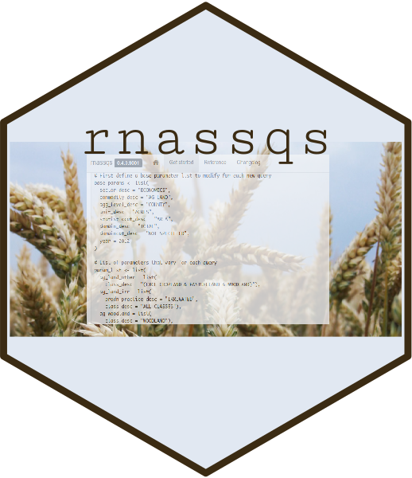

## rOpenSci HQ

* [NumFOCUS](https://numfocus.org/) recognizes [Melina Vidoni](https://ropensci.org/authors/melina-vidoni/) and [Will Landau](https://ropensci.org/authors/will-landau/) for their contributions to rOpenSci. [Read the blog post](https://ropensci.org/blog/2019/11/25/numfocus-awards/)
* Join us for our next Community Call - [Last Night, Testing Saved my Life](https://ropensci.org/blog/2019/11/12/commcall-dec2019/) - on December 5th, 2019, with Steffi LaZerte and Rich FitzJohn.

 

## Software 📦

CRAN: 
GitHub: 

### New Packages

* The first version (`v0.1`) of `lightr` is on CRAN - read spectrometric data and metadata. Checkout the [docs](https://docs.ropensci.org/lightr/) to get started. {{ "lightr" | image_cran }} {{ "lightr" | image_github }}
* The first version (`v2.0.3`) of `mauricer` is on CRAN - install BEAST2 packages. Checkout the [docs](https://docs.ropensci.org/mauricer/) to get started. {{ "mauricer" | image_cran }} {{ "mauricer" | image_github }}

### New Versions

* A new version (`v0.3.0`) of `phylocomr` is on CRAN - Interface to Phylocom for analysis of phylogenetic community structure and character evolution. See the [release notes](https://github.com/ropensci/phylocomr/releases/tag/v0.3.0) for changes. Checkout the [vignette](https://cran.rstudio.com/web/packages/phylocomr/vignettes/phylocomr.html) to get started. {{ "phylocomr" | image_cran }} {{ "phylocomr" | image_github }}
> now always use temp files even when users pass files to avoid altering user files; new manual file describing inputs; check taxon name case in all inputs
* A new version (`v1.2.9`) of `UCSCXenaTools` is on CRAN - download and explore datasets from UCSC Xena data hubs. See the [release notes](https://github.com/ropensci/UCSCXenaTools/blob/master/NEWS.md) for changes. Checkout the [docs](https://shixiangwang.github.io/home/en/tools/ucscxenatools-intro/) to get started. {{ "UCSCXenaTools" | image_cran }} {{ "UCSCXenaTools" | image_github }}
* A new version (`v0.4.12`) of `iheatmapr` is on CRAN - Interactive and complex heatmaps. See the [release notes](https://github.com/ropensci/iheatmapr/releases/tag/v0.4.12) for changes. Checkout the [docs](https://ropensci.github.io/iheatmapr/) to get started. {{ "iheatmapr" | image_cran }} {{ "iheatmapr" | image_github }}
> adjust tests to be compatible with newer version of scales package
* A new version (`v0.4.1`) of `stplanr` is on CRAN - sustainable transport planning. See the [release notes](https://github.com/ropensci/stplanr/blob/master/NEWS.md) for changes. Checkout the [docs](https://ropensci.github.io/stplanr/) to get started. {{ "stplanr" | image_cran }} {{ "stplanr" | image_github }}
> better error messages if `od2line()` fails due to non-matching ids; improved documentation of `od2line()` in the vignette
* A new version (`v1.0.15`) of `lingtypology` is on CRAN - linguistic typology and mapping. See the [release notes](https://github.com/ropensci/lingtypology/releases/tag/v1.0.15) for changes. Checkout the [docs](https://ropensci.github.io/lingtypology/) to get started. {{ "lingtypology" | image_cran }} {{ "lingtypology" | image_github }}
> remove `NA` apearence from popup window when "fake" language argument is used; fast fix of colors tests
* A new version (`v0.2.3`) of `tiler` is on CRAN - generate geographic and non-geographic map tiles from R. See the [release notes](https://github.com/ropensci/tiler/blob/master/NEWS.md) for changes. Checkout the [docs](https://ropensci.github.io/tiler/) to get started. {{ "tiler" | image_cran }} {{ "tiler" | image_github }}
> precompile vignette that depends on external data
* A new version (`v2.0`) of `skimr` is on CRAN - compact and flexible summaries of data. See the [release notes](https://github.com/ropensci/skimr/blob/master/NEWS.md) for changes. Checkout the [vignettes](https://cran.rstudio.com/web/packages/skimr/vignettes/) to get started. {{ "skimr" | image_cran }} {{ "skimr" | image_github }}
> a complete re-write! check out the release notes for all the details 🎉
* A new version (`v0.9.5`) of `rnoaa` is on CRAN - NOAA Weather Data from R. See the [release notes](https://github.com/ropensci/rnoaa/releases/tag/v0.9.5) for changes. Checkout the [vignettes](https://cran.rstudio.com/web/packages/rnoaa/vignettes/) to get started. {{ "rnoaa" | image_cran }} {{ "rnoaa" | image_github }}
> `lcd()` base url fixed (please upgrade if you use lcd data); all `gefs` functions temporarily defunct 
* A new version (`v0.2.0`) of `git2rdata` is on CRAN - store and retrieve data.frames in a Git repository. See the [release notes](https://github.com/ropensci/git2rdata/releases/tag/v0.2.0) for changes. Checkout the [docs](https://ropensci.github.io/git2rdata/) to get started. {{ "git2rdata" | image_cran }} {{ "git2rdata" | image_github }}
> a number of breaking changes, and some new features
* A new version (`v1.1.3`) of `nasapower` is on CRAN - NASA POWER API Client. See the [release notes](https://github.com/ropensci/nasapower/blob/master/NEWS.md) for changes. Checkout the [docs](https://docs.ropensci.org/nasapower/) to get started. {{ "nasapower" | image_cran }} {{ "nasapower" | image_github }}
> new vignette "Using nasapower with large geographic areas"
* A new version (`v0.9.91`) of `taxize` is on CRAN - taxonomic toolbelt for R. See the [release notes](https://github.com/ropensci/taxize/releases/tag/v0.9.91) for changes. Checkout the [taxize book](https://taxize.dev/) to get started. {{ "taxize" | image_cran }} {{ "taxize" | image_github }}
> `get_ids` can now suppress package cli messages; many improvements and bug fixes; force HTTP/1.1 for NCBI; warn when taxon identifiers of class X don't match `db` param value; beware: COL now rate limits
* A new version (`v0.4.0`) of `nodbi` is on CRAN - the NoSQL database connector. See the [release notes](https://github.com/ropensci/nodbi/releases/tag/v0.4.0) for changes. Checkout the [README](https://github.com/ropensci/nodbi/#readme) to get started. {{ "nodbi" | image_cran }} {{ "nodbi" | image_github }}
> in `docdb_query()` and `docdb_get()` for sqlite use a connection instead of file path; fix to `docdb_query()` and `docdb_create()` for sqlite when handling mixed value types

  

## Software Review ✔

We accept community contributed packages via our software review system - an open software review system, sorta like scholarly paper review, but way better. We'll highlight newly onboarded packages here. A huge thanks to our reviewers, who do a lot of work reviewing (see the [blog post on our review system](https://ropensci.org/blog/2016/03/28/software-review)),
and the authors of the packages!

If you want to be a reviewer fill out [this short form](https://ropensci.org/onboarding/), and we'll ping you when there's a submission that fits in your area of expertise.

The following package recently went through our software review process and has been approved:

* [baRcodeR][] > Label Creation for Tracking and Collecting Data from Biological Samples
    * Author: [Yihan Wu](https://github.com/yihanwu)
    * Issue: [ropensci/onboarding#338](https://github.com/ropensci/onboarding/issues/338)
    * Reviewers:
        * [Rayna Harris](https://github.com/raynamharris)
        * [Lluís Revilla](https://github.com/llrs)

  

## On the blog

[Nicholas Potter](https://ropensci.org/authors/nicholas-potter/) wrote about his recently approved package [rnassqs][] for accessing USDA agricultural data: [rnassqs: accessing USDA agricultural data via API](https://ropensci.org/blog/2019/11/26/rnassqs/)

 

[Vikram Baliga](https://ropensci.org/authors/vikram-b.-baliga/) wrote about his recently approved package [workloopR][] - [Analysis of work loops and other data from muscle physiology experiments in R](https://ropensci.org/technotes/2019/11/14/workloopr-release/)

  

## Use Cases

The following 12 works use/cite rOpenSci software:

* Fecchio _et al_. used [MODISTools][] in their paper [An inverse latitudinal gradient in infection probability and phylogenetic diversity for Leucocytozoon blood parasites in New World birds](https://doi.org/10.1111/1365-2656.13117) [^1]
* Scheffers _et al_. used [rredlist][] in their paper [Global wildlife trade across the tree of life](https://doi.org/10.1126/science.aav5327) [^2]
* Enkybayar _et al_. used [rplos][] in their paper [Comparing public and private Facebook activity linking to PLOS ONE papers](NULL) [^3]
* Lewinski & Hasan used [pdftools][] in their paper [Russian Troll Account Classification with Twitter and Facebook Data](http://bit.ly/2smxrVz) [^4]
* Dumitrescu _et al_. used [rnoaa][] in their paper [Homogenization of a combined hourly air temperature dataset over Romania](https://doi.org/10.1002/joc.6353) [^5]
* Yoo _et al_. used [MODIStsp][] in their paper _The use of MODIS atmospheric products to estimate cooling degree days at weather stations in South and North Korea_ (https://doi.org/10.5532/KJAFM.2019.21.2.97) [^6]
* Kaaronen & Strelkovskii used [nlrx][] in their paper [Cultural Evolution of Sustainable Behaviours: Pro-Environmental Tipping Points in an Agent-Based Model](https://doi.org/10.31234/osf.io/w6dpa) [^7]
* Sydenham _et al_. used [taxize][] in their paper [When context matters: Spatial prediction models of environmental conditions can identify target areas for wild bee habitat management interventions](https://doi.org/10.1016/j.landurbplan.2019.103673) [^8]
* Bottin _et al_. used [taxize][] in their paper [Phytosociological data and herbarium collections show congruent large scale patterns but differ in their local descriptions of community composition](https://doi.org/10.1111/jvs.12825) [^9]
* Piatscheck used [rgbif][] and [spocc][] and [rinat][] in their paper [Past, present and future: Geographic and temporal variation in a Fig–fig wasp mutualism](https://search.proquest.com/docview/2302689695) [^10]
* Reyes _et al_. used [iheatmapr][] in their paper [GENAVi: a shiny web application for gene expression normalization, analysis and visualization](https://doi.org/10.1186/s12864-019-6073-7) [^11]
* Fetter used [rotl][] in their paper [Natural Selection For Disease Resistance In Hybrid Poplars Targets Stomatal Patterning Traits And Regulatory Genes](https://scholarworks.uvm.edu/graddis/1162) [^12]

  

## Call For Maintainers

Part of the mission of rOpenSci is making sustainable software that users can rely on. Some software maintainers need to give up maintenance due to a variety of circumstances. When that happens we try to find new maintainers. Checkout our [Contributing Guide](https://devguide.ropensci.org/contributingguide.html) for why and how to contribute to rOpenSci.

We've had six recent examples of maintainer transitions within rOpenSci:

- [RSelenium][]: now maintained by [Ju Kim](https://github.com/juyeongkim)
- [chromer][]: now maintained by [Paula Andrea](https://github.com/orchid00)
- [qualtRics][]: now maintained by [Julia Silge](https://github.com/juliasilge)
- [rsnps][]: now maintained by [Julia Gustavsen](https://github.com/jooolia) and [Sina Rüeger](https://github.com/sinarueeger)
- [rdpla][]: now maintained by [Alyssa Columbus](https://github.com/acolum)
- [webchem][]: now maintained by [Erik Sapper](https://github.com/eriksapper)
- [mregions][]: in process of moving to maintainance by [VLIZ](http://www.vliz.be)

We don't have any packages looking for new maintainers - if you are a maintainer and want to hand over that role to someone else get in touch with us.

  

  

### Keep up with rOpenSci

* Mailing list: Sign up with an email address to get this newsletter sent to your inbox -> [ropensci.org/#subscribe](https://ropensci.org/#subscribe)
* Alternatively, you can subscribe to this newsletter via our XML feed at <https://news.ropensci.org/feed.xml> or our JSON feed at <https://news.ropensci.org/feed.json>
* rOpenSci on Twitter: [@ropensci](https://twitter.com/ropensci)
* The rOpenSci blog at [ropensci.org/blog](https://ropensci.org/blog) - you can subscribe in any RSS aggregator, or manually via <https://ropensci.org/feed.xml>. We also announce new blog posts on our Twitter account.

 

#### Footnotes

[^1]: Fecchio, A., Bell, J. A., Bosholn, M., Vaughan, J. A., Tkach, V. V., Lutz, H. L., … Clark, N. J. (2019). An inverse latitudinal gradient in infection probability and phylogenetic diversity for Leucocytozoon blood parasites in New World birds. Journal of Animal Ecology. <https://doi.org/10.1111/1365-2656.13117>
[^2]: Scheffers, B. R., Oliveira, B. F., Lamb, I., & Edwards, D. P. (2019). Global wildlife trade across the tree of life. Science, 366(6461), 71–76. <https://doi.org/10.1126/science.aav5327>
[^3]: Enkybayar, A., Haustein, S., Barata, G., & Alperin, J. P. Comparing public and private Facebook activity linking to PLOS ONE papers. Altmetrics 2019 Conference Proceedings <http://altmetrics.org/wp-content/uploads/2019/10/Enkybayar_altmetrics19_paper_8.pdf>
[^4]: Lewinski, D., & Hasan, M. R. Russian Troll Account Classification with Twitter and Facebook Data. <http://bit.ly/2smxrVz>
[^5]: Dumitrescu, A., Cheval, S., & Guijarro, J. A. (2019). Homogenization of a combined hourly air temperature dataset over Romania. International Journal of Climatology. <https://doi.org/10.1002/joc.6353>
[^6]: Yoo, B. H., Kim, K. S., & Lee, J. (2019). The use of MODIS atmospheric products to estimate cooling degree days at weather stations in South and North Korea. Korean Journal of Agricultural and Forest Meteorology, 21(2), 97-109. https://doi.org/10.5532/KJAFM.2019.21.2.97
[^7]: Kaaronen, R. O., & Strelkovskii, N. (2019). Cultural Evolution of Sustainable Behaviours: Pro-Environmental Tipping Points in an Agent-Based Model. <https://doi.org/10.31234/osf.io/w6dpa>
[^8]: Sydenham, M. A. K., Moe, S. R., & Eldegard, K. (2020). When context matters: Spatial prediction models of environmental conditions can identify target areas for wild bee habitat management interventions. Landscape and Urban Planning, 193, 103673. <https://doi.org/10.1016/j.landurbplan.2019.103673>
[^9]: Bottin, M., Peyre, G., Vargas, C., Raz, L., Richardson, J. E., & Sanchez, A. (2019). Phytosociological data and herbarium collections show congruent large scale patterns but differ in their local descriptions of community composition. Journal of Vegetation Science. <https://doi.org/10.1111/jvs.12825>
[^10]: Piatscheck, F. (2019). Past, present and future: Geographic and temporal variation in a Fig–fig wasp mutualism (Order No. 22588967). ProQuest Dissertations & Theses Global. (2302689695). <https://search.proquest.com/docview/2302689695>
[^11]: Reyes, A. L. P., Silva, T. C., Coetzee, S. G., Plummer, J. T., Davis, B. D., Chen, S., … Jones, M. R. (2019). GENAVi: a shiny web application for gene expression normalization, analysis and visualization. BMC Genomics, 20(1). <https://doi.org/10.1186/s12864-019-6073-7>
[^12]: Fetter, K.C. 2019. Natural Selection For Disease Resistance In Hybrid Poplars Targets Stomatal Patterning Traits And Regulatory Genes. Graduate College Dissertations and Theses. 1162. <https://scholarworks.uvm.edu/graddis/1162>

[RSelenium]: https://github.com/ropensci/RSelenium
[chromer]: https://github.com/ropensci/chromer
[qualtRics]: https://github.com/ropensci/qualtRics
[rsnps]: https://github.com/ropensci/rsnps
[rdpla]: https://github.com/ropensci/rdpla
[webchem]: https://github.com/ropensci/webchem
[stplanr]: https://github.com/ropensci/stplanr
[mregions]: https://github.com/ropensci/mregions

[rredlist]: https://github.com/ropensci/rredlist
[rplos]: https://github.com/ropensci/rplos
[pdftools]: https://github.com/ropensci/pdftools
[rnoaa]: https://github.com/ropensci/rnoaa
[MODIStsp]: https://github.com/ropensci/MODIStsp
[MODISTools]: https://github.com/ropensci/MODISTools
[nlrx]: https://github.com/ropensci/nlrx
[taxize]: https://github.com/ropensci/taxize
[rgbif]: https://github.com/ropensci/rgbif
[spocc]: https://github.com/ropensci/spocc
[rinat]: https://github.com/ropensci/rinat
[iheatmapr]: https://github.com/ropensci/iheatmapr
[rotl]: https://github.com/ropensci/rotl

[rnassqs]: https://github.com/ropensci/rnassqs
[baRcodeR]: https://github.com/yihanwu/baRcodeR
[workloopR]: https://github.com/ropensci/workloopR
