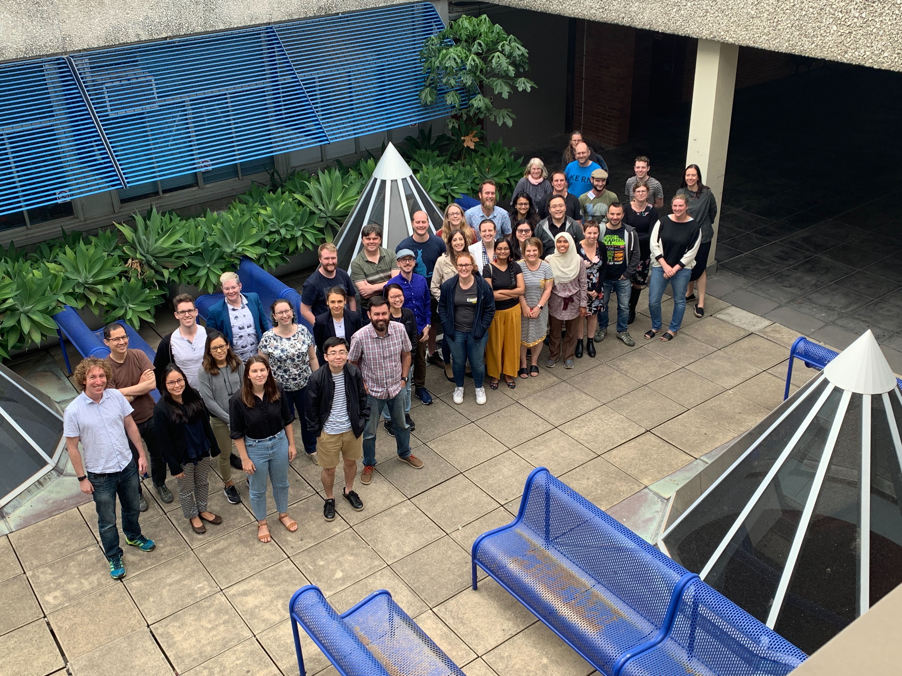

## Software 📦

CRAN: 
GitHub: 

### New Versions

* A new version (`v0.9.0`) of `geojsonio` is on CRAN - Convert Data from and to GeoJSON or TopoJSON. See the [release notes](https://github.com/ropensci/geojsonio/releases/tag/v0.9.0) for changes. Checkout the [vignettes](https://cran.rstudio.com/web/packages/geojsonio/vignettes/) to get started. {{ "geojsonio" | image_cran }} {{ "geojsonio" | image_github }}
> `geojson_sf()`/`geojson_sp()` now accept strings; replace httr with crul & rgdal replaced with sf
* A new version (`v0.4.0`) of `geojsonlint` is on CRAN - Tools for Validating GeoJSON. See the [release notes](https://github.com/ropensci/geojsonlint/releases/tag/v0.4.0) for changes. Checkout the [docs](https://docs.ropensci.org/geojsonlint/) to get started. {{ "geojsonlint" | image_cran }} {{ "geojsonlint" | image_github }}
> `geojson_lint()` defunct - the geojsonlint.com API is down
* A new version (`v2.1.0`) of `rgbif` is on CRAN - interface to the [Global Biodiversity Information Facility](https://www.gbif.org/) API. See the [release notes](https://github.com/ropensci/rgbif/releases/tag/v2.1.0) for changes. Checkout the [occurrence manual](https://books.ropensci.org/occurrences/) to get started. {{ "rgbif" | image_cran }} {{ "rgbif" | image_github }}
> `occ_download()` bug fix for `within` predicates for geometry queries; `occ_spellcheck()` now defunct
* A new version (`v4.9.2`) of `plotly` is on CRAN - Create Interactive Web Graphics via plotly.js. See the [release notes](https://github.com/ropensci/plotly/releases/tag/v4.9.2) for changes. Checkout the [plotly book](https://plotly-book.cpsievert.me/) to get started. {{ "plotly" | image_cran }} {{ "plotly" | image_github }}
> upgrade plotly.js to v1.52.2
* A new version (`v0.9.92`) of `taxize` is on CRAN - taxonomic toolbelt for R. See the [release notes](https://github.com/ropensci/taxize/releases/tag/v0.9.92) for changes. Checkout the [taxize book](https://taxize.dev/) to get started. {{ "taxize" | image_cran }} {{ "taxize" | image_github }}
> all Catalogue of Life functions removed (get in touch if you need help); new fxn `gn_parse()` for Global Names name parser
* A new version (`v1.0.8`) of `spocc` is on CRAN - an interface to many species occurrence data sources. See the [release notes](https://github.com/ropensci/spocc/releases/tag/v1.0.8) for changes. Checkout the [docs](https://docs.ropensci.org/spocc/) to get started. {{ "spocc" | image_cran }} {{ "spocc" | image_github }}
* A new version (`v1.1.1`) of `lingtypology` is on CRAN - linguistic typology and mapping. See the [release notes](https://github.com/ropensci/lingtypology/releases/tag/v1.1.1) for changes. Checkout the [docs](https://docs.ropensci.org/lingtypology/) to get started. {{ "lingtypology" | image_cran }} {{ "lingtypology" | image_github }}
> update glottolog from v2.7 to v4.1; some fxns removed
* A new version (`v0.3.0`) of `scrubr` is on CRAN - clean biological occurrence records. See the [release notes](https://github.com/ropensci/scrubr/releases/tag/v0.3.0) for changes. Checkout the [docs](https://docs.ropensci.org/scrubr/) to get started. {{ "scrubr" | image_cran }} {{ "scrubr" | image_github }}
> new fxn `fix_names()`; new fxn `eco_region` to filter data by ecoregions; new fxns `coord_imprecise()`/`coord_uncertain()` to clean coordinates
* A new version (`v1.0.2`) of `fingertipsR` is on CRAN - Fingertips data for public health <http://fingertips.phe.org.uk/>. See the [release notes](https://github.com/ropensci/fingertipsR/blob/master/NEWS.md) for changes. Checkout the [vignettes](https://cran.rstudio.com/web/packages/fingertipsR/vignettes/) to get started. {{ "fingertipsR" | image_cran }} {{ "fingertipsR" | image_github }}
> bug fix for `fingertips_data()`
* A new version (`v0.1.3`) of `osmdata` is on CRAN - import OpenStreetMap data as simple features or spatial objects. See the [release notes](https://github.com/ropensci/osmdata/releases/tag/v0.1.3) for changes. Checkout the [docs](https://docs.ropensci.org/osmdata/) to get started. {{ "osmdata" | image_cran }} {{ "osmdata" | image_github }}
> `osmdata_pbf()` function removed; remove deprecated `add_feature()` - replaced by `add_osm_feature()`
* A new version (`v2.0.2`) of `EML` is on CRAN - read and write ecological metadata language files. See the [release notes](https://github.com/ropensci/EML/blob/master/NEWS.md) for changes. Checkout the [docs](https://docs.ropensci.org/EML/) to get started. {{ "EML" | image_cran }} {{ "EML" | image_github }}
* A new version (`v0.4.1`) of `nlrx` is on CRAN - setup, run and analyze NetLogo model simulations. See the [release notes](https://github.com/ropensci/nlrx/blob/master/NEWS.md) for changes. Checkout the [vignettes](https://cran.rstudio.com/web/packages/nlrx/vignettes/) to get started. {{ "nlrx" | image_cran }} {{ "nlrx" | image_github }}
* A new version (`v0.2.0.8`) of `opentripplanner` is on CRAN - client for OpenTripPlanner for journey planning. See the [release notes](https://github.com/ropensci/opentripplanner/blob/master/NEWS.md) for changes. Checkout the [docs](https://docs.ropensci.org/opentripplanner/) to get started. {{ "opentripplanner" | image_cran }} {{ "opentripplanner" | image_github }}
* A new version (`v0.6.4`) of `rorcid` is on CRAN - Interface to the Orcid.org API. See the [release notes](https://github.com/ropensci/rorcid/releases/tag/v0.6.4) for changes. Checkout the [vignette](https://cran.rstudio.com/web/packages/rorcid/vignettes/rorcid.html) to get started. {{ "rorcid" | image_cran }} {{ "rorcid" | image_github }}
> `recursive` parameter removed from `orcid()`; `orcid_search()` loses some parameters; `orcid()` gains additional fields to query, e.g., `peer-review-type`
* A new version (`v2.7`) of `assertr` is on CRAN - Assertive Programming for R Analysis Pipelines. See the [release notes](https://github.com/ropensci/assertr/releases/tag/v2.7) for changes. Checkout the [vignette](https://cran.r-project.org/web/packages/assertr/vignettes/assertr.html) to get started. {{ "assertr" | image_cran }} {{ "assertr" | image_github }}
> added "inverse" option to predicates
* A new version (`v0.4.0`) of `emld` is on CRAN - ecological metadata as linked data. See the [release notes](https://github.com/ropensci/emld/blob/master/NEWS.md) for changes. Checkout the [vignette](https://cran.r-project.org/web/packages/emld/vignettes/tutorial.html) to get started. {{ "emld" | image_cran }} {{ "emld" | image_github }}
> fixed serialization bug in `references` attribute; fixed validation bugs
* A new version (`v0.3.3`) of `weathercan` is on CRAN - Download weather data from the Environment and Climate Change Canada website. See the [release notes](https://github.com/ropensci/weathercan/blob/master/NEWS.md) for changes. Checkout the [docs](http://docs.ropensci.org/weathercan/) to get started. {{ "weathercan" | image_cran }} {{ "weathercan" | image_github }}
> update internal datasets
* A new version (`v1.7.7`) of `RSelenium` is on CRAN - R client for Selenium Remote WebDriver. See the [release notes](https://github.com/ropensci/RSelenium/blob/master/NEWS.md) for changes. Checkout the [docs](http://docs.ropensci.org/RSelenium) to get started. {{ "RSelenium" | image_cran }} {{ "RSelenium" | image_github }}
> re-submission to CRAN after archiving

  

## Software Review ✔

We accept community contributed packages via our software review system - an open software review system, sorta like scholarly paper review, but way better. We'll highlight newly onboarded packages here. A huge thanks to our reviewers, who do a lot of work reviewing (see the [blog post on our review system](https://ropensci.org/blog/2016/03/28/software-review)),
and the authors of the packages!

If you want to be a reviewer fill out [this short form](https://ropensci.org/onboarding/), and we'll ping you when there's a submission that fits in your area of expertise.

The following packages were recently submitted:

* [mcbette][] > Model Comparison Using babette
    * Author: [Richard Bilderbeek](https://github.com/richelbilderbeek)
    * Issue: [ropensci/onboarding#360](https://github.com/ropensci/onboarding/issues/360)
    * Reviewers:
        * [Vikram Baliga](https://github.com/vbaliga)
        * [bjoelle](https://github.com/bjoelle)
* [dittodb][] > A Test Environment for DB Requests
    * Author: [Jonathan Keane](https://github.com/jonkeane)
    * Issue: [ropensci/onboarding#366](https://github.com/ropensci/onboarding/issues/366)
    * Reviewers: not yet assigned
* [circle][] > R client package for the Circle CI API
    * Author: [Patrick Schratz](https://github.com/pat-s)
    * Issue: [ropensci/onboarding#356](https://github.com/ropensci/onboarding/issues/356)
    * Reviewers: not yet assigned

  

## On the blog

- [Steph Stammel](https://ropensci.org/authors/steph-stammel/) wrote about OzUnconf 2019 ~> [The Fun of Building Things and the Challenge of Learning - the rOpenSci OzUnconf 2019](https://ropensci.org/blog/2020/02/05/ozunconf19/). Steph does a really nice job of explaining the motivation behind the unconf and dives into some of the projects explored at the event.

 

Software Review:

- [Kari Norman](https://ropensci.org/authors/kari-norman/) wrote about her recently rOpenSci reviewed package [taxadb][]: [taxadb: A High-Performance Local Taxonomic Database Interface](https://ropensci.org/blog/2020/02/13/taxadb/). Kari discusses the motivation for and design of the package, and how to use taxadb.

  

## Use Cases

The following 13 works use/cite rOpenSci software:

* Næss used [rnaturalearth][] in their paper [From hunter-gatherers to nomadic pastoralists: forager bands do not tell the whole story of the evolution of human cooperation](https://doi.org/10.31235/osf.io/9c8bm) [^1]
* Wang _et al_. used [UCSCXenaTools][] in their paper [Antigen presentation and tumor immunogenicity in cancer immunotherapy response prediction](https://doi.org/10.7554/elife.49020) [^2]
* Thorson used [rfishbase][] in their paper [Predicting recruitment density dependence and intrinsic growth rate for all fishes worldwide using a data‐integrated life‐history model](https://doi.org/10.1111/faf.12427) [^3]
* Geary _et al_. used [taxize][] in their paper [Predator responses to fire: A global systematic review and meta‐analysis](https://doi.org/10.1111/1365-2656.13153) [^4]
* Hong _et al_. used [FedData][] in their paper [Visualizing Urban Microclimate and Quantifying its Impact on Building Energy Use in San Francisco](https://doi.org/10.1145/3363459.3363536) [^5]
* Lange _et al_. used [biomartR][] in their paper [RST1 and RIPR connect the cytosolic RNA exosome to the Ski complex in Arabidopsis](https://doi.org/10.1038/s41467-019-11807-4) [^6]
* Báez _et al_. used [spocc][] in their paper [Ensemble modeling of the potential distribution of the whale shark in the Atlantic Ocean](https://doi.org/10.1002/ece3.5884) [^7]
* Estrada-Peña _et al_. used [MODIStsp][] and [rotl][] in their paper [Species occurrence of ticks in South America, and interactions with biotic and abiotic traits](https://doi.org/10.1038/s41597-019-0314-0) [^8]
* Lecocq _et al_. used [rfishbase][] in their paper [TOFF, a database of traits of fish to promote advances in fish aquaculture](https://doi.org/10.1038/s41597-019-0307-z) [^9]
* Reis used [rgbif][] in their paper [Uma perspectiva macroecológica sobre o risco de extinção em mamíferos](http://bit.ly/38mfmHG) [^10]
* Yagli _et al_. used [camsRad][] in their paper [Can we justify producing univariate machine-learning forecasts with satellite-derived solar irradiance?](https://doi.org/10.1016/j.apenergy.2019.114122) [^11]
* Li _et al_. used [UCSCXenaTools][] in their paper [The SMART App: an interactive web application for comprehensive DNA methylation analysis and visualization](https://doi.org/10.1186/s13072-019-0316-3) [^12]
* Fu & Hughey used [rcrossref][] and [rentrez][] in their paper [Releasing a preprint is associated with more attention and citations for the peer-reviewed article](https://doi.org/10.7554/elife.52646) [^13]

  

## From the Forum

We have a [discussion forum](https://discuss.ropensci.org) (using [Discourse](https://www.discourse.org/)) for the rOpenSci community. It's a really nice way to have conversations on the internet. From time to time we'll highlight recent discussions of interest.

Two use cases have been reported in the forum recently:

* [Mark Padgham](https://ropensci.org/about/#team) shared a use case for his [osmdata][] package: [osmdata use case: Wall Art](https://discuss.ropensci.org/t/osmdata-use-case-wall-art/1944)
* [Ivan Leung](https://twitter.com/urganmax) shared a use case for the [pdftools][] package: [pdftools for parsing .pdf from a URL - public data mining](https://discuss.ropensci.org/t/pdftools-for-parsing-pdf-from-a-url-public-data-mining/1953)

  

## Call For Maintainers

Part of the mission of rOpenSci is making sustainable software that users can rely on. Some software maintainers need to give up maintenance due to a variety of circumstances. When that happens we try to find new maintainers. Checkout our [Contributing Guide](https://devguide.ropensci.org/contributingguide.html) for why and how to contribute to rOpenSci.

We've had six recent examples of maintainer transitions within rOpenSci:

- [RSelenium][]: now maintained by [Ju Kim](https://github.com/juyeongkim)
- [chromer][]: now maintained by [Paula Andrea](https://github.com/orchid00)
- [qualtRics][]: now maintained by [Julia Silge](https://github.com/juliasilge)
- [rsnps][]: now maintained by [Julia Gustavsen](https://github.com/jooolia) and [Sina Rüeger](https://github.com/sinarueeger)
- [rdpla][]: now maintained by [Alyssa Columbus](https://github.com/acolum)
- [webchem][]: now maintained by [Erik Sapper](https://github.com/eriksapper)
- [mregions][]: in process of moving to maintenance by [VLIZ](http://www.vliz.be)

We don't have any packages looking for new maintainers - if you are a maintainer and want to hand over that role to someone else get in touch with us.

  

  

### Keep up with rOpenSci

* Mailing list: Sign up with an email address to get this newsletter sent to your inbox -> [ropensci.org/#subscribe](https://ropensci.org/#subscribe)
* Alternatively, you can subscribe to this newsletter via our XML feed at <https://news.ropensci.org/feed.xml> or our JSON feed at <https://news.ropensci.org/feed.json>
* rOpenSci on Twitter: [@ropensci](https://twitter.com/ropensci)
* The rOpenSci blog at [ropensci.org/blog](https://ropensci.org/blog) - you can subscribe in any RSS aggregator, or manually via <https://ropensci.org/feed.xml>. We also announce new blog posts on our Twitter account.

 

#### Footnotes

[^1]: Næss, M. W. (2019). From hunter-gatherers to nomadic pastoralists: forager bands do not tell the whole story of the evolution of human cooperation. <https://doi.org/10.31235/osf.io/9c8bm>
[^2]: Wang, S., He, Z., Wang, X., Li, H., & Liu, X.-S. (2019). Antigen presentation and tumor immunogenicity in cancer immunotherapy response prediction. eLife, 8. <https://doi.org/10.7554/elife.49020>
[^3]: Thorson, J. T. (2019). Predicting recruitment density dependence and intrinsic growth rate for all fishes worldwide using a data‐integrated life‐history model. Fish and Fisheries. <https://doi.org/10.1111/faf.12427
[^4]: Geary, W. L., Doherty, T. S., Nimmo, D. G., Tulloch, A. I. T., & Ritchie, E. G. (2020). Predator responses to fire: A global systematic review and meta‐analysis. Journal of Animal Ecology. <https://doi.org/10.1111/1365-2656.13153>
[^5]: Hong, T., Xu, Y., Sun, K., Zhang, W., & Luo, X. (2019). Visualizing Urban Microclimate and Quantifying its Impact on Building Energy Use in San Francisco. Proceedings of the 1st ACM International Workshop on Urban Building Energy Sensing, Controls, Big Data Analysis, and Visualization  - UrbSys’19. <https://doi.org/10.1145/3363459.3363536>
[^6]: Lange, H., Ndecky, S. Y. A., Gomez-Diaz, C., Pflieger, D., Butel, N., Zumsteg, J., … Gagliardi, D. (2019). RST1 and RIPR connect the cytosolic RNA exosome to the Ski complex in Arabidopsis. Nature Communications, 10(1). <https://doi.org/10.1038/s41467-019-11807-4>
[^7]: Báez, J. C., Barbosa, A. M., Pascual, P., Ramos, M. L., & Abascal, F. (2019). Ensemble modeling of the potential distribution of the whale shark in the Atlantic Ocean. Ecology and Evolution, 10(1), 175–184. <https://doi.org/10.1002/ece3.5884>
[^8]: Estrada-Peña, A., Nava, S., Tarragona, E., Bermúdez, S., de la Fuente, J., Domingos, A., … Guglielmone, A. A. (2019). Species occurrence of ticks in South America, and interactions with biotic and abiotic traits. Scientific Data, 6(1). <https://doi.org/10.1038/s41597-019-0314-0>
[^9]: Lecocq, T., Benard, A., Pasquet, A., Nahon, S., Ducret, A., Dupont-Marin, K., … Thomas, M. (2019). TOFF, a database of traits of fish to promote advances in fish aquaculture. Scientific Data, 6(1). <https://doi.org/10.1038/s41597-019-0307-z>
[^10]: Reis, V. S. (2019). Uma perspectiva macroecológica sobre o risco de extinção em mamíferos. Thesis. <http://bit.ly/38mfmHG>
[^11]: Yagli, G. M., Yang, D., Gandhi, O., & Srinivasan, D. (2019). Can we justify producing univariate machine-learning forecasts with satellite-derived solar irradiance? Applied Energy, 114122. <https://doi.org/10.1016/j.apenergy.2019.114122>
[^12]: Li, Y., Ge, D., & Lu, C. (2019). The SMART App: an interactive web application for comprehensive DNA methylation analysis and visualization. Epigenetics & Chromatin, 12(1). <https://doi.org/10.1186/s13072-019-0316-3>
[^13]: Fu, D. Y., & Hughey, J. J. (2019). Releasing a preprint is associated with more attention and citations for the peer-reviewed article. eLife, 8. <https://doi.org/10.7554/elife.52646>

[RSelenium]: https://github.com/ropensci/RSelenium
[chromer]: https://github.com/ropensci/chromer
[qualtRics]: https://github.com/ropensci/qualtRics
[rsnps]: https://github.com/ropensci/rsnps
[rdpla]: https://github.com/ropensci/rdpla
[webchem]: https://github.com/ropensci/webchem
[stplanr]: https://github.com/ropensci/stplanr
[mregions]: https://github.com/ropensci/mregions

[UCSCXenaTools]: https://github.com/ropensci/UCSCXenaTools
[rfishbase]: https://github.com/ropensci/rfishbase
[taxize]: https://github.com/ropensci/taxize
[FedData]: https://github.com/ropensci/FedData
[spocc]: https://github.com/ropensci/spocc
[MODIStsp]: https://github.com/ropensci/MODIStsp
[rotl]: https://github.com/ropensci/rotl
[rgbif]: https://github.com/ropensci/rgbif
[rcrossref]: https://github.com/ropensci/rcrossref
[rentrez]: https://github.com/ropensci/rentrez

[mcbette]: https://github.com/richelbilderbeek/mcbette
[dittodb]: https://github.com/jonkeane/dittodb
[circle]: https://github.com/ropenscilabs/circle 
[taxadb]: https://github.com/ropensci/taxadb
[rnaturalearth]: https://github.com/ropensci/rnaturalearth
[biomartR]: https://github.com/ropensci/biomartR
[camsRad]: https://github.com/ropensci/camsRad
[osmdata]: https://github.com/ropensci/osmdata
[pdftools]: https://github.com/ropensci/pdftools
